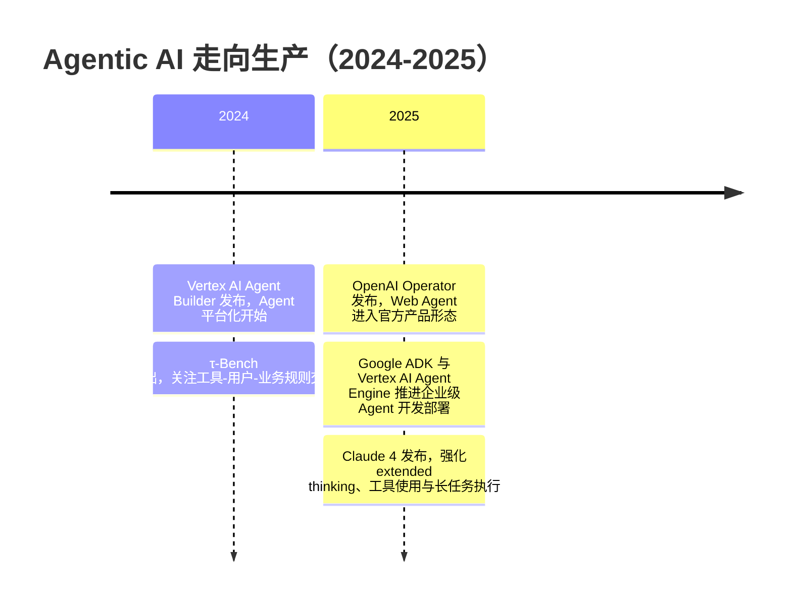

## 8.2.5 Agentic AI 走向生产（2024-2025）

**时间范围**：2024-2025  
**阶段位置**：前一阶段解决了“Agent 如何调用工具、如何在浏览器和 GUI 中行动”的问题；本阶段的核心转变，是 Agent 从 Demo、论文和开源实验，进入面向真实用户、真实企业流程、真实成本约束的生产化落地；下一阶段将进一步走向“长任务自治、跨组织协作、个人 AI 工作代理”。

### 时代背景

到 2024 年，LLM Agent 已经不再缺“想法”：ReAct 证明了推理与行动循环可行，Function Calling 让工具调用从 Prompt Hack 变成结构化协议，LangGraph、AutoGen、CrewAI 等框架也让开发者能快速搭出多 Agent 原型。但真正的问题是：这些 Agent 仍然“不够可靠”。它们可以演示订票、查资料、改代码，却经常卡在登录、权限、异常页面、工具报错、上下文丢失、任务中断等细节上。工程上看，瓶颈已经从“模型会不会调用工具”变成“它能否在复杂环境中稳定完成任务”。

这一阶段的突破来自三个条件同时成熟：第一，多模态模型能看懂网页截图、GUI 元素和文件内容；第二，推理模型与 extended thinking 提升了长链路任务的规划能力；第三，云厂商和模型厂商开始补齐部署、权限、监控、评估、数据连接器等生产基础设施。于是 Agentic AI 的竞争焦点，从“谁的模型更聪明”转向“谁能把模型变成可控、可观测、可治理的工作系统”。

### 关键突破

#### OpenAI Operator（2025）

**一句话定位**：Operator 标志着通用 Web Agent 从实验室 Demo 进入官方产品形态，是“模型直接操作人类软件界面”的一次商业化试水。

**核心贡献**：

OpenAI 在 2025 年 1 月发布 Operator 研究预览，定位为一个可以使用自己浏览器执行任务的 Agent，能够看网页、点击、输入、滚动，并处理表单填写、购物、创建内容等重复性浏览器任务；它最初面向美国 ChatGPT Pro 用户开放。其背后的 Computer-Using Agent（CUA）结合 GPT-4o 的视觉能力和强化学习得到的推理能力，被训练为理解并操作 GUI，而不是依赖站点专门开放 API。OpenAI 官方给出的关键点是：CUA 能通过截图“看见”界面，并通过鼠标键盘动作“操作”界面，从而绕开每个网站都要单独接 API 的传统集成成本。([OpenAI](https://openai.com/index/introducing-operator/))

这件事的重要性不在于 Operator 当时已经完美可靠，而在于它改变了 Agent 的产品边界。过去工程师做自动化，通常要写 API 适配器、爬虫、RPA 脚本或 Selenium 流程；Operator 展示的是另一条路线：让模型直接使用人类已有的软件界面。OpenAI 公布的 CUA 评测中，它在 OSWorld、WebArena、WebVoyager 等环境取得了面向电脑/网页操作的较高成功率，但官方也明确强调它仍处在早期阶段、有局限。([OpenAI](https://openai.com/index/computer-using-agent/))

**工程师视角**：

如果你在 2025 年做 Agent 应用，Operator 给你的启发不是“以后不用写工具了”，而是要重新划分自动化接口的优先级。高频、强一致、涉及钱和权限的流程，仍应优先走 API；低频、长尾、没有 API 或 API 集成成本过高的流程，可以考虑 GUI Agent。但这也带来新的工程问题：如何做人类确认、如何防止误点击、如何处理验证码和登录态、如何记录可审计轨迹、如何在失败时安全回滚。Operator 把 Agent 从“聊天窗口”推向“真实软件操作层”，也把安全、权限和审计推到了工程设计的中心。

#### Google Vertex AI Agent Builder / Gemini Agent（2024-2025）

**一句话定位**：Google 的路线代表云厂商视角的 Agent 生产化：不是只给一个 Agent 产品，而是把模型、RAG、工具、部署、监控、企业数据治理打包成平台能力。

**核心贡献**：

Google Cloud 在 2024 年 4 月发布 Vertex AI Agent Builder，目标是帮助开发者构建和部署 enterprise-ready 的生成式 AI 体验与 Agent。它把 Vertex AI Search、Conversation、RAG API、向量搜索、函数调用、扩展工具和企业安全控制整合在一起，支持从无代码控制台到 LangChain on Vertex AI 的多种开发方式。官方特别强调 grounding：企业 Agent 不能只靠模型参数回答，而要连接企业内部数据、搜索、合同、知识库和业务系统。([Google Cloud](https://cloud.google.com/blog/products/ai-machine-learning/build-generative-ai-experiences-with-vertex-ai-agent-builder))

到 2025 年，Google 进一步把 Agent 平台化。Google 在 Cloud Next 2025 发布 Agent Development Kit（ADK），这是一个面向多 Agent 应用的开源框架，覆盖构建、交互、评估和部署；同时，Vertex AI Agent Engine 被描述为托管运行时，用于把自定义 Agent 部署到生产环境，并提供测试、发布和可靠性能力。([Google 开发者博客](https://developers.googleblog.com/en/agent-development-kit-easy-to-build-multi-agent-applications/))

Google 在消费端也推进 Gemini Agent / Agent Mode 与 Project Mariner。I/O 2025 上，Google 宣布 Agent Mode 作为 Gemini App 中的实验功能，用户只需描述目标，Gemini 就可以代表用户完成任务；同时 Project Mariner 的 computer use 能力被推进到 Gemini API，并计划给开发者使用。([blog.google](https://blog.google/innovation-and-ai/products/google-io-2025-all-our-announcements/?utm_source=chatgpt.com))

**工程师视角**：

Google 这条路线对企业工程师尤其重要。企业不是缺一个“会聊天的 Agent”，而是缺一个能接 IAM、审计、VPC、数据权限、RAG、监控、发布流程的 Agent 平台。Vertex AI Agent Builder 的价值，是把 Agent 从单个 Python 脚本提升为企业应用生命周期管理对象。对于中国开发者，这也解释了为什么腾讯元器、百度 AgentBuilder、Dify、阿里云百炼 / Model Studio 这类平台会迅速出现：真正的大规模落地，往往不是靠单模型能力，而是靠“模型 + 数据连接 + 工作流 + 权限 + 评估 + 发布”的平台化组合。腾讯元器定位为零代码智能体创建与分发平台，Dify 则把自身定义为用于构建 agentic workflow、连接工具和数据源、部署 AI 应用的平台。([腾讯元器](https://yuanqi.tencent.com/?utm_source=chatgpt.com))

#### Claude 4 Extended Thinking + Agentic Task（2025）

**一句话定位**：Claude 4 系列把 Agent 能力的重点从“能调用工具”推进到“能长时间保持目标、跨工具推理、持续执行复杂任务”。

**核心贡献**：

Anthropic 在 2025 年 5 月发布 Claude Opus 4 和 Claude Sonnet 4，明确把 coding、advanced reasoning 和 AI agents 作为核心定位。官方强调 Claude 4 支持 extended thinking with tool use：模型可以在 extended thinking 过程中调用工具，例如 Web Search，从而在推理和工具使用之间交替；同时支持并行工具调用、更好的指令遵循，以及在开发者提供本地文件访问时改进记忆能力。([Anthropic](https://www.anthropic.com/news/claude-4?c=6709))

Claude 4 对 Agent 生产化的关键贡献，是把“长任务执行”放到模型能力中心。Anthropic 称 Claude Opus 4 能在复杂、长时间任务和 Agent workflow 上保持持续表现，并在需要数千步骤的任务中连续工作数小时；同时 Claude Code 正式 GA，支持 GitHub Actions 后台任务、VS Code 和 JetBrains 集成。对工程师来说，这意味着 Agent 不再只是同步聊天里的临时工具调用，而开始进入异步代码修改、后台执行、跨文件重构、持续上下文维护这些真实研发场景。([Anthropic](https://www.anthropic.com/news/claude-4?c=6709))

**工程师视角**：

Claude 4 改变的是开发 Agent 的“时间尺度”。早期 Agent 更像一次函数调用：输入任务，调用工具，返回结果。Claude 4 之后，工程师开始考虑“任务会不会跑 30 分钟、2 小时甚至更久”。这要求系统具备 checkpoint、任务队列、状态持久化、人工审批、日志追踪和中断恢复能力。换句话说，模型变强以后，瓶颈会转移到系统架构：你不能只写一个 while loop 让 Agent 自己跑，而要像设计分布式任务系统一样设计 Agent runtime。

#### GAIA / SWE-bench / τ-Bench：可靠性成为核心议题（2024-2025）

**一句话定位**：这些 benchmark 把 Agent 评估从“回答是否聪明”推进到“任务是否真的完成、状态是否正确、行为是否稳定”。

**核心贡献**：

GAIA 提出了一组面向通用 AI Assistant 的现实问题，要求系统具备推理、多模态处理、网页浏览和工具使用能力。论文显示，人在 GAIA 上能达到 92% 准确率，而带插件的 GPT-4 只有 15%，这揭示了一个关键事实：LLM 在很多专业考试上表现优秀，并不等于它能稳定完成普通人日常会做的综合任务。([arXiv](https://arxiv.org/abs/2311.12983))

SWE-bench 则把评估拉到真实软件工程场景：它包含 2294 个来自真实 GitHub issue 和 pull request 的问题，要求模型根据 issue 修改代码并通过测试。这个 benchmark 的意义在于，它不评估“写一段函数”的能力，而评估模型能否理解代码库、跨文件修改、运行测试、定位错误并生成可合并 patch。([arXiv](https://arxiv.org/abs/2310.06770))

τ-Bench 进一步贴近客服、零售、航空等真实业务 Agent 场景。它模拟用户与工具 Agent 的动态多轮对话，Agent 需要遵守业务规则、调用 API 工具，并让最终数据库状态与标注目标状态一致。论文还提出 pass^k 来评估多次运行的一致性，并指出即使是当时先进的 function calling agent，在部分任务上的成功率和一致性仍然不足。([arXiv](https://arxiv.org/abs/2406.12045))

**工程师视角**：

这些 benchmark 让工程团队意识到：Agent 不能只看单次 demo，而要看端到端任务成功率、重试后的稳定性、工具调用正确率、最终状态一致性和违规动作率。一个客服 Agent 回答得很礼貌没有意义，关键是它有没有正确改订单；一个代码 Agent 解释得很清楚没有意义，关键是 patch 有没有通过测试；一个浏览器 Agent 看起来会点击没有意义，关键是它有没有在正确页面、正确账户、正确权限下完成动作。2024-2025 年之后，Agent 项目的验收口径开始从“生成质量”转向“任务完成质量”。

### 阶段总结

**本阶段核心主题**：Agentic AI 的主线从“模型能不能行动”变成“行动是否可靠、可控、可评估”。真正进入生产的 Agent，不只是 LLM 加工具，而是模型、工具、权限、状态、评估、监控、人工审批共同组成的复合系统。

### 历史意义与遗留问题

这个阶段解决了三个写进教科书的问题。第一，Agent 产品化路径被验证：Operator、Gemini Agent、Claude Code 证明大模型可以从对话框走向真实任务执行。第二，企业 Agent 平台雏形形成：Vertex AI Agent Builder、ADK、Agent Engine 说明云厂商开始把 Agent 当作生产基础设施，而不是应用层玩具。第三，Agent 评估标准开始成熟：GAIA、SWE-bench、τ-Bench 把行业注意力从“模型分数”拉回“任务成功率”。

但它也留下了更难的问题。Agent 一旦能行动，就必须面对权限边界、错误恢复、数据泄露、成本失控和责任归属。更关键的是，2025 年的 Agent 仍然缺少稳定的长期记忆、跨天任务管理、可证明的安全约束和足够高的一致性。下一阶段的核心竞争，不会只是更长上下文或更强模型，而是谁能构建真正可信赖的 Agent runtime：它能记住目标、解释动作、接受监督、失败可恢复，并在复杂组织流程中长期运行。

---

**Sources:**

- [Introducing Operator | OpenAI](https://openai.com/index/introducing-operator/)
- [Build generative AI experiences with Vertex AI Agent Builder | Google Cloud Blog](https://cloud.google.com/blog/products/ai-machine-learning/build-generative-ai-experiences-with-vertex-ai-agent-builder)
- [
            
            Agent Development Kit: Making it easy to build multi-agent applications
            
            
            - Google Developers Blog
            
        ](https://developers.googleblog.com/en/agent-development-kit-easy-to-build-multi-agent-applications/)
- [100 things we announced at I/O](https://blog.google/innovation-and-ai/products/google-io-2025-all-our-announcements/?utm_source=chatgpt.com)
- [腾讯元器- AI 智能体创建与分发平台](https://yuanqi.tencent.com/?utm_source=chatgpt.com)
- [Introducing Claude 4 \ Anthropic](https://www.anthropic.com/news/claude-4?c=6709)
- [[2311.12983] GAIA: a benchmark for General AI Assistants](https://arxiv.org/abs/2311.12983)

