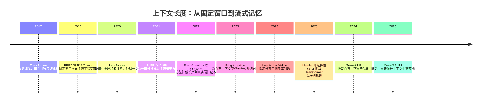

## 8.3.1 上下文长度：从 512 Token 到无限流式记忆

**时间范围**：2017-2025  
**本节位置**：前一阶段证明了 Transformer 可以用统一架构建模语言；本阶段的核心转变，是把“能否理解一句话”推进到“能否处理整本书、代码仓库、长视频和持续任务轨迹”；下一阶段将自然引出长期记忆、Agent 状态持久化与无限上下文系统设计。

### 时代背景

Transformer 刚出现时，长上下文不是第一目标，真正的目标是替代 RNN/CNN，让序列建模可以并行训练。2017 年的 Transformer 使用位置编码让模型知道 Token 顺序，但自注意力的计算和显存复杂度随序列长度近似二次增长；到 BERT 时代，512 Token 几乎成为默认上限，GPT-2 也只是把上下文从 512 扩展到 1024 Token。BERT 论文中也明确提到，更长序列成本会显著升高，因此训练时大部分步骤使用 128 长度，最后少量步骤才用 512 长度。([arXiv](https://arxiv.org/abs/1706.03762))

突破发生在三个条件同时成熟之后：第一，GPU 集群和混合精度训练降低了长序列训练成本；第二，FlashAttention 这类 IO-aware attention 把瓶颈从“理论 FLOPs”重新拉回到真实硬件内存访问；第三，RAG、代码生成、长文档问答、多模态视频理解把市场需求从“短对话”推向“长任务”。上下文长度从此不再只是模型参数表上的数字，而变成应用架构设计的核心约束。([arXiv](https://arxiv.org/abs/2205.14135))

### 关键突破

#### 绝对位置编码与固定窗口 Transformer（2017-2019）

**一句话定位**：它让 Transformer 第一次摆脱循环结构，但也把上下文长度绑定在训练时的位置范围内。

**核心贡献**：Transformer 用位置编码补上 self-attention 的先天缺陷：attention 本身只看 Token 间关系，不知道谁在前谁在后。原始 Transformer 使用正弦位置编码，BERT/GPT 系列则大量采用 learned positional embedding。它解决了并行训练问题，却没有真正解决长度外推问题：模型在训练时只见过 512 或 1024 的位置，推理时突然塞入更长文本，位置分布会偏移，效果不稳定。([arXiv](https://arxiv.org/abs/1706.03762))

**工程师视角**：当时做长文档任务，主流做法不是“扩上下文”，而是切块。摘要、问答、分类都要先把文档拆成 512 Token 左右的片段，再做 chunk-level 推理和结果聚合。工程问题也随之出现：切块边界会切断语义，答案可能跨 chunk，排序和合并逻辑往往比模型调用本身更复杂。

> 📄 原始论文：Vaswani et al., 2017, arXiv:1706.03762

#### Longformer 与稀疏注意力路线（2020）

**一句话定位**：这是长文档 Transformer 的早期工程化尝试，用“不是每个 Token 都看所有 Token”换取更长输入。

**核心贡献**：Longformer 将全局 self-attention 改为局部窗口 attention + 少量 global attention，使复杂度近似线性增长。它的直觉很工程化：长文档里大部分 Token 只需要看附近上下文，标题、问题、特殊标记等关键位置才需要全局可见。这样可以处理数千 Token 以上的文档，而不必完全依赖暴力截断。([arXiv](https://arxiv.org/abs/2004.05150))

**工程师视角**：这类模型改变了文档 NLP 的工作流。以前工程师要写大量规则处理 chunk 聚合，现在可以直接把较长文档送进模型。但它也带来新约束：global attention 位置需要人为设计，模型架构不再是标准 Transformer，迁移到通用 LLM 生态的成本较高。因此它更像特定任务的长文档编码器，而不是后来通用大模型的主流路径。

> 📄 原始论文：Beltagy et al., 2020, arXiv:2004.05150

#### RoPE：相对位置信息进入主流 LLM（2021）

**一句话定位**：RoPE 是现代开源 LLM 长上下文扩展的关键基础设施之一。

**核心贡献**：RoPE 不再简单给 Token 加一个位置向量，而是用旋转矩阵把位置信息注入 Query 和 Key，使 attention score 天然包含相对位置关系。它的工程价值在于：相对距离比绝对下标更符合语言建模需求，也更容易做长度外推。后来的 LLaMA、Qwen、DeepSeek 等模型都深受这一路线影响，许多长上下文扩展技术本质上也是围绕 RoPE scaling 展开。([arXiv](https://arxiv.org/abs/2104.09864))

**工程师视角**：RoPE 让“把 4K 模型扩到 16K、32K、128K”变成可调参问题，而不是必须重训整套架构。工程上常见的 YaRN、NTK-aware scaling、位置插值等方法，都是在不完全推翻基座模型的前提下延长上下文。但坑也很明显：能塞进去不等于能用好，位置缩放过猛会损伤短上下文能力，长文本中间位置仍可能召回不稳。

> 📄 原始论文：Su et al., 2021, arXiv:2104.09864

#### ALiBi：Train Short, Test Long（2021）

**一句话定位**：ALiBi 把长度外推问题从“学习位置向量”改成“给远距离注意力加线性惩罚”。

**核心贡献**：ALiBi 的做法非常朴素：不显式学习位置 embedding，而是在 attention score 中加入与距离相关的线性 bias，使模型天然偏好近距离 Token，同时保留访问远距离信息的能力。论文核心卖点就是 Train Short, Test Long：训练时用短序列降低成本，推理时可扩展到更长输入。([arXiv](https://arxiv.org/abs/2108.12409))

**工程师视角**：ALiBi 给工程团队一个现实选项：如果预算有限，不一定要全程用超长序列训练模型。你可以用较短上下文完成主要训练，再依靠位置机制获得一定外推能力。不过它并不是银弹。对需要精确引用、跨文档推理、代码仓库级分析的任务，单靠位置外推不足以保证可靠性，仍然需要检索、重排和上下文组织策略配合。

> 📄 原始论文：Press et al., 2021, arXiv:2108.12409

#### Ring Attention：把上下文扩展变成分布式系统问题（2023）

**一句话定位**：Ring Attention 的意义在于，它不近似 attention，而是把超长上下文的计算拆到多设备上做。

**核心贡献**：标准 attention 的瓶颈是 KV 矩阵过大。Ring Attention 使用 blockwise computation，把序列切成块分布到多张设备上，并让设备之间以 ring 方式传递 KV block，同时重叠通信和计算。它的目标不是牺牲精度换长度，而是在分布式训练/推理中把可处理上下文扩展到百万级甚至更高。([arXiv](https://arxiv.org/abs/2310.01889))

**工程师视角**：这类工作提醒我们：长上下文不是单纯模型算法问题，也是系统工程问题。模型服务团队需要考虑张量并行、KV Cache 分片、通信带宽、batching 策略和成本曲线。到了百万 Token 级别，“一次请求多少钱、延迟多少、失败后如何恢复”往往比“模型理论上支持多长”更重要。

> 📄 原始论文：Liu et al., 2023, arXiv:2310.01889

#### Mamba / SSM：线性复杂度挑战 Transformer（2023）

**一句话定位**：Mamba 代表了另一条路线：不优化 attention，而是尝试用选择性状态空间模型替代 attention 主干。

**核心贡献**：Mamba 认为 Transformer 的长序列低效来自 attention 的二次复杂度。它使用 selective state space model，让模型根据当前输入动态决定保留或遗忘哪些信息，并通过硬件友好的并行算法实现线性序列扩展。论文报告称 Mamba 在长序列上具备线性扩展能力，并在推理吞吐上相对 Transformer 有明显优势。([arXiv](https://arxiv.org/abs/2312.00752))

**工程师视角**：Mamba 给了长上下文系统一个新想象：未来处理日志流、传感器、音频、超长代码轨迹时，不一定所有信息都要放进 attention 矩阵。但在 LLM 应用落地中，SSM 还没有完全替代 Transformer。原因很现实：Transformer 生态成熟，推理框架、量化、微调、工具链都围绕它构建；Mamba 更适合被看作长序列架构的重要候选，而不是当前生产系统的默认答案。

> 📄 原始论文：Gu & Dao, 2023, arXiv:2312.00752

#### Lost in the Middle：大上下文不等于大利用率（2023）

**一句话定位**：这篇论文把行业从“比谁窗口大”拉回到“模型到底有没有用上中间信息”。

**核心贡献**：研究发现，即使模型支持长上下文，当关键证据位于输入开头或结尾时效果较好，放在中间时性能会显著下降。这说明上下文窗口长度只是容量上限，不代表有效注意力、证据定位和推理能力同步增长。([arXiv](https://arxiv.org/abs/2307.03172))

**工程师视角**：这直接改变 RAG 和 Agent 的上下文组织方式。不能把 100 页资料粗暴拼进 prompt，然后期待模型自动找到答案。更稳妥的做法是：把高置信证据放在开头或接近问题的位置；对长上下文做分段摘要；保留引用来源；用 reranker 控制进入上下文的材料质量；对关键事实做重复锚定。长上下文降低了 RAG 的切块压力，但没有取消检索和重排的价值。

> 📄 原始论文：Liu et al., 2023, arXiv:2307.03172

#### 百万上下文产品化：Gemini 1.5、Qwen2.5-1M 与国内长文本竞赛（2024-2025）

**一句话定位**：百万上下文让长文档、长视频、代码仓库和 Agent 轨迹进入统一输入空间。

**核心贡献**：Gemini 1.5 把百万级上下文推向主流产品叙事，强调跨长文档、音频、视频的细粒度回忆与推理。Qwen2.5-1M 则代表国内开源生态的重要进展，通过长上下文预训练、后训练、长数据合成、渐进式训练等方法，把 Qwen2.5 系列扩展到 1M Token，并开源相关推理框架，降低开发者使用门槛。([arXiv](https://arxiv.org/abs/2403.05530))

**工程师视角**：对中国开发者尤其重要的是，长上下文开始与国产模型生态结合。企业知识库、合同审查、长研报分析、客服质检、代码迁移等场景，不再只能依赖闭源海外 API。但生产选型仍要看三件事：长上下文价格是否可接受、中文长文档召回是否稳定、是否支持引用溯源和缓存。百万窗口是能力边界的提升，不是架构设计的免死金牌。

> 📄 技术报告：Gemini Team, 2024, arXiv:2403.05530  
> 📄 技术报告：Yang et al., 2025, arXiv:2501.15383

### 阶段总结

**本阶段核心主题**：上下文长度的演进，本质上是“位置表示、注意力计算、硬件系统、应用需求”四条线共同推进的结果。真正成熟的长上下文系统，不是把窗口做大，而是让模型在长输入中稳定找到、保留、引用和推理关键信息。

### 历史意义与遗留问题

这一阶段解决了两个写进教科书的问题：第一，Transformer 不再被 512/1024 Token 固定窗口锁死，长文档、长代码、长视频进入 LLM 原生处理范围；第二，长上下文从单点算法优化，演变成包含位置编码、FlashAttention、KV Cache、分布式并行和数据合成的完整工程体系。

但它也留下三个新问题。第一，**有效上下文利用率**仍不足，Lost in the Middle 说明模型会“看见但没用上”。第二，**成本曲线**仍然陡峭，百万 Token 请求在延迟、缓存、失败恢复和账单上都很重。第三，**长期记忆**没有被真正解决：上下文窗口再大，也只是一次请求内的临时工作区；Agent 要跨天执行任务，还需要外部记忆、状态数据库、Checkpoint 和可检索的事件流。下一阶段的重点，将从“窗口有多大”转向“记忆如何被写入、更新、检索和遗忘”。

---

**Sources:**

- [Attention Is All You Need](https://arxiv.org/abs/1706.03762)

