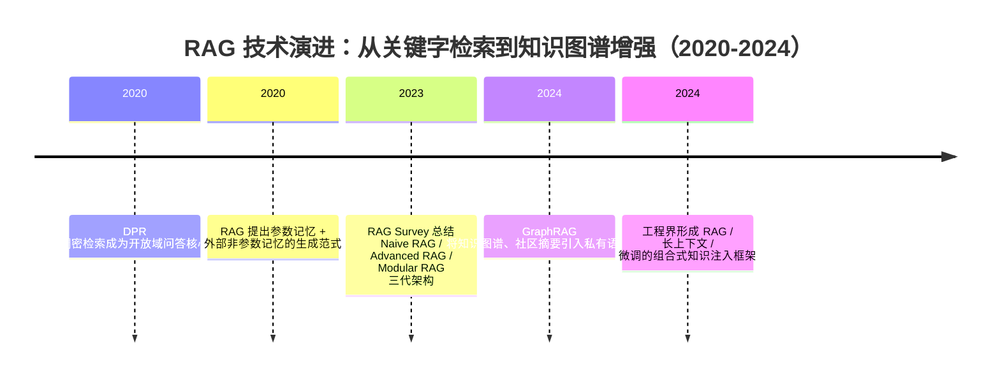

## 8.3.2 RAG 技术演进：关键字检索到知识图谱增强

**时间范围**：2020-2024  
**本节在整体演进史中的位置**：前一阶段，LLM 主要依赖参数记忆回答问题，事实更新慢、幻觉高、引用不可追溯；本阶段的核心转变，是把“知识”从模型参数中部分外置到检索系统、向量数据库和知识图谱中；这也引出了下一阶段的问题：当文档规模、权限、结构关系和任务复杂度继续上升时，RAG 不再只是“检索几段文本”，而会演化为可编排、可评估、可治理的知识基础设施。

### 时代背景

2020 年前后，开放域问答和企业知识问答已经暴露出一个共同瓶颈：单纯依赖模型参数记忆，很难同时满足“知识新鲜、答案准确、来源可追溯、成本可控”四个目标。传统关键词检索，如 TF-IDF、BM25，擅长精确匹配术语，但对语义改写、同义表达、跨段落推理支持有限；纯生成模型虽然表达流畅，却容易把过期知识或错误联想包装成确定答案。Dense Passage Retrieval（DPR）在 2020 年证明，用双编码器把问题和段落映射到同一个向量空间，可以在开放域问答中替代部分传统稀疏检索，并显著提升 top-k 召回效果。([arXiv](https://arxiv.org/abs/2004.04906)) 同年，RAG 论文把 dense retriever、外部非参数记忆和 seq2seq 生成模型组合起来，给出了后来企业级知识库问答的基本形态：先检索，再生成，并保留知识来源。([arXiv](https://arxiv.org/abs/2005.11401))

这一阶段的突破不是单点算法突然成熟，而是三类条件同时到位：第一，Embedding 模型质量提升，使“语义检索”从实验室走向可用；第二，向量数据库、ANN 索引和 GPU/CPU 混合检索工程成熟，支持百万到亿级文档低延迟召回；第三，LLM 的上下文理解和指令遵循能力增强，使模型能在给定证据片段中完成摘要、归纳和引用生成。对工程团队来说，RAG 的意义不是“让模型变聪明”，而是把不可控的模型记忆，改造成可更新、可审计、可权限控制的外部知识系统。

---

## 关键突破

### Dense Passage Retrieval：稠密检索成为 RAG 的底座（2020）

**一句话定位**：DPR 是从关键词检索走向语义检索的重要转折点，为后来的向量数据库和 RAG 检索层奠定了工程基础。

**核心贡献**：

DPR 承接的是 BM25 一类关键词检索的痛点：用户问题和文档答案经常不是同一套词。例如用户问“怎么报销出差高铁票”，制度文档里可能写的是“差旅交通凭证提交规范”。关键词系统容易漏召回，而 dense retriever 会把问题和段落编码成向量，按语义相似度找候选段落。DPR 使用双编码器结构分别编码 query 和 passage，这让离线构建文档向量、在线只编码查询成为可能，是它能落地到大规模检索系统的关键。论文显示，在多个开放域 QA 数据集上，DPR 相比强 BM25 系统取得明显 top-20 检索准确率提升。([arXiv](https://arxiv.org/abs/2004.04906))

**工程师视角**：

如果你是 2020 年前后的搜索或 NLP 工程师，DPR 改变的是检索系统的第一性假设：过去主要调分词、倒排索引、BM25 参数；之后开始维护 Embedding 模型、向量索引、召回阈值、重建索引策略。知识库系统也从“关键词搜索框”变成“语义召回 + 生成式回答”的前置模块。它的代价也很明显：向量召回更吃数据分布和 embedding 质量，精确词、数字、专有名词容易丢，因此后来生产系统很少只用 dense retrieval，而是走向 BM25 + 向量的 hybrid retrieval。

> 📄 原始论文：Karpukhin et al., 2020, arXiv:2004.04906

---

### RAG：参数记忆与外部记忆的组合范式（2020）

**一句话定位**：RAG 把“检索”和“生成”正式耦合为一个通用范式，让 LLM 可以基于外部知识回答知识密集型问题。

**核心贡献**：

RAG 解决的是纯生成模型的知识边界问题。模型参数可以记住大量事实，但参数记忆更新成本高、不可追溯，也难以证明答案来自哪里。Lewis et al. 提出的 RAG 把预训练 seq2seq 模型作为参数记忆，把 Wikipedia dense vector index 作为非参数记忆，生成答案时先检索相关文档，再让生成模型基于这些文档输出结果。论文还区分了两种形式：一种是在整段生成中使用同一批检索文档，另一种是在不同 token 生成时可依赖不同文档。([arXiv](https://arxiv.org/abs/2005.11401))

它的历史意义在于，把“模型知道什么”变成了“系统能查到什么”。这对企业场景尤其关键：公司制度、合同、产品文档、客服知识库每天都在变，不可能每次更新都重新训练模型。RAG 让知识更新从“重新训练”变成“更新索引”，把模型能力和业务知识解耦。

**工程师视角**：

RAG 出现后，AI 应用开发的日常工作流发生了明显变化。你不再只写 Prompt，而是要设计一条数据管线：文档解析、清洗、切块、Embedding、索引、检索、重排、Prompt 拼装、答案引用。RAG 也让“可追溯回答”成为产品默认要求：答案后面要能跟出处，否则企业用户很难信任。中国企业知识库场景里，这一点尤其明显：制度问答、招投标文档、金融研报、政企材料通常都要求引用原文段落，不能只给一个流畅但无来源的总结。

> 📄 原始论文：Lewis et al., 2020, arXiv:2005.11401

---

### Naive RAG → Advanced RAG → Modular RAG：从链路拼接到系统工程（2023）

**一句话定位**：Gao et al. 的 RAG Survey 总结了 RAG 从简单“检索-生成”链路，演进为包含查询改写、重排序、上下文压缩、评估与模块编排的系统工程。

**核心贡献**：

Naive RAG 的典型流程很直接：用户问题进入系统，检索 top-k 文档块，把它们塞进 Prompt，再让 LLM 生成答案。它的优点是实现快，适合 MVP；缺点也非常工程化：切块不合理会破坏语义，top-k 固定容易漏召回或引入噪声，长文档会挤占上下文，生成模型可能忽略关键证据。

Advanced RAG 开始修补这些问题：检索前做 query rewrite、HyDE、多查询扩展；检索中使用 hybrid retrieval 和 metadata filter；检索后接 reranker、context compression、去重和证据排序。Modular RAG 则进一步把 RAG 拆成可替换模块：retriever、router、memory、generator、judge、fallback policy 都可以按任务动态编排。Gao et al. 的综述明确将 RAG 演进划分为 Naive RAG、Advanced RAG、Modular RAG，并从 retrieval、generation、augmentation 三个基础维度系统梳理了技术栈。([arXiv](https://arxiv.org/abs/2312.10997))

**工程师视角**：

这一步最大的变化，是 RAG 从“应用代码里的一个函数”变成“需要持续调优的基础设施”。工程师开始关注 Recall@k、MRR、Context Precision、Faithfulness、端到端延迟、每次回答成本，而不是只看回答是否“看起来对”。在生产中，一个成熟 RAG 系统往往会有多路召回：BM25 兜底专有名词，向量召回处理语义相似，reranker 做精排，LLM-as-Judge 做答案质量评估。对中文场景而言，还要额外处理分词、繁简体、英文缩写、表格、扫描 PDF、章节标题丢失等问题。真正的难点不是把 LangChain 跑起来，而是让系统在脏数据、权限边界和高并发下稳定给出可信答案。

> 📄 原始论文：Gao et al., 2023, arXiv:2312.10997

---

### GraphRAG：从局部片段召回到全局关系理解（2024）

**一句话定位**：GraphRAG 把 RAG 的检索对象从“相似文本块”扩展到“实体、关系和社区摘要”，解决传统 RAG 难以回答全局性、综合性问题的痛点。

**核心贡献**：

传统 RAG 擅长回答局部问题，例如“某条制度的报销上限是多少”。但它不擅长回答全局问题，例如“这批客户访谈反映出哪些主要痛点？”“一个行业研报库里有哪些长期趋势？”原因是这类问题不是找某几个相似 chunk，而是要跨大量文档做 query-focused summarization。Edge et al. 的 GraphRAG 论文指出，普通 RAG 在面向整个语料库的 global question 上会失效，因为 top-k chunk 只能覆盖局部证据；而传统 query-focused summarization 又难以扩展到 RAG 系统常见的大规模文本集合。([arXiv](https://arxiv.org/abs/2404.16130))

GraphRAG 的核心做法是先用 LLM 从文档中抽取实体和关系，构建知识图谱，再对图中的实体社区生成 community summaries。查询时，系统不是只找相似文本块，而是利用社区摘要生成多个局部回答，再聚合成最终答案。Microsoft Research 对 GraphRAG 的介绍也强调，它通过基于私有数据构建知识图谱，并在查询时结合图结构和图机器学习结果增强 Prompt。([微软](https://www.microsoft.com/en-us/research/blog/graphrag-unlocking-llm-discovery-on-narrative-private-data/))

**工程师视角**：

GraphRAG 改变的是你对“索引”的理解。Naive RAG 的索引对象是 chunk；GraphRAG 的索引对象还包括 entity、relationship、community、summary。它适合文档之间关系密集、问题偏综合分析的场景，例如投研报告、法律案件、舆情分析、医药文献、企业访谈、招投标材料。但它不是免费午餐：图谱构建需要大量 LLM 调用，实体抽取质量会影响后续推理，更新索引比普通向量库更复杂。因此生产选型时，不应把 GraphRAG 当成默认升级版，而应在“全局问题多、跨文档关系重要、可接受较高离线成本”的场景中使用。

> 📄 原始论文：Edge et al., 2024, arXiv:2404.16130

---

### RAG vs 长上下文 vs 微调：三种知识注入路线的分工（2024）

**一句话定位**：到 2024 年，工程界逐渐形成共识：RAG、长上下文、微调不是互相替代，而是分别解决知识注入的不同约束。

**核心贡献**：

RAG 适合高频更新、需要引用、知识量大且权限复杂的场景。它的优势是知识可更新、可追溯、可做权限过滤；缺点是链路复杂，召回失败会直接导致回答失败。

长上下文适合一次性分析完整材料，例如审阅一份合同、总结一篇长论文、分析一个代码文件夹。它的优势是工程链路简单，少了切块和召回误差；缺点是成本高、延迟高，而且“塞进去”不等于“用得好”，模型仍可能忽略中间位置的信息。长上下文更像增强版工作台，不是企业知识库的完整替代。

微调适合稳定能力、固定格式、风格偏好和领域表达方式的学习，例如客服语气、SQL 生成风格、特定 JSON 输出规范。它不适合承载频繁变化的事实知识，因为每次知识更新都重新训练既慢又贵，还难以解释答案来源。

**工程师视角**：

一个实用决策框架是：  
知识经常变、要求引用、要做权限控制，优先 RAG；  
输入材料本身就在用户请求里，且任务是单次深度分析，优先长上下文；  
输出风格稳定、任务模式重复、希望降低 Prompt 复杂度，考虑微调。  
在真实系统里，三者经常组合：用 RAG 取证据，用长上下文承载更多候选材料，用微调或 LoRA 固化输出格式和行业话术。成本、时效性、准确性之间没有银弹，只有取舍。

---

## 阶段总结

**本阶段核心主题**：RAG 的本质不是“给 Prompt 塞几段资料”，而是把知识从模型参数中解耦出来，交给可更新、可检索、可审计的外部系统管理。它的演进方向也很清晰：从关键词召回到语义召回，从局部 chunk 到全局图结构，从简单链路到模块化知识基础设施。

---

## 历史意义与遗留问题

**这个阶段解决了什么**：

RAG 解决了 LLM 落地中的三个核心问题：知识更新慢、答案不可追溯、领域私有知识难注入。它让企业可以在不重新训练大模型的情况下，把内部文档、产品手册、制度规范、研报材料接入生成式问答系统。GraphRAG 进一步证明，当问题从“找答案”升级为“理解一个语料库的结构和主题”时，图结构比单纯相似度检索更有表达力。

**留下了什么新问题**：

第一，RAG 的效果上限受制于数据质量。PDF 解析错、切块错、元数据缺失，后面的模型再强也只能基于坏证据生成。第二，评估仍然困难。检索命中不等于最终答案可信，答案流畅也不等于忠实于原文。第三，GraphRAG 带来了新的成本与维护问题：图谱如何增量更新、实体如何消歧、社区摘要如何防止过期，都会成为生产难点。第四，RAG 与 Agent 的边界正在模糊。下一阶段，检索系统不再只是被动返回文本，而会变成 Agent 的外部记忆、规划依据和行动约束，这也把问题从“如何检索知识”推进到“如何让系统可靠地使用知识”。

---

**Sources:**

- [Dense Passage Retrieval for Open-Domain Question Answering](https://arxiv.org/abs/2004.04906)
- [GraphRAG: Unlocking LLM discovery on narrative private ...](https://www.microsoft.com/en-us/research/blog/graphrag-unlocking-llm-discovery-on-narrative-private-data/)

