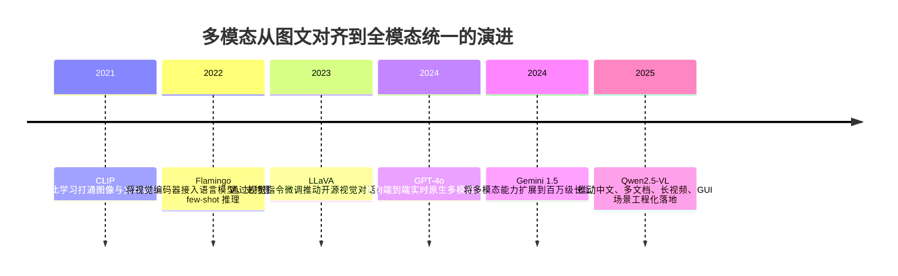

## 8.3.3 多模态：从 CLIP 到全模态统一模型

**时间范围**：2021-2025  
**本节在整体演进史中的位置**：前一阶段，大模型主要解决“语言智能”的规模化问题；本阶段的核心转变，是把图像、音频、视频、代码和结构化数据逐步纳入同一推理接口；下一阶段则会进一步走向 GUI Agent、具身智能和长期交互型个人 AI。

### 时代背景

在 2021 年之前，计算机视觉和自然语言处理长期是两套相对割裂的技术栈：视觉模型做分类、检测、分割，语言模型做生成、问答、翻译。工程上要做一个“看图回答问题”的系统，通常需要 OCR、目标检测、Caption、规则逻辑、NLP 模型多段串联，链路长、误差累积严重，也很难迁移到新场景。真正的瓶颈不是“模型不会看图”，而是视觉信息没有进入语言模型的语义空间，图像、文本、语音、视频之间缺少统一表示。

突破发生在三个条件同时成熟之后：第一，互联网上积累了海量弱标注图文对，虽然噪声大，但规模足以支撑对比学习；第二，Transformer 架构和大规模预训练经验已经被验证，可以把“统一表示”问题转化为可扩展的训练问题；第三，GPU 集群和分布式训练基础设施成熟，使得数亿级图文对、长视频、多模态上下文训练成为可能。CLIP 解决了“图像和文本如何对齐”，Flamingo / LLaVA 解决了“视觉如何接入 LLM 对话”，GPT-4o / Gemini 1.5 则把问题推进到“所有模态能否被同一个智能体实时理解和推理”。([arXiv](https://arxiv.org/abs/2103.00020?utm_source=chatgpt.com))

### 关键突破

#### CLIP（2021）

**一句话定位**：CLIP 是现代视觉语言模型的地基，它把图像分类从“固定标签分类”改造成了“自然语言描述匹配”。

**核心贡献**：

CLIP 承接的是传统 CV 的泛化痛点：一个 ImageNet 分类器只能识别预定义类别，换一个业务标签就要重新标注、训练。CLIP 的思路很工程化：不再让模型预测固定类别 ID，而是训练一个图像编码器和一个文本编码器，把配对的图片和文本拉近，把不匹配的图片和文本推远。这样一来，“识别一张图里是不是猫”不再需要专门训练猫分类器，只需要把候选文本写成 “a photo of a cat” 与图像 embedding 做相似度匹配。CLIP 使用约 4 亿图文对训练，并展示了较强的 zero-shot transfer 能力，包括在 ImageNet 上不使用原始 128 万标注样本也能达到接近 ResNet-50 的零样本表现。([arXiv](https://arxiv.org/abs/2103.00020?utm_source=chatgpt.com))

CLIP 的影响不只是提升了分类泛化能力，更重要的是定义了后续多模态系统的接口：图像可以被压缩成一个可与文本比较的向量。后来的图文检索、图片审核、文生图打分、RAG 图片检索、视觉 Agent 的环境感知，大量都继承了这个“视觉 embedding + 文本 embedding 对齐”的范式。

**工程师视角**：

如果你是 2021 年的算法工程师，CLIP 会直接改变你的工作流。过去做一个商品图片标签系统，需要采集样本、训练分类器、调阈值、上线模型；CLIP 之后，很多冷启动场景可以先用 prompt label 做 zero-shot 分类，再根据业务数据微调。它特别适合标签体系经常变化、标注成本高、需要快速验证的场景，比如内容审核、商品理解、图片搜索。但坑也很明显：CLIP 对细粒度计数、空间关系、OCR、专业领域图像并不稳定；工程上不能把它当成“真正理解图像”的模型，而应把它当成强大的跨模态召回和粗分类组件。

> 📄 原始论文：Radford et al., 2021, arXiv:2103.00020。([arXiv](https://arxiv.org/abs/2103.00020?utm_source=chatgpt.com))

#### Flamingo / LLaVA（2022-2023）

**一句话定位**：Flamingo 和 LLaVA 标志着多模态从“图文匹配”进入“视觉对话”，也就是把视觉信息接到 LLM 的生成能力上。

**核心贡献**：

CLIP 能判断图文是否匹配，但它本身不是对话模型，不擅长复杂问答、推理和工具调用。Flamingo 的关键价值是把强视觉编码器和强语言模型桥接起来，让模型可以处理图文交错输入，并通过 few-shot prompt 适应新的视觉任务。它解决的是“如何不重新训练一个完整多模态大模型，也能让 LLM 消化图片和视频”的问题。([arXiv](https://arxiv.org/abs/2204.14198?utm_source=chatgpt.com))

LLaVA 则把这个方向进一步工程化和开源化：它用视觉编码器连接 Vicuna 等 LLM，并用 GPT-4 生成的多模态指令数据做视觉指令微调，让模型具备类似“看图聊天”的能力。LLaVA 的意义在于降低了多模态模型的实验门槛：研究者和工程团队不再只能等待闭源模型，而可以用开源 LLM + 视觉 encoder + projector 的方式快速搭建 VLM。([arXiv](https://arxiv.org/abs/2304.08485?utm_source=chatgpt.com))

**工程师视角**：

这类模型让“图片上传 + 问答”成为标准产品能力。企业知识库不再只处理 PDF 文本，还能处理截图、报表、流程图、UI 截图；客服系统可以让用户上传故障图片；教育产品可以讲解题目图片。工程上典型架构是：Vision Encoder 提取视觉 token，经 projector 对齐到 LLM hidden space，再由 LLM 生成答案。这是非常实用的“后融合”路线，优点是复用现成 LLM，成本低、迭代快；缺点是视觉和语言并非从底层共同训练，复杂时序、语音情绪、视频因果推理仍然容易断层。

> 📄 原始论文：Alayrac et al., 2022, arXiv:2204.14198；Liu et al., 2023, arXiv:2304.08485。([arXiv](https://arxiv.org/abs/2204.14198?utm_source=chatgpt.com))

#### GPT-4o / Gemini 1.5（2024）

**一句话定位**：GPT-4o 和 Gemini 1.5 把多模态从“外接视觉模块”推进到“模型原生能力”和“长上下文多模态推理”。

**核心贡献**：

GPT-4o 的关键变化是端到端跨文本、视觉和音频训练，OpenAI 明确称其由同一个神经网络处理输入和输出，而不是传统语音助手常见的 ASR → LLM → TTS 级联系统。这个差别非常关键：级联系统只能听到转写后的文字，语速、停顿、情绪、环境声等信息会在 ASR 阶段丢失；原生多模态模型则有机会直接把语音、图像和文本作为统一上下文参与推理。GPT-4o 官方说明其可实时处理 audio、vision、text，并在系统卡中描述其接受文本、音频、图像、视频组合输入，输出文本、音频、图像组合结果。([OpenAI](https://openai.com/index/hello-gpt-4o/?utm_source=chatgpt.com))

Gemini 1.5 的突破点则是“多模态 + 超长上下文”。Gemini 1.5 报告强调模型可以在数百万 token 上下文中处理长文档、小时级视频和音频，并通过更高效的架构提升训练与服务效率。Google 官方也指出 Gemini 1.5 采用 MoE 架构，并突出其跨模态长上下文理解能力。([arXiv](https://arxiv.org/abs/2403.05530?utm_source=chatgpt.com))

这里可以把两条路线理解为：GPT-4o 代表实时原生多模态交互，重点是低延迟语音、视觉、文本统一；Gemini 1.5 代表长上下文多模态理解，重点是把视频、代码库、长文档放进同一个推理窗口。前者像一个实时助理，后者像一个能读完整项目资料和长视频的分析引擎。

**工程师视角**：

这直接改变了应用设计方式。过去做语音 Agent，要维护 ASR、对话模型、TTS 三套状态；做视频分析，要先抽帧、转写、分段总结，再喂给 LLM。GPT-4o / Gemini 1.5 之后，产品可以更接近“直接把真实世界输入交给模型”：会议录音、屏幕录像、代码仓库、产品截图、表格、日志可以进入统一上下文。但工程上仍要克制：多模态 token 成本高、延迟不可控、可观测性更难，生产系统仍应保留分层架构。比如高频简单 OCR 不一定要上最强多模态模型；长视频分析也应先做镜头切分、关键帧抽取、语音转写索引，再让大模型做综合推理。

> 📄 技术资料：OpenAI, 2024, GPT-4o System Card, arXiv:2410.21276；Gemini Team, 2024, arXiv:2403.05530。([arXiv](https://arxiv.org/abs/2410.21276?utm_source=chatgpt.com))

#### Qwen2.5-VL 与中国多模态生态（2025）

**一句话定位**：Qwen2.5-VL 代表国内开源多模态模型从“能看图”走向“能解析文档、理解视频、操作界面”的工程化阶段。

**核心贡献**：

对中国开发者来说，Qwen2.5-VL 的价值不只是开源替代，而是贴近真实业务场景：文档解析、表格理解、图表问答、目标定位、长视频理解、手机和电脑操作等。其技术报告提到动态分辨率处理、绝对时间编码、长视频理解，以及对发票、表单、表格等结构化文档的抽取能力。这些能力非常贴近企业落地：财务票据、政务表单、工业巡检、教育题目、移动端自动化，都需要模型同时理解版面、文字、坐标和语义。([arXiv](https://arxiv.org/abs/2502.13923?utm_source=chatgpt.com))

**工程师视角**：

国内团队选型时，不能只看通用 benchmark。多模态落地常常卡在三个细节：中文 OCR 是否稳、复杂版面是否能保留结构、私有化部署成本是否可控。Qwen2.5-VL 这类模型的出现，使得“本地部署视觉问答 + 文档解析 + GUI Agent 原型”变得现实。对于企业项目，闭源模型适合快速验证上限，开源 VLM 适合做私有化、行业微调和成本优化。

> 📄 原始论文：Bai et al., 2025, arXiv:2502.13923。([arXiv](https://arxiv.org/abs/2502.13923?utm_source=chatgpt.com))

### 阶段总结

**本阶段核心主题**：多模态的主线不是“给 LLM 加一双眼睛”，而是把真实世界输入变成模型可推理的统一上下文。CLIP 解决对齐，Flamingo / LLaVA 解决接入，GPT-4o / Gemini 1.5 解决原生交互与长上下文，Qwen2.5-VL 等开源模型则把能力拉近到企业可部署、可微调、可控成本的工程环境。

### 历史意义与遗留问题

这个阶段写进教科书的成就是：AI 从纯文本智能进入多模态智能。工程上，图片搜索、视觉问答、文档解析、会议理解、视频分析、语音助手、GUI Agent 都开始共享同一个技术底座。过去需要多个模型级联的系统，正在被统一多模态模型简化。

但它也留下了新的问题。第一，多模态幻觉更难排查，模型可能“看错图”却用非常流畅的语言解释；第二，视频和音频的长时序推理仍然昂贵，模型能读长上下文不等于能稳定利用长上下文；第三，空间定位、坐标操作、表格结构还需要更强的可验证机制；第四，安全问题升级了，Prompt Injection 不再只藏在文本里，还可能藏在截图、网页、二维码、音频和视频帧中。

因此，下一阶段的关键不只是模型“能看、能听、能说”，而是 Agent 能否在真实数字环境中可靠行动：理解屏幕、点击控件、调用工具、保留状态，并在高风险操作前接受人类审批。这也自然引出了 GUI Agent、Computer Use 和具身智能的发展。

---

**Sources:**

- [Learning Transferable Visual Models From Natural Language Supervision](https://arxiv.org/abs/2103.00020?utm_source=chatgpt.com)
- [Hello GPT-4o](https://openai.com/index/hello-gpt-4o/?utm_source=chatgpt.com)

