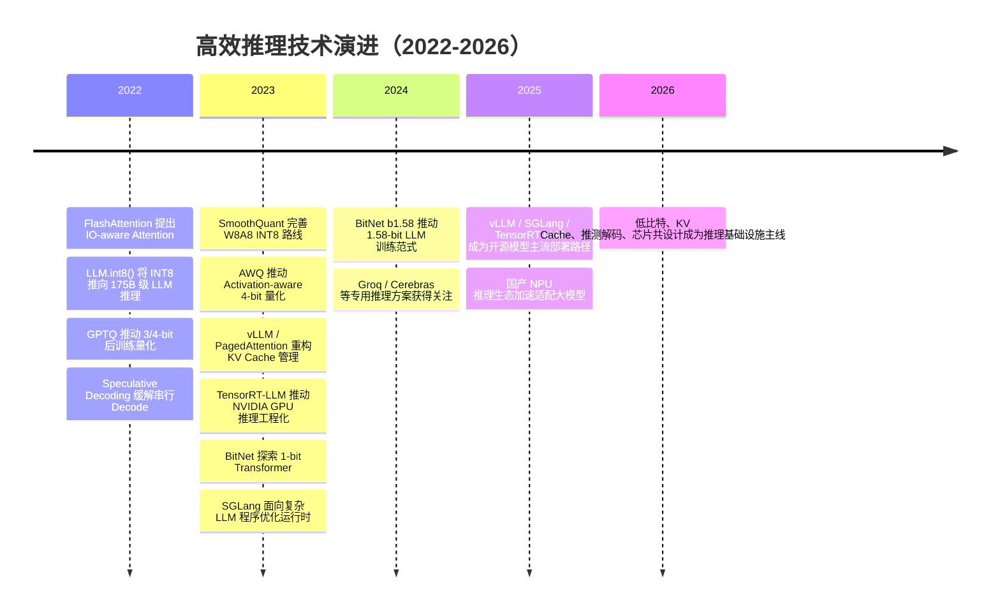

## 8.3.4 高效推理：从量化压缩到推理加速芯片生态

**时间范围：2022-2026**  
**本节在整体演进史中的位置**：前一阶段，模型能力主要靠参数规模、数据规模和训练算力扩张驱动；本阶段的核心转变，是行业意识到“训练出强模型”只是上半场，“以足够低的成本、足够低的延迟服务海量用户”才是商业化下半场；这进一步引出下一阶段的关键问题：推理系统、模型架构与专用芯片会越来越深度协同，AI 基础设施从“GPU 集群”走向“模型-系统-硬件共设计”。

### 时代背景

2022 年以后，LLM 的主要瓶颈从“能不能训练出来”快速转向“能不能便宜、稳定、低延迟地跑起来”。对工程团队来说，推理成本不是一个抽象指标，而是直接决定产品毛利、并发上限和用户体验的硬约束：模型参数越大，显存占用越高；上下文越长，KV Cache 增长越快；用户越多，Decode 阶段逐 Token 串行生成带来的延迟越明显。更麻烦的是，LLM 推理并不总是缺算力，很多场景真正卡在显存容量、HBM 带宽、KV Cache 管理和调度效率上。

这个阶段的突破之所以集中出现，有三个条件同时成熟：第一，开源模型爆发，LLaMA、Qwen、Mistral、DeepSeek 等模型让工程社区有了可重复优化的对象；第二，NVIDIA A100/H100、国产昇腾等加速器提供了更强 Tensor Core、FP8/低精度算子和更大显存带宽；第三，服务端框架从“能跑模型”升级为“能调度请求、管理 KV Cache、压榨吞吐”。因此，高效推理不再是单点优化，而变成一条完整链路：量化减少模型权重与激活开销，推测解码减少串行 Decode 次数，vLLM / TensorRT-LLM / SGLang 改善服务系统吞吐，最后由 GPU、NPU、LPU、Wafer-scale 芯片承接底层效率竞争。NVIDIA H100 引入 FP8 Transformer Engine，Blackwell 进一步支持 FP4/MXFP8 等低精度能力，说明硬件厂商也开始围绕 Transformer 推理特征做专门设计。([NVIDIA](https://www.nvidia.com/en-sg/data-center/h100/))

---

## 关键突破

### FP16 / BF16 到 FP8：低精度成为默认工程策略（2022）

**一句话定位**：FP16 / BF16 让大模型训练和推理摆脱 FP32 的高成本，FP8 则标志着低精度计算从“软件技巧”进入“硬件原生支持”阶段。

**核心贡献**：

在 Transformer 大规模部署前，FP32 是稳定但昂贵的默认选择。随着模型进入百亿、千亿参数量级，FP32 的显存和带宽成本过高，FP16 / BF16 成为训练和推理的常规配置。H100 的 Transformer Engine 进一步将 FP8 推到主流视野：它不是简单把数值砍成 8 bit，而是配合缩放、格式选择和硬件 Tensor Core，让矩阵乘在更低精度下仍保持可用精度。NVIDIA 官方资料明确指出，H100 支持 FP8 Transformer Engine，Blackwell 又继续扩展到 NVFP4 与 MXFP8。([NVIDIA](https://www.nvidia.com/en-sg/data-center/h100/))

**工程师视角**：

这个变化改变了工程师的第一反应：以前部署模型先问“显存够不够”，后来要问“这个模型支持什么精度、框架有没有对应 Kernel、精度下降是否可接受”。在生产中，FP16 / BF16 通常是稳定基线；FP8 更适合在硬件、框架和模型都支持时启用，尤其适合吞吐敏感的大规模服务。坑在于：低精度不是配置项这么简单，算子覆盖不完整、LayerNorm / Softmax / KV Cache 精度处理不当，都会造成异常输出或收益不明显。

---

### LLM.int8() 与 SmoothQuant：INT8 推理进入大模型时代（2022）

**一句话定位**：INT8 技术把“把模型塞进更少显存”从小模型时代带到了 175B 级别 LLM 推理。

**核心贡献**：

LLM.int8() 解决的核心痛点是：LLM 中存在少量但影响巨大的异常通道，如果粗暴 INT8 量化，会导致精度明显下降。它的做法是将绝大多数矩阵乘使用 INT8，对异常特征用混合精度单独处理，从而实现显存大幅下降且尽量保持性能。论文报告称，该方法可让 175B 参数模型以 INT8 方式推理，并显著降低显存需求。([arXiv](https://arxiv.org/abs/2208.07339))

SmoothQuant 则进一步关注 W8A8，即权重和激活都做 8-bit 量化。它的关键思想是：激活比权重更难量化，因此可以通过数学等价变换，把部分量化难度从激活“迁移”到权重上，使整体更适合硬件执行。SmoothQuant 被定位为训练无关的 PTQ 方法，目标是在较小精度损失下获得硬件友好的 INT8 推理。([arXiv](https://arxiv.org/abs/2211.10438))

> 📄 原始论文：Dettmers et al., 2022, arXiv:2208.07339  
> 📄 原始论文：Xiao et al., 2022, arXiv:2211.10438

**工程师视角**：

如果你在 2022 年部署 LLM，INT8 带来的直接变化是：原本需要多卡或高端卡的模型，有机会下探到更便宜的硬件上。但工程判断不能只看显存节省，还要看 Kernel 是否真正加速。有些 INT8 配置只减少显存，不一定降低端到端延迟；如果反量化开销、CPU-GPU 数据搬运、算子 fallback 没处理好，线上收益会被吃掉。

---

### GPTQ：4-bit 权重量化成为开源模型部署利器（2022）

**一句话定位**：GPTQ 让大模型 3/4-bit 后训练量化进入实用阶段，是开源 LLM 本地部署热潮的重要推手。

**核心贡献**：

GPTQ 的目标很直接：不重新训练大模型，只用少量校准数据，把权重量化到 3-bit 或 4-bit，同时尽量保持模型质量。它基于近似二阶信息逐层修正量化误差，让低比特权重量化不再只是“压缩文件”，而是尽量保持输出分布稳定。论文中报告 GPTQ 可在数小时内量化 175B 参数模型，并实现显著压缩与推理加速。([arXiv](https://arxiv.org/abs/2210.17323))

> 📄 原始论文：Frantar et al., 2022, arXiv:2210.17323

**工程师视角**：

GPTQ 对开发者的影响非常实际：本地部署、私有化交付、边缘推理突然变得可行。很多团队不再只能调用闭源 API，而可以拿 7B / 13B / 70B 开源模型做量化部署。但 GPTQ 的常见坑是校准集选择：如果校准数据和真实业务差异太大，量化后在业务任务上可能掉点明显。另一个坑是“能加载”不等于“能高并发服务”，4-bit 模型还需要匹配高效 Kernel 和服务框架。

---

### AWQ：Activation-aware 让 4-bit 更适合真实部署（2023）

**一句话定位**：AWQ 把 4-bit 量化从“离线压缩技巧”推进到更硬件友好、更泛化的部署方案。

**核心贡献**：

AWQ 的核心观察是：LLM 中并非所有权重同等重要，少量显著通道对输出质量影响极大；识别这些通道时，应该看激活分布，而不是只看权重本身。AWQ 通过保护关键通道、避免复杂混合精度路径，使 4-bit weight-only 量化更适合实际硬件执行。论文指出，AWQ 不依赖反向传播或重建，因此更不容易过拟合校准集，并在语言模型、多模态模型上都有较好泛化。([arXiv](https://arxiv.org/abs/2306.00978))

> 📄 原始论文：Lin et al., 2023, arXiv:2306.00978

**工程师视角**：

AWQ 改变的是部署选型：如果目标是端侧、本地私有化或多租户低成本推理，AWQ 往往比单纯追求最低 bit 更稳。尤其在中文场景中，Qwen、DeepSeek、Yi 等开源模型常被做成 GPTQ / AWQ / GGUF 等格式，工程师需要根据硬件和框架选择量化格式，而不是盲目下载“最小”的模型。经验上，4-bit 是可用性与成本之间的甜点区，但面向法律、金融、代码生成等高精度任务，仍要做业务评测后再上线。

---

### Speculative Decoding：用小模型加速大模型 Decode（2022-2023）

**一句话定位**：推测解码第一次系统性缓解了自回归生成“一次只能吐一个 Token”的串行瓶颈。

**核心贡献**：

LLM Decode 阶段的问题在于：生成 K 个 Token 通常需要 K 次串行前向。Speculative Decoding 的思路是让一个更小、更快的 draft model 先猜多个 Token，再由大模型一次性验证这些 Token 是否可接受；如果接受，就相当于一次大模型调用推进多个 Token。Leviathan 等人的工作强调该方法可以在不改变目标模型输出分布的情况下加速推理；DeepMind 的 Speculative Sampling 也报告在 Chinchilla 70B 上达到约 2-2.5x 的解码加速。([arXiv](https://arxiv.org/abs/2211.17192))

> 📄 原始论文：Leviathan et al., 2022, arXiv:2211.17192  
> 📄 原始论文：Chen et al., 2023, arXiv:2302.01318

**工程师视角**：

这个技术改变了优化思路：过去优化推理主要是“让一次前向更快”，推测解码则是“减少大模型前向次数”。但它不是免费午餐。draft model 必须足够快、足够接近主模型，否则拒绝率高，反而浪费算力。实际落地时，要监控 accepted tokens per step、端到端 latency、GPU utilization，而不是只看论文里的理论 speedup。

---

### FlashAttention 与 vLLM / PagedAttention：从算子优化到 KV Cache 操作系统化（2022-2023）

**一句话定位**：FlashAttention 证明注意力优化要关注 GPU 内存层级，vLLM/PagedAttention 则把 KV Cache 管理提升为 LLM Serving 的核心系统问题。

**核心贡献**：

FlashAttention 的突破在于 IO-aware：不是近似 Attention，而是在保持精确计算的前提下，通过 tiling 减少 HBM 与 SRAM 之间的数据读写。它解释了一个工程现实：很多时候 Transformer 慢，不是因为数学公式太复杂，而是因为内存访问太浪费。([arXiv](https://arxiv.org/abs/2205.14135))

vLLM 的 PagedAttention 则解决服务端更痛的 KV Cache 问题。多用户并发时，每个请求长度不同，KV Cache 动态增长，传统连续显存分配容易产生碎片和浪费。PagedAttention 借鉴操作系统分页思想，将 KV Cache 分块管理，使显存利用率和批处理能力显著提升。论文报告 vLLM 相比 FasterTransformer、Orca 等系统在相同延迟水平下吞吐可提升 2-4 倍。([arXiv](https://arxiv.org/abs/2309.06180))

> 📄 原始论文：Dao et al., 2022, arXiv:2205.14135  
> 📄 原始论文：Kwon et al., 2023, arXiv:2309.06180

**工程师视角**：

这两个工作让工程师开始认真区分 Prefill 和 Decode：Prefill 更像计算密集型，Decode 更容易受显存带宽和 KV Cache 影响。部署时，不能只看单请求 tokens/s，还要看并发场景下的吞吐、显存碎片、队列等待和长短请求混部。vLLM 的出现使开源模型服务从“脚本级 demo”进入“生产级 serving engine”阶段，也成为国内 Qwen、DeepSeek 等模型部署文档中的常见推荐路径之一。Qwen 官方文档就列出了 vLLM、SGLang、TensorRT-LLM 等部署方式。([GitHub](https://github.com/QwenLM/qwen3))

---

### TensorRT-LLM 与 SGLang：推理框架进入编译器与运行时竞争（2023-2024）

**一句话定位**：TensorRT-LLM 代表硬件厂商主导的极致优化路线，SGLang 代表面向复杂 LLM 程序的运行时优化路线。

**核心贡献**：

TensorRT-LLM 是 NVIDIA 面向 LLM/VLM 推理优化的开源库，提供自定义 Attention Kernel、GEMM、MoE 优化、Paged KV Cache、In-flight Batching、量化、Speculative Decoding 等能力。它的优势在于和 NVIDIA GPU、TensorRT、Triton Inference Server 生态深度绑定，适合对性能、稳定性和 GPU 利用率要求很高的生产环境。([GitHub](https://github.com/NVIDIA/TensorRT-LLM))

SGLang 则从另一个角度切入：真实 LLM 应用已经不只是单轮 `generate()`，而是包含多轮对话、RAG、工具调用、JSON 约束输出、并行分支和复杂控制流。SGLang 提供前端语言和运行时，运行时通过 RadixAttention 复用 KV Cache，并用压缩 FSM 加速结构化输出解码；论文报告在多类任务上相比已有推理系统最高可获得 6.4x 吞吐提升。([arXiv](https://arxiv.org/abs/2312.07104))

> 📄 原始论文：Zheng et al., 2023, arXiv:2312.07104

**工程师视角**：

这个阶段后，模型部署选型开始变成系统工程题：  
- 快速上线、兼容开源模型：优先 vLLM。  
- NVIDIA GPU 上追求极致性能：考虑 TensorRT-LLM。  
- 复杂 Agent / RAG / 结构化输出密集场景：关注 SGLang。  
- 国产算力环境：关注 Ascend-vLLM、MindIE、vLLM-MLU 等适配生态。华为昇腾 MindIE 定位为基于 Ascend 硬件的推理引擎，Ascend-vLLM 也明确继承 vLLM 优势并针对 NPU 做优化。([hiascend.com](https://www.hiascend.com/en/developer/software/mindie))

---

### BitNet 与 1-bit LLM：从“压缩已有模型”走向“为低比特重新训练模型”（2023-2024）

**一句话定位**：BitNet 把低比特推理从后训练量化推进到模型架构和训练范式层面。

**核心贡献**：

GPTQ、AWQ 主要是对已有 FP16/BF16 模型做 PTQ；BitNet 则更激进：从训练阶段就引入 1-bit 权重结构。BitNet 使用 BitLinear 替代传统 Linear 层，探索 1-bit Transformer 是否也能具备类似全精度模型的扩展规律。后续 BitNet b1.58 进一步采用三值权重 {-1, 0, 1}，论文称在相同模型规模和训练 Token 下可匹配 FP16/BF16 Transformer 的困惑度和下游任务表现，同时显著降低延迟、内存、吞吐和能耗成本。([arXiv](https://arxiv.org/abs/2310.11453))

> 📄 原始论文：Wang et al., 2023, arXiv:2310.11453  
> 📄 原始论文：Ma et al., 2024, arXiv:2402.17764

**工程师视角**：

BitNet 的意义不在于今天立刻替换所有线上模型，而在于它提醒工程界：低比特的终局可能不是“把 FP16 模型压到 4-bit”，而是“从一开始就训练适合低比特硬件的模型”。这会影响未来芯片设计：如果矩阵乘可以大量转化为低比特加法、符号运算或更简单的数据路径，推理芯片就不必完全沿着传统 GPU Tensor Core 路线演进。

---

### 推理加速芯片生态：从通用 GPU 到专用推理架构（2024-2026）

**一句话定位**：当推理调用量超过训练作业量，芯片竞争的焦点开始从“训练大模型”转向“以最低成本生成 Token”。

**核心贡献**：

GPU 仍是主流，因为 CUDA、TensorRT-LLM、Triton、PyTorch、vLLM 生态形成了强大护城河。但 2024 年后，Groq LPU、Cerebras Wafer-Scale Engine、各类国产 NPU/MLU/DCU 开始在推理市场获得更多关注。Groq 强调低延迟推理和片上 SRAM 数据流架构；Cerebras 在 2024 年发布推理服务时宣称 Llama3.1 8B 可达到 1800 tokens/s、70B 可达到 450 tokens/s，并将其定位为挑战 GPU 云推理成本的方案。([Groq](https://groq.com/newsroom/groq-lpu-inference-engine-leads-in-first-independent-llm-benchmark))

对中国开发者而言，芯片生态还有额外现实意义：高端 GPU 供应、成本和合规都可能影响部署选择，因此 Qwen、DeepSeek 等模型在 vLLM、SGLang、TensorRT-LLM 之外，也越来越需要适配昇腾、寒武纪等国产推理栈。华为公开资料中，MindIE、Ascend-vLLM、CANN 等都在围绕大模型推理做生态建设。([hiascend.com](https://www.hiascend.com/en/developer/software/mindie))

**工程师视角**：

未来部署不再是“有 GPU 就行”，而是要做三层匹配：模型结构是否适配硬件，推理框架是否支持该硬件，业务负载是否能吃到该硬件优势。比如长上下文 RAG 更看重 KV Cache 和显存带宽；低延迟聊天更看重 Decode tokens/s；批量离线生成更看重吞吐和调度；Agent 场景则还要看工具调用导致的碎片化请求能否被高效调度。

---

## 阶段总结

**本阶段核心主题**：高效推理的本质不是单纯“把模型压小”，而是围绕 Token 生成链路重构整个系统。量化解决权重和激活成本，推测解码解决串行生成瓶颈，PagedAttention 解决 KV Cache 显存浪费，TensorRT-LLM / SGLang / vLLM 解决运行时调度和 Kernel 效率，芯片生态则开始根据这些负载特征重新设计硬件。

---

## 历史意义与遗留问题

**这个阶段解决了什么**：

高效推理技术把 LLM 从“昂贵实验品”推向“可规模化服务”。FP16/BF16/FP8 让低精度成为默认策略；INT8、GPTQ、AWQ 让大模型可以在更低显存成本下部署；Speculative Decoding 改善了 Decode 串行瓶颈；vLLM/PagedAttention 让多用户并发服务真正可控；TensorRT-LLM、SGLang 等框架把推理优化从单个算子扩展到运行时系统；推理芯片生态则让行业开始围绕 Token 经济学重新思考基础设施。

**留下了什么新问题**：

第一，量化仍然缺少统一评估标准。通用 benchmark 不掉点，不代表法律、金融、代码、医疗等业务任务不掉点。第二，长上下文使 KV Cache 成为新显存黑洞，模型权重量化后，瓶颈会进一步转向 KV Cache 压缩、分页、迁移和跨机复用。第三，推理框架越来越复杂，vLLM、TensorRT-LLM、SGLang、国产 NPU 栈之间存在模型兼容、Kernel 覆盖、调试工具和运维能力差异。第四，专用芯片虽然有机会突破 GPU 成本墙，但生态迁移成本很高：编译器、算子库、模型适配、监控工具和开发者社区缺一不可。

因此，下一阶段的核心不是某一种量化格式胜出，而是 **模型架构、推理框架、调度系统和芯片共同演进**。谁能把“每生成 1 个 Token 的成本、延迟和能耗”压到最低，谁就掌握 AI 应用规模化的基础设施入口。

---

**Sources:**

- [nvidia h100 gpu](https://www.nvidia.com/en-sg/data-center/h100/)
- [LLM.int8(): 8-bit Matrix Multiplication for Transformers at Scale](https://arxiv.org/abs/2208.07339)
- [Qwen3 is the large language model series ...](https://github.com/QwenLM/qwen3)
- [MindIE-Ascend Community](https://www.hiascend.com/en/developer/software/mindie)
- [Groq® LPU™ Inference Engine Leads in First Independent ...](https://groq.com/newsroom/groq-lpu-inference-engine-leads-in-first-independent-llm-benchmark)

