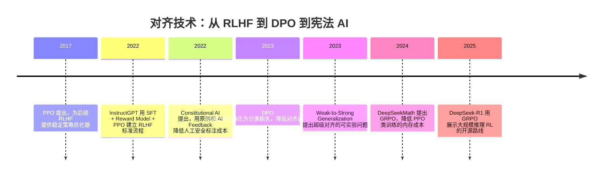

## 8.3.5 对齐技术：从 RLHF 到 DPO 到宪法 AI

**时间范围：2017-2025**

**本节在整体演进史中的位置**：前一阶段解决的是“模型变大后能力如何涌现”，本阶段转向“能力变强后如何让模型按人类意图行动”。核心转变是：对齐不再只是 Prompt 层面的约束，而成为预训练之后最关键的后训练工程。它也引出下一阶段的问题：当模型能力超过人类评估能力时，谁来监督模型？

### 时代背景

到 2021-2022 年，LLM 已经证明“规模”可以带来语言理解、生成和少样本泛化能力，但工程落地马上遇到一个更尖锐的问题：模型会说话，不代表它会“好好说话”。基础模型的训练目标只是预测下一个 Token，它并不知道什么叫有帮助、真实、无害、符合用户意图。OpenAI 的 InstructGPT 论文明确指出，更大的语言模型并不会天然更会遵循用户意图，仍可能生成不真实、有害或无用的内容。([arXiv](https://arxiv.org/abs/2203.02155))

这个阶段的突破来自三个条件叠加：第一，GPT-3 级别模型已经具备足够通用能力，值得在其上做行为塑形；第二，API 产品化带来了真实用户 Prompt 和人工偏好数据；第三，强化学习、偏好建模和大规模分布式训练基础设施逐渐成熟，使“先让模型会，再让模型听话”的后训练路线成为可能。工程上，这一阶段的本质不是发明一个更聪明的模型架构，而是发明一套把人类偏好、原则和安全边界注入模型行为的流水线。

### 关键突破

#### PPO：让 RLHF 有了可控优化器（2017）

**一句话定位**：PPO 不是为 LLM 发明的，但它后来成为早期 RLHF 的核心优化器。

**核心贡献**：

PPO 解决的是传统策略梯度训练不稳定的问题。它通过限制新旧策略更新幅度，让模型在提升奖励的同时不要一步跨太大，避免训练崩掉。原始 PPO 论文将其定位为一种在实现复杂度、采样效率和训练稳定性之间取得较好平衡的策略优化方法。([arXiv](https://arxiv.org/abs/1707.06347))

放到 LLM 对齐里，PPO 的价值在于：模型可以根据 Reward Model 给出的分数继续优化，但又通过 KL 约束避免偏离原始语言模型太远。没有这个“刹车”，模型很容易学会钻 Reward Model 的空子，生成看似高分但实际很怪的回答。

**工程师视角**：

如果你在 2022 年做 RLHF，PPO 意味着你的训练流程不再是普通 SFT。你需要同时维护 Policy Model、Reference Model、Reward Model，有时还要训练 Value Model；训练时要监控 KL、reward、response length、toxicity 等指标。它能带来效果，但工程代价非常高：显存、分布式训练、采样吞吐、超参稳定性都变成问题。

> 📄 原始论文：Schulman et al., 2017, arXiv:1707.06347

#### InstructGPT / RLHF：从“语言建模”到“用户意图对齐”（2022）

**一句话定位**：InstructGPT 让 RLHF 成为 ChatGPT 时代对齐训练的事实标准。

**核心贡献**：

InstructGPT 的核心不是简单微调，而是一条三阶段流水线：先用人工示范数据做 SFT，让模型学会基础指令跟随；再收集人类对多个候选回答的排序，训练 Reward Model；最后用 PPO 优化模型，使其输出更符合人类偏好。论文中一个标志性结果是，1.3B 参数的 InstructGPT 在人工偏好评估中优于 175B GPT-3，说明“对齐质量”可以比单纯参数规模更影响用户体验。([arXiv](https://arxiv.org/abs/2203.02155))

它承接了 GPT-3 的痛点：基础模型知识多、表达强，但不好控。RLHF 把“好回答”从抽象价值判断变成可训练信号，让模型在 helpfulness、truthfulness、harmlessness 上更接近产品要求。

**工程师视角**：

这项工作改变了大模型应用团队的分工。过去工程师重点关注 Prompt 和推理接口；RLHF 普及后，数据标注、偏好采集、模型评估、Reward Model 训练、灰度上线都进入核心工作流。你会发现，产品里的“模型性格”和“回答风格”不只是 Prompt 写出来的，而是由后训练数据和偏好目标塑造出来的。

> 📄 原始论文：Ouyang et al., 2022, arXiv:2203.02155

#### Constitutional AI：用原则替代部分人工偏好标注（2022）

**一句话定位**：Constitutional AI 是 Anthropic 对 RLHF 标注成本和安全边界问题的系统性回应。

**核心贡献**：

Constitutional AI 的关键思想是：不要让人类逐条告诉模型哪个回答更安全，而是给模型一组明确原则，让模型基于这些原则自我批评、自我改写，再用 AI Feedback 训练偏好模型。Anthropic 的论文将其称为 RLAIF，即 Reinforcement Learning from AI Feedback；人类监督主要体现在制定“宪法”原则，而不是对每个有害样本做偏好打分。([arXiv](https://arxiv.org/abs/2212.08073))

它解决了 RLHF 的两个痛点：第一，安全样本标注成本高，而且标注员长期接触有害内容会有心理负担；第二，人类偏好常常不一致，而原则可以显式表达系统希望遵循的价值边界。

**工程师视角**：

这让安全对齐从“堆标注”转向“写规范 + 自动生成训练数据”。如果你在企业里做内部模型，Constitutional AI 的启发是：不要只靠人工审核坏案例，而要把公司政策、合规边界、行业规范整理成可执行原则，再让模型参与批评、修订和生成偏好数据。但坑也很明显：原则写得含糊，模型会学得含糊；原则之间冲突，模型会表现出过度拒答或边界漂移。

> 📄 原始论文：Bai et al., 2022, arXiv:2212.08073

#### DPO：把复杂 RLHF 变成偏好分类问题（2023）

**一句话定位**：DPO 是对齐工程从“强化学习重工程”走向“偏好数据微调”的关键拐点。

**核心贡献**：

DPO 的动机很直接：PPO-based RLHF 很强，但太复杂。DPO 论文指出，传统 RLHF 需要先训练 Reward Model，再用强化学习优化策略，训练过程不稳定且计算成本高；DPO 通过重新参数化 reward，把标准 RLHF 目标转化为一个简单的分类损失，直接让模型提高 chosen response 相对 rejected response 的概率。([arXiv](https://arxiv.org/abs/2305.18290))

工程上可以把 DPO 理解为：你仍然需要偏好数据，但不再需要完整 RL 环境、Reward Model 在线打分、PPO 采样循环和大量 RL 超参。它降低了中小团队做指令对齐的门槛，也解释了为什么后来的开源模型社区大量采用 DPO、IPO、KTO、ORPO 等偏好优化变体。

**工程师视角**：

DPO 最大的变化是工作流变简单了。以前做 RLHF 需要 RL 训练栈，现在更像做一次特殊形式的 SFT：准备 chosen/rejected 数据对，启动训练，重点调 beta、学习率、数据质量。它特别适合企业私有模型做风格、拒答边界、领域偏好对齐。但它不是银弹：如果偏好数据本身噪声很大，DPO 会非常直接地把噪声学进去；如果 rejected 样本太弱，模型学不到细粒度偏好。

> 📄 原始论文：Rafailov et al., 2023, arXiv:2305.18290

#### Weak-to-Strong Generalization：超级对齐问题浮出水面（2023）

**一句话定位**：Weak-to-Strong Generalization 把对齐问题从“人类监督模型”推进到“弱监督如何控制强模型”。

**核心贡献**：

OpenAI 的弱到强泛化研究提出了一个面向超级对齐的问题：如果未来模型能力超过人类，人类就无法可靠评估所有复杂行为，RLHF 的监督前提会失效。论文用较弱模型监督更强模型做类比实验，研究强模型是否能从弱标签中恢复出更强能力；结果显示，强模型通常能超过弱监督者，但距离充分发挥自身能力仍有差距。([arXiv](https://arxiv.org/abs/2312.09390))

这里需要纠正一个常见误读：它不是简单的“GPT-4 监督 GPT-4”，而是用弱模型监督强模型，模拟未来“人类是弱监督者、超级模型是强学生”的结构。OpenAI 还展示了一些改进方法，例如辅助置信度损失，能提升弱到强泛化效果。([arXiv](https://arxiv.org/abs/2312.09390))

**工程师视角**：

这项工作对今天的直接启发是：评估体系不能只依赖人类肉眼打分。对于代码、数学、法律、金融这类高复杂任务，工程团队需要引入可验证环境、自动测试、形式化约束、专家抽检和模型辅助评审。否则，模型越强，人类越容易被“看起来很对”的答案说服。

> 📄 原始论文：Burns et al., 2023, arXiv:2312.09390

#### GRPO / DeepSeek-R1：面向推理能力的低成本 RL 路线（2024-2025）

**一句话定位**：GRPO 代表了中国开源模型阵营在推理对齐上的重要工程化突破。

**核心贡献**：

GRPO 最早在 DeepSeekMath 中被系统提出，它是 PPO 的变体，核心做法是去掉单独的 critic/value model，用同一问题下多条生成结果的组内相对分数估计 baseline，从而降低训练资源消耗。DeepSeekMath 论文明确称 GRPO 可以提升数学推理能力，同时优化 PPO 的内存使用。([arXiv](https://arxiv.org/abs/2402.03300))

到 DeepSeek-R1，GRPO 被用于大规模推理强化学习。DeepSeek-R1-Zero 展示了不经过传统 SFT、直接用大规模 RL 激发推理行为的可能性；DeepSeek-R1 则加入冷启动数据和多阶段训练，以改善可读性、语言混杂等问题。([arXiv](https://arxiv.org/abs/2501.12948))

**工程师视角**：

GRPO 的意义不只是“又一个 RL 算法”，而是降低了推理模型训练的基础设施门槛。对国内团队尤其重要：在算力受限、模型开源生态活跃、应用场景强调数学/代码/复杂推理的背景下，GRPO 提供了一条比传统 PPO 更轻的路径。但它也提醒工程师：推理 RL 不等于通用安全对齐，数学题奖励可验证，开放问答和价值判断的奖励设计仍然困难。

> 📄 原始论文：Shao et al., 2024, arXiv:2402.03300  
> 📄 原始论文：DeepSeek-AI et al., 2025, arXiv:2501.12948

### 阶段总结

**本阶段核心主题**：对齐技术的主线，是把“人类想要什么”转化为模型可优化的训练信号。早期 RLHF 证明偏好数据能显著改善产品体验，DPO 让偏好优化变得更易复现，Constitutional AI 和弱到强泛化则把问题推进到更本质的层面：当人工标注不足以覆盖复杂行为时，模型能否参与监督模型？

### 历史意义与遗留问题

这个阶段最重要的成就是：大模型从“会续写文本的基础模型”变成“能遵循指令的 AI 助手”。RLHF 建立了 ChatGPT 类产品的后训练范式；DPO 降低了开源和企业模型对齐的工程门槛；Constitutional AI 证明原则监督可以部分替代人工偏好标注；GRPO 则让强化学习重新成为推理模型训练的核心工具之一。

但遗留问题同样关键。第一，偏好数据并不等于真实价值观，标注员偏好、平台政策、区域文化都会影响模型行为。第二，Reward Hacking 仍然存在，模型可能学会迎合评分器而不是真正解决问题。第三，安全原则难以穷举，过度保守会伤害可用性，过度宽松又带来风险。第四，超级对齐问题还没有解决：当模型能力超过人类评估能力时，传统 RLHF 的监督闭环会变得脆弱。这正是下一阶段“可验证监督、模型辅助评审、自动化对齐研究”继续展开的原因。

---

**Sources:**

- [Training language models to follow instructions with human feedback](https://arxiv.org/abs/2203.02155)

