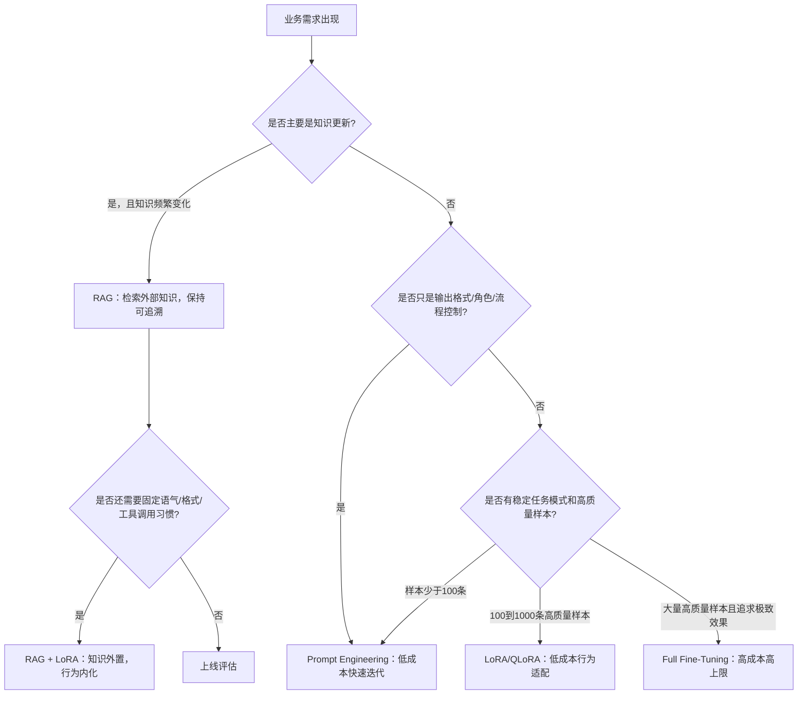
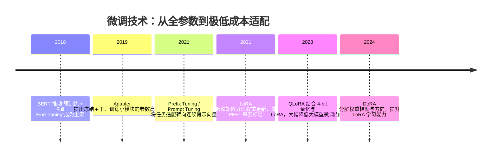

## 8.3.6 微调技术：从全参数到极低成本适配

**时间范围**：2018-2024  
**本节位置**：前一阶段，高效推理主要解决“模型跑得起、跑得快”的问题；本阶段进一步追问“模型能不能以极低成本适配业务”；它也为下一阶段的个性化 Agent、多 LoRA 动态加载、端侧模型适配埋下基础。

### 时代背景

2018 年之后，BERT、GPT 等预训练模型让 NLP 工程进入“预训练 + 下游适配”时代。最早的主流做法是 Full Fine-Tuning：拿一个通用大模型，在业务数据上继续训练全部参数。这个范式简单、效果强，但很快撞上三堵墙：第一，模型越来越大，训练显存和优化器状态成本急剧上升；第二，每个业务任务都保存一份完整模型，存储和部署成本不可接受；第三，多任务、多租户场景下，模型版本管理变成灾难。BERT 证明“预训练模型只加一个输出层即可在多种任务上微调”是可行的，但当模型从数亿参数走向百亿、千亿参数，全参数微调不再是默认答案，而是少数高价值场景才负担得起的重型方案。([arXiv](https://arxiv.org/abs/1810.04805?utm_source=chatgpt.com))

这个阶段的突破来自三个条件同时成熟：算法上，人们开始发现下游任务对大模型的修改往往不是全空间更新，而是低维、稀疏、可压缩的；工程上，Transformer 层结构稳定，使 Adapter、Prefix、LoRA 这类“外挂式适配层”容易标准化；生态上，Hugging Face Transformers、PEFT、DeepSpeed、bitsandbytes 等工具把研究方法变成可复用训练流水线。于是微调技术的核心问题从“如何把模型训练得更好”，转向“如何只改极少参数，却尽量接近全参数微调效果”。

---

### 关键突破

#### Full Fine-Tuning：预训练模型适配的第一范式（2018-2019）

**一句话定位**：Full Fine-Tuning 是大模型应用开发的原始默认范式，把预训练模型完整复制到具体任务上继续训练。

**核心贡献**：

Full Fine-Tuning 的价值在于，它把 NLP 从“为每个任务设计专用模型结构”推进到“一个通用预训练模型适配多任务”。BERT 的成功尤其关键：预训练阶段学习通用语言表示，下游任务只需加入少量任务头并微调整个模型，就能在问答、自然语言推理、分类等任务上取得强效果。([arXiv](https://arxiv.org/abs/1810.04805?utm_source=chatgpt.com))

它解决的是前深度学习和早期深度学习时代“特征工程重、任务模型碎片化”的问题。但它也制造了新的成本问题：每个任务都要更新并保存一份完整模型；模型越大，训练越贵，部署越难，回滚和版本管理越复杂。

**工程师视角**：

如果你在 2019 年做 NLP 项目，Full Fine-Tuning 是最直接的路线：准备标注数据，加载 BERT/RoBERTa，改 classification head，然后训练全模型。它的优势是稳定、易解释、效果上限高；缺点是每个任务都像维护一个独立模型。在企业环境里，如果有 20 个部门、50 个分类器、多个语言版本，全参数微调很快会把 GPU、模型仓库和上线流程压垮。

> 📄 原始论文：Devlin et al., 2018, arXiv:1810.04805

---

#### Adapter：把“任务差异”压进小模块（2019）

**一句话定位**：Adapter 首次系统性证明，大量任务适配不一定要改全模型，可以在冻结主干的基础上插入少量可训练模块。

**核心贡献**：

Houlsby 等人在 2019 年提出 Adapter Tuning：冻结预训练模型主体，只在 Transformer 层之间加入小型瓶颈网络，每个任务训练自己的 Adapter。论文报告显示，Adapter 在 GLUE 上接近 full fine-tuning 效果，只增加约 3.6% 的任务参数，而 full fine-tuning 需要为每个任务训练 100% 参数。([arXiv](https://arxiv.org/abs/1902.00751?utm_source=chatgpt.com))

这个思路的关键不是“多加几层网络”，而是把通用能力和任务能力解耦：基座模型负责通用语言理解，Adapter 负责注入任务偏移。它让多任务部署从“复制 N 份模型”变成“一个基座 + N 个小插件”。

**工程师视角**：

Adapter 改变了模型管理方式。你不再需要为每个客户保存一份完整模型，而是保存一个共享 backbone 和多个 adapter 权重。对于企业知识库、行业分类器、多语言任务，这种架构极具吸引力。它的主要问题是推理时多了额外网络层，虽然开销不大，但在高 QPS、低延迟场景中仍要评估。

> 📄 原始论文：Houlsby et al., 2019, arXiv:1902.00751

---

#### Prefix Tuning / Prompt Tuning：把“提示词”变成可训练参数（2021）

**一句话定位**：Prefix Tuning 把 Prompt Engineering 从手写文本推进到可学习的连续向量空间。

**核心贡献**：

Prefix Tuning 冻结语言模型参数，只训练一段连续向量 prefix，让后续 token 像关注普通上下文一样关注这些“虚拟 token”。Li 和 Liang 的工作显示，在生成任务中，仅训练约 0.1% 参数也能达到接近 full fine-tuning 的效果，并在低数据场景表现更稳。([arXiv](https://arxiv.org/abs/2101.00190?utm_source=chatgpt.com))

Prompt Tuning 进一步简化了 Prefix Tuning，只学习 soft prompt，并发现模型规模越大，soft prompt 与 full tuning 的差距越小。这给了工程界一个重要信号：大模型足够强时，很多任务不需要修改模型内部权重，只需学习如何“激活”模型已有能力。([arXiv](https://arxiv.org/abs/2104.08691?utm_source=chatgpt.com))

中国读者尤其值得注意 P-Tuning v2。它由清华团队提出，把深层 Prompt Tuning 扩展到更广泛的 NLU 任务，报告称可在 0.1%-3% 可训练参数下接近 full fine-tuning 表现。这条路线后来也影响了国内大模型早期适配实践。([arXiv](https://arxiv.org/abs/2110.07602?utm_source=chatgpt.com))

**工程师视角**：

Prefix/Prompt Tuning 的实践价值在于极低存储成本和较强多任务隔离。但它也有明显工程坑：训练不稳定、超参敏感、不同模型结构迁移性不如 LoRA，且对生成风格、复杂指令遵循的控制不一定足够强。因此在今天的生产项目里，它更适合低成本实验、分类/抽取等轻适配任务，而不是所有场景的默认方案。

> 📄 原始论文：Li & Liang, 2021, arXiv:2101.00190  
> 📄 原始论文：Lester et al., 2021, arXiv:2104.08691  
> 📄 原始论文：Liu et al., 2021, arXiv:2110.07602

---

#### LoRA：低秩更新成为微调事实标准（2021）

**一句话定位**：LoRA 是 PEFT 走向大模型工程主流的关键转折点。

**核心贡献**：

LoRA 的核心观察是：下游任务对大模型权重的更新 ΔW 往往具有低秩结构，不必直接训练完整矩阵。它冻结原始权重 W，只训练两个小矩阵 A 和 B，用 BA 近似 ΔW。推理时可以把 LoRA 权重合并回原矩阵，因此相比 Adapter 不引入额外推理层。Hu 等人的论文报告，LoRA 在 GPT-3 175B 场景下可将可训练参数减少约 10,000 倍，将 GPU 显存需求降低约 3 倍，同时在多个模型上达到接近或优于 full fine-tuning 的效果。([arXiv](https://arxiv.org/abs/2106.09685?utm_source=chatgpt.com))

LoRA 之所以成为事实标准，是因为它同时击中了三个工程痛点：训练成本低、推理无额外延迟、权重文件小。它不像 Prefix Tuning 那样强依赖提示向量优化，也不像 Adapter 那样改变模型前向结构。对于工程师来说，LoRA 的 mental model 很清晰：基座模型不动，业务差异存在一组小型增量权重里。

**工程师视角**：

LoRA 改变了微调日常。原来你要申请多卡训练资源、保存完整 checkpoint；现在可以用单机多卡甚至单卡训练一个行业风格、客服话术、代码规范、垂直问答的适配器。生产上也更容易做多租户：一个通用基座模型加载多个 LoRA adapter，根据租户、任务或语言动态切换。国内 Qwen 等模型生态也很早支持 full-parameter、LoRA 和 Q-LoRA 微调，使企业可以在中文场景下以较低成本做行业适配。([GitHub](https://github.com/QwenLM/Qwen?utm_source=chatgpt.com))

> 📄 原始论文：Hu et al., 2021, arXiv:2106.09685

---

#### QLoRA：把大模型微调推进到单卡时代（2023）

**一句话定位**：QLoRA 把 LoRA 与 4-bit 量化结合，让几十亿到数百亿参数模型的微调门槛大幅降低。

**核心贡献**：

QLoRA 的思路是：基座模型用 4-bit 量化形式冻结保存，梯度通过量化模型回传到 LoRA adapter，只训练低秩参数。它引入 NF4、Double Quantization 和 Paged Optimizer，分别解决量化精度、量化常数存储和训练显存峰值问题。Dettmers 等人的论文报告，QLoRA 能在单张 48GB GPU 上微调 65B 模型，并保持接近 16-bit full fine-tuning 的任务性能。([arXiv](https://arxiv.org/abs/2305.14314?utm_source=chatgpt.com))

它的历史意义不只是“更省显存”，而是改变了谁能微调大模型。过去 65B 级模型微调属于大厂和实验室；QLoRA 之后，中小团队、个人开发者也能对大模型做领域适配。它直接推动了开源模型社区的爆发：LLaMA、Qwen、Mistral、DeepSeek 等模型都可以围绕 LoRA/QLoRA 构建轻量适配生态。

**工程师视角**：

QLoRA 让微调从“基础设施项目”变成“业务实验手段”。你可以用较低成本验证：客服话术是否值得微调？法律文书润色是否需要行业语料？代码助手是否需要公司内部规范？但 QLoRA 也有坑：4-bit 训练更依赖底层 kernel、batch size、序列长度和显存碎片管理；它适合降低训练门槛，不代表一定比 LoRA 更快或更准。若预算允许、追求极致质量，bf16 LoRA 仍然常常是更稳的选择。

> 📄 原始论文：Dettmers et al., 2023, arXiv:2305.14314

---

#### DoRA：修补 LoRA 与全参数微调之间的能力差距（2024）

**一句话定位**：DoRA 是 LoRA 系方法从“省参数”走向“逼近 full fine-tuning 学习能力”的一次重要改进。

**核心贡献**：

DoRA 认为 LoRA 与 full fine-tuning 的差距来自权重更新方式不够细。它将预训练权重分解为 magnitude 和 direction 两部分：方向更新仍使用 LoRA 的低秩方式，幅度部分单独学习。这样既保留了 LoRA 的参数效率和无额外推理开销，又提升了学习能力和训练稳定性。论文报告 DoRA 在 LLaMA、LLaVA、VL-BART 等文本与多模态任务上相对 LoRA 有更好表现。([arXiv](https://arxiv.org/abs/2402.09353?utm_source=chatgpt.com))

DoRA 的出现说明 PEFT 已经进入“精细化阶段”：问题不再只是能不能省参数，而是如何在省参数的同时逼近 full fine-tuning 的表达能力。

**工程师视角**：

如果你已经把 LoRA 跑通，但发现复杂推理、多模态指令、风格一致性仍差一口气，DoRA 是值得尝试的增强方案。它不是替代所有 LoRA 配置的银弹，而是适合对质量更敏感、又不想回到全参数微调的中间路线。

> 📄 原始论文：Liu et al., 2024, arXiv:2402.09353

---

### 微调 vs RAG vs Prompt Engineering：三路线决策树

工程上可以用三维度判断：

| 维度 | Prompt Engineering | RAG | 微调 / PEFT |
|---|---|---|---|
| 数据量 | 0 到少量示例 | 文档多、问答样本可少 | 需要稳定训练样本 |
| 更新频率 | 高频改规则最方便 | 高频知识更新最合适 | 适合稳定风格/能力 |
| 成本结构 | 开发成本低，推理 token 可能高 | 有检索和索引成本 | 训练成本高，推理可控 |

核心原则：**知识不要轻易微调进模型，行为才适合微调进模型**。公司制度、产品价格、实时数据应优先 RAG；稳定客服口吻、固定 JSON 输出、领域写作风格、工具调用偏好，才是 LoRA/QLoRA 的主场。

---

### 阶段总结

**本阶段核心主题**：微调技术的主线，是把“复制并训练整个模型”逐步压缩为“冻结基座，只学习任务差异”。Adapter 证明小模块可行，Prefix/Prompt Tuning 证明连续提示可行，LoRA/QLoRA 则真正把低成本微调带进工程主流。到 DoRA 阶段，行业开始追求参数效率与效果上限的平衡，而不只是单纯省显存。

---

### 历史意义与遗留问题

这个阶段写进教科书的成就是：**大模型适配从重资产训练变成轻量化增量更新**。它让企业能基于同一个开源或闭源基座模型，快速构建行业助手、客服机器人、代码助手、写作工具、多模态应用，而不必为每个场景训练一份完整模型。对中国开发者来说，LoRA/QLoRA 与 Qwen、DeepSeek、Baichuan、InternLM 等中文开源模型结合，显著降低了本土行业模型落地门槛。

但它也留下了新问题。第一，PEFT 的能力边界仍不清晰：哪些任务 LoRA 足够，哪些必须 full fine-tuning，很多时候仍靠实验判断。第二，多 LoRA 组合、动态路由、热加载会带来服务复杂度。第三，微调可能把数据偏差、错误风格、幻觉模式固化进模型，评估体系必须同步升级。第四，RAG、Prompt、微调三者不是替代关系，而是组合关系；真正的生产系统往往是 RAG 提供知识，Prompt 控制流程，LoRA 固化稳定行为。

这也自然引出下一阶段：当低成本适配成为基础能力后，AI Agent 不再只是调用一个通用模型，而会按用户、任务、工具、上下文动态选择模型、检索源和 adapter。微调技术的终点不是“训练一个更小的权重文件”，而是让模型系统具备可组合、可切换、可治理的长期适应能力。

---

**Sources:**

- [BERT: Pre-training of Deep Bidirectional Transformers for Language Understanding](https://arxiv.org/abs/1810.04805?utm_source=chatgpt.com)
- [The official repo of Qwen (通义千问) chat & pretrained large ...](https://github.com/QwenLM/Qwen?utm_source=chatgpt.com)

