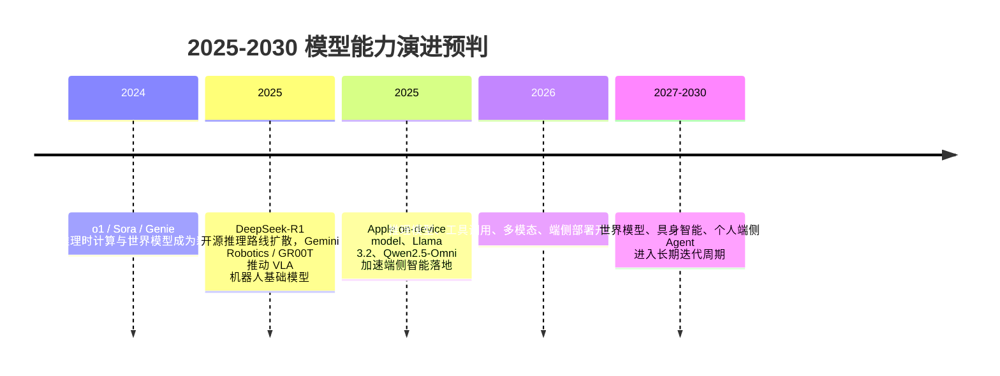

## 8.5.1 模型能力演进预判（2025-2030）

**时间范围**：2025-2030  
**本节位置**：前一阶段已经证明”大模型可以通过规模、多模态、Agent 工具调用获得通用能力”；本阶段的核心转变，是从”云端大模型回答问题”走向”可思考、可模拟、可行动、可本地运行的智能系统”；下一阶段将自然引出长期自主 Agent、个人 AI 与具身智能基础设施。

### 时代背景

2025 年前后，LLM 的主要瓶颈不再只是“参数够不够大”，而是四个更工程化的问题：复杂任务能否可靠推理、模型是否理解真实世界的动态规律、AI 能否进入物理世界执行动作、以及推理能力能否从云端下沉到手机、车机、眼镜和机器人本体。上一阶段的 Scaling Law 证明了预训练规模的重要性，但互联网高质量文本数据逐渐逼近边际收益递减，单纯堆参数也带来不可接受的训练成本和推理成本。于是行业开始寻找新的能力增长轴：推理时计算量、视频与交互环境数据、机器人轨迹数据、端侧 NPU/SoC 加速，以及更强的量化与蒸馏技术。OpenAI o1/o3、DeepSeek-R1、Genie、Gemini Robotics、Apple on-device foundation model、Gemini Nano、Llama 3.2、Qwen2.5-Omni 等工作，本质上都在回答同一个问题：模型能力的下一轮增长，是否可以不完全依赖“更大预训练”，而依赖“更会思考、更懂世界、更贴近设备与环境”。([OpenAI](https://openai.com/index/learning-to-reason-with-llms/))

### 关键突破

#### Test-Time Compute Scaling 与推理模型（2024-2026）

**一句话定位**：推理模型把能力扩展从“训练时堆算力”推进到“推理时动态分配算力”，是大模型从快问快答走向复杂问题求解的关键转折。

**核心贡献**：  
传统 LLM 的推理通常是“一次采样、一条回答”，这对摘要、翻译、信息抽取足够，但对数学、代码、复杂规划很脆弱。Test-Time Compute Scaling 的核心思想，是让模型在推理阶段花更多计算：可以多次采样、搜索候选解、使用 verifier 评分，也可以让模型在生成答案前进行更长的内部推理。Snell et al. 的研究系统分析了推理时计算的两条路线：基于过程奖励模型搜索，以及根据题目难度自适应调整推理分布；结论不是“算得越多一定越好”，而是“要把算力花在值得花的问题上”。([arXiv](https://arxiv.org/abs/2408.03314))

OpenAI o1 将这一方向产品化，明确提出模型性能会随“更多思考时间”提升；o3/o4-mini 则进一步把推理能力与工具调用、视觉理解、代码执行结合起来，形成“推理 + 工具”的统一工作流。DeepSeek-R1 的意义在于开源化：它用大规模 RL，尤其是 GRPO 路线，展示了不完全依赖人工标注 CoT，也能诱发模型出现自我反思、长链推理等行为，并发布了 1.5B 到 70B 的蒸馏模型，降低了研究和落地门槛。([OpenAI](https://openai.com/index/learning-to-reason-with-llms/))

> 📄 原始论文：Snell et al., 2024, arXiv:2408.03314  
> 📄 原始论文：DeepSeek-AI et al., 2025, arXiv:2501.12948

**工程师视角**：  
这会改变模型调用层设计。过去工程师只关心 model、temperature、max_tokens；现在还要设计 reasoning budget、verifier、并行采样、失败重试和成本上限。对代码生成、数学求解、SQL Agent、复杂规划任务，可以用“弱模型多采样 + verifier”替代一次强模型调用；但在开放式写作、客服闲聊、主观判断场景，额外推理常常只是增加延迟和成本。未来 3-5 年，推理红利仍会持续，但会从“无脑加 thinking tokens”走向“按任务难度动态分配算力”。

#### 世界模型：从 Sora、Genie 到交互式环境（2024-2025）

**一句话定位**：世界模型把大模型从“预测下一个 Token”推向“预测环境如何变化”，是通往因果推理、仿真训练和具身智能的重要中间层。

**核心贡献**：  
Sora 的重要性不只是视频生成质量，而是 OpenAI 明确把视频生成模型称为“world simulators”的探索方向：模型通过大规模视频学习物体运动、镜头变化、时空一致性和简单物理规律。它还不能等同于真实物理引擎，但把“生成模型是否能形成可泛化世界表征”这个问题推到了行业中心。([OpenAI](https://openai.com/index/video-generation-models-as-world-simulators/))

Genie 则更进一步：它不是只生成一段视频，而是尝试生成可交互环境。Genie 通过未标注互联网视频学习 latent action，让用户能够在生成环境中逐帧行动；Genie 3 又把方向推进到更通用的实时交互式世界模型，强调可生成多样环境并支持交互。这里的关键变化是：模型不再只是“看见世界”，而是开始学习“动作会如何改变世界”。([arXiv](https://arxiv.org/abs/2402.15391))

> 📄 原始论文：Bruce et al., 2024, arXiv:2402.15391

**工程师视角**：  
世界模型短期不会替代物理仿真器，但会改变数据生成和测试流程。自动驾驶、机器人、游戏 AI、数字孪生团队会越来越多地使用生成式环境做长尾场景扩充，例如雨夜、遮挡、低光、罕见障碍物。但工程上必须记住：生成环境不是 ground truth。它适合做预训练、鲁棒性测试和策略 warm-up，不适合直接替代安全关键系统的真实验证。真正可靠的方案会是“真实数据 + 仿真器 + 生成式世界模型”的混合闭环。

#### 具身智能：LLM 赋能机器人控制（2023-2026）

**一句话定位**：具身智能的核心突破，是把语言、视觉、动作统一到一个可学习接口中，让机器人从“每个任务单独编程”走向“通过通用模型迁移”。

**核心贡献**：  
RT-2 提出了 Vision-Language-Action（VLA）范式：把机器人动作表示为 Token，使模型能同时学习互联网级视觉语言知识和机器人控制数据。这样一来，模型不只是识别“这是苹果”，还可以把“把苹果放进碗里”转换为动作序列。Open X-Embodiment / RT-X 进一步解决数据孤岛问题，把 22 种机器人形态、100 万级真实轨迹统一成跨机器人数据集，证明不同机器人之间的经验迁移是可能的。([arXiv](https://arxiv.org/abs/2307.15818))

2025 年后，Gemini Robotics 和 NVIDIA GR00T N1 代表了更工程化的路线。Gemini Robotics 强调让机器人感知、推理、使用工具并与人交互；Gemini Robotics-ER 1.6 则突出空间理解、任务规划、成功检测和工具调用。GR00T N1 使用双系统架构：视觉语言模块负责理解环境和指令，扩散 Transformer 负责实时生成动作。这说明具身智能不会是“一个 LLM 直接控制电机”，而会是高层推理模型、VLA 策略、低层控制器、安全约束和仿真训练平台的组合。([Google DeepMind](https://deepmind.google/models/gemini-robotics/))

> 📄 原始论文：Brohan et al., 2023, arXiv:2307.15818  
> 📄 原始论文：Open X-Embodiment Collaboration, 2023, arXiv:2310.08864  
> 📄 原始论文：Bjorck et al., 2025, arXiv:2503.14734  
> 📄 原始论文：Gemini Robotics Team, 2025, arXiv:2503.20020

**工程师视角**：  
如果你在做机器人或工业 Agent，未来架构不会是简单的“LLM + ROS”。更现实的分层是：LLM/多模态模型做任务理解与规划，VLA 模型做技能选择与轨迹生成，传统控制器负责稳定性和安全边界，仿真平台负责数据扩充与回归测试。最大坑在于安全与泛化：模型能听懂自然语言，不代表能在新环境稳定执行；能在 demo 中拿起杯子，不代表能在工厂 24 小时运行。

#### 端侧大模型：1-7B 参数的本地智能（2023-2026）

**一句话定位**：端侧大模型让 AI 从“云端服务”变成“设备能力”，其价值不只是省钱，而是低延迟、隐私、离线和个性化。

**核心贡献**：  
Google 的 Gemini Nano 通过 Android AICore 在设备上运行，面向低延迟、隐私敏感和离线场景；Apple Intelligence 的技术报告则展示了约 3B 参数的 on-device foundation model 与云端 Private Cloud Compute 协同的混合路线。Meta Llama 3.2 发布 1B/3B 轻量模型，强调 128K 上下文和移动/边缘设备适配；国内 Qwen2.5-Omni-7B 则把文本、图像、音频、视频输入与实时文本/语音输出统一起来，并明确面向手机、笔记本等 edge devices。([Android Developers](https://developer.android.com/ai/gemini-nano))

> 📄 技术报告：Apple, 2025, arXiv:2507.13575  
> 📄 原始论文：Qwen Team, 2025, arXiv:2503.20215

**工程师视角**：  
端侧模型会改变产品架构：能在本地做的，就不一定要发到云端。典型场景包括输入法改写、会议摘要预处理、相册理解、车内语音助手、AR 眼镜实时提示、机器人离线控制。但端侧模型不是“小号 GPT”：它更适合短上下文、强约束、低风险任务。工程选型上要重点关注量化格式、内存占用、首 Token 延迟、NPU 兼容性、隐私策略和云端 fallback。未来主流架构大概率是“端侧小模型常驻 + 云端强模型兜底 + 用户数据本地化记忆”。

### 阶段总结

**本阶段核心主题**：模型能力的增长轴正在从“更大参数 + 更多数据”转向“推理时计算、环境交互、具身数据和端侧部署”的组合优化。真正重要的不是某个单点模型，而是模型开始进入闭环：能思考、能看见动态世界、能调用工具、能控制设备，并能在用户身边长期运行。

### 历史意义与遗留问题

这个阶段解决的，是大模型从“语言智能”走向“系统智能”的第一步。推理模型让复杂问题求解有了新的 scaling path；世界模型让模型开始学习环境变化；VLA 和机器人基础模型让自然语言与物理动作之间出现统一接口；端侧模型则把 AI 从云端 API 下沉为设备原生能力。

但遗留问题同样尖锐。第一，Test-Time Compute 的收益高度依赖可验证任务，开放式任务仍缺少可靠 verifier。第二，世界模型还没有真正掌握稳定物理因果，生成视频中的“看似合理”不能等同于“可用于决策”。第三，机器人落地受制于数据采集、硬件成本、安全认证和长尾环境。第四，端侧模型会带来碎片化生态：不同芯片、系统、量化格式和隐私合规要求会显著增加工程复杂度。也正因为这些问题没有解决，下一阶段的核心议题将不再只是“模型多强”，而是“Agent 能否在真实世界长期、可靠、低成本地完成任务”。

---

**Sources:**

- [Learning to reason with LLMs](https://openai.com/index/learning-to-reason-with-llms/)
- [Scaling LLM Test-Time Compute Optimally can be More Effective than Scaling Model Parameters](https://arxiv.org/abs/2408.03314)
- [Gemini Robotics](https://deepmind.google/models/gemini-robotics/)
- [Gemini Nano | AI](https://developer.android.com/ai/gemini-nano)

