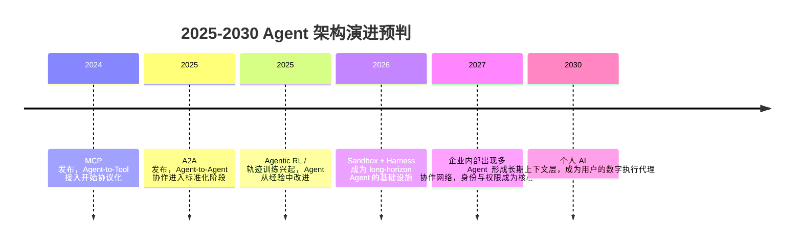

## 8.5.2 Agent 架构演进预判

**时间范围**：2025-2030  
**本节在整体演进史中的位置**：前一阶段的核心结论是：模型能力开始从“回答问题”走向“执行任务”。本阶段的核心转变是：Agent 不再只是一次性 ReAct 循环，而会演进为具备持久状态、跨系统协作、自我改进与长期用户上下文的“软件执行主体”。这将引出下一阶段对基础设施、身份、安全、监管与社会影响的讨论。

### 时代背景

2025 年前后，Agent 的瓶颈已经不再是“能不能调用工具”，而是“能不能可靠地连续工作”。早期 ReAct / Function Calling 解决了单轮或短链路任务，但一旦任务跨越数小时、数天，系统就会暴露出四类硬伤：上下文会爆、状态会丢、工具调用不可控、失败后难以恢复。另一方面，长上下文模型、代码执行沙箱、Checkpoint、MCP / A2A 等协议、LLM-as-Judge 评估和大规模轨迹数据开始成熟，使 Agent 从“聊天框里的自动化脚本”向“可恢复、可审计、可协作的软件进程”演进。OpenAI 在 2026 年更新 Agents SDK 时，明确把 sandbox execution、文件检查、命令执行、代码编辑和 long-horizon tasks 放到核心位置，这说明行业共识已经从“模型更聪明”转向“执行环境更工程化”。([OpenAI](https://openai.com/index/the-next-evolution-of-the-agents-sdk/))

### 关键突破

#### 长任务持久化 Agent（2025-2026）

**一句话定位**：Agent 从“一次会话里的智能流程”变成“可以中断、恢复、接力和审计的长期任务执行体”。

**核心贡献**：

长任务 Agent 解决的是 ReAct 时代最痛的状态问题。一个 Agent 做代码迁移、合同审查、科研实验或企业流程自动化时，不可能把全部中间状态都塞进上下文窗口。工程上必须把“模型上下文”和“任务状态”分离：上下文只保留当前决策需要的信息，完整执行历史、文件修改、工具结果、人工审批记录则落到外部存储中。

LangGraph 的 checkpoint 思路代表了这一方向：它把图执行状态在每一步保存为 checkpoint，从而支持 human-in-the-loop、time travel debugging、对话记忆和失败恢复。OpenAI 2026 年 Agents SDK 的 sandbox/harness 更新，则进一步把 Agent 的执行环境标准化：Agent 可以在受控工作区中读文件、运行命令、编辑代码，同时避免直接污染宿主系统。([LangChain 文档](https://docs.langchain.com/oss/python/langgraph/persistence?utm_source=chatgpt.com))

**工程师视角**：

如果你在 2023 年做 Agent，核心工作是调 Prompt、写工具 schema、处理死循环；到 2026 年，核心工作变成设计“Agent Runtime”：任务 ID、状态机、checkpoint 存储、sandbox 权限、回滚策略、人工审批点、Trace 与告警。一个生产级 Agent 不应该只问“这一步怎么回答”，而要问“这一步失败后能不能恢复、谁批准了危险动作、执行证据能不能回放”。

> 📄 相关系统：LangGraph Persistence；OpenAI Agents SDK, 2026。

#### 自主学习 Agent：从经验到权重（2025-2027）

**一句话定位**：Agent 的学习方式从“把失败写进记忆”升级为“把执行轨迹变成训练数据，反向改进模型或策略”。

**核心贡献**：

Reflexion 和 Voyager 是这条路线的早期信号。Reflexion 不更新模型权重，而是让 Agent 根据任务反馈生成反思文本，并把反思写入 episodic memory；Voyager 则在 Minecraft 中维护一个可复用的 skill library，通过环境反馈持续积累技能。它们证明了一个关键事实：Agent 的能力不只来自预训练，也来自执行过程中的经验沉淀。([arXiv](https://arxiv.org/abs/2303.11366?utm_source=chatgpt.com))

2025 年以后，趋势会进一步走向“经验 → 轨迹 → 训练”。Agent Lightning 提出把任意 Agent 执行过程建模为 Markov decision process，并将 Agent 执行与 RL 训练解耦，使 LangChain、OpenAI Agents SDK、AutoGen 或自研 Agent 都能生成可训练轨迹。国内相关进展也值得关注：ROME / ALE 将 agentic RL 训练框架、sandbox 环境和 CLI Agent 框架组合成端到端生态，并强调多轮交互、轨迹生成和长程任务训练。([arXiv](https://arxiv.org/abs/2508.03680?utm_source=chatgpt.com))

**工程师视角**：

这会改变 Agent 评估与迭代方式。过去我们主要靠人工看日志、改 Prompt；未来更像 MLOps：采集失败轨迹，标注成功/失败，做 reward shaping，离线回放，最后用 SFT / DPO / RL 更新策略。常见坑也会从“Prompt 不稳定”升级为“奖励黑客、环境泄漏、训练-部署不一致”。因此，真正有价值的不是随便让 Agent 自我学习，而是建立安全的轨迹采集、回放、评估和灰度发布闭环。

> 📄 原始论文：Shinn et al., 2023, arXiv:2303.11366；Wang et al., 2023, arXiv:2305.16291；Luo et al., 2025, arXiv:2508.03680；Wang et al., 2025, arXiv:2512.24873。

#### Agent 互联网：MCP + A2A（2024-2028）

**一句话定位**：Agent 从“连接工具”走向“连接其他 Agent”，协议层成为新基础设施。

**核心贡献**：

MCP 解决的是 Agent-to-Tool 问题。Anthropic 在 2024 年发布 MCP，目标是用统一协议连接 AI 系统与数据源，避免每个工具、每个数据系统都要单独写 connector。它的历史意义类似 LSP 之于 IDE：把“工具接入”从框架私有能力变成生态接口。([Anthropic](https://www.anthropic.com/news/model-context-protocol))

A2A 解决的是 Agent-to-Agent 问题。Google 在 2025 年推出 Agent2Agent Protocol，强调不同供应商、不同框架构建的 Agent 可以发现彼此能力、交换信息、协同完成任务；A2A 后来进入 Linux Foundation，说明它不仅是 Google Cloud 的产品能力，而是在向中立治理的互操作标准演进。A2A 官方文档也明确区分了 MCP 与 A2A：MCP 偏 agent-to-tool，A2A 偏 agent-to-agent。([Google 开发者博客](https://developers.googleblog.com/en/a2a-a-new-era-of-agent-interoperability/))

**工程师视角**：

未来企业里不会只有一个“全能 Agent”，而会有采购 Agent、财务 Agent、法务 Agent、代码 Agent、数据分析 Agent。它们需要像微服务一样互相发现、鉴权、调用和审计。工程重点会从“我给模型多少工具”变成“哪个 Agent 有权代表谁调用哪个系统”。身份认证、权限委托、调用计费、责任归属、跨组织信任，会成为 Agent 架构设计里的核心问题。

#### 个人 AI：长期上下文与用户代理（2025-2030）

**一句话定位**：个人 AI 会从“会聊天的助手”演进为“理解用户长期目标、偏好、关系和工作流的私人执行层”。

**核心贡献**：

个人 AI 的关键不是记住几条偏好，而是建立可控、可解释、可迁移的长期上下文。OpenAI 在 2025 年扩展 ChatGPT Memory，使其不仅使用用户显式保存的 memories，也可以参考过去聊天记录来提供更个性化的响应；这标志着个人 AI 从 session-based assistant 走向 history-aware assistant。([OpenAI](https://openai.com/index/memory-and-new-controls-for-chatgpt/?utm_source=chatgpt.com))

但“记得越多越好”不是正确方向。个人 AI 真正需要的是上下文治理：哪些记忆可长期保存，哪些只在项目内有效，哪些敏感信息永不进入模型上下文，哪些行为需要二次确认。Anthropic 在 MCP code execution 文章中提到，通过代码执行和 MCP，敏感中间数据可以留在执行环境，只把必要结果暴露给模型；这类隐私保护模式会成为个人 AI 的基础设计。([Anthropic](https://www.anthropic.com/engineering/code-execution-with-mcp))

**工程师视角**：

做个人 AI 时，不能把它简单理解为“RAG + 用户画像”。更合理的架构是三层记忆：短期上下文负责当前任务，项目记忆负责某个长期目标，个人记忆负责稳定偏好与身份信息。每层都要有可查看、可编辑、可删除、可导出的机制。否则，个人 AI 很容易变成一个“看似贴心但不可审计”的黑盒。

### 阶段总结

**本阶段核心主题**：Agent 架构的主线不是“更复杂的 Prompt”，而是“更像软件系统”。持久化、权限、协议、沙箱、观测、训练闭环，会比单次推理技巧更重要。未来优秀的 Agent 工程师，本质上会同时是分布式系统工程师、安全工程师和 MLOps 工程师。

### 历史意义与遗留问题

这个阶段解决的核心问题，是把 Agent 从 demo 变成可工程化的执行系统：长任务可以恢复，工具接入可以标准化，多个 Agent 可以协作，用户上下文可以跨会话延续。它写进教科书的成就，不是某一个 Agent 产品，而是确立了 Agent Runtime、Agent Protocol、Agent Memory 和 Agent Learning Pipeline 四个基础抽象。

但它也留下了更难的问题。第一，长期自主执行会放大错误，Agent 做错一步可能影响真实资产、数据和人。第二，自主学习会带来 reward hacking 与不可预测策略漂移。第三，Agent 互联网需要解决身份、信任、责任和审计，否则跨组织协作无法大规模落地。第四，个人 AI 越了解用户，隐私、依赖和心理安全问题越突出。下一阶段的关键，不再只是“让 Agent 更能干”，而是“让 Agent 在真实社会系统中可控、可信、可追责”。

---

**Sources:**

- [The next evolution of the Agents SDK | OpenAI](https://openai.com/index/the-next-evolution-of-the-agents-sdk/)
- [Persistence - Docs by LangChain](https://docs.langchain.com/oss/python/langgraph/persistence?utm_source=chatgpt.com)
- [Reflexion: Language Agents with Verbal Reinforcement Learning](https://arxiv.org/abs/2303.11366?utm_source=chatgpt.com)
- [Introducing the Model Context Protocol \ Anthropic](https://www.anthropic.com/news/model-context-protocol)
- [
            
            Announcing the Agent2Agent Protocol (A2A)
            
            
            - Google Developers Blog
            
        ](https://developers.googleblog.com/en/a2a-a-new-era-of-agent-interoperability/)

