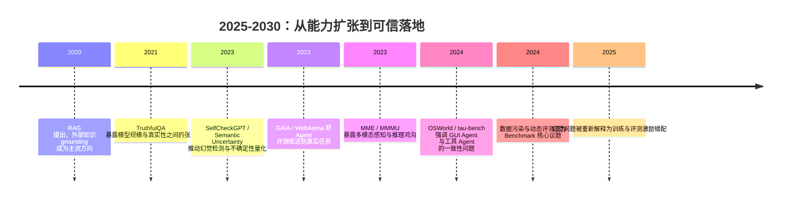

## 8.5.3 技术瓶颈与开放性挑战

**时间范围**：2025-2030  
**本节在整体演进史中的位置**：前一阶段证明了大模型和 Agent 已经具备“能回答、能调用工具、能完成部分任务”的能力；本阶段的核心转变，是从追求能力上限转向追求可靠性、可验证性和可评估性；这也为下一阶段的基础设施、监管与社会影响讨论埋下伏笔。

### 时代背景

进入 2025 年后，AI 应用的主要矛盾不再是“模型能不能生成答案”，而是“这个答案、这个动作、这个判断是否可信”。大模型已经能写代码、读图、调用工具、浏览网页、操作 GUI，但在生产环境中，幻觉、状态漂移、工具误调用、多模态误判和 Benchmark 失真仍然频繁出现。RAG、Function Calling、LangGraph、Computer Use 等技术把模型从“聊天系统”推向“行动系统”，也把错误从文本层面放大到业务层面：一个错误引用只是答错问题，一个错误工具调用可能改错订单、发错邮件、删除数据。RAG 让模型接入外部知识，但无法保证检索到的上下文一定正确；Agent 让模型多步执行，但每一步错误都会累积；多模态模型能看图，却仍可能误解空间关系；评测集越来越多，却不一定衡量真实工作能力。这一阶段的关键问题是：AI 不再缺“能力展示”，缺的是工程上可承担责任的可靠性。RAG 最初被提出就是为了解决参数化记忆更新困难和可追溯性不足的问题，但后续实践证明，检索增强只能缓解幻觉，不能根治幻觉。([arXiv](https://arxiv.org/abs/2005.11401?utm_source=chatgpt.com))

### 关键突破

#### RAG 与事实性评估（2020-2023）

**一句话定位**：RAG 是大模型从“只相信参数记忆”走向“外部知识 grounding”的关键转折，但它同时暴露了“检索正确 ≠ 生成正确”的新问题。

**核心贡献**：

- 解决了知识更新和来源追溯问题。传统 LLM 把知识压缩在参数里，更新成本高，也很难解释答案来自哪里。RAG 将生成模型和非参数化知识库结合，让模型在回答前先检索文档，再基于检索结果生成答案。
- 核心创新不是“多加一个搜索框”，而是把检索结果变成生成过程的条件输入，使模型输出可以被外部证据约束。
- 后续 FActScore 等事实性评估进一步把长文本拆成 atomic facts，逐条检查是否有来源支持。这让事实性评估从“整体感觉对不对”变成“每个事实是否可验证”。([arXiv](https://arxiv.org/abs/2005.11401?utm_source=chatgpt.com))

**工程师视角**：

如果你在 2020 年前后做知识问答，核心工作是 Prompt 和微调；RAG 普及后，工作流变成了“文档解析 → 切块 → Embedding → 检索 → 重排 → 引用生成 → 事实校验”。工程师开始关心 chunk 粒度、召回率、reranker、引用格式和无答案拒答，而不是只调模型参数。

> 📄 原始论文：Lewis et al., 2020, arXiv:2005.11401  
> 📄 原始论文：Min et al., 2023, arXiv:2305.14251

#### 不确定性量化与自检机制（2023-2025）

**一句话定位**：不确定性量化试图让模型从“总是给答案”变成“知道自己什么时候不该答”。

**核心贡献**：

- 幻觉的本质不是模型不会说话，而是模型在不确定时仍然生成流畅答案。TruthfulQA 早期已经指出，模型规模变大并不天然带来更高 truthfulness，有些模型会更擅长模仿人类文本中的错误信念。([arXiv](https://arxiv.org/abs/2109.07958?utm_source=chatgpt.com))
- SelfCheckGPT 提出一种黑盒检测思路：对同一问题采样多次，如果模型真的知道答案，多次回答应当语义一致；如果回答彼此矛盾，说明存在幻觉风险。Semantic Uncertainty 进一步指出，不能简单按字符串差异衡量不确定性，因为不同表达可能语义等价，因此要在语义层面聚类后计算熵。([arXiv](https://arxiv.org/abs/2303.08896?utm_source=chatgpt.com))
- 2025 年 OpenAI 的 “Why Language Models Hallucinate” 将问题进一步推到训练与评测激励层面：主流评测往往奖励猜测、惩罚“不知道”，导致模型更像考试中硬猜答案的学生，而不是谨慎的工程系统。([arXiv](https://arxiv.org/abs/2509.04664?utm_source=chatgpt.com))

**工程师视角**：

这改变了上线策略。过去很多团队只看 accuracy，现在必须引入 confidence score、abstention policy、answer verification 和人工兜底。高风险业务中，模型输出不应只有 `answer`，还应包含 `evidence`、`confidence`、`uncertainty_reason` 和 `need_human_review`。国内企业做政务、金融、医疗、法律 RAG 时尤其要注意：宁可拒答，也不能编造法规条款或政策依据。

> 📄 原始论文：Lin et al., 2021, arXiv:2109.07958  
> 📄 原始论文：Manakul et al., 2023, arXiv:2303.08896  
> 📄 原始论文：Kuhn et al., 2023, arXiv:2302.09664  
> 📄 原始论文：Kalai et al., 2025, arXiv:2509.04664

#### Agent 可靠性 Benchmark（2023-2024）

**一句话定位**：Agent Benchmark 把评测对象从“答题能力”推进到“多步行动完成率”，也让行业第一次系统看到 Agent 的可靠性天花板。

**核心贡献**：

- GAIA 将问题设计为需要推理、多模态、网页浏览和工具使用的真实任务，并显示人类和 GPT-4 插件系统之间仍有巨大差距。WebArena、WorkArena、OSWorld、τ-bench 则进一步把任务放到网页、企业软件、桌面环境和工具交互流程中。([arXiv](https://arxiv.org/abs/2311.12983?utm_source=chatgpt.com))
- 这些 Benchmark 说明，Agent 的失败通常不是单点能力不足，而是多步链路的复合误差：看错页面、选错按钮、忘记约束、工具参数填错、执行后不校验结果。
- τ-bench 特别强调 consistency：同一个任务跑多次，Agent 是否稳定完成。它的实验显示，即便是先进 function calling agent，在真实规则约束场景中也会出现明显不稳定。([arXiv](https://arxiv.org/abs/2406.12045?utm_source=chatgpt.com))

**工程师视角**：

这直接改变了 Agent 架构设计。工程师不能再写一个 ReAct loop 就上线，而要加入状态机、权限边界、工具 schema 校验、执行前 dry-run、执行后 verification、最大步数限制、人工审批节点和可回滚机制。生产级 Agent 的核心不是“更聪明”，而是“每一步都可观测、可中断、可恢复”。

> 📄 原始论文：Mialon et al., 2023, arXiv:2311.12983  
> 📄 原始论文：Zhou et al., 2023, arXiv:2307.13854  
> 📄 原始论文：Drouin et al., 2024, arXiv:2403.07718  
> 📄 原始论文：Xie et al., 2024, arXiv:2404.07972  
> 📄 原始论文：Yao et al., 2024, arXiv:2406.12045

#### 多模态推理 Benchmark 与视觉程序化（2023-2024）

**一句话定位**：多模态模型从“能描述图片”走向“能基于图片推理”，但空间关系、图表理解和物理常识仍是系统性短板。

**核心贡献**：

- MME 将多模态评测拆成 perception 和 cognition 两类能力，提醒行业不要把“看见物体”误认为“理解场景”。MMMU 则引入跨学科、专家级图文题，覆盖图表、地图、化学结构、乐谱等异构图片类型，证明多模态模型在专业推理上仍有明显空间。([arXiv](https://arxiv.org/abs/2306.13394?utm_source=chatgpt.com))
- ViperGPT 代表了另一条路线：让 LLM 生成 Python 程序，调用视觉模块、深度估计、检测器等工具完成复杂视觉推理。这本质上是神经符号融合：神经模型负责感知和语言，符号程序负责组合、计数、比较和执行。([arXiv](https://arxiv.org/abs/2303.08128?utm_source=chatgpt.com))
- 这说明多模态推理不应只靠一个端到端大模型硬扛。对于空间、计数、几何、表格、流程图等任务，引入工具化视觉模块和结构化中间表示往往更可靠。

**工程师视角**：

如果你在做票据识别、工业质检、自动驾驶标注、PPT 理解或医疗影像辅助，不能只看模型 demo。你要拆解任务：OCR 交给 OCR，目标检测交给检测器，空间计算交给几何模块，LLM 负责解释和编排。真正可靠的多模态系统通常是 pipeline + foundation model，而不是单模型万能调用。

> 📄 原始论文：Surís et al., 2023, arXiv:2303.08128  
> 📄 原始论文：Fu et al., 2023, arXiv:2306.13394  
> 📄 原始论文：Yue et al., 2023, arXiv:2311.16502

#### 评估体系从静态题库走向动态评测（2022-2025）

**一句话定位**：Benchmark 本身开始成为瓶颈，因为静态题库、榜单分数和真实智能之间出现了越来越大的偏差。

**核心贡献**：

- HELM 推动了 holistic evaluation，强调不能只看准确率，还要看鲁棒性、公平性、校准性、效率等维度。Chatbot Arena 则用真人偏好投票评估模型交互体验，补充了传统静态题库无法覆盖的主观质量。([斯坦福 CRFM](https://crfm.stanford.edu/helm/?utm_source=chatgpt.com))
- 但新的问题是数据污染。训练语料来自互联网，公开 Benchmark 很容易进入训练集，使模型“会考试”但不一定会解决真实问题。2024 年以来，Benchmark Data Contamination 成为评估研究中的核心议题。([arXiv](https://arxiv.org/abs/2406.04244?utm_source=chatgpt.com))
- 因此，未来评估会走向动态任务、私有测试集、执行式评测、红队评测和线上业务指标结合，而不是只看 MMLU、GSM8K、HumanEval 这类固定分数。

**工程师视角**：

企业内部不能直接照搬公开榜单选模型。更合理的做法是建立私有 eval set：抽样真实用户问题、覆盖失败案例、加入安全红队样本，并在每次 Prompt、RAG、模型版本升级后跑回归测试。模型选型不应只问“榜单第几”，而要问“在我的业务分布上，拒答率、幻觉率、P99 延迟、工具成功率和人工接管率是多少”。

> 📄 原始论文：Liang et al., 2022, HELM  
> 📄 原始论文：Chiang et al., 2024, arXiv:2403.04132  
> 📄 原始论文：Xu et al., 2024, arXiv:2406.04244

### 阶段总结

**本阶段核心主题**：  
这一阶段最重要的技术洞见是：大模型的短板不再只是“知识不够”或“参数不够”，而是缺少可验证的推理过程、稳定的行动控制和可信的评估闭环。RAG、Agent、多模态和 Benchmark 的发展共同指向同一个结论：未来 AI 系统会越来越像软件工程系统，而不是单纯的模型调用。

### 历史意义与遗留问题

**这个阶段解决了什么**：

- 把幻觉问题从“模型偶尔胡说”提升为系统性工程问题，形成了 RAG grounding、事实性评估、不确定性量化、拒答机制等实践框架。
- 把 Agent 从 demo 推向可评测对象，行业开始用 GAIA、WebArena、OSWorld、τ-bench 等任务衡量多步执行能力。
- 把多模态能力从“看图说话”推进到“图文推理”，并识别出空间、计数、图表、物理常识等关键短板。
- 把 Benchmark 从静态排行榜推进到动态、私有、执行式和业务闭环评测。

**留下了什么新问题**：

- 幻觉仍无法根治。RAG 依赖检索质量，不确定性估计依赖校准，神经符号系统依赖工具设计，三者都不是银弹。
- Agent 可靠性仍受多步误差累积限制。任务越长，状态越复杂，失败概率越高。
- 多模态模型仍缺少稳定的空间世界模型。它能识别对象，但未必真正理解对象之间的几何、因果和功能关系。
- 评估体系仍落后于能力演进。公开 Benchmark 容易被污染，真人偏好评测成本高，企业私有评测难以标准化。

这为下一阶段提出了更高要求：未来真正有价值的 AI 基础设施，不只是更便宜的推理、更长的上下文和更强的模型，而是能把模型输出变成可审计、可回滚、可度量、可治理的工程系统。

---

### 自检结果

内容覆盖了幻觉治理、Agent 可靠性、多模态推理和评估体系四个大纲要点；论文与 arXiv 编号已核实；Mermaid 使用标准 `timeline` 语法；整体写法保持工程视角，没有加入不可运行代码或无关铺垫。

---

**Sources:**

- [Retrieval-Augmented Generation for Knowledge-Intensive NLP Tasks](https://arxiv.org/abs/2005.11401?utm_source=chatgpt.com)
- [Holistic Evaluation of Language Models (HELM)](https://crfm.stanford.edu/helm/?utm_source=chatgpt.com)

