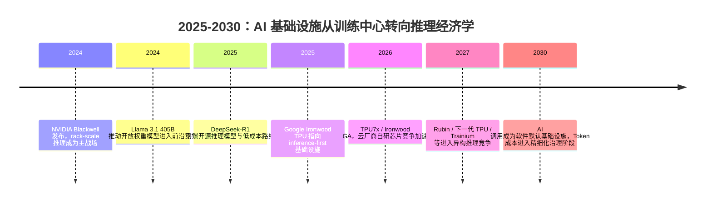

## 8.5.4 基础设施与生态演进预判

**时间范围**：2025-2030  
**本节位置**：前一节指出了 Agent 可靠性、幻觉、多模态推理和评估体系的瓶颈；本节讨论这些能力瓶颈背后的基础设施约束如何被重塑；下一节将继续引出监管、社会影响与负责任 AI 开发问题。

### 时代背景

2025 年以后，AI 产业的核心矛盾开始从“模型能不能做出来”转向“能不能以足够低的成本、足够低的延迟、足够稳定地大规模运行”。训练仍然昂贵，但工程侧更痛的是 inference：Agent 不再是一次问答，而是多轮规划、工具调用、反思、检索、代码执行和重试，每个任务都会消耗成倍 Token。前一阶段 Test-Time Compute Scaling 证明“多想一会儿”能提升推理能力，但它也把成本、延迟和能耗推到台前。因此，2025-2030 年的基础设施竞争，本质上是围绕 **Token / second、Token / dollar、Token / watt** 三个指标展开的系统级竞争。芯片从单卡性能竞争走向 rack-scale 集群竞争，云厂商从卖 GPU 实例走向软硬一体的 AI Factory，模型生态则从“闭源模型绝对领先”进入“闭源守住前沿、开源压低成本并加速定制”的混合格局。

### 关键突破

#### NVIDIA Hopper / Blackwell / Rubin 平台化路线（2024-2027）

**一句话定位**：NVIDIA 从“卖 GPU”升级为“卖整套 AI Factory”，继续占据通用训练与高端推理的事实标准位置。

**核心贡献**：  
H100 / H200 时代解决的是大模型训练和通用推理的规模化问题。H200 引入 HBM3E，更大的显存和带宽让 70B 级模型推理、长上下文 KV Cache、Batch Serving 更容易落地。到 Blackwell，重点已经不是单卡峰值算力，而是 GB200 NVL72 这种 rack-scale 系统：NVIDIA 官方称 GB200 NVL72 在 LLM inference 上相对同等数量 H100 可带来最高 30x 性能提升，并降低最高 25x 成本与能耗。([NVIDIA](https://www.nvidia.com/en-sg/data-center/h200/))

**工程师视角**：  
对应用工程师来说，变化不是“换一张更快的卡”这么简单，而是部署方式变化。过去你会关心 `tensor_parallel_size=2/4/8`，现在还要关心多机网络、NVLink / InfiniBand 拓扑、Prefill/Decode 分离、KV Cache 复用、Continuous Batching、Speculative Decoding。选型建议是：如果你要服务多模型、多租户、长上下文、复杂 Agent，NVIDIA 生态仍是最稳妥路线；如果只是固定模型的高并发推理，应该主动评估 TPU、Trainium、Groq、Cerebras 等专用方案。

#### Google TPU：从训练专用到推理优先（2024-2026）

**一句话定位**：Google TPU 代表了 hyperscaler 自研芯片路线：不追求开放硬件生态，而追求模型、编译器、数据中心和云服务的垂直整合。

**核心贡献**：  
Trillium 作为第六代 TPU，于 2024 年进入可用阶段，Google 称其相对上一代有 4x 性能提升和 67% 能效提升。随后 Ironwood 被明确定位为“面向 inference 时代”的第七代 TPU，Google 官方称它是第一代专门为生成式 AI 推理设计的 TPU；TPU7x / Ironwood 在 2026 年进入 GA。([blog.google](https://blog.google/feed/trillium-tpus/))

**工程师视角**：  
TPU 的价值不在于“能不能替代所有 GPU”，而在于当你的模型、框架、数据都在 Google Cloud / JAX / XLA / Gemini 生态内时，它可以用系统协同换成本优势。常见坑是迁移成本：PyTorch CUDA Kernel、vLLM 插件、自定义算子、第三方推理框架不一定能无缝迁移。工程上更现实的做法是：核心服务继续保留 GPU 路线，批量生成、Embedding、内部固定工作流可逐步迁移到 TPU 或云厂商自研芯片。

#### Groq / Cerebras：低延迟与新架构推理的反击（2024-2026）

**一句话定位**：Groq 和 Cerebras 不是要全面替代 GPU，而是针对 LLM inference 的瓶颈重新设计执行路径。

**核心贡献**：  
Groq 的 LPU 路线强调确定性低延迟和高 Token 吞吐，2024 年公开资料显示其内部 benchmark 可稳定达到约 300 tokens/s，独立测试中也体现出高吞吐和极低生成延迟。Cerebras 则采用 Wafer-Scale Engine 路线，官方宣传其在特定模型上可达到超过 2,000 tokens/s。([Groq](https://groq.com/newsroom/groq-lpu-inference-engine-leads-in-first-independent-llm-benchmark))

**工程师视角**：  
这类架构最适合低延迟交互、代码补全、语音对话、Agent 中大量短请求的 Decode 阶段。它们的限制也很明显：模型覆盖、上下文长度、私有部署、生态工具链成熟度未必等同于 GPU。未来更可能出现的是异构推理流水线：GPU / TPU 负责 Prefill 和复杂 batch，LPU / Wafer-scale 负责高速 Decode。工程师需要从“选一个云厂商”升级为“按 workload 拆推理链路”。

#### Token 经济学：从模型能力曲线到成本曲线（2025-2030）

**一句话定位**：Token 成本下降会把 AI 从“高价值场景工具”推向“默认软件基础能力”。

**核心贡献**：  
Stanford AI Index 2025 指出，达到 GPT-3.5 水平的系统推理成本从 2022 年 11 月到 2024 年 10 月下降超过 280 倍；报告也提到硬件成本年降约 30%、能效年增约 40%。这说明成本下降不是单点突破，而是小模型能力提升、量化、缓存、推测解码、Batch API、专用芯片和竞争性定价共同作用。([斯坦福HAI](https://hai.stanford.edu/ai-index/2025-ai-index-report))

**工程师视角**：  
判断“AI 调用是否比人工便宜”，不能只看每百万 Token 单价，而要看完整任务成本：输入 Token、输出 Token、工具调用、重试率、人工复核率、失败兜底成本。到 2026 年，主流 API 已经出现明显分层：OpenAI GPT-5.5 标准价格为 $5 / 1M input、$30 / 1M output；Claude Opus 4.7 为 $5 / 1M input、$25 / 1M output；Gemini 与 DeepSeek 等模型则在 Flash、cache hit、Batch 场景中持续压低边际成本。([OpenAI](https://openai.com/api/pricing/))

更实用的判断是：分类、摘要、翻译、信息抽取这类短链路任务，AI 成本已经普遍低于人工；代码生成、投研、法务审查、复杂 Agent 仍要计算返工率和责任成本。2030 年前，真正的分水岭不是“Token 免费”，而是企业能否把 AI 成本纳入和数据库、缓存、CDN 一样的基础设施预算。

#### 开源 vs 闭源：能力差距收窄后的生态重塑（2024-2030）

**一句话定位**：闭源模型继续定义能力上限，开源模型负责压低成本、推动本地化和行业定制。

**核心贡献**：  
Llama 3.1 405B 让开放权重模型第一次接近 frontier model 叙事中心；Meta 官方称其是当时最强的开放可用基础模型之一。DeepSeek-R1 则把开源推理模型推向全球关注，其论文明确发布 DeepSeek-R1-Zero、DeepSeek-R1 以及基于 Qwen / Llama 蒸馏的多个 dense 模型。Qwen3 进一步强化了中国开源生态的工程价值，其官方仓库说明 open-weight 模型采用 Apache 2.0 license。([AI.Meta](https://ai.meta.com/blog/meta-llama-3-1/))

> 📄 原始论文：DeepSeek-AI et al., 2025, arXiv:2501.12948

**工程师视角**：  
开源模型改变了日常架构决策：以前默认“强模型 API + Prompt Engineering”，现在会自然拆成三层：闭源 frontier model 处理高难任务；开源 7B-70B 模型处理高频、低风险、可批量任务；企业私有模型处理合规、数据不出域和稳定格式任务。中国开发者尤其需要关注这一点：在网络访问、数据合规、成本预算、国产算力适配等约束下，Qwen、DeepSeek、GLM、Baichuan 等生态往往不是“替代品”，而是生产系统的主力选项。

### 阶段总结

**本阶段核心主题**：基础设施竞争从“谁能训练最大模型”转向“谁能以最低成本持续服务最多智能任务”。未来的 AI 工程师不只需要会调 API，还要理解模型路由、缓存、批处理、异构硬件、私有化部署与成本治理。

### 历史意义与遗留问题

这个阶段写进教科书的成就是：AI 从研究实验室和少数大厂能力，变成可被普通企业采购、部署、组合和优化的基础设施。Token 成本下降、开源模型成熟、专用推理芯片兴起，共同让 AI 应用从“Demo 经济”走向“单位经济模型可计算”的生产阶段。

但它也留下了新问题：第一，推理需求可能因为 Agent 普及而指数级增长，成本下降未必等于总支出下降；第二，闭源 API 的能力优势与开源模型的可控性之间仍然存在张力；第三，算力供应链、能源消耗、地缘限制会影响模型选型。对工程师而言，2030 年前最重要的能力不是追逐单个最强模型，而是设计一个能随价格、性能、合规和业务风险动态切换的 AI 基础设施栈。

---

**Sources:**

- [NVIDIA H200 Tensor Core GPU](https://www.nvidia.com/en-sg/data-center/h200/)
- [Google Cloud announces Trillium TPUs now available](https://blog.google/feed/trillium-tpus/)
- [Groq® LPU™ Inference Engine Leads in First Independent ...](https://groq.com/newsroom/groq-lpu-inference-engine-leads-in-first-independent-llm-benchmark)
- [The 2025 AI Index Report | Stanford HAI](https://hai.stanford.edu/ai-index/2025-ai-index-report)
- [API Pricing](https://openai.com/api/pricing/)
- [Introducing Llama 3.1: Our most capable models to date](https://ai.meta.com/blog/meta-llama-3-1/)

