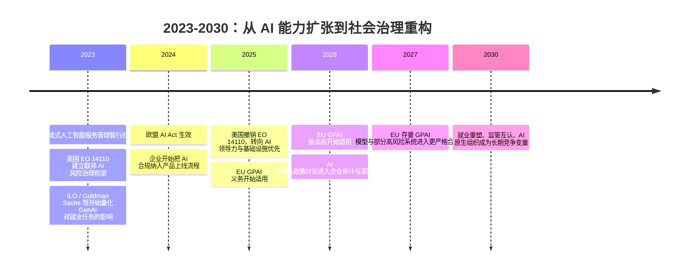

## 8.5.5 社会影响与监管格局

**时间范围：2023-2030**  
**本节在整体演进史中的位置**：前一阶段讨论的是基础设施、推理芯片、Token 成本和开源生态，核心结论是：AI 调用成本下降后，模型能力会更快渗透到真实业务。本阶段的核心转变是：AI 不再只是“能不能做出来”的技术问题，而变成“能不能被社会、法律、企业流程长期接受”的治理问题。下一阶段真正决定 AI Agent 普及速度的，不只是模型多强，而是企业是否敢用、用户是否信任、监管是否允许、劳动者是否能完成技能迁移。

### 时代背景

2023 年 ChatGPT 爆发后，生成式 AI 从实验室和开发者社区快速进入教育、办公、金融、医疗、内容生产与政务场景。上一阶段解决的是模型能力、长上下文、工具调用和推理成本问题；但当 AI 开始替人写代码、筛简历、生成广告、处理客户投诉、辅助风控决策时，新的瓶颈出现了：责任边界不清、训练数据来源不透明、版权争议、隐私泄露、幻觉输出、偏见歧视、深度伪造、就业替代和国家安全风险。算力、数据和算法的成熟让大模型具备了规模化部署条件，但也让“单点技术风险”变成“社会级系统风险”。因此，2023-2030 年的主线不是单纯限制 AI，而是各经济体在“创新速度、产业竞争、安全底线、社会承受能力”之间重新找平衡。

### 关键突破

#### 欧盟 AI Act（2024）

**一句话定位**：AI Act 是全球第一个综合性 AI 法规框架，把 AI 从“软件功能”纳入“风险分级监管”的产品治理体系。

**核心贡献**：  
欧盟选择的不是按模型大小一刀切监管，而是按应用风险分层：禁止不可接受风险应用，对高风险系统设置更严格义务，对 General-Purpose AI（GPAI）模型单独规定透明度和系统性风险要求。AI Act 于 2024 年 8 月 1 日生效，整体上从 2026 年 8 月 2 日起全面适用，但有分阶段例外：禁止类 AI 实践与 AI literacy 义务自 2025 年 2 月 2 日适用，GPAI 义务自 2025 年 8 月 2 日适用，嵌入受监管产品的高风险 AI 系统有更长过渡期至 2027 年。([数字化战略欧洲门户](https://digital-strategy.ec.europa.eu/en/policies/regulatory-framework-ai?utm_source=chatgpt.com))

对开发者来说，AI Act 最重要的变化是：上线 AI 功能前不能只问“模型准确率多少”，还要问“它属于什么风险等级”。招聘筛选、信贷评分、教育评估、医疗辅助、关键基础设施等场景，会从普通产品需求变成合规工程项目。工程团队需要补齐 risk classification、数据治理、日志留存、人工监督、模型评估、用户告知、事故上报等能力。对于提供 GPAI 模型的团队，还要准备技术文档、训练内容摘要、安全评估与系统性风险管理；欧盟委员会也明确，GPAI 提供者从 2026 年 8 月 2 日起进入执法阶段，旧模型最迟 2027 年 8 月 2 日前合规。([数字化战略欧洲门户](https://digital-strategy.ec.europa.eu/en/policies/guidelines-gpai-providers))

**工程师视角**：  
如果你在 2024 年后做面向欧洲市场的 AI 产品，PRD 里要新增“合规需求”章节，CI/CD 里要新增评估报告与审计日志，Prompt、模型版本、训练数据、RAG 召回片段、用户确认动作都要可追溯。AI 工程从“调 Prompt + 调 API”升级为“模型生命周期管理”。

#### 美国 EO 14110 与 2025 政策转向（2023-2025）

**一句话定位**：美国路线体现了“行政令驱动 + 产业竞争优先”的治理模式，政策方向会随政府更替明显摆动。

**核心贡献**：  
2023 年 10 月的 EO 14110 将安全、隐私、公民权利、劳动者保护、竞争和政府采购纳入联邦 AI 治理框架，要求 NIST 推进 AI 安全、红队测试和标准实践，强调 AI 可能带来欺诈、歧视、虚假信息、工人替代和国家安全风险。([Federal Register](https://www.federalregister.gov/documents/2023/11/01/2023-24283/safe-secure-and-trustworthy-development-and-use-of-artificial-intelligence)) 但这个框架在 2025 年 1 月被撤销，随后新行政令强调移除阻碍美国 AI 领导力的政策，并要求制定新的 AI Action Plan。([Federal Register](https://www.federalregister.gov/documents/2023/11/01/2023-24283/safe-secure-and-trustworthy-development-and-use-of-artificial-intelligence)) 2025 年 7 月发布的 America’s AI Action Plan 则把重点放在三条主线：加速创新、建设 AI 基础设施、国际外交与安全领导。([The White House](https://www.whitehouse.gov/wp-content/uploads/2025/07/Americas-AI-Action-Plan.pdf?utm_source=chatgpt.com))

这说明美国不是没有监管，而是更偏向通过 NIST 标准、联邦采购、行业自律、出口管制、基础设施投资和州法博弈来塑造市场。对工程团队的实际影响是：如果服务美国市场，合规重点常常不是“统一 AI 法条”，而是具体行业约束。例如医疗看 HIPAA，金融看公平信贷与模型风险管理，招聘看反歧视，儿童产品看隐私与安全，政府项目看采购与安全标准。

**工程师视角**：  
美国路线要求团队保持政策可配置性。一个成熟的 LLM Gateway 不应把安全策略写死，而要支持按地区、客户、行业动态加载策略：哪些模型可用、哪些数据可出境、哪些日志必须留存、哪些回答必须经过人工审批。美国政策波动也提醒创业团队：不要把“当前行政偏好”当成长期确定性，真正稳的是可审计、可解释、可回滚的工程能力。

#### 中国《生成式人工智能服务管理暂行办法》（2023）

**一句话定位**：这是中国面向生成式 AI 公共服务的基础监管框架，核心逻辑是“鼓励创新 + 分类分级 + 安全底线”。

**核心贡献**：  
《暂行办法》自 2023 年 8 月 15 日施行，适用于向中国境内公众提供文本、图片、音频、视频等内容生成服务的场景；内部研发、未向公众提供服务的情形则不完全适用。([China Law Translate](https://www.chinalawtranslate.com/en/generative-ai-interim/)) 它要求服务提供者使用合法来源的数据和基础模型，尊重知识产权、商业秘密、个人信息和人格权益，并采取措施提升生成内容的准确性、可靠性和透明度。对于具有舆论属性或社会动员能力的生成式 AI 服务，还涉及安全评估和算法备案。([China Law Translate](https://www.chinalawtranslate.com/en/generative-ai-interim/))

中国路线对开发者的影响非常直接：面向公众开放的 AI 应用不能只做模型接入，还要做内容安全、敏感信息过滤、用户投诉机制、生成内容标识、数据来源审查、备案材料准备和安全评估配合。特别是 ToC 应用、内容社区、搜索问答、新闻摘要、教育辅导、智能客服等场景，产品上线节奏往往取决于合规准备是否完整。

**工程师视角**：  
在国内做生成式 AI 产品，推荐从第一天就把内容安全当成主链路，而不是上线前补一个审核接口。典型架构应包含输入审核、检索内容权限过滤、模型输出安全分类、敏感主题拒答、人工复核队列、审计日志和用户举报处理。否则一旦业务量上来，再补合规能力会牵动 Prompt、RAG、缓存、日志和前端交互的整体重构。

#### 劳动力市场结构性冲击（2023-2030）

**一句话定位**：生成式 AI 不是简单替代“低技能体力劳动”，而是首先冲击高频文本、规则、分析和沟通任务。

**核心贡献**：  
与工业机器人主要影响制造业不同，LLM 首先进入的是知识工作流：写作、翻译、客服、法务检索、数据分析、代码生成、市场文案、财务初审、HR 筛选。ILO 2023 年研究认为，生成式 AI 更可能增强而不是完全自动化大多数职业，但文书类岗位暴露度最高，且由于文书岗位中女性就业占比较高，影响具有明显性别差异。([International Labour Organization](https://www.ilo.org/publications/generative-ai-and-jobs-global-analysis-potential-effects-job-quantity-and?utm_source=chatgpt.com)) 2025 年 ILO 更新研究继续把重点放在职业任务暴露，而不是笼统预测“岗位消失”。([International Labour Organization](https://www.ilo.org/publications/generative-ai-and-jobs-refined-global-index-occupational-exposure?utm_source=chatgpt.com)) Goldman Sachs 也估计，全球约 3 亿全职岗位等量工作暴露于 AI 自动化影响，但“暴露”不等于“立即失业”。([高盛](https://www.goldmansachs.com/insights/articles/how-will-ai-affect-the-us-labor-market?utm_source=chatgpt.com))

真正先被重塑的不是完整职业，而是职业内部的任务包。初级分析师不再花大量时间整理材料，而是校验 AI 生成的初稿；程序员不再只写样板代码，而是负责需求拆解、测试设计、架构约束和代码审查；客服一线岗位从回答标准问题转向处理复杂投诉和情绪沟通。OECD 调查也显示，很多接触 AI 的工人认为 AI 改善了绩效和工作体验，但同时担心隐私、算法管理和岗位风险。([OECD](https://www.oecd.org/en/topics/sub-issues/ai-and-work.html))

**工程师视角**：  
如果你负责企业内部 AI 落地，不要用“替代多少人”作为唯一 KPI。更合理的指标是：单个员工可处理任务量、错误率下降、响应时间缩短、培训周期缩短、人工复核负担是否增加。AI 最容易产生收益的岗位通常具备三个特征：任务数字化、输入输出文本化、质量标准可被定义。最难替代的是强线下交互、复杂责任承担、强人际信任和高度不确定决策。

#### 负责任 AI 工程化（2023-2030）

**一句话定位**：Responsible AI 从价值倡议变成工程体系，核心是把“安全、公平、透明、隐私、可追责”落到开发流程里。

**核心贡献**：  
NIST AI Risk Management Framework 将可信 AI 的特征概括为有效可靠、安全、稳健、可解释、隐私增强、公平且偏见受控、透明且可问责；这给工程团队提供了比“不要作恶”更可执行的检查维度。([国家标准与技术研究院出版物](https://nvlpubs.nist.gov/nistpubs/ai/nist.ai.100-1.pdf?utm_source=chatgpt.com)) ISO/IEC 42001:2023 则进一步把 AI 治理变成可管理的组织体系，强调建立、实施、维护和持续改进 AI management system。([ISO](https://www.iso.org/standard/42001?utm_source=chatgpt.com))

**工程师视角**：  
负责任 AI 不应停留在原则墙上，而要变成 checklist、测试集、日志字段和发布门禁。一个可落地的工程清单包括：  
1. **数据侧**：记录训练数据、RAG 文档和用户数据来源，避免无授权采集与越权检索。  
2. **模型侧**：固定模型版本，建立离线评测集，覆盖幻觉、偏见、越狱、隐私泄露和危险能力。  
3. **产品侧**：明确 AI 参与边界，必要时提示用户“这是 AI 生成内容”，高风险场景保留人工确认。  
4. **运行侧**：保存 Prompt、工具调用、检索片段、输出结果和人工修改记录，支持事故复盘。  
5. **组织侧**：为模型上线设定 owner、审批人、回滚方案和定期复评周期。

### 阶段总结

**本阶段核心主题**：AI 的关键矛盾从“能力不足”转向“能力过强但不可控”。真正成熟的 AI 应用，不是 demo 效果最惊艳的系统，而是能在合规、成本、安全、用户信任和组织流程中长期运行的系统。对工程师来说，Responsible AI 不是额外负担，而是 AI 产品进入金融、医疗、教育、政务和企业核心流程的入场券。

### 历史意义与遗留问题

**这个阶段解决了什么**：  
它把 AI 从“研究成果”和“互联网产品功能”推进到社会基础设施层面。欧盟给出了风险分级监管模板，美国展示了创新优先与国家竞争逻辑，中国建立了面向公共生成式 AI 服务的合规底线。企业也开始意识到，AI 落地不仅需要模型 API，还需要数据治理、权限系统、审计日志、安全评估和人机协同流程。

**留下了什么新问题**：  
第一，全球监管并不统一，跨境 AI 产品需要面对欧盟风险分级、美国行业分散监管、中国备案与内容安全要求之间的差异。第二，就业冲击不是一次性失业潮，而是持续的任务重组，最脆弱的可能是初级岗位和标准化知识工作。第三，责任边界仍不清晰：当 Agent 调错工具、生成错误建议或造成经济损失时，责任在模型提供方、应用开发者、企业部署方，还是最终用户？这将成为 2030 年前 AI Agent 能否进入高风险生产场景的核心问题。

---

**Sources:**

- [AI Act | Shaping Europe's digital future - European Union](https://digital-strategy.ec.europa.eu/en/policies/regulatory-framework-ai?utm_source=chatgpt.com)
- [
      Federal Register
       :: 
      Safe, Secure, and Trustworthy Development and Use of Artificial Intelligence
    ](https://www.federalregister.gov/documents/2023/11/01/2023-24283/safe-secure-and-trustworthy-development-and-use-of-artificial-intelligence)
- [America's AI Action Plan](https://www.whitehouse.gov/wp-content/uploads/2025/07/Americas-AI-Action-Plan.pdf?utm_source=chatgpt.com)
- [Interim Measures for the Management of Generative Artificial Intelligence Services](https://www.chinalawtranslate.com/en/generative-ai-interim/)
- [Generative AI and Jobs: A global analysis of potential ...](https://www.ilo.org/publications/generative-ai-and-jobs-global-analysis-potential-effects-job-quantity-and?utm_source=chatgpt.com)
- [How Will AI Affect the US Labor Market?](https://www.goldmansachs.com/insights/articles/how-will-ai-affect-the-us-labor-market?utm_source=chatgpt.com)
- [AI and work | OECD](https://www.oecd.org/en/topics/sub-issues/ai-and-work.html)
- [Artificial Intelligence Risk Management Framework (AI RMF 1.0)](https://nvlpubs.nist.gov/nistpubs/ai/nist.ai.100-1.pdf?utm_source=chatgpt.com)
- [ISO/IEC 42001:2023 - AI management systems](https://www.iso.org/standard/42001?utm_source=chatgpt.com)

