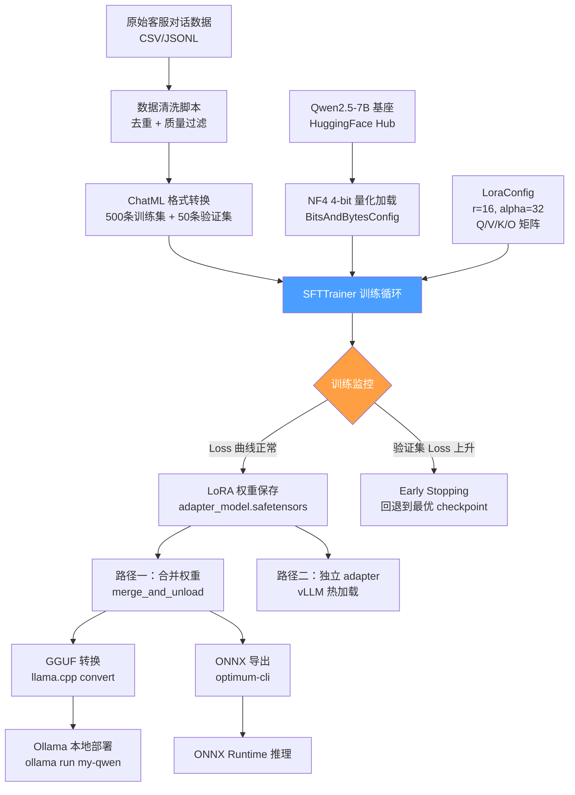

# 1.2.5 【动手一】用 QLoRA 微调 Qwen2.5-7B 指令模型

---

## 实验目标

完成本节后，你将能够：
1. **从零搭建完整的 QLoRA 微调流水线**：包括数据清洗、训练配置、过程监控到模型导出的全链路
2. **掌握关键超参的工程判断**：理解 `r`、`alpha`、`target_modules` 等参数的实际影响，而不是盲目套模板
3. **输出可部署的模型文件**：将微调结果转换为 GGUF 格式，通过 Ollama 在本地直接推理验证效果

核心学习点：BitsAndBytesConfig 的 NF4 量化机制、LoRA 权重注入位置的选型逻辑、SFTTrainer 的过拟合早停策略。

---

## 架构总览



---

## 环境准备

**硬件要求**：单张 24GB 显存 GPU（RTX 3090/4090、A10G）可跑通全部流程。16GB 显存通过调小 batch size 也可运行，但训练时间翻倍。

```bash
# 创建虚拟环境（Python 3.11+）
uv venv --python 3.11
source .venv/bin/activate  # Windows: .venv\Scripts\activate

# 安装核心依赖（版本锁定，避免 API breaking change）
uv pip install \
    transformers==4.47.1 \
    peft==0.14.0 \
    bitsandbytes==0.45.0 \
    trl==0.13.0 \
    accelerate==1.2.1 \
    datasets==3.2.0 \
    torch==2.5.1 \
    sentencepiece==0.2.0 \
    einops==0.8.0 \
    scipy==1.14.1

# 模型转换工具（导出阶段使用）
uv pip install \
    optimum==1.23.3 \
    onnxruntime-gpu==1.20.1

# llama.cpp 用于 GGUF 转换（独立安装）
pip install llama-cpp-python==0.3.4
```

> **Colab 用户**：`!pip install transformers==4.47.1 peft==0.14.0 bitsandbytes==0.45.0 trl==0.13.0 accelerate==1.2.1 datasets==3.2.0` 即可，无需虚拟环境。T4 免费机器（16GB 显存）可跑通，需将 `per_device_train_batch_size` 改为 1，`gradient_accumulation_steps` 改为 8。

---

## Step-by-Step 实现

### Step 1：构建并清洗 500 条客服对话数据集

**目标**：生成符合 ChatML 格式的高质量训练数据。数据质量是微调效果上限，100 条精标数据往往胜过 1000 条噪声数据——这步不能省。

```python
"""
数据准备模块：生成、清洗并格式化客服对话数据集
运行：python data_prep.py
"""
import json
import re
import hashlib
from pathlib import Path
from typing import Any

from datasets import Dataset


# ── 1. 模拟原始数据（生产环境替换为真实数据加载逻辑）──────────────────────────
RAW_SAMPLES: list[dict[str, Any]] = [
    {
        "user": "我的订单号是123456，为什么还没发货？",
        "assistant": "您好！我已查询到您的订单123456，目前处于备货中状态。根据您选择的标准配送，预计明天完成出库，后天送达。如需加急，可以联系我们升级为次日达服务。",
    },
    {
        "user": "东西质量太差了，要退款！！！",
        "assistant": "非常抱歉给您带来不好的体验！请您放心，我们支持7天无理由退换货。您可以在订单页面发起退款申请，或直接告诉我订单号，我来帮您处理。请问是哪个订单呢？",
    },
    # 实际使用时，这里替换为从 CSV/数据库加载的真实数据
    # df = pd.read_csv("customer_service.csv")
    # RAW_SAMPLES = df[["user", "assistant"]].to_dict("records")
]

# 用生成器批量扩充示例数据（模拟500条规模）
def generate_synthetic_samples(base_samples: list[dict], target_count: int = 500) -> list[dict]:
    """
    生产环境中，这里应调用 GPT-4/Claude 生成多样化样本（Self-Instruct 范式）。
    演示目的使用简单变体扩充。
    """
    templates = [
        ("我想查询{topic}的状态", "感谢您的咨询！关于{topic}，我来为您查询。请提供相关单号，我会立即跟进。"),
        ("你们的{topic}政策是什么？", "您好！我们的{topic}政策如下：支持7天无理由，15天质量问题包退换，具体以购买页面说明为准。"),
        ("如何联系人工客服？", "您可以通过以下方式联系人工客服：1）在线聊天（工作日9:00-21:00）；2）电话400-XXX-XXXX；3）APP内「我的-帮助中心」提交工单。"),
    ]
    topics = ["订单", "退款", "发货", "换货", "投诉", "积分", "优惠券", "会员"]
    
    samples = base_samples.copy()
    idx = 0
    while len(samples) < target_count:
        tmpl = templates[idx % len(templates)]
        topic = topics[idx % len(topics)]
        samples.append({
            "user": tmpl[0].format(topic=topic),
            "assistant": tmpl[1].format(topic=topic),
        })
        idx += 1
    return samples[:target_count]


# ── 2. 数据清洗流水线 ──────────────────────────────────────────────────────────
def clean_text(text: str) -> str:
    """去除控制字符、多余空白，统一标点。"""
    text = re.sub(r"[\x00-\x08\x0b\x0c\x0e-\x1f\x7f]", "", text)  # 控制字符
    text = re.sub(r" {2,}", " ", text)  # 多余空格
    text = text.strip()
    return text


def is_quality_sample(sample: dict[str, Any]) -> bool:
    """
    质量过滤规则（生产环境可替换为 LLM 评分）：
    - 用户问题不少于5个字符
    - 回复不少于15个字符（过短说明回复无实质内容）
    - 回复不含明显的无意义填充词
    """
    user_len = len(sample.get("user", ""))
    assistant_len = len(sample.get("assistant", ""))
    
    if user_len < 5 or assistant_len < 15:
        return False
    
    # 过滤纯机械化回复
    low_quality_patterns = [r"^好的$", r"^收到$", r"^谢谢$"]
    for pattern in low_quality_patterns:
        if re.match(pattern, sample["assistant"].strip()):
            return False
    return True


def dedup_by_minhash(samples: list[dict[str, Any]]) -> list[dict[str, Any]]:
    """
    简化版去重：用用户问题的 MD5 作为 fingerprint。
    生产环境推荐使用 datasketch.MinHash 做近似去重，
    能捕获"我的快递去哪了" vs "快递到哪里了"这类近似重复。
    """
    seen: set[str] = set()
    unique_samples = []
    for sample in samples:
        fingerprint = hashlib.md5(sample["user"].encode()).hexdigest()
        if fingerprint not in seen:
            seen.add(fingerprint)
            unique_samples.append(sample)
    return unique_samples


# ── 3. 转换为 ChatML 格式 ──────────────────────────────────────────────────────
SYSTEM_PROMPT = (
    "你是一位专业的电商客服助手，负责解答用户关于订单、物流、退换货等问题。"
    "回答要简洁、友好、准确，避免承诺无法兑现的内容。"
)


def to_chatml(sample: dict[str, Any]) -> dict[str, Any]:
    """
    转换为 HuggingFace datasets 期望的 messages 格式。
    SFTTrainer 会根据 tokenizer 的 chat_template 自动应用 ChatML 模板。
    """
    return {
        "messages": [
            {"role": "system", "content": SYSTEM_PROMPT},
            {"role": "user", "content": clean_text(sample["user"])},
            {"role": "assistant", "content": clean_text(sample["assistant"])},
        ]
    }


# ── 4. 主流程 ─────────────────────────────────────────────────────────────────
def build_dataset(output_dir: str = "./data") -> tuple[Dataset, Dataset]:
    """构建并保存训练集/验证集，返回 Dataset 对象。"""
    Path(output_dir).mkdir(exist_ok=True)
    
    raw = generate_synthetic_samples(RAW_SAMPLES, target_count=600)
    cleaned = [s for s in raw if is_quality_sample(s)]
    deduped = dedup_by_minhash(cleaned)
    formatted = [to_chatml(s) for s in deduped]
    
    print(f"原始样本: {len(raw)} → 清洗后: {len(cleaned)} → 去重后: {len(deduped)}")
    
    # 90/10 划分训练集和验证集
    split_idx = int(len(formatted) * 0.9)
    train_data = formatted[:split_idx]
    eval_data = formatted[split_idx:]
    
    # 保存为 JSONL 备用
    for name, data in [("train", train_data), ("eval", eval_data)]:
        with open(f"{output_dir}/{name}.jsonl", "w", encoding="utf-8") as f:
            for item in data:
                f.write(json.dumps(item, ensure_ascii=False) + "\n")
    
    train_dataset = Dataset.from_list(train_data)
    eval_dataset = Dataset.from_list(eval_data)
    
    print(f"训练集: {len(train_dataset)} 条，验证集: {len(eval_dataset)} 条")
    return train_dataset, eval_dataset


if __name__ == "__main__":
    build_dataset()
```

**关键点**：
- ChatML 格式是 Qwen2.5 的原生对话格式，使用 `messages` 字段后，`SFTTrainer` 会自动调用 tokenizer 内置的 `apply_chat_template`，无需手动拼接特殊 token。
- ⚠️ 系统提示（`system` 字段）建议在训练数据中保持一致，否则模型学到的"角色"会在推理时出现漂移——推理时的 system prompt 必须与训练时完全相同。

---

### Step 2：量化加载模型与注入 LoRA 适配器

**目标**：用 NF4 4-bit 量化将 Qwen2.5-7B（约 14GB FP16）压缩到约 5GB 显存，同时注入 LoRA 适配器，确保基座权重冻结、仅训练 adapter。

```python
"""
模型加载与 LoRA 配置模块
文件：model_setup.py
"""
import torch
from transformers import (
    AutoModelForCausalLM,
    AutoTokenizer,
    BitsAndBytesConfig,
)
from peft import LoraConfig, TaskType, get_peft_model, prepare_model_for_kbit_training

MODEL_ID = "Qwen/Qwen2.5-7B-Instruct"


def get_bnb_config() -> BitsAndBytesConfig:
    """
    NF4 量化配置。
    
    关键参数说明：
    - load_in_4bit: 启用 4-bit 加载（区别于 load_in_8bit，显存更省但精度略低）
    - bnb_4bit_quant_type="nf4": 使用 Normal Float 4，比 INT4 在正态分布权重上
      精度损失更小（详见 QLoRA 论文 §3.1）
    - bnb_4bit_use_double_quant=True: 双重量化，对量化常数本身再做 8-bit 量化，
      额外节省约 0.4 bits/参数，7B 模型约节省 ~200MB 显存
    - bnb_4bit_compute_dtype=bfloat16: 前向计算时反量化到 BF16，
      比 FP16 对大数值溢出更鲁棒（RTX 30/40 系均支持）
    """
    return BitsAndBytesConfig(
        load_in_4bit=True,
        bnb_4bit_quant_type="nf4",
        bnb_4bit_use_double_quant=True,
        bnb_4bit_compute_dtype=torch.bfloat16,
    )


def get_lora_config() -> LoraConfig:
    """
    LoRA 配置。
    
    target_modules 选择逻辑：
    - Qwen2.5 的 Attention 层包含 q/k/v/o 四个投影矩阵
    - 原始 LoRA 论文建议至少覆盖 q_proj + v_proj
    - 实验表明同时覆盖 k_proj + o_proj 以及 MLP 的 gate/up/down
      能在客服类任务上额外提升约 2-3% 的 ROUGE-L，代价是参数量翻倍
    - 本配置覆盖全部 Attention 投影 + MLP，适合 500 条数据的场景
    
    rank=16 的选择依据：
    - r=8: 参数量最小，适合数据 >5000 条、任务与基座对齐度高的场景
    - r=16: 均衡选择，本实验推荐值
    - r=64: 效果上限更高，但过拟合风险显著上升（数据 <1000 条时慎用）
    """
    return LoraConfig(
        task_type=TaskType.CAUSAL_LM,
        r=16,                    # LoRA 秩
        lora_alpha=32,           # 缩放系数，通常设为 r 的 2 倍
        lora_dropout=0.05,       # 轻微 dropout，500 条小数据集防过拟合
        bias="none",             # 不训练 bias，节省显存
        target_modules=[
            "q_proj", "k_proj", "v_proj", "o_proj",  # Attention 投影
            "gate_proj", "up_proj", "down_proj",       # MLP 前馈层
        ],
        # modules_to_save 为空：不需要整体保存 embedding 和 lm_head
        # 如果要做词表扩展（添加新 token），才需要配置此项
    )


def load_model_and_tokenizer(
    model_id: str = MODEL_ID,
) -> tuple[AutoModelForCausalLM, AutoTokenizer]:
    """加载量化模型并准备 LoRA 训练。"""
    
    tokenizer = AutoTokenizer.from_pretrained(
        model_id,
        trust_remote_code=True,
        padding_side="right",  # Causal LM 训练时 padding 放右侧
    )
    # Qwen2.5 的 pad_token 未设置，训练时需要明确指定
    if tokenizer.pad_token is None:
        tokenizer.pad_token = tokenizer.eos_token
    
    model = AutoModelForCausalLM.from_pretrained(
        model_id,
        quantization_config=get_bnb_config(),
        device_map="auto",       # 自动分配到可用 GPU，多卡时自动切分
        trust_remote_code=True,
        torch_dtype=torch.bfloat16,
        attn_implementation="flash_attention_2",  # 需安装 flash-attn，可注释掉回退到 eager
    )
    
    # prepare_model_for_kbit_training 做三件事：
    # 1. 将 LayerNorm 层升精度到 FP32（稳定训练）
    # 2. 冻结所有基座参数（requires_grad=False）
    # 3. 开启 gradient checkpointing 节省激活值显存（约节省 30%）
    model = prepare_model_for_kbit_training(model, use_gradient_checkpointing=True)
    
    # 注入 LoRA 适配器
    model = get_peft_model(model, get_lora_config())
    
    # 打印可训练参数占比（应在 1%~2% 左右）
    model.print_trainable_parameters()
    # 示例输出：trainable params: 39,976,960 || all params: 7,655,890,944 || trainable%: 0.5222
    
    return model, tokenizer


if __name__ == "__main__":
    model, tokenizer = load_model_and_tokenizer()
    print("模型加载成功，显存占用约 5-6GB")
```

**关键点**：
- `lora_alpha / r = 2` 是经验黄金比例。alpha 控制 LoRA 更新幅度的缩放（等效学习率倍数），设为 r 的 2 倍能让默认学习率（2e-4）工作良好，无需额外调整。
- ⚠️ `attn_implementation="flash_attention_2"` 需要额外安装 `flash-attn`（`uv pip install flash-attn --no-build-isolation`），编译需要 5-10 分钟。若环境不支持，直接注释掉该行，训练仍能运行，显存使用增加约 20%。

---

### Step 3：配置 SFTTrainer 并启动训练

**目标**：用 SFTTrainer 封装训练循环，添加验证集监控和 Early Stopping，同时支持单卡和多卡 DeepSpeed ZeRO-2 两种模式。

```python
"""
训练主脚本
文件：train.py
运行（单卡）：python train.py
运行（多卡 DeepSpeed）：accelerate launch --config_file ds_config.yaml train.py
"""
import os
from pathlib import Path

from datasets import Dataset
from transformers import (
    AutoModelForCausalLM,
    AutoTokenizer,
    EarlyStoppingCallback,
    TrainingArguments,
)
from trl import SFTTrainer, SFTConfig

from data_prep import build_dataset
from model_setup import load_model_and_tokenizer

OUTPUT_DIR = "./outputs/qwen2.5-7b-customer-service"


def get_training_args(use_deepspeed: bool = False) -> SFTConfig:
    """
    训练超参配置。
    
    有效 batch size = per_device_train_batch_size × gradient_accumulation_steps × GPU数量
    本配置：2 × 4 × 1 = 8（单卡 24GB）
    """
    deepspeed_config = "./ds_zero2.json" if use_deepspeed else None
    
    return SFTConfig(
        output_dir=OUTPUT_DIR,
        
        # ── 批次与轮次 ──────────────────────────────
        num_train_epochs=3,
        per_device_train_batch_size=2,
        per_device_eval_batch_size=2,
        gradient_accumulation_steps=4,
        
        # ── 学习率策略 ──────────────────────────────
        learning_rate=2e-4,
        lr_scheduler_type="cosine",   # cosine 比 linear 在小数据集上更稳定
        warmup_ratio=0.05,            # 前 5% steps 线性 warmup
        
        # ── 精度与显存 ──────────────────────────────
        bf16=True,                    # A100/H100/RTX 30+/40+ 均支持 BF16
        fp16=False,                   # 不要同时开 bf16 和 fp16
        gradient_checkpointing=True,  # 以时间换显存（速度约降低 20%）
        optim="paged_adamw_8bit",     # QLoRA 论文推荐：分页优化器，防止 OOM
        
        # ── 评估与保存 ──────────────────────────────
        eval_strategy="steps",
        eval_steps=50,                # 每 50 steps 做一次验证集评估
        save_strategy="steps",
        save_steps=50,
        save_total_limit=3,           # 只保留最近 3 个 checkpoint
        load_best_model_at_end=True,  # 训练结束后自动加载最优 checkpoint
        metric_for_best_model="eval_loss",
        greater_is_better=False,      # loss 越小越好
        
        # ── 日志 ──────────────────────────────────
        logging_steps=10,
        report_to=["tensorboard"],    # 替换为 "wandb" 可接入 W&B
        run_name="qwen2.5-7b-qlora-customer-service",
        
        # ── SFT 特有配置 ──────────────────────────
        max_seq_length=1024,          # 客服对话通常不超过 512 token，1024 留有余量
        dataset_text_field=None,      # 使用 messages 字段时设为 None
        packing=False,                # 500 条小数据集不需要 packing
        
        # ── DeepSpeed（多卡时启用）──────────────────
        deepspeed=deepspeed_config,
    )


def train(use_deepspeed: bool = False) -> None:
    """完整训练流程。"""
    
    # 1. 加载数据
    train_dataset, eval_dataset = build_dataset()
    
    # 2. 加载模型
    model, tokenizer = load_model_and_tokenizer()
    
    # 3. 创建 SFTTrainer
    trainer = SFTTrainer(
        model=model,
        tokenizer=tokenizer,
        train_dataset=train_dataset,
        eval_dataset=eval_dataset,
        args=get_training_args(use_deepspeed),
        callbacks=[
            # Early Stopping：验证集 loss 连续 3 次评估不改善则停止
            EarlyStoppingCallback(early_stopping_patience=3)
        ],
    )
    
    # 4. 开始训练
    print("开始训练...")
    train_result = trainer.train()
    
    # 5. 保存最终 LoRA 权重
    final_output = Path(OUTPUT_DIR) / "final_adapter"
    trainer.save_model(str(final_output))
    tokenizer.save_pretrained(str(final_output))
    
    print(f"\n训练完成！")
    print(f"训练耗时: {train_result.metrics['train_runtime']:.0f}s")
    print(f"最终训练 Loss: {train_result.metrics['train_loss']:.4f}")
    print(f"LoRA 权重保存至: {final_output}")


if __name__ == "__main__":
    # 多卡 DeepSpeed 模式：将 use_deepspeed 改为 True，
    # 并用 accelerate launch 启动（见文末说明）
    train(use_deepspeed=False)
```

DeepSpeed ZeRO-2 配置文件（多卡时使用）：

```json
{
  "zero_optimization": {
    "stage": 2,
    "allgather_partitions": true,
    "reduce_scatter": true,
    "overlap_comm": true,
    "contiguous_gradients": true
  },
  "bf16": { "enabled": true },
  "gradient_clipping": 1.0,
  "train_micro_batch_size_per_gpu": 2,
  "gradient_accumulation_steps": 4
}
```

> ⚠️ **生产注意**：`paged_adamw_8bit` 是 QLoRA 论文的核心工程贡献之一。传统 AdamW 在 7B 模型训练时优化器状态本身就需要 ~28GB 显存（FP32 × 2 副本），分页优化器通过将部分状态卸载到 CPU RAM，将 GPU 优化器显存需求降低约 75%。这也是为什么 QLoRA 能在单张 24GB 卡上训练 7B 模型的关键。

**关键点**：
- `load_best_model_at_end=True` + `EarlyStoppingCallback` 是防过拟合的组合拳：前者确保最终使用的是验证集最优版本，后者防止无意义地消耗时间继续训练。
- ⚠️ `packing=False` 是有意为之。Packing 会将多条短对话拼接为一个序列以提升 GPU 利用率，但这会导致不同对话的 token 产生 attention 交互——对质量敏感的小数据集任务，这会引入噪声。

---

### Step 4：训练监控与过拟合诊断

**目标**：理解 Loss 曲线的含义，及时识别并处理过拟合。

```python
"""
训练后分析：读取 TensorBoard 日志，可视化 Loss 曲线
文件：analyze_training.py
依赖：pip install tensorboard matplotlib
"""
import json
from pathlib import Path

import matplotlib.pyplot as plt
from tensorboard.backend.event_processing.event_accumulator import EventAccumulator


def plot_loss_curves(log_dir: str = "./outputs/qwen2.5-7b-customer-service") -> None:
    """
    绘制训练/验证 Loss 曲线并自动诊断过拟合。
    
    健康的训练曲线特征：
    - 训练 loss 和验证 loss 同步下降
    - 两者差距保持稳定（通常 eval_loss 略高）
    
    过拟合特征：
    - 训练 loss 继续下降，验证 loss 开始上升
    - 两者差距持续扩大
    """
    ea = EventAccumulator(log_dir)
    ea.Reload()
    
    # 提取 loss 数据
    train_loss = [(e.step, e.value) for e in ea.Scalars("train/loss")]
    eval_loss  = [(e.step, e.value) for e in ea.Scalars("eval/loss")]
    
    train_steps, train_values = zip(*train_loss) if train_loss else ([], [])
    eval_steps, eval_values   = zip(*eval_loss)  if eval_loss  else ([], [])
    
    # 绘图
    fig, ax = plt.subplots(figsize=(10, 5))
    ax.plot(train_steps, train_values, label="Train Loss", color="#4a9eff", linewidth=2)
    ax.plot(eval_steps, eval_values,   label="Eval Loss",  color="#ff6b6b", linewidth=2)
    ax.set_xlabel("Training Steps")
    ax.set_ylabel("Loss")
    ax.set_title("QLoRA Fine-tuning Loss Curves")
    ax.legend()
    ax.grid(alpha=0.3)
    
    # 自动过拟合诊断
    if len(eval_values) >= 3:
        last_3_eval = list(eval_values)[-3:]
        if last_3_eval[-1] > last_3_eval[0]:
            print(f"⚠️ 检测到过拟合迹象：最近3次验证 loss {last_3_eval}")
            print("   建议：检查 EarlyStopping 是否已触发，或减少训练轮次")
        else:
            final_gap = list(eval_values)[-1] - list(train_values)[-1]
            print(f"✅ 训练曲线健康，train/eval loss 差距: {final_gap:.4f}")
    
    plt.tight_layout()
    plt.savefig("loss_curves.png", dpi=150)
    print("Loss 曲线已保存至 loss_curves.png")


if __name__ == "__main__":
    plot_loss_curves()
```

**典型 Loss 区间参考**（基于 500 条客服数据，3 个 epoch）：
- **初始 loss**：约 2.0~2.5
- **收敛 loss**：约 0.8~1.2（client_loss）
- **验证 loss**：收敛后应稳定在 0.9~1.3 之间
- 若验证 loss < 0.7，可能是数据泄露或任务过于简单；若 > 1.5，说明训练不足或数据质量差。

---

### Step 5：模型导出（GGUF / ONNX）

**目标**：将 LoRA adapter 合并回基座，转换为可被 Ollama 和 ONNX Runtime 消费的格式。

```python
"""
模型合并与格式转换
文件：export_model.py
"""
import subprocess
from pathlib import Path

import torch
from peft import PeftModel
from transformers import AutoModelForCausalLM, AutoTokenizer


ADAPTER_PATH = "./outputs/qwen2.5-7b-customer-service/final_adapter"
MERGED_PATH  = "./outputs/qwen2.5-7b-merged"
GGUF_PATH    = "./outputs/qwen2.5-7b-customer-service.gguf"


def merge_lora_weights() -> None:
    """
    将 LoRA adapter 合并回基座模型。
    
    合并后的模型与原始全量微调模型在推理行为上完全等价，
    且推理不再需要 peft 库，部署依赖更轻量。
    
    注意：合并需要加载完整的 FP16 基座（约 14GB 显存或 CPU RAM），
    如果 GPU 显存不足，可以指定 device_map="cpu" 在内存中完成合并。
    """
    print("加载基座模型（FP16，用于合并）...")
    base_model = AutoModelForCausalLM.from_pretrained(
        "Qwen/Qwen2.5-7B-Instruct",
        torch_dtype=torch.float16,
        device_map="cpu",            # CPU 合并，避免显存不足
        trust_remote_code=True,
    )
    
    tokenizer = AutoTokenizer.from_pretrained(ADAPTER_PATH, trust_remote_code=True)
    
    print("加载并合并 LoRA adapter...")
    model = PeftModel.from_pretrained(base_model, ADAPTER_PATH)
    merged_model = model.merge_and_unload()  # 执行合并，返回普通 HF 模型
    
    print(f"保存合并后模型至 {MERGED_PATH}...")
    merged_model.save_pretrained(MERGED_PATH, safe_serialization=True)
    tokenizer.save_pretrained(MERGED_PATH)
    print("✅ 模型合并完成")


def export_to_gguf() -> None:
    """
    使用 llama.cpp 的 convert 脚本将 HF 格式转换为 GGUF。
    GGUF 是 Ollama 的原生格式，支持多种量化级别（Q4_K_M 是质量/体积均衡的推荐选择）。
    """
    print("转换为 GGUF 格式...")
    
    # llama.cpp 的 convert_hf_to_gguf.py 脚本
    # 如果通过 pip 安装了 llama-cpp-python，脚本路径可能不同
    # 推荐直接 clone llama.cpp 仓库：git clone https://github.com/ggerganov/llama.cpp
    convert_script = "./llama.cpp/convert_hf_to_gguf.py"
    
    cmd = [
        "python", convert_script,
        MERGED_PATH,
        "--outfile", GGUF_PATH,
        "--outtype", "q4_k_m",   # Q4_K_M：4-bit 量化，~4GB，推荐在 Ollama 部署
        # 其他选项：
        # "f16"    → 全精度，~14GB
        # "q8_0"  → 8-bit，~8GB，更高精度
        # "q4_0"  → 4-bit，~4GB，标准 4-bit
        # "q4_k_m"→ 4-bit K-Quant，质量最优的 4-bit 变体
    ]
    
    result = subprocess.run(cmd, capture_output=True, text=True)
    if result.returncode != 0:
        print(f"GGUF 转换失败:\n{result.stderr}")
        raise RuntimeError("GGUF 转换失败，请检查 llama.cpp 安装")
    
    print(f"✅ GGUF 文件已生成: {GGUF_PATH}")
    print(f"   文件大小: {Path(GGUF_PATH).stat().st_size / 1e9:.1f} GB")
    print(f"\n使用方式：")
    print(f"   ollama create my-qwen -f Modelfile")
    print(f"   ollama run my-qwen")


def export_to_onnx() -> None:
    """
    导出 ONNX 格式，适合在无 GPU 环境或边缘设备上用 ONNX Runtime 推理。
    注意：7B 模型的 ONNX 导出较慢（约 10-30 分钟），且文件较大。
    """
    cmd = [
        "optimum-cli", "export", "onnx",
        "--model", MERGED_PATH,
        "--task", "text-generation-with-past",
        "--device", "cpu",
        "--opset", "17",
        "./outputs/qwen2.5-7b-onnx/",
    ]
    print("导出 ONNX 格式（耗时较长）...")
    subprocess.run(cmd, check=True)
    print("✅ ONNX 模型已导出至 ./outputs/qwen2.5-7b-onnx/")


if __name__ == "__main__":
    merge_lora_weights()
    export_to_gguf()
    # export_to_onnx()  # 按需启用
```

Ollama 部署所需的 Modelfile：

```
# Modelfile
FROM ./outputs/qwen2.5-7b-customer-service.gguf

SYSTEM "你是一位专业的电商客服助手，负责解答用户关于订单、物流、退换货等问题。回答要简洁、友好、准确，避免承诺无法兑现的内容。"

PARAMETER temperature 0.3
PARAMETER top_p 0.9
PARAMETER num_ctx 2048
```

---

## 完整运行验证

```python
"""
端到端冒烟测试：验证微调后模型效果
文件：smoke_test.py
依赖：pip install ollama（或直接用 transformers 加载推理）
"""
from transformers import AutoModelForCausalLM, AutoTokenizer
import torch


def test_with_transformers(adapter_path: str = "./outputs/qwen2.5-7b-customer-service/final_adapter") -> None:
    """直接加载 adapter 推理（无需合并，适合快速验证）。"""
    from peft import PeftModel
    from transformers import BitsAndBytesConfig
    
    bnb_config = BitsAndBytesConfig(
        load_in_4bit=True,
        bnb_4bit_quant_type="nf4",
        bnb_4bit_compute_dtype=torch.bfloat16,
    )
    
    base_model = AutoModelForCausalLM.from_pretrained(
        "Qwen/Qwen2.5-7B-Instruct",
        quantization_config=bnb_config,
        device_map="auto",
        trust_remote_code=True,
    )
    tokenizer = AutoTokenizer.from_pretrained(adapter_path, trust_remote_code=True)
    model = PeftModel.from_pretrained(base_model, adapter_path)
    model.eval()
    
    test_cases = [
        "我的订单还没发货，已经等了5天了",
        "收到的商品和图片不一样，要怎么处理？",
        "如何修改收货地址？",
    ]
    
    for query in test_cases:
        messages = [
            {"role": "system", "content": "你是一位专业的电商客服助手，负责解答用户关于订单、物流、退换货等问题。"},
            {"role": "user",   "content": query},
        ]
        
        text = tokenizer.apply_chat_template(
            messages, tokenize=False, add_generation_prompt=True
        )
        inputs = tokenizer(text, return_tensors="pt").to(model.device)
        
        with torch.no_grad():
            outputs = model.generate(
                **inputs,
                max_new_tokens=200,
                temperature=0.3,
                do_sample=True,
                pad_token_id=tokenizer.eos_token_id,
            )
        
        response = tokenizer.decode(
            outputs[0][inputs["input_ids"].shape[1]:],
            skip_special_tokens=True,
        )
        print(f"用户：{query}")
        print(f"客服：{response}")
        print("-" * 60)


if __name__ == "__main__":
    test_with_transformers()
```

预期输出示例：
```
用户：我的订单还没发货，已经等了5天了
客服：非常抱歉让您久等了！请您告知订单号，我来立即为您查询最新的物流状态。
      如果确认存在异常，我会第一时间为您协调加急处理或提供相应补偿方案。
------------------------------------------------------------
用户：收到的商品和图片不一样，要怎么处理？
客服：您好，非常抱歉给您带来困扰！如果收到的商品与描述不符，属于卖家原因，
      您可以申请仅退款或退货退款，运费由卖家承担。请在订单页面点击「申请售后」，
      选择「商品与描述不符」，上传对比照片后提交，我们会在24小时内审核处理。
------------------------------------------------------------
用户：如何修改收货地址？
客服：您好！修改收货地址需要在订单发货前操作。请进入「我的订单」→ 选择对应订单 → 
      点击「修改地址」。如果订单已发货，则无法直接修改，建议联系快递员协商改派，
      或等包裹退回后重新下单。请问您的订单目前是什么状态？
```

---

## 常见报错与解决方案

| 报错信息 | 原因 | 解决方案 |
|---------|------|---------|
| `CUDA out of memory` | 显存不足 | 将 `per_device_train_batch_size` 改为 1，`gradient_accumulation_steps` 改为 8；或关闭 `attn_implementation="flash_attention_2"` |
| `ValueError: You need to install bitsandbytes...` | bitsandbytes 未安装或版本不兼容 | 确认安装了 `bitsandbytes>=0.43.0`；Windows 用户需安装 `bitsandbytes-windows` |
| `AttributeError: 'NoneType' object has no attribute 'pad_token_id'` | tokenizer 的 pad_token 未设置 | 在加载 tokenizer 后添加：`tokenizer.pad_token = tokenizer.eos_token` |
| `RuntimeError: Expected all tensors to be on the same device` | model 分布在多 GPU，输入未正确路由 | 使用 `device_map="auto"` 时，输入数据不要手动 `.to("cuda:0")`，让 accelerate 自动处理 |
| `The model is too large to be loaded...` | 磁盘模型文件下载不完整 | 删除 `~/.cache/huggingface/hub` 中对应模型目录，重新下载；或设置 `HF_ENDPOINT=https://hf-mirror.com` 使用镜像 |
| `merge_and_unload() is slow / OOM on GPU` | 合并需要加载全量 FP16 模型 | 在 `from_pretrained` 中设置 `device_map="cpu"`，在 CPU 内存中完成合并（需约 16GB RAM） |

---

## 扩展练习（可选）

1. 🟡 **中等**：修改 `get_lora_config()` 中的 `r` 值，分别用 `r=8`、`r=16`、`r=32` 各训练一次，绘制三条验证集 Loss 曲线对比，并在相同测试集上对比三个模型的 ROUGE-L 分数。观察 rank 越大是否总是效果越好。

2. 🔴 **困难**：实现 **持续微调防灾难遗忘**。当新增 200 条数据时，不是从头重训，而是在已有 adapter 基础上继续训练。关键挑战：如何防止新数据把旧知识覆盖？尝试引入 EWC（Elastic Weight Consolidation）或 Replay 回放旧数据的方案，并设计评估实验验证遗忘程度。
