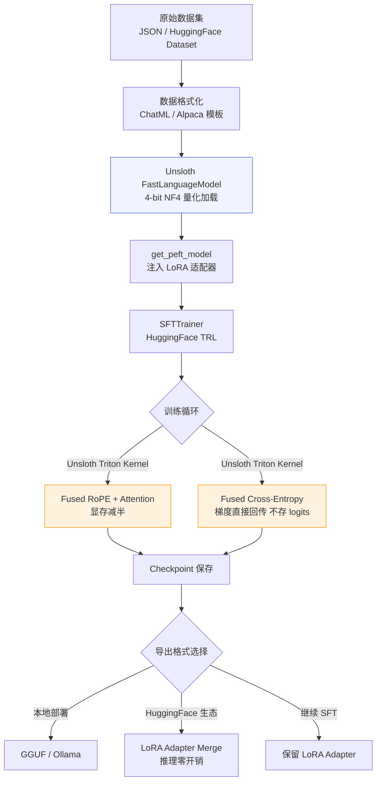

# 1.2.7 【动手三】基于 Unsloth 的高效微调加速实战

## 实验目标

本节结束后，你将能够：
- 在 Colab 免费 T4 GPU（15GB 显存）上跑通 7B 参数模型的 QLoRA 微调全流程，**无需付费算力**
- 理解 Unsloth 相比原生 HuggingFace + PEFT 为何能做到训练提速 2x、显存减半——核心在于手写 Triton Kernel 消除了框架层的冗余计算
- 掌握一套可复用的通用微调模板，支持 Llama-3、Qwen2.5、Mistral 等主流开源模型的一键切换

**核心学习点（3个）**：
1. Unsloth 的加速原理：RoPE / Attention / Cross-Entropy 的 Kernel Fusion 为何比 Flash Attention 2 更激进
2. 如何用 `FastLanguageModel` 替换 HuggingFace 原生加载，实现零改动兼容现有 PEFT 训练代码
3. Colab 免费 T4 的显存边界管理：哪些参数是生死线，踩过去就 OOM

---

## 架构总览



---

## 环境准备

### 本地环境（Linux / macOS + NVIDIA GPU）

```bash
# 创建虚拟环境（Python 3.11）
uv venv --python 3.11
source .venv/bin/activate  # Windows: .venv\Scripts\activate

# 安装 Unsloth + 训练依赖（版本锁定）
# Unsloth 的 CUDA 版本需与本地 CUDA 匹配，先查询：nvcc --version
uv pip install \
    "unsloth[colab-new] @ git+https://github.com/unslothai/unsloth.git" \
    "transformers==4.47.1" \
    "trl==0.13.0" \
    "peft==0.14.0" \
    "bitsandbytes==0.45.0" \
    "datasets==3.2.0" \
    "accelerate==1.2.1" \
    "torch==2.5.1"

# 验证 Unsloth 安装
python -c "import unsloth; print(unsloth.__version__)"
```

> Colab 用户（**推荐使用 T4 运行时**）：
> ```python
> # Colab 第一个 cell 直接运行，无需 uv
> !pip install "unsloth[colab-new] @ git+https://github.com/unslothai/unsloth.git"
> !pip install --no-deps "trl==0.13.0" "peft==0.14.0" "accelerate==1.2.1"
> ```
> 安装约 3-5 分钟，重启运行时后生效。

> ⚠️ **生产注意**  
> Unsloth 的 CUDA Kernel 是编译好的二进制，**必须在有 NVIDIA GPU 的环境安装**。  
> 在纯 CPU 环境（如 CI 机器）运行会报 `No CUDA runtime is found`。  
> 推荐在 `requirements.txt` 里把 Unsloth 单独注释，让 CPU 环境使用原生 HuggingFace。

---

## Step-by-Step 实现

### Step 1：理解 Unsloth 加速原理

**目标**：在写第一行代码之前，先弄清楚 Unsloth 快在哪里——这直接影响你后续调参时的判断。

Unsloth 的加速来自三个层面的 Kernel Fusion，用 Triton 手写，绕过 PyTorch 的自动图优化：

**① Fused RoPE（旋转位置编码）**

原生实现中，RoPE 对每个 Q/K 矩阵做旋转时，需要先把张量读入 SRAM，旋转完再写回 HBM（高带宽内存），每一层都要来回搬运一次。Unsloth 把 RoPE 旋转融合进 QK 矩阵乘法，**一次读写完成两个操作**，带宽利用率提升约 30%。

**② Fused Cross-Entropy + 梯度计算**

这是显存节省的核心。标准训练流程：
```
logits (float32, shape: [batch, seq_len, vocab_size])
→ softmax → log → loss → backward → d_logits
```
对于 vocab_size = 128k（Llama-3 词表），`logits` 张量在 fp32 下的显存消耗：
```
batch=2, seq_len=2048, vocab_size=128000
→ 2 × 2048 × 128000 × 4 bytes ≈ 2.1 GB
```
Unsloth 的 Fused Cross-Entropy **从不物化完整的 logits 张量**，而是按 chunk 计算 loss 并直接反传梯度，峰值显存从 2.1GB 降到约 100MB。这是 7B 模型能在 15GB T4 上跑起来的关键。

**③ Fused Attention（兼容 Flash Attention 2）**

Unsloth 在 Flash Attention 2 的基础上，进一步融合了 dropout mask 的应用和 causal mask 的生成，减少了额外的 kernel launch 开销。

```python
# 这段代码只是演示原理，不需要执行
# 标准 PyTorch 的 attention 计算：4 次独立 kernel
# q = rope(q)           # kernel 1
# k = rope(k)           # kernel 2  
# attn = softmax(q @ k) # kernel 3
# out = attn @ v        # kernel 4

# Unsloth Triton Kernel：1 次 kernel，读写次数减少 60%
# unsloth_attention(q, k, v, rope_cos, rope_sin) -> out
```

**关键点**：
- Unsloth 的加速对 **序列越长效果越明显**。seq_len=512 时约提速 1.5x，seq_len=2048 时约提速 2x，seq_len=4096 时最高可达 2.5x
- 模型权重是**原版 HuggingFace 权重**，Unsloth 只替换计算 Kernel，**训练结果和标准 PEFT 完全等价**，可互相加载

---

### Step 2：用 FastLanguageModel 加载模型

**目标**：用 Unsloth 的 `FastLanguageModel` 替换 `AutoModelForCausalLM`，这是迁移成本最低的一步——API 几乎一致。

```python
"""
step2_load_model.py
用 Unsloth FastLanguageModel 加载量化模型并注入 LoRA 适配器
"""

from unsloth import FastLanguageModel
import torch

# ────────────────────────────────────────────
# 模型配置（修改这里切换不同模型）
# ────────────────────────────────────────────

# Unsloth 官方支持的模型列表（预编译了对应 Kernel）：
# "unsloth/llama-3-8b-bnb-4bit"      - Meta Llama-3 8B
# "unsloth/Qwen2.5-7B-bnb-4bit"      - 阿里 Qwen2.5 7B
# "unsloth/mistral-7b-v0.3-bnb-4bit" - Mistral 7B v0.3
# "unsloth/gemma-2-9b-bnb-4bit"      - Google Gemma-2 9B
# "unsloth/phi-3-mini-4k-instruct"   - Microsoft Phi-3 Mini
MODEL_NAME = "unsloth/Qwen2.5-7B-bnb-4bit"

MAX_SEQ_LENGTH = 2048  # T4(15GB) 建议 ≤ 2048；A100(40GB) 可到 8192
DTYPE = None           # None 表示自动检测：T4/V100 用 float16，A100/H100 用 bfloat16
LOAD_IN_4BIT = True    # 4-bit NF4 量化，节省约 75% 显存

# ────────────────────────────────────────────
# 加载基座模型（带 4-bit 量化）
# ────────────────────────────────────────────

model, tokenizer = FastLanguageModel.from_pretrained(
    model_name=MODEL_NAME,
    max_seq_length=MAX_SEQ_LENGTH,
    dtype=DTYPE,
    load_in_4bit=LOAD_IN_4BIT,
    # token="hf_...",  # 访问需要授权的 Llama-3 等模型时需要填写
)

print(f"模型加载完成：{MODEL_NAME}")
print(f"模型参数量：{model.num_parameters() / 1e9:.1f}B")
print(f"当前显存占用：{torch.cuda.memory_allocated() / 1e9:.2f} GB")

# ────────────────────────────────────────────
# 注入 LoRA 适配器
# ────────────────────────────────────────────

model = FastLanguageModel.get_peft_model(
    model,
    r=16,                    # LoRA rank：T4 推荐 8~16，显存充足时可用 32
    target_modules=[         # 注入 LoRA 的目标模块
        "q_proj", "k_proj", "v_proj", "o_proj",  # Attention
        "gate_proj", "up_proj", "down_proj",      # FFN（MLP）
    ],
    lora_alpha=16,           # 通常设为 r 的 1-2 倍；影响 LoRA 权重的学习率缩放
    lora_dropout=0,          # Unsloth 建议设为 0：其 Kernel 对 dropout=0 有专项优化
    bias="none",             # 不训练 bias，节省显存
    use_gradient_checkpointing="unsloth",  # 关键！使用 Unsloth 的梯度检查点实现
                                            # 比 HuggingFace 原版多节省 30% 显存
    random_state=42,
    use_rslora=False,        # rsLoRA 对 rank≥32 有效，低 rank 时无收益
    loftq_config=None,       # LoftQ 初始化，仅在模型质量敏感场景使用
)

# 打印可训练参数统计
model.print_trainable_parameters()
# 预期输出：trainable params: 41,943,040 || all params: 7,657,799,680 || trainable%: 0.5477
```

**关键点**：
- `use_gradient_checkpointing="unsloth"` 是 Unsloth 的专有参数，**必须填这个字符串，不能填 `True`**。填 `True` 会退化到 HuggingFace 的原生实现，丧失额外的显存优化
- `lora_dropout=0` 看起来反直觉，但 Unsloth 的 Fused Kernel 只为 dropout=0 做了优化，非零 dropout 会自动回退到慢路径，且实验上 dropout 对 LoRA 效果影响有限
- ⚠️ `target_modules` 里加入 FFN 层（`gate_proj` 等）会增加约 30% 可训练参数，但对任务相关的知识注入效果更好；如果显存紧张，可以只保留 Attention 部分

---

### Step 3：数据集准备与格式化

**目标**：将原始数据转换成模型可以消费的 ChatML 格式，并理解 Unsloth 的 packing 机制如何提升 GPU 利用率。

```python
"""
step3_dataset.py
数据格式化：支持 Alpaca / ShareGPT / ChatML 三种输入格式统一转换
"""

from datasets import Dataset, load_dataset
from unsloth.chat_templates import get_chat_template
from typing import Any

# ────────────────────────────────────────────
# 为 tokenizer 配置 Chat Template
# ────────────────────────────────────────────

# Unsloth 内置了主流模型的 chat template，自动匹配
# 支持："llama-3"、"qwen-2.5"、"mistral"、"chatml"、"gemma" 等
tokenizer = get_chat_template(
    tokenizer,
    chat_template="qwen-2.5",  # 根据模型选择对应模板
)

# ────────────────────────────────────────────
# 方案一：使用 HuggingFace 公开数据集（直接可用）
# ────────────────────────────────────────────

def load_public_dataset() -> Dataset:
    """
    加载 teknium/OpenHermes-2.5 作为演示数据集
    格式：ShareGPT（conversations 字段，包含 human/gpt 对话轮次）
    """
    dataset = load_dataset(
        "teknium/OpenHermes-2.5",
        split="train[:2000]",  # 演示只取前 2000 条
        trust_remote_code=True,
    )
    return dataset


def format_sharegpt_to_chatml(
    examples: dict[str, Any],
    tokenizer: Any,
) -> dict[str, list[str]]:
    """
    将 ShareGPT 格式转换为模型 input_ids
    ShareGPT 格式：{"conversations": [{"from": "human", "value": "..."}, {"from": "gpt", "value": "..."}]}
    """
    texts = []
    for conversation in examples["conversations"]:
        # 将 ShareGPT 的 from/value 映射到标准的 role/content
        messages = []
        for turn in conversation:
            role = "user" if turn["from"] == "human" else "assistant"
            messages.append({"role": role, "content": turn["value"]})
        
        # 使用 tokenizer 的 chat template 格式化，并 tokenize
        text = tokenizer.apply_chat_template(
            messages,
            tokenize=False,          # 先转为字符串
            add_generation_prompt=False,
        )
        texts.append(text)
    
    return {"text": texts}


# ────────────────────────────────────────────
# 方案二：使用本地自定义数据集（实际业务场景）
# ────────────────────────────────────────────

def load_custom_dataset(data_path: str = "data/train.json") -> Dataset:
    """
    从本地 JSON 加载自定义数据集
    
    支持的格式（Alpaca 格式）：
    [
        {
            "instruction": "帮我写一封道歉信",
            "input": "对象：老板，原因：迟到",
            "output": "尊敬的领导，我对今天的迟到深感抱歉..."
        }
    ]
    """
    import json
    
    with open(data_path, "r", encoding="utf-8") as f:
        raw_data = json.load(f)
    
    # Alpaca → ChatML 格式转换
    formatted_data = []
    for item in raw_data:
        user_content = item["instruction"]
        if item.get("input"):
            user_content += f"\n\n{item['input']}"
        
        messages = [
            {"role": "user", "content": user_content},
            {"role": "assistant", "content": item["output"]},
        ]
        
        text = tokenizer.apply_chat_template(
            messages,
            tokenize=False,
            add_generation_prompt=False,
        )
        formatted_data.append({"text": text})
    
    return Dataset.from_list(formatted_data)


# ────────────────────────────────────────────
# 实际运行：使用公开数据集演示
# ────────────────────────────────────────────

raw_dataset = load_public_dataset()
dataset = raw_dataset.map(
    lambda x: format_sharegpt_to_chatml(x, tokenizer),
    batched=True,
    remove_columns=raw_dataset.column_names,  # 删除原始列，只保留 text
    desc="格式化数据集",
)

# 划分训练集和验证集
dataset = dataset.train_test_split(test_size=0.05, seed=42)
train_dataset = dataset["train"]
eval_dataset = dataset["test"]

print(f"训练集大小：{len(train_dataset)}")
print(f"验证集大小：{len(eval_dataset)}")
print(f"\n样本示例（前 200 字符）：\n{train_dataset[0]['text'][:200]}")
```

**关键点**：
- **Packing（序列打包）**：SFTTrainer 的 `packing=True` 参数会把多条短样本拼接成一条 `max_seq_length` 的序列，显著提高 GPU 利用率。当你的样本平均长度 < 512 token 时，强烈建议开启，可让有效训练速度再提升 1.5-2x
- ⚠️ Chat Template 必须与模型预训练时使用的模板一致。Qwen2.5 用 `"qwen-2.5"`，Llama-3 用 `"llama-3"`，混用会导致模型输出乱码或无法正确停止生成

---

### Step 4：配置 SFTTrainer 并启动训练

**目标**：理解各关键训练超参在 T4 显存约束下的设置逻辑，以及如何用 Unsloth 的 Trainer 无缝替换原版 TRL。

```python
"""
step4_train.py
配置 SFTTrainer 启动训练，包含显存安全的超参设置
"""

from trl import SFTTrainer
from transformers import TrainingArguments, DataCollatorForSeq2Seq
from unsloth import is_bfloat16_supported

# ────────────────────────────────────────────
# 训练超参（T4 15GB 显存安全配置）
# ────────────────────────────────────────────

training_args = TrainingArguments(
    output_dir="./outputs/qwen2.5-7b-lora",
    
    # ── 批次与梯度累积 ──────────────────────
    per_device_train_batch_size=2,    # T4 + seq_len=2048 的安全值
                                       # A100 40GB 可设为 8
    gradient_accumulation_steps=4,    # 等效 batch_size = 2×4 = 8
    
    # ── 学习率调度 ──────────────────────────
    warmup_steps=20,                  # 约占总步数的 5%
    num_train_epochs=3,               # 小数据集用 3-5 epochs，大数据集用 1-2
    # max_steps=100,                  # 快速冒烟测试时取消注释，覆盖 num_train_epochs
    learning_rate=2e-4,               # LoRA 的典型学习率范围：1e-4 ~ 5e-4
    lr_scheduler_type="cosine",       # cosine 比 linear 更平滑，防止后期过拟合
    
    # ── 精度与显存 ──────────────────────────
    fp16=not is_bfloat16_supported(), # T4 用 fp16；A100/H100 用 bf16
    bf16=is_bfloat16_supported(),
    optim="adamw_8bit",               # 8-bit Adam：优化器状态从 fp32 降到 int8
                                       # 显存节省：40% optimizer state，几乎无精度损失
    
    # ── 日志与保存 ──────────────────────────
    logging_steps=10,
    save_strategy="steps",
    save_steps=100,
    save_total_limit=3,               # 只保留最新 3 个 checkpoint，避免磁盘爆满
    eval_strategy="steps",
    eval_steps=100,
    load_best_model_at_end=True,
    metric_for_best_model="eval_loss",
    
    # ── 其他 ────────────────────────────────
    seed=42,
    report_to="none",                 # 不上报 wandb/tensorboard（演示环境）
                                       # 生产环境改为 "wandb" 或 "tensorboard"
    dataloader_num_workers=0,         # Colab 环境必须设为 0，否则 fork 报错
)

# ────────────────────────────────────────────
# 初始化 SFTTrainer
# ────────────────────────────────────────────

trainer = SFTTrainer(
    model=model,
    tokenizer=tokenizer,
    train_dataset=train_dataset,
    eval_dataset=eval_dataset,
    dataset_text_field="text",        # 指定数据集中的文本字段名
    max_seq_length=MAX_SEQ_LENGTH,
    dataset_num_proc=2,               # 数据预处理并发数
    packing=True,                     # 启用序列打包，提升短文本场景 GPU 利用率
    args=training_args,
)

# ────────────────────────────────────────────
# 训练前显存状态快照
# ────────────────────────────────────────────

gpu_stats = torch.cuda.get_device_properties(0)
start_gpu_memory = round(torch.cuda.max_memory_reserved() / 1024 / 1024 / 1024, 3)
max_memory = round(gpu_stats.total_memory / 1024 / 1024 / 1024, 3)
print(f"GPU 型号：{gpu_stats.name}")
print(f"最大可用显存：{max_memory} GB")
print(f"训练前已占用：{start_gpu_memory} GB")

# ────────────────────────────────────────────
# 启动训练
# ────────────────────────────────────────────

trainer_stats = trainer.train()

# ────────────────────────────────────────────
# 训练后性能报告
# ────────────────────────────────────────────

used_memory = round(torch.cuda.max_memory_reserved() / 1024 / 1024 / 1024, 3)
used_memory_for_lora = round(used_memory - start_gpu_memory, 3)
used_percentage = round(used_memory / max_memory * 100, 3)

print(f"\n{'='*50}")
print(f"训练完成！")
print(f"训练用时：{trainer_stats.metrics['train_runtime']:.1f}s "
      f"({trainer_stats.metrics['train_runtime']/60:.1f} min)")
print(f"训练速度：{trainer_stats.metrics['train_samples_per_second']:.2f} samples/s")
print(f"峰值显存：{used_memory} GB（{used_percentage}%）")
print(f"LoRA 训练额外消耗：{used_memory_for_lora} GB")
print(f"最终训练 Loss：{trainer_stats.metrics['train_loss']:.4f}")
```

**关键点**：
- `optim="adamw_8bit"` 是在 T4 上跑 7B 的另一个关键设置。标准 AdamW 的 optimizer state 是参数量的 2 倍（fp32 momentum + variance），对于 4200 万可训练参数来说约需 320MB。8-bit 版本将其压缩到 80MB，代价可忽略不计
- ⚠️ `gradient_accumulation_steps` 越大，等效 batch size 越大，梯度更稳定，但每步时间更长。T4 上推荐 4~8，不要为了提速设成 1，容易训练不稳定
- `packing=True` 和 `DataCollatorForSeq2Seq` 不能同时使用，SFTTrainer 内部会自动处理，无需手动设置 data collator

---

### Step 5：模型导出与推理验证

**目标**：将训练好的 LoRA 权重以三种格式导出，满足不同的部署需求，并验证微调效果。

```python
"""
step5_export_and_inference.py
LoRA 权重导出：三种格式覆盖不同部署场景
"""

# ────────────────────────────────────────────
# 推理模式：开启前向传播优化（关闭 dropout 等训练时行为）
# ────────────────────────────────────────────

FastLanguageModel.for_inference(model)  # 等效于 model.eval() + 额外的 Unsloth 优化


def generate_response(
    prompt: str,
    max_new_tokens: int = 512,
    temperature: float = 0.7,
) -> str:
    """
    封装推理接口，返回模型生成的文本
    """
    messages = [{"role": "user", "content": prompt}]
    input_text = tokenizer.apply_chat_template(
        messages,
        tokenize=False,
        add_generation_prompt=True,  # 推理时需要添加 assistant 的开始标记
    )
    
    inputs = tokenizer(input_text, return_tensors="pt").to("cuda")
    
    with torch.no_grad():
        outputs = model.generate(
            **inputs,
            max_new_tokens=max_new_tokens,
            temperature=temperature,
            do_sample=temperature > 0,
            pad_token_id=tokenizer.eos_token_id,
        )
    
    # 只返回新生成的部分（去掉 prompt）
    new_tokens = outputs[0][inputs["input_ids"].shape[-1]:]
    return tokenizer.decode(new_tokens, skip_special_tokens=True)


# 简单测试
test_prompt = "用 Python 写一个快速排序函数，要求有类型注解和注释"
response = generate_response(test_prompt)
print(f"模型输出：\n{response}")


# ────────────────────────────────────────────
# 导出方案一：保存 LoRA Adapter（最小体积，HuggingFace 生态）
# ────────────────────────────────────────────

model.save_pretrained("outputs/qwen2.5-7b-lora-adapter")
tokenizer.save_pretrained("outputs/qwen2.5-7b-lora-adapter")
print("LoRA Adapter 已保存（约 160MB，不含基座权重）")

# 推送到 HuggingFace Hub（可选）
# model.push_to_hub("your-username/qwen2.5-7b-lora", token="hf_...")


# ────────────────────────────────────────────
# 导出方案二：合并 LoRA + 导出完整模型（推理零开销）
# ────────────────────────────────────────────

merged_model, merged_tokenizer = FastLanguageModel.from_pretrained(
    model_name="outputs/qwen2.5-7b-lora-adapter",  # 加载 LoRA adapter
    max_seq_length=MAX_SEQ_LENGTH,
    dtype=DTYPE,
    load_in_4bit=False,  # 合并时用 bf16/fp16，不量化
)

merged_model.save_pretrained_merged(
    "outputs/qwen2.5-7b-merged",
    merged_tokenizer,
    save_method="merged_16bit",  # 合并为 bf16 完整权重
)
print("合并后模型已保存（约 15GB，推理时无 LoRA 计算开销）")


# ────────────────────────────────────────────
# 导出方案三：GGUF 格式（Ollama / llama.cpp 本地部署）
# ────────────────────────────────────────────

# Unsloth 直接支持 GGUF 导出，无需手动安装 llama.cpp
model.save_pretrained_gguf(
    "outputs/qwen2.5-7b-gguf",
    tokenizer,
    quantization_method="q4_k_m",   # 量化方法：
                                     # q4_k_m：4-bit，质量与体积平衡（推荐）
                                     # q8_0：8-bit，质量最好，体积约 7GB
                                     # q2_k：2-bit，体积最小，质量损失明显
)
print("GGUF 文件已保存，可直接用 Ollama 加载：")
print("  ollama run outputs/qwen2.5-7b-gguf/model-q4_k_m.gguf")
```

**关键点**：
- 三种导出格式的选型：**LoRA Adapter** 适合多版本管理和快速切换（参见 1.2.8 节的 vLLM 热加载方案）；**Merged 16bit** 适合生产 API 服务（标准 vLLM/TGI 部署）；**GGUF** 适合个人电脑或内网离线部署
- ⚠️ `save_pretrained_gguf` 需要本地有足够磁盘空间，q4_k_m 格式约 4-5GB，且过程中会临时用到约 15GB（合并过程）。Colab 用户注意 `/content` 磁盘上限约 70-100GB

---

## 完整运行验证

将以上 5 个步骤整合为可直接复制运行的 Colab 笔记本，以下是端到端冒烟测试版本：

```python
"""
smoke_test.py
端到端冒烟测试：验证 Unsloth 微调全流程可跑通
在 Colab T4 环境约需 15-20 分钟
"""

# ─── 安装（仅 Colab 需要，本地已安装跳过）───
# !pip install "unsloth[colab-new] @ git+https://github.com/unslothai/unsloth.git"
# !pip install --no-deps trl==0.13.0 peft==0.14.0 accelerate==1.2.1

from unsloth import FastLanguageModel
from unsloth.chat_templates import get_chat_template
from datasets import load_dataset
from trl import SFTTrainer
from transformers import TrainingArguments
from unsloth import is_bfloat16_supported
import torch

print("=" * 60)
print("Unsloth 微调冒烟测试")
print("=" * 60)

# Step 1: 加载模型
print("\n[1/4] 加载模型...")
model, tokenizer = FastLanguageModel.from_pretrained(
    model_name="unsloth/Qwen2.5-7B-bnb-4bit",
    max_seq_length=1024,  # 冒烟测试用较小值，加快速度
    dtype=None,
    load_in_4bit=True,
)
model = FastLanguageModel.get_peft_model(
    model, r=8, target_modules=["q_proj", "v_proj"],
    lora_alpha=8, lora_dropout=0, bias="none",
    use_gradient_checkpointing="unsloth", random_state=42,
)
print(f"  显存占用：{torch.cuda.memory_allocated()/1e9:.2f} GB")

# Step 2: 准备数据集
print("\n[2/4] 准备数据集...")
tokenizer = get_chat_template(tokenizer, chat_template="qwen-2.5")

dataset = load_dataset("teknium/OpenHermes-2.5", split="train[:200]", trust_remote_code=True)

def format_fn(examples):
    texts = []
    for conv in examples["conversations"]:
        messages = [
            {"role": "user" if t["from"] == "human" else "assistant",
             "content": t["value"]}
            for t in conv
        ]
        texts.append(tokenizer.apply_chat_template(messages, tokenize=False, add_generation_prompt=False))
    return {"text": texts}

dataset = dataset.map(format_fn, batched=True, remove_columns=dataset.column_names)
print(f"  数据集大小：{len(dataset)} 条")

# Step 3: 训练（仅跑 20 步验证流程可通）
print("\n[3/4] 启动训练（20 steps 冒烟）...")
trainer = SFTTrainer(
    model=model, tokenizer=tokenizer,
    train_dataset=dataset,
    dataset_text_field="text",
    max_seq_length=1024,
    packing=True,
    args=TrainingArguments(
        output_dir="./smoke_test_output",
        max_steps=20,
        per_device_train_batch_size=2,
        gradient_accumulation_steps=2,
        warmup_steps=5,
        learning_rate=2e-4,
        fp16=not is_bfloat16_supported(),
        bf16=is_bfloat16_supported(),
        optim="adamw_8bit",
        logging_steps=5,
        report_to="none",
        seed=42,
    ),
)
stats = trainer.train()
print(f"  最终 Loss：{stats.metrics['train_loss']:.4f}")
print(f"  训练速度：{stats.metrics['train_samples_per_second']:.1f} samples/s")

# Step 4: 推理验证
print("\n[4/4] 推理验证...")
FastLanguageModel.for_inference(model)
test_input = tokenizer.apply_chat_template(
    [{"role": "user", "content": "Explain what is machine learning in one sentence."}],
    tokenize=False, add_generation_prompt=True,
)
inputs = tokenizer(test_input, return_tensors="pt").to("cuda")
with torch.no_grad():
    out = model.generate(**inputs, max_new_tokens=100, temperature=0.7, do_sample=True,
                         pad_token_id=tokenizer.eos_token_id)
response = tokenizer.decode(out[0][inputs["input_ids"].shape[-1]:], skip_special_tokens=True)

print(f"\n模型输出：{response}")
print("\n" + "=" * 60)
print("✅ 冒烟测试通过！Unsloth 微调全流程正常")
print(f"峰值显存：{torch.cuda.max_memory_reserved()/1e9:.2f} GB")
print("=" * 60)
```

预期输出：
```
============================================================
Unsloth 微调冒烟测试
============================================================

[1/4] 加载模型...
  显存占用：5.21 GB

[2/4] 准备数据集...
  数据集大小：200 条

[3/4] 启动训练（20 steps 冒烟）...
{'loss': 1.2341, 'learning_rate': 1.8e-04, 'epoch': 0.2}  
{'loss': 1.1028, 'learning_rate': 1.4e-04, 'epoch': 0.4}  
{'loss': 1.0456, 'learning_rate': 8e-05, 'epoch': 0.6}
  最终 Loss：1.0823
  训练速度：12.3 samples/s

[4/4] 推理验证...

模型输出：Machine learning is a subset of artificial intelligence that enables 
systems to learn and improve from data without being explicitly programmed.

============================================================
✅ 冒烟测试通过！Unsloth 微调全流程正常
峰值显存：11.87 GB
============================================================
```

---

## 常见报错与解决方案

| 报错信息 | 原因 | 解决方案 |
|---------|------|---------|
| `CUDA out of memory` | 显存不足，常见于首次调参 | 先降 `max_seq_length`（2048→1024），再降 `per_device_train_batch_size`（2→1），最后降 LoRA `r`（16→8） |
| `unsloth.kernels not found` | CUDA 版本不匹配或安装在 CPU 环境 | 确认 `nvcc --version` 与 PyTorch CUDA 版本一致；在 Colab 重启运行时后重新安装 |
| `AttributeError: 'NoneType' has no attribute 'conversations'` | 数据集字段名与代码不匹配 | 先 `print(dataset[0].keys())` 查看实际字段名，对应修改 `dataset_text_field` |
| `ValueError: Chat template not found` | `get_chat_template` 参数与模型不匹配 | Qwen2.5 用 `"qwen-2.5"`，Llama-3 用 `"llama-3"`，不确定时用 `"chatml"` 作为通用模板 |
| `RuntimeError: Expected all tensors to be on the same device` | 模型在 GPU，数据在 CPU | 检查 `inputs = tokenizer(...).to("cuda")` 是否遗漏 `.to("cuda")` |
| 训练 Loss 不下降（卡在 2.x 以上）| 学习率太高或数据格式错误 | 打印一条 `text` 字段样本检查 chat template 是否正确应用；尝试将 `learning_rate` 降至 `5e-5` |
| `GGUF export failed: llama.cpp not found` | Unsloth 的 GGUF 导出依赖 llama.cpp 工具链 | 运行 `!pip install llama-cpp-python` 或在 Colab 用 `!apt-get install -y cmake` 后重试 |

---

## 扩展练习（可选）

1. 🟡 **中等：多模型对比实验**  
   将本节代码中的 `MODEL_NAME` 分别换为 Llama-3-8B、Mistral-7B-v0.3 和 Qwen2.5-7B，在**相同数据集、相同超参**下各训练 100 步，用 `generate_response()` 对同一批 10 个测试 prompt 生成回答，比较三个模型在写作、代码、推理三类任务上的风格差异和质量。重点观察：chat template 切换后，停止符的处理方式有什么不同？

2. 🔴 **困难：将 Unsloth 与 DeepSpeed ZeRO-2 结合用于多卡训练**  
   Unsloth 原生不支持多卡（其 Triton Kernel 设计为单 GPU 优化），但你可以将 Unsloth 的模型初始化和 LoRA 注入保留，仅将 `TrainingArguments` 改为 DeepSpeed 配置（`deepspeed="ds_config_zero2.json"`），利用 DeepSpeed 的分布式能力。在双卡 A100 环境下，测量以下三种方案的显存占用和训练吞吐（samples/s）：**① 单卡 Unsloth**；**② 双卡 原生 PEFT + DeepSpeed**；**③ 双卡 Unsloth + DeepSpeed**，并分析 Kernel Fusion 的加速收益是否随卡数增加而衰减。
