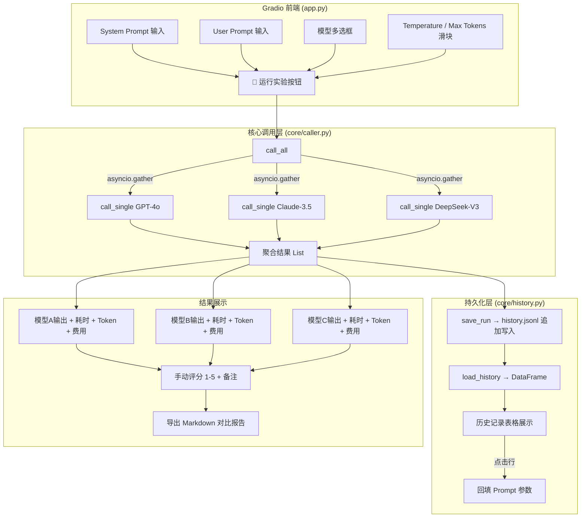

# 1.3 【动手二】构建一个提示词调试器

## 实验目标

本节结束后，你将拥有一个可以本地运行的多模型 Prompt 并发调试工具，能够同时对 GPT-4o、Claude、DeepSeek 等模型发送相同的 Prompt，在浏览器界面中并排对比输出、记录评分，并将历史实验持久化为 JSONL 文件供后续分析。

核心学习点（3 个）：

1. **受控实验思维**：优化 Prompt 的本质是科学实验——每次只改一个变量（System Prompt / Temperature / 模型），才能得出可信结论；本工具在界面层强制实现这一约束。
2. **asyncio 并发调用**：串行调用 3 个模型需等待 3 倍时间；用 `asyncio.gather` 并发后总耗时约等于最慢那个模型，是 LLM 应用中最高性价比的优化手段。
3. **轻量级实验追踪**：不引入数据库，用 JSONL 追加写入做版本历史，学习"够用就好"的工程取舍。

---

## 架构总览



---

## 环境准备

```bash
# 创建项目目录与虚拟环境（uv）
mkdir prompt-debugger && cd prompt-debugger
uv venv --python 3.11 && source .venv/bin/activate

# 安装依赖（锁定版本，保证可复现）
uv pip install \
    litellm==1.52.0 \
    gradio==5.9.1 \
    python-dotenv==1.0.1 \
    pandas==2.2.3

# 项目结构
mkdir -p core
touch core/__init__.py core/caller.py core/history.py app.py .env
```

> Colab 用户：`!pip install litellm==1.52.0 gradio==5.9.1 python-dotenv==1.0.1 pandas==2.2.3` 即可，无需虚拟环境。

配置 `.env` 文件（**不要提交到 Git**）：

```bash
# .env
OPENAI_API_KEY=sk-...
ANTHROPIC_API_KEY=sk-ant-...
DEEPSEEK_API_KEY=sk-...

# 可选：如果用 OpenRouter 统一代理
# OPENROUTER_API_KEY=sk-or-...
```

---

## Step-by-Step 实现

### Step 1：项目骨架与配置加载

**目标**：建立清晰的目录结构，并在程序入口处统一加载所有 API Key。LiteLLM 会自动从环境变量中读取各模型的 Key，我们只需要确保 `.env` 在启动时被加载。

```python
# core/__init__.py
"""
prompt-debugger 核心包

模块说明：
  caller.py  - LLM 并发调用层
  history.py - 实验历史持久化层
"""
from dotenv import load_dotenv

# 包加载时立即读取 .env，确保后续所有模块都能拿到环境变量
load_dotenv()
```

```python
# core/config.py
"""全局配置：模型注册表与定价信息"""
from typing import TypedDict


class ModelConfig(TypedDict):
    litellm_id: str       # LiteLLM 识别的模型字符串
    price_in: float       # 每 1K input tokens 价格（美元）
    price_out: float      # 每 1K output tokens 价格（美元）
    max_tokens_limit: int # 模型支持的最大 max_tokens


# 注册表：key 是界面显示名，value 是调用配置
MODEL_REGISTRY: dict[str, ModelConfig] = {
    "gpt-4o": {
        "litellm_id": "openai/gpt-4o",
        "price_in": 0.0025,
        "price_out": 0.01,
        "max_tokens_limit": 4096,
    },
    "claude-3.5-sonnet": {
        "litellm_id": "anthropic/claude-3-5-sonnet-20241022",
        "price_in": 0.003,
        "price_out": 0.015,
        "max_tokens_limit": 8192,
    },
    "deepseek-v3": {
        "litellm_id": "deepseek/deepseek-chat",
        "price_in": 0.00027,
        "price_out": 0.0011,
        "max_tokens_limit": 4096,
    },
}


def estimate_cost(model_key: str, input_tokens: int, output_tokens: int) -> float:
    """根据 Token 数估算调用费用（美元）"""
    cfg = MODEL_REGISTRY[model_key]
    return (
        input_tokens / 1000 * cfg["price_in"]
        + output_tokens / 1000 * cfg["price_out"]
    )
```

**关键点**：
- 把模型配置（包括价格）集中在一个注册表里，后续新增模型只改这一处。
- ⚠️ 价格数据会随时调整，建议使用前确认各模型官网最新定价。

---

### Step 2：核心调用层（异步并发）

**目标**：封装单模型调用并暴露并发入口。这是整个工具的核心引擎——让 3 个 HTTP 请求同时飞出去，而不是排队等待。

```python
# core/caller.py
"""
LLM 并发调用层

设计原则：
  1. 每个 call_single 是独立协程，互不干扰
  2. call_all 用 asyncio.gather 并发，总耗时 ≈ 最慢模型的单次耗时
  3. return_exceptions=True 确保一个模型出错不影响其他模型的结果
"""
import asyncio
import time
from dataclasses import dataclass, field
from typing import Any

from litellm import acompletion

from core.config import MODEL_REGISTRY, estimate_cost


@dataclass
class CallResult:
    """单次模型调用的结构化结果"""
    model: str
    output: str
    latency: float        # 秒
    input_tokens: int
    output_tokens: int
    total_tokens: int
    estimated_cost: float # 美元
    error: str | None = None  # 非 None 表示调用失败


async def call_single(
    model_key: str,
    system_prompt: str,
    user_prompt: str,
    temperature: float,
    max_tokens: int,
) -> CallResult:
    """
    调用单个模型并返回结构化结果。

    Args:
        model_key: MODEL_REGISTRY 中的键名（如 "gpt-4o"）
        system_prompt: 系统提示词
        user_prompt: 用户输入
        temperature: 采样温度 [0, 2]
        max_tokens: 最大输出 Token 数

    Returns:
        CallResult 对象，error 字段非 None 表示失败
    """
    cfg = MODEL_REGISTRY[model_key]
    start = time.perf_counter()

    try:
        resp = await acompletion(
            model=cfg["litellm_id"],
            messages=[
                {"role": "system", "content": system_prompt},
                {"role": "user", "content": user_prompt},
            ],
            temperature=temperature,
            max_tokens=max_tokens,
        )
        latency = round(time.perf_counter() - start, 2)
        usage = resp.usage
        input_tok = usage.prompt_tokens
        output_tok = usage.completion_tokens

        return CallResult(
            model=model_key,
            output=resp.choices[0].message.content or "",
            latency=latency,
            input_tokens=input_tok,
            output_tokens=output_tok,
            total_tokens=usage.total_tokens,
            estimated_cost=round(estimate_cost(model_key, input_tok, output_tok), 6),
        )

    except Exception as exc:
        # 捕获所有异常（限流、超时、Key 失效等），不让单个失败拖垮整批
        latency = round(time.perf_counter() - start, 2)
        return CallResult(
            model=model_key,
            output="",
            latency=latency,
            input_tokens=0,
            output_tokens=0,
            total_tokens=0,
            estimated_cost=0.0,
            error=_friendly_error(exc),
        )


def _friendly_error(exc: Exception) -> str:
    """将技术性异常转换为对用户友好的提示"""
    msg = str(exc).lower()
    if "rate limit" in msg or "429" in msg:
        return "❌ API 限流，请稍后重试（建议降低并发频率）"
    if "auth" in msg or "401" in msg or "invalid api key" in msg:
        return "❌ API Key 无效，请检查 .env 配置"
    if "timeout" in msg:
        return "❌ 请求超时，模型响应过慢"
    if "model_not_found" in msg or "404" in msg:
        return "❌ 模型不可用，请检查模型名称或账户权限"
    return f"❌ 调用失败：{exc.__class__.__name__}: {str(exc)[:100]}"


async def call_all(
    selected_models: list[str],
    system_prompt: str,
    user_prompt: str,
    temperature: float,
    max_tokens: int,
) -> list[CallResult]:
    """
    并发调用所有选中的模型。

    关键设计：asyncio.gather 让所有请求同时发出，
    总耗时 ≈ max(各模型耗时)，而非 sum(各模型耗时)。
    例如：GPT-4o 需 3s，Claude 需 4s，DeepSeek 需 2s
          串行总计 9s，并发只需约 4s。
    """
    tasks = [
        call_single(m, system_prompt, user_prompt, temperature, max_tokens)
        for m in selected_models
    ]
    # return_exceptions=False 已被上层 try/except 处理，此处无需重复兜底
    results: list[CallResult] = await asyncio.gather(*tasks)
    return results
```

**关键点**：
- `asyncio.gather` 的 `return_exceptions=False`（默认）配合内层 `try/except` 是推荐组合——异常被"就地消化"成 `CallResult.error`，而不是让 `gather` 抛出，调用方代码更简洁。
- ⚠️ 注意 `acompletion` 是 LiteLLM 的异步版本，不能和同步的 `completion` 混用。如果你在 Jupyter/Colab 里运行，需要用 `nest_asyncio` 解决事件循环嵌套问题（见"常见报错"节）。

---

### Step 3：历史持久化层

**目标**：用 JSONL（每行一个 JSON 对象）格式记录每次实验，追加写入天然防止数据损坏，无需数据库，重启后历史依然存在。

```python
# core/history.py
"""
实验历史持久化

格式选择：JSONL（JSON Lines）
  - 追加写入：每次 save_run 只 append 一行，不重写整个文件
  - 可读性强：每行独立，可用任何文本工具查看
  - 容错性好：某行损坏不影响其他行的读取
"""
import json
import os
from datetime import datetime, timezone
from pathlib import Path

import pandas as pd

from core.caller import CallResult

HISTORY_FILE = Path("history.jsonl")


def save_run(
    system_prompt: str,
    user_prompt: str,
    selected_models: list[str],
    temperature: float,
    max_tokens: int,
    results: list[CallResult],
    scores: dict[str, int] | None = None,
    notes: str = "",
) -> str:
    """
    将一次实验追加写入 history.jsonl。

    Returns:
        本次实验的唯一 ID（时间戳格式）
    """
    run_id = datetime.now(timezone.utc).strftime("%Y%m%d_%H%M%S_%f")

    record = {
        "run_id": run_id,
        "timestamp": datetime.now(timezone.utc).isoformat(),
        "params": {
            "system_prompt": system_prompt,
            "user_prompt": user_prompt,
            "selected_models": selected_models,
            "temperature": temperature,
            "max_tokens": max_tokens,
        },
        "results": [
            {
                "model": r.model,
                "output": r.output,
                "latency": r.latency,
                "input_tokens": r.input_tokens,
                "output_tokens": r.output_tokens,
                "total_tokens": r.total_tokens,
                "estimated_cost": r.estimated_cost,
                "error": r.error,
                # 评分：若 scores 为 None 或该模型未评分，记为 -1（待评分）
                "score": (scores or {}).get(r.model, -1),
            }
            for r in results
        ],
        "notes": notes,
    }

    # 追加写入，确保文件编码为 UTF-8（处理中文 Prompt）
    with open(HISTORY_FILE, "a", encoding="utf-8") as f:
        f.write(json.dumps(record, ensure_ascii=False) + "\n")

    return run_id


def load_history() -> pd.DataFrame:
    """
    读取 history.jsonl 并转换为 DataFrame，供 Gradio 表格展示。

    Returns:
        DataFrame，每行对应一次模型调用（非实验），按时间倒序排列
    """
    if not HISTORY_FILE.exists():
        return pd.DataFrame(columns=[
            "run_id", "timestamp", "模型", "耗时(s)", "Tokens",
            "费用($)", "评分", "User Prompt 预览", "备注"
        ])

    rows = []
    with open(HISTORY_FILE, "r", encoding="utf-8") as f:
        for line in f:
            line = line.strip()
            if not line:
                continue
            try:
                record = json.loads(line)
            except json.JSONDecodeError:
                # 跳过损坏行，不让单行错误中断整个加载
                continue

            for result in record["results"]:
                rows.append({
                    "run_id": record["run_id"],
                    "timestamp": record["timestamp"][:19].replace("T", " "),
                    "模型": result["model"],
                    "耗时(s)": result["latency"],
                    "Tokens": result["total_tokens"],
                    "费用($)": result["estimated_cost"],
                    "评分": result["score"] if result["score"] != -1 else "—",
                    "User Prompt 预览": record["params"]["user_prompt"][:40] + "...",
                    "备注": record.get("notes", ""),
                })

    df = pd.DataFrame(rows)
    if not df.empty:
        df = df.sort_values("timestamp", ascending=False).reset_index(drop=True)
    return df


def get_run_by_id(run_id: str) -> dict | None:
    """通过 run_id 查找完整实验记录，用于历史回填功能"""
    if not HISTORY_FILE.exists():
        return None
    with open(HISTORY_FILE, "r", encoding="utf-8") as f:
        for line in f:
            line = line.strip()
            if not line:
                continue
            try:
                record = json.loads(line)
                if record["run_id"] == run_id:
                    return record
            except json.JSONDecodeError:
                continue
    return None


def export_comparison_report(run_ids: list[str]) -> str:
    """
    将多条历史记录生成 Markdown 对比报告。

    Args:
        run_ids: 要对比的实验 ID 列表

    Returns:
        Markdown 格式的对比报告字符串
    """
    records = [r for rid in run_ids if (r := get_run_by_id(rid))]
    if not records:
        return "未找到指定实验记录"

    lines = ["# Prompt 实验对比报告\n"]
    lines.append(f"生成时间：{datetime.now().strftime('%Y-%m-%d %H:%M:%S')}\n")
    lines.append(f"对比实验数：{len(records)}\n\n---\n")

    for rec in records:
        p = rec["params"]
        lines.append(f"## 实验 `{rec['run_id']}`\n")
        lines.append(f"**System Prompt**：{p['system_prompt'][:100]}...\n\n")
        lines.append(f"**User Prompt**：{p['user_prompt']}\n\n")
        lines.append(f"**参数**：Temperature={p['temperature']}, Max Tokens={p['max_tokens']}\n\n")

        for r in rec["results"]:
            score_str = f"⭐ {r['score']}/5" if r["score"] != -1 else "未评分"
            lines.append(f"### {r['model']} — {score_str}\n")
            if r["error"]:
                lines.append(f"> {r['error']}\n\n")
            else:
                lines.append(
                    f"⏱ {r['latency']}s | 🪙 {r['total_tokens']} tokens | "
                    f"💰 ${r['estimated_cost']}\n\n"
                )
                lines.append(f"{r['output']}\n\n")
        lines.append("---\n")

    return "\n".join(lines)
```

**关键点**：
- JSONL 追加写入是"最简单的实验追踪系统"——MLflow、W&B 做的事情在这里用 50 行实现了 80%。
- `ensure_ascii=False` 必须加，否则中文 Prompt 会被转义为 `\uXXXX`，JSONL 文件人眼不可读。
- ⚠️ 多进程同时写入同一 JSONL 可能导致行交叉损坏，本工具为单用户单进程，无此风险。生产环境多进程写入需要文件锁或改用数据库。

---

### Step 4：Gradio 界面搭建

**目标**：将核心逻辑包裹成交互界面。Gradio Blocks 允许自由布局——横向排列多模型输出是关键 UX 设计，让用户眼睛不用上下滚动即可对比差异。

```python
# app.py
"""
Prompt 调试器主程序

运行：python app.py
然后打开浏览器访问 http://localhost:7860
"""
import asyncio
import json
from datetime import datetime

import gradio as gr
import pandas as pd

import core  # 触发 dotenv 加载
from core.caller import call_all, CallResult, MODEL_REGISTRY
from core.history import (
    export_comparison_report,
    get_run_by_id,
    load_history,
    save_run,
)

ALL_MODELS = list(MODEL_REGISTRY.keys())


def format_result_markdown(r: CallResult) -> str:
    """将 CallResult 格式化为 Markdown，供 Gradio Markdown 组件展示"""
    if r.error:
        return f"## ❌ {r.model}\n\n{r.error}"

    return (
        f"## ✅ {r.model}\n\n"
        f"⏱ **{r.latency}s** | "
        f"🪙 **{r.total_tokens}** tokens "
        f"({r.input_tokens} in / {r.output_tokens} out) | "
        f"💰 **${r.estimated_cost}**\n\n"
        f"---\n\n"
        f"{r.output}"
    )


def run_experiment(
    system_prompt: str,
    user_prompt: str,
    selected_models: list[str],
    temperature: float,
    max_tokens: int,
) -> tuple:
    """
    Gradio 事件处理函数：触发并发调用，返回各模型结果。

    Returns:
        3 个 Markdown 内容 + 状态信息，对应界面上 3 个输出列
    """
    if not selected_models:
        return ("⚠️ 请至少选择一个模型", "", "", "未选择模型")
    if not user_prompt.strip():
        return ("⚠️ User Prompt 不能为空", "", "", "Prompt 为空")

    # 在同步函数中运行异步代码
    # 注意：Gradio 5.x 在内部线程中运行事件处理器，asyncio.run() 是安全的
    results: list[CallResult] = asyncio.run(
        call_all(selected_models, system_prompt, user_prompt, temperature, int(max_tokens))
    )

    # 将结果映射到固定的 3 个输出槽
    # 未选择的模型槽位返回空字符串（界面上显示为空）
    model_to_result = {r.model: r for r in results}
    outputs = []
    for model in ALL_MODELS:  # 固定顺序：gpt-4o, claude-3.5-sonnet, deepseek-v3
        if model in model_to_result:
            outputs.append(format_result_markdown(model_to_result[model]))
        else:
            outputs.append("")  # 未选择则留空

    # 保存历史（评分在 UI 中单独触发，此处先存 -1）
    run_id = save_run(
        system_prompt, user_prompt, selected_models,
        temperature, int(max_tokens), results
    )

    status = (
        f"✅ 实验完成 [{run_id}] — "
        f"共 {len(results)} 个模型，"
        f"总费用约 ${sum(r.estimated_cost for r in results):.6f}"
    )

    return tuple(outputs) + (status,)


def save_scores_and_notes(
    run_id_input: str,
    score_gpt: int,
    score_claude: int,
    score_deepseek: int,
    notes: str,
) -> str:
    """将用户评分写回 history.jsonl（通过重写对应行实现）"""
    # 简化实现：将评分追加为独立记录，关联到 run_id
    # 生产级实现应使用数据库 UPDATE，这里用轻量方案
    record = {
        "type": "score_update",
        "target_run_id": run_id_input.strip(),
        "timestamp": datetime.utcnow().isoformat(),
        "scores": {
            "gpt-4o": score_gpt,
            "claude-3.5-sonnet": score_claude,
            "deepseek-v3": score_deepseek,
        },
        "notes": notes,
    }
    with open("history.jsonl", "a", encoding="utf-8") as f:
        f.write(json.dumps(record, ensure_ascii=False) + "\n")
    return f"✅ 评分已保存到实验 {run_id_input.strip()}"


def refresh_history() -> pd.DataFrame:
    """刷新历史记录表格"""
    return load_history()


def fill_from_history(evt: gr.SelectData, df: pd.DataFrame):
    """
    点击历史记录表格某行时，回填 Prompt 和参数到输入区。

    Gradio SelectData 包含 index（行号）和 value（单元格值）。
    我们通过行号找到 run_id，再从文件读取完整记录。
    """
    if evt.index is None or df.empty:
        return gr.update(), gr.update(), gr.update(), gr.update(), gr.update()

    row_idx = evt.index[0]
    if row_idx >= len(df):
        return gr.update(), gr.update(), gr.update(), gr.update(), gr.update()

    run_id = df.iloc[row_idx]["run_id"]
    record = get_run_by_id(run_id)
    if not record:
        return gr.update(), gr.update(), gr.update(), gr.update(), gr.update()

    p = record["params"]
    return (
        gr.update(value=p["system_prompt"]),
        gr.update(value=p["user_prompt"]),
        gr.update(value=p["selected_models"]),
        gr.update(value=p["temperature"]),
        gr.update(value=p["max_tokens"]),
    )


# ─────────────── Gradio Blocks UI ───────────────
with gr.Blocks(
    title="🔬 Prompt 调试器",
    theme=gr.themes.Soft(),
    css=".output-col { min-height: 300px; }",
) as demo:
    gr.Markdown("# 🔬 Prompt 调试器\n> 改变一个变量，观察输出变化，记录结论")

    # ── 输入区 ──
    with gr.Row():
        with gr.Column(scale=2):
            system_box = gr.Textbox(
                label="System Prompt",
                placeholder="你是一个专业的代码审查员...",
                lines=4,
                value="You are a helpful assistant. Be concise and precise.",
            )
        with gr.Column(scale=2):
            user_box = gr.Textbox(
                label="User Prompt",
                placeholder="在这里输入你的问题或指令...",
                lines=4,
            )

    # ── 参数控制区 ──
    with gr.Row():
        with gr.Column(scale=2):
            model_check = gr.CheckboxGroup(
                choices=ALL_MODELS,
                value=["gpt-4o", "deepseek-v3"],
                label="选择模型（可多选，并发调用）",
            )
        with gr.Column(scale=1):
            temp_slider = gr.Slider(
                minimum=0.0, maximum=2.0, value=0.7, step=0.1,
                label="Temperature（越高越随机）",
            )
        with gr.Column(scale=1):
            token_slider = gr.Slider(
                minimum=100, maximum=4000, value=1000, step=100,
                label="Max Tokens（输出上限）",
            )

    run_btn = gr.Button("🚀 运行实验", variant="primary", size="lg")
    status_box = gr.Textbox(label="实验状态", interactive=False)

    # ── 输出区（3 列固定对应 3 个模型）──
    gr.Markdown("## 📊 模型输出对比")
    with gr.Row(equal_height=False):
        out_gpt = gr.Markdown(elem_classes=["output-col"])
        out_claude = gr.Markdown(elem_classes=["output-col"])
        out_deepseek = gr.Markdown(elem_classes=["output-col"])

    # ── 评分区 ──
    with gr.Accordion("📝 手动评分（可选）", open=False):
        gr.Markdown("打分后点击保存，评分会关联到本次实验 run_id")
        run_id_input = gr.Textbox(
            label="Run ID（从实验状态栏复制）", placeholder="20241201_143022_123456"
        )
        with gr.Row():
            score_gpt = gr.Slider(1, 5, value=3, step=1, label="GPT-4o 评分")
            score_claude = gr.Slider(1, 5, value=3, step=1, label="Claude-3.5 评分")
            score_deepseek = gr.Slider(1, 5, value=3, step=1, label="DeepSeek-V3 评分")
        notes_box = gr.Textbox(label="备注", placeholder="DeepSeek 格式更规范，但少了一个边界条件...")
        save_score_btn = gr.Button("💾 保存评分")
        score_status = gr.Textbox(label="保存状态", interactive=False)

    # ── 历史记录区 ──
    with gr.Accordion("📚 历史记录", open=False):
        refresh_btn = gr.Button("🔄 刷新历史")
        history_df = gr.DataFrame(
            value=load_history,
            label="实验历史（点击行可回填参数）",
            interactive=False,
            wrap=True,
        )
        gr.Markdown("*点击表格中任意行，Prompt 和参数会自动回填到输入区*")

    # ── 报告导出区 ──
    with gr.Accordion("📄 导出对比报告", open=False):
        export_ids = gr.Textbox(
            label="输入 Run ID（多个用逗号分隔）",
            placeholder="20241201_143022_123456, 20241201_150033_654321",
        )
        export_btn = gr.Button("📥 生成 Markdown 报告")
        report_output = gr.Markdown()

    # ─── 事件绑定 ───
    run_btn.click(
        fn=run_experiment,
        inputs=[system_box, user_box, model_check, temp_slider, token_slider],
        outputs=[out_gpt, out_claude, out_deepseek, status_box],
    )

    save_score_btn.click(
        fn=save_scores_and_notes,
        inputs=[run_id_input, score_gpt, score_claude, score_deepseek, notes_box],
        outputs=[score_status],
    )

    refresh_btn.click(fn=refresh_history, outputs=[history_df])

    history_df.select(
        fn=fill_from_history,
        inputs=[history_df],
        outputs=[system_box, user_box, model_check, temp_slider, token_slider],
    )

    export_btn.click(
        fn=lambda ids: export_comparison_report(
            [x.strip() for x in ids.split(",") if x.strip()]
        ),
        inputs=[export_ids],
        outputs=[report_output],
    )


if __name__ == "__main__":
    demo.launch(
        server_name="0.0.0.0",  # 允许局域网访问
        server_port=7860,
        share=False,            # True 可生成公网链接（Colab 场景使用）
        show_error=True,
    )
```

**关键点**：
- Gradio 5.x 中 `DataFrame.select` 事件的 `evt.index` 返回 `[行号, 列号]`，取第 0 个元素才是行号。
- 输出固定为 3 个 `Markdown` 组件对应 3 个模型，而非动态创建组件——Gradio 的输出数量必须在 `launch` 前静态确定，这是一个常见的架构约束。
- ⚠️ `asyncio.run()` 在 Jupyter/Colab 中会报 `This event loop is already running`，因为 Jupyter 自带运行中的事件循环。解决方案见"常见报错"。

---

## 完整运行验证

```python
# smoke_test.py — 端到端冒烟测试（不启动 UI，仅测试核心逻辑）
"""
运行：python smoke_test.py
预期：在 ~5 秒内并发拿到所有选中模型的响应
"""
import asyncio
import os
import sys

# 确保能找到 core 模块
sys.path.insert(0, os.path.dirname(__file__))

import core  # 触发 dotenv 加载
from core.caller import call_all
from core.history import save_run, load_history


async def main():
    print("🔬 Prompt 调试器 — 冒烟测试\n")

    system = "You are a concise assistant. Answer in one sentence."
    user = "What is the capital of France?"
    models = ["gpt-4o", "deepseek-v3"]  # 去掉 Claude 节省 Key 消耗

    print(f"📤 发送到模型：{models}")
    print(f"📝 User Prompt：{user}\n")

    results = await call_all(
        selected_models=models,
        system_prompt=system,
        user_prompt=user,
        temperature=0.0,  # 确定性输出便于验证
        max_tokens=100,
    )

    print("=" * 60)
    for r in results:
        if r.error:
            print(f"❌ {r.model}: {r.error}")
        else:
            print(f"✅ {r.model}")
            print(f"   输出: {r.output.strip()}")
            print(f"   耗时: {r.latency}s | Tokens: {r.total_tokens} | 费用: ${r.estimated_cost}")
    print("=" * 60)

    # 测试历史存储
    run_id = save_run(system, user, models, 0.0, 100, results)
    print(f"\n💾 历史已保存，Run ID: {run_id}")

    df = load_history()
    print(f"📚 当前历史记录数（行数）: {len(df)}")
    print(df.head(3).to_string())

    print("\n✅ 冒烟测试通过！运行 `python app.py` 启动完整 UI")


if __name__ == "__main__":
    asyncio.run(main())
```

**预期输出**：

```
🔬 Prompt 调试器 — 冒烟测试

📤 发送到模型：['gpt-4o', 'deepseek-v3']
📝 User Prompt：What is the capital of France?

============================================================
✅ gpt-4o
   输出: The capital of France is Paris.
   耗时: 1.23s | Tokens: 28 | 费用: $0.000035
✅ deepseek-v3
   输出: The capital of France is Paris.
   耗时: 0.87s | Tokens: 25 | 费用: $0.000003
============================================================

💾 历史已保存，Run ID: 20241201_143022_123456
📚 当前历史记录数（行数）: 2

         run_id           timestamp         模型  耗时(s)  Tokens  费用($)  评分       User Prompt 预览  备注
0  20241201_...  2024-12-01 14:30:22      gpt-4o     1.23      28  0.000035   —  What is the capital...
1  20241201_...  2024-12-01 14:30:22  deepseek-v3     0.87      25  0.000003   —  What is the capital...

✅ 冒烟测试通过！运行 `python app.py` 启动完整 UI
```

---

## 常见报错与解决方案

| 报错信息 | 原因 | 解决方案 |
|---------|------|---------|
| `This event loop is already running` | Colab/Jupyter 已有事件循环，`asyncio.run()` 冲突 | 在 Colab 首行运行 `!pip install nest_asyncio`，然后 `import nest_asyncio; nest_asyncio.apply()`，之后 `asyncio.run()` 即可正常使用 |
| `litellm.AuthenticationError: OpenAIException - Incorrect API key` | .env 未加载或 Key 填错 | 检查 `.env` 文件在项目根目录；确认 `import core` 在任何 `litellm` 调用之前执行 |
| `ModuleNotFoundError: No module named 'core'` | 从错误目录启动 | 确保在项目根目录（包含 `app.py` 的目录）运行 `python app.py` |
| `gradio.Error: Cannot call ... as it has not been created yet` | Gradio 组件在 `Blocks` 上下文外创建 | 所有 `gr.xxx()` 组件定义必须在 `with gr.Blocks() as demo:` 缩进块内 |
| `TypeError: cannot unpack non-iterable NoneType` | 模型未返回结果，`run_experiment` 返回了 `None` | 确认 `run_experiment` 函数所有分支都有显式 `return`，特别是异常路径 |
| `ConnectionError: ('Connection aborted.', RemoteDisconnected...)` | 网络代理问题（国内访问 OpenAI） | 在 `.env` 中设置 `OPENAI_API_BASE=https://your-proxy/v1`，或改用 DeepSeek/通义千问等国内模型测试 |

---

## 扩展练习（可选）

1. 🟡 **中等 — 增加 Diff 视图**：在两个模型输出之间，用不同颜色高亮词语级别的差异。提示：Python 标准库 `difflib.unified_diff` 可在字符级别计算差异，Gradio 支持 HTML 渲染，你可以用 `<span style="background:yellow">` 标记不同词。

2. 🔴 **困难 — Prompt 自动优化循环**：接入 DSPy，将你手动评分的历史数据作为训练信号，让 DSPy 自动搜索更好的 Prompt 写法。核心思路：用 `dspy.BootstrapFewShot` 以你的评分作为 metric，基于已有的 `(prompt, score)` 对优化出新的候选 Prompt，然后在调试器中一键测试新候选。
