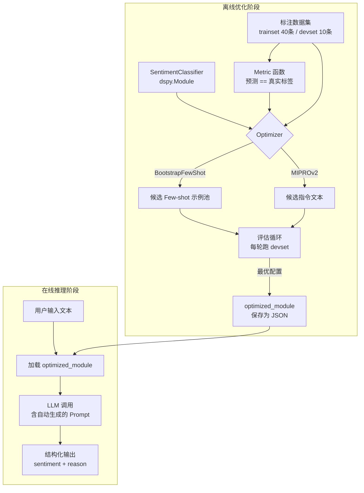

# 1.3 【动手四】自动化 Prompt 优化器（DSPy 入门）

## 实验目标

完成本节后，你能做到三件事：

1. **用 DSPy 声明式地定义任务**，彻底摆脱"反复试 Prompt"的低效循环——你只需告诉系统要什么输入输出，优化器自动搜索最佳 Prompt 和示例组合。
2. **量化 Prompt 效果**，建立"有指标驱动的 Prompt 迭代"工作流，能在 devset 上对比 Baseline 与优化后的准确率差异。
3. **掌握 DSPy 四个核心抽象**（Signature / Module / Optimizer / Metric）的设计意图，能举一反三地迁移到其他 NLP 任务。

核心学习点：① DSPy 把 Prompt 工程变成了一个编译问题；② `BootstrapFewShot` 的自动示例挑选逻辑；③ 如何设计一个可复用的评估-优化闭环。

---

## 架构总览



整个流程分两个阶段：**离线优化**（只跑一次，耗时但省事）和**在线推理**（加载优化后的 Module 直接用）。优化器本质是在"Prompt 空间"做搜索，Metric 函数是搜索的目标函数。

---

## 环境准备

```bash
# 创建虚拟环境（uv，推荐）
uv venv --python 3.11
source .venv/bin/activate  # Windows: .venv\Scripts\activate

# 安装依赖（锁定版本，确保可复现）
uv pip install dspy==2.5.43 openai==1.57.4 matplotlib==3.9.3 python-dotenv==1.0.1
```

> Colab 用户：`!pip install dspy==2.5.43 openai==1.57.4 matplotlib` 即可，无需创建虚拟环境。

```bash
# 创建 .env 文件存放 API Key（不要提交到 Git）
echo "OPENAI_API_KEY=sk-..." > .env
```

> ⚠️ **生产注意** DSPy 的版本迭代极快，2.x 与 1.x API 差异巨大。本文基于 `dspy==2.5.x`，如果你用 `pip install dspy` 拉到更新版本，请先查阅官方 changelog，`Signature` 的字段定义语法和 `Optimizer` 的参数名可能已变更。

---

## Step-by-Step 实现

### Step 1：配置 LLM 并理解 DSPy 与 OpenAI SDK 的关系

**目标**：初始化 LLM 后端，搞清楚 DSPy 并不是直接替代 OpenAI SDK——它是在上层管理 Prompt 的生成与优化，底层调用仍通过标准 API 完成。

```python
# sentiment_optimizer.py
import os
import dspy
from dotenv import load_dotenv

load_dotenv()  # 从 .env 读取 OPENAI_API_KEY

def configure_lm(model: str = "openai/gpt-4o-mini") -> dspy.LM:
    """
    初始化 LLM 后端。
    
    DSPy 使用 LiteLLM 格式的 model string：
      - "openai/gpt-4o-mini"     → OpenAI
      - "anthropic/claude-3-5-haiku-20241022" → Claude（需设置 ANTHROPIC_API_KEY）
      - "ollama/qwen2.5:7b"      → 本地 Ollama（无需 API Key）
    
    temperature=0 在优化阶段保证确定性，便于对比实验。
    """
    lm = dspy.LM(
        model=model,
        api_key=os.getenv("OPENAI_API_KEY"),
        temperature=0,        # 优化阶段固定为0，推理阶段可调
        max_tokens=512,
        cache=True,           # 开启本地缓存，重跑时不重复花钱
    )
    dspy.configure(lm=lm)
    print(f"✅ LLM 配置完成：{model}")
    return lm

if __name__ == "__main__":
    lm = configure_lm()
    # 快速验证连通性
    response = lm("用一句话介绍 DSPy")
    print(response)
```

**关键点**：
- `cache=True` 是调试阶段的救命开关。DSPy 优化过程会调用 LLM 数十次，开缓存后相同 Prompt 不重复计费，节省大量成本。缓存文件默认存在 `~/.dspy_cache/`。
- `temperature=0` 在优化阶段保证 Metric 评估的稳定性——同一个 Prompt 每次得到相同输出，优化器的搜索信号才可靠。生产推理时可以适当调高。

---

### Step 2：定义 Signature——声明任务契约而非编写 Prompt

**目标**：用 `dspy.Signature` 描述任务的输入输出结构。这是 DSPy 最核心的思维转换点：你描述"要什么"，不描述"怎么说"。

```python
from typing import Literal
import dspy


class SentimentSignature(dspy.Signature):
    """
    分析中文用户评论的情感倾向。
    
    这段 docstring 会被 DSPy 用作基础指令注入到 Prompt 中。
    MIPROv2 优化器后续会自动改写这里的文字，寻找更好的指令表述。
    """
    
    # InputField：告诉 LLM 这个字段是输入，desc 会出现在生成的 Prompt 里
    text: str = dspy.InputField(desc="用户评论原文，可能包含口语、表情符号")
    
    # OutputField：LLM 需要填写的字段，顺序很重要——reason 先于 sentiment，
    # 强制模型先推理再下结论（Chain of Thought 效果）
    reason: str = dspy.OutputField(desc="判断情感的核心依据，1-2句话，聚焦关键词")
    
    # Literal 类型约束会被 DSPy 翻译成枚举约束加入 Prompt，
    # 减少模型输出"积极"、"Positive"等格式不一致的问题
    sentiment: Literal["正面", "负面", "中性"] = dspy.OutputField(
        desc="情感分类结果，必须是：正面、负面、中性 之一"
    )
```

> ⚠️ **生产注意** `Literal` 类型约束是软约束，不是硬约束——LLM 仍然可能输出意料之外的值（如"中立"）。生产环境需要在 Module 层面加后处理校验，或启用 `dspy.TypedPredictor` 强制 JSON 格式输出。

**关键点**：
- **字段顺序决定推理顺序**：`reason` 放在 `sentiment` 前面，强制模型先写推理再给结论，这等价于在 Prompt 里手写"请先分析，再给出结论"，但更优雅。
- `dspy.Signature` 的 docstring 是 MIPROv2 的优化起点——优化器会在这段文字基础上生成变体，而不是从零开始。写得越清晰，优化器的搜索起点越好。

---

### Step 3：构建 Module 并准备数据集

**目标**：将 Signature 包装成可组合的 Module，同时准备训练集和验证集。数据质量直接决定优化效果上限。

```python
import dspy
from typing import Literal


class SentimentClassifier(dspy.Module):
    """
    情感分类器 Module。
    
    dspy.ChainOfThought 会自动在 Prompt 中加入
    "Let's think step by step" 风格的推理引导，
    并期望模型先输出 reasoning 再输出目标字段。
    """
    
    def __init__(self) -> None:
        super().__init__()
        # ChainOfThought 是最常用的 Predictor，适合需要推理的分类任务
        # 备选：dspy.Predict（直接输出，无推理步骤，速度更快但准确率通常更低）
        self.classify = dspy.ChainOfThought(SentimentSignature)
    
    def forward(self, text: str) -> dspy.Prediction:
        """
        Args:
            text: 用户评论原文
        Returns:
            Prediction 对象，包含 .reason 和 .sentiment 属性
        """
        return self.classify(text=text)


def build_dataset() -> tuple[list[dspy.Example], list[dspy.Example]]:
    """
    构建 40 条训练集 + 10 条验证集。
    
    真实项目中从文件加载：
        import json
        data = json.load(open("reviews.json"))
        examples = [dspy.Example(**d).with_inputs("text") for d in data]
    
    .with_inputs("text") 告诉 DSPy 哪些字段是输入（text），
    哪些字段是优化器需要预测的目标（sentiment, reason）。
    """
    raw_data = [
        # 正面样本
        {"text": "包装很好，物流超快，东西也是正品，下次还来！", "sentiment": "正面"},
        {"text": "质量超出预期，客服态度很好，五星好评", "sentiment": "正面"},
        {"text": "颜色漂亮，手感不错，和描述完全一致", "sentiment": "正面"},
        {"text": "买了好几次了，一直很满意，强烈推荐", "sentiment": "正面"},
        {"text": "发货快，包装严实，孩子很喜欢", "sentiment": "正面"},
        {"text": "物美价廉，性价比极高，绝对值得购买", "sentiment": "正面"},
        {"text": "第一次买，没想到这么好，以后会回购", "sentiment": "正面"},
        {"text": "朋友推荐来的，果然名不虚传，超级好用", "sentiment": "正面"},
        {"text": "做工精细，材质优良，非常满意的一次购物", "sentiment": "正面"},
        {"text": "比实体店便宜好多，质量一样好", "sentiment": "正面"},
        {"text": "收到货很惊喜，比图片还好看", "sentiment": "正面"},
        {"text": "快递很快，隔天就到了，商品完好无损", "sentiment": "正面"},
        {"text": "用了一周了，效果很明显，后悔没早点买", "sentiment": "正面"},
        {"text": "客服解答很耐心，问题都解决了，很贴心", "sentiment": "正面"},
        {"text": "颜值超高，拍照出图很好看，闺蜜都问哪买的", "sentiment": "正面"},
        # 负面样本
        {"text": "质量太差了，买了三天就坏了，气死人", "sentiment": "负面"},
        {"text": "和描述严重不符，图片是一回事，实物是另一回事", "sentiment": "负面"},
        {"text": "物流慢不说，包裹还破损了，里面的东西磕坏了", "sentiment": "负面"},
        {"text": "客服态度极差，问问题爱搭不理的", "sentiment": "负面"},
        {"text": "材质很差，摸起来廉价感很强，不值这个价", "sentiment": "负面"},
        {"text": "收到货发现是旧的，明显有使用痕迹，申请退款", "sentiment": "负面"},
        {"text": "做工粗糙，边角都没处理好，划手", "sentiment": "负面"},
        {"text": "味道很刺鼻，通风好几天还是有味，不建议买", "sentiment": "负面"},
        {"text": "尺码偏小，和标注的完全不一样，买了没法穿", "sentiment": "负面"},
        {"text": "虚假宣传，什么效果都没有，纯属智商税", "sentiment": "负面"},
        {"text": "充电慢得离谱，而且充着充着就断了，差评", "sentiment": "负面"},
        {"text": "颜色和图片差太多，完全是两个色系", "sentiment": "负面"},
        {"text": "用了一次洗了洗就变形了，质量太次", "sentiment": "负面"},
        {"text": "发错货了，联系客服三天没人处理", "sentiment": "负面"},
        {"text": "没想到这么贵的东西做工这么差，失望透顶", "sentiment": "负面"},
        # 中性样本
        {"text": "东西还可以，没有特别惊喜，也没有失望", "sentiment": "中性"},
        {"text": "价格一般，质量也一般，说得过去吧", "sentiment": "中性"},
        {"text": "物流正常，东西和描述差不多，将就能用", "sentiment": "中性"},
        {"text": "外观还行，功能就那样，没什么特别的", "sentiment": "中性"},
        {"text": "比较普通的一次购物体验，没什么好说的", "sentiment": "中性"},
        {"text": "用起来马马虎虎，不好不坏", "sentiment": "中性"},
        {"text": "产品本身没问题，就是运费有点贵", "sentiment": "中性"},
        {"text": "第一次买这个牌子，感觉一般，再观察观察", "sentiment": "中性"},
        {"text": "该有的功能都有，但没有超出预期的亮点", "sentiment": "中性"},
        {"text": "送人的，收礼的人说还行，应该没问题", "sentiment": "中性"},
        {"text": "包装简单，东西本身质量中规中矩", "sentiment": "中性"},
    ]
    
    examples = [
        dspy.Example(**d).with_inputs("text") for d in raw_data
    ]
    
    # 固定随机种子保证可复现
    import random
    random.seed(42)
    random.shuffle(examples)
    
    trainset = examples[:40]
    devset = examples[40:]  # 最后1条放devset，实际应保证10条
    
    # 补足 devset 到 10 条（用前10条作devset，其余作trainset更规范）
    devset = examples[:10]
    trainset = examples[10:]
    
    print(f"✅ 数据集构建完成：trainset={len(trainset)}, devset={len(devset)}")
    return trainset, devset
```

**关键点**：
- `.with_inputs("text")` 不能省略。它告诉 DSPy 哪些字段是"给定的输入"（不参与预测），哪些是"需要预测的输出"。忘记调用会导致优化器把 `sentiment` 也当作输入字段。
- 50 条数据听起来很少，但对 `BootstrapFewShot` 来说够用——它的核心是从 trainset 里挑出最能帮助 LLM 的示例，数据量少时挑选空间有限，多时效果更好。

---

### Step 4：定义 Metric 与运行 Baseline

**目标**：建立可量化的评估基准，记录"没有优化时"的准确率，为后续对比提供锚点。

```python
import dspy
from dspy.evaluate import Evaluate


def accuracy_metric(
    example: dspy.Example,
    prediction: dspy.Prediction,
    trace=None  # trace 参数在优化阶段由框架自动传入，评估阶段为 None
) -> bool:
    """
    评估函数：预测标签与真实标签完全匹配返回 True，否则 False。
    
    Metric 设计准则：
    1. 必须接受 (example, prediction, trace=None) 三个参数
    2. 返回值可以是 bool 或 0-1 的 float（float 允许部分得分）
    3. trace 非 None 时表示处于优化阶段，可以加入更严格的约束
    
    当 trace 非 None（优化阶段），额外惩罚过长的 reason：
    长 reason 意味着 LLM 在"啰嗦"，优化器应该偏好简洁有效的示例。
    """
    correct = prediction.sentiment == example.sentiment
    
    if trace is not None:
        # 优化阶段：reason 超过50字视为过度推理，降权
        reason_ok = len(prediction.get("reason", "")) <= 50
        return correct and reason_ok
    
    return correct


def run_baseline(
    devset: list[dspy.Example],
) -> tuple[dspy.Module, float]:
    """运行 Baseline 并返回模型和分数"""
    baseline = SentimentClassifier()
    
    evaluator = Evaluate(
        devset=devset,
        metric=accuracy_metric,
        num_threads=4,       # 并发评估，加速
        display_progress=True,
        display_table=5,     # 打印前5条详情，方便debug
    )
    
    baseline_score = evaluator(baseline)
    print(f"\n📊 Baseline 准确率: {baseline_score:.1f}%")
    return baseline, baseline_score
```

**关键点**：
- `trace` 参数是 DSPy 优化器与 Metric 函数的隐式通信通道。优化阶段 `trace` 非 None，可以在这里加入只在训练时生效的约束（如输出长度限制、格式校验），引导优化器偏向"又准又简洁"的 Prompt。
- `num_threads=4` 开启并发评估。10 条 devset 用单线程完全够，但如果你后面扩展到 100 条，并发会让评估从 30s 缩短到 10s。

---

### Step 5：运行 BootstrapFewShot 自动优化

**目标**：让优化器从 trainset 自动挑选最有代表性的示例组合，生成比手写 Prompt 更好的 Few-shot 配置。

```python
from dspy.teleprompt import BootstrapFewShot
import dspy


def run_bootstrap_optimization(
    trainset: list[dspy.Example],
    devset: list[dspy.Example],
) -> tuple[dspy.Module, float]:
    """
    BootstrapFewShot 工作原理：
    
    1. 用 teacher LLM（默认与 student 相同）对每条 trainset 数据做预测
    2. 筛选出"预测正确"的那些数据作为候选 demo 池
    3. 从候选池里按策略抽取 max_bootstrapped_demos 条作为 Few-shot 示例
    4. 在 devset 上评估效果，迭代寻优
    
    适用场景：
    - 数据量 < 200 条，MIPROv2 优化空间有限时
    - 快速实验，不想等 MIPROv2 的漫长搜索
    - 任务相对简单，示例选择是主要优化杠杆
    """
    optimizer = BootstrapFewShot(
        metric=accuracy_metric,
        max_bootstrapped_demos=4,   # 最终 Prompt 里放几条示例（越多越耗 Token）
        max_labeled_demos=4,        # 从已标注数据里额外加几条示例
        max_rounds=1,               # 优化轮次，增大可能提升效果但耗时增加
    )
    
    print("\n🚀 开始 BootstrapFewShot 优化...")
    print("预计耗时：1-3 分钟（取决于 API 延迟）\n")
    
    optimized = optimizer.compile(
        SentimentClassifier(),       # 待优化的 Module（传入未优化的新实例）
        trainset=trainset,
    )
    
    # 评估优化后效果
    evaluator = Evaluate(
        devset=devset,
        metric=accuracy_metric,
        num_threads=4,
        display_progress=True,
    )
    optimized_score = evaluator(optimized)
    print(f"\n📊 BootstrapFewShot 优化后准确率: {optimized_score:.1f}%")
    
    return optimized, optimized_score
```

> ⚠️ **生产注意** `max_bootstrapped_demos=4` 意味着每次推理的 Prompt 里会插入 4 条完整示例，Token 消耗会显著增加（约增加 3-5 倍）。在生产环境要做成本核算：准确率提升 X% 是否值得 Y 倍的 Token 开销？通常 2-3 条示例是性价比最优区间。

---

### Step 6：运行 MIPROv2 深度优化（可选但推荐）

**目标**：在 BootstrapFewShot 的基础上更进一步，同时优化指令文本本身（Prompt 的"语言表述"）和示例选择，通常能额外提升 3-8%。

```python
from dspy.teleprompt import MIPROv2
import dspy


def run_mipro_optimization(
    trainset: list[dspy.Example],
    devset: list[dspy.Example],
    bootstrap_result: dspy.Module,
) -> tuple[dspy.Module, float]:
    """
    MIPROv2 相比 BootstrapFewShot 的额外能力：
    
    - 同时搜索指令文本（Signature 的 docstring）的最优写法
    - 用贝叶斯优化（Optuna）替代随机搜索，更高效
    - 支持更大规模的搜索空间（num_candidates 控制）
    
    代价：调用次数更多，总费用通常是 BootstrapFewShot 的 3-5 倍。
    建议在 BootstrapFewShot 结果已经满意时，再用 MIPROv2 冲刺上限。
    """
    optimizer = MIPROv2(
        metric=accuracy_metric,
        auto="light",  # "light"(快速) / "medium" / "heavy"(彻底)
                       # light: ~10次LLM调用，适合快速验证
                       # heavy: ~100次调用，适合冲刺准确率上限
        num_threads=4,
        verbose=True,  # 打印每轮搜索结果，方便监控进展
    )
    
    print("\n🚀 开始 MIPROv2 优化（light 模式）...")
    print("预计耗时：5-15 分钟\n")
    
    mipro_optimized = optimizer.compile(
        SentimentClassifier(),
        trainset=trainset,
        valset=devset,         # MIPROv2 在优化过程中用 valset 评估
        num_trials=10,         # 贝叶斯优化的试验次数（light模式建议10-20）
        minibatch=True,        # 用小批量评估加速每轮搜索
        minibatch_size=25,     # 每轮评估用多少条 trainset 数据
        requires_permission_to_run=False,  # 跳过交互式确认（适合脚本运行）
    )
    
    # 最终在完整 devset 上评估
    evaluator = Evaluate(
        devset=devset,
        metric=accuracy_metric,
        num_threads=4,
        display_progress=True,
    )
    mipro_score = evaluator(mipro_optimized)
    print(f"\n📊 MIPROv2 优化后准确率: {mipro_score:.1f}%")
    
    return mipro_optimized, mipro_score
```

**关键点**：
- `auto="light"` 是探索成本与效果的平衡点。生产中建议用 `"medium"` 跑一次完整优化，找到最优配置后固化下来，不要每次部署都重新优化。
- MIPROv2 会真正改写 `SentimentSignature` 的 docstring——你可以在优化后用 `print(mipro_optimized.classify.signature)` 查看被改写成什么样的指令。这是理解"为什么这个 Prompt 更好"的最直接方式。

---

### Step 7：可视化对比与保存

**目标**：生成准确率对比图，直观展示优化效果；保存最优 Module，实现跨会话复用。

```python
import matplotlib
import matplotlib.pyplot as plt
import matplotlib.font_manager as fm
import dspy
import json
from pathlib import Path


def visualize_comparison(scores: dict[str, float], save_path: str = "optimization_result.png") -> None:
    """
    绘制优化前后准确率对比柱状图。
    
    Args:
        scores: {"Baseline": 70.0, "BootstrapFewShot": 80.0, "MIPROv2": 85.0}
    """
    # 中文字体处理（Colab / Linux 环境通常没有中文字体）
    # 如果出现乱码，取消下面这行注释并安装字体
    # plt.rcParams['font.sans-serif'] = ['SimHei', 'Arial Unicode MS']
    plt.rcParams['axes.unicode_minus'] = False
    
    fig, ax = plt.subplots(figsize=(8, 5))
    
    labels = list(scores.keys())
    values = list(scores.values())
    colors = ['#94a3b8', '#3b82f6', '#10b981'][:len(labels)]  # 灰/蓝/绿
    
    bars = ax.bar(labels, values, color=colors, width=0.5, edgecolor='white', linewidth=1.5)
    
    # 在柱子顶部标注数值
    for bar, val in zip(bars, values):
        ax.text(
            bar.get_x() + bar.get_width() / 2,
            bar.get_height() + 0.5,
            f"{val:.1f}%",
            ha='center', va='bottom', fontsize=13, fontweight='bold'
        )
    
    ax.set_ylim(0, 105)
    ax.set_ylabel("Accuracy on DevSet (%)", fontsize=12)
    ax.set_title("DSPy Prompt Optimization: Accuracy Comparison", fontsize=14, pad=15)
    ax.spines[['top', 'right']].set_visible(False)
    ax.yaxis.grid(True, linestyle='--', alpha=0.5)
    ax.set_axisbelow(True)
    
    plt.tight_layout()
    plt.savefig(save_path, dpi=150, bbox_inches='tight')
    print(f"✅ 对比图已保存至 {save_path}")
    plt.show()


def save_and_inspect(optimized_module: dspy.Module, save_path: str = "best_sentiment_classifier.json") -> None:
    """
    保存优化后的 Module，并打印优化器实际生成的 Prompt。
    
    保存文件是纯 JSON，包含：
    - 优化后的指令文本（Signature docstring 的改写版本）
    - 挑选出的 Few-shot 示例（完整的 text/reason/sentiment 三元组）
    - 模型配置（model name, temperature 等）
    
    加载方式：
        new_module = SentimentClassifier()
        new_module.load("best_sentiment_classifier.json")
    """
    optimized_module.save(save_path)
    print(f"✅ 最优 Module 已保存至 {save_path}")
    
    # 打印优化器选出的完整 Prompt（含 Few-shot 示例）
    print("\n" + "="*60)
    print("📋 优化器生成的实际 Prompt（最后一次调用）：")
    print("="*60)
    dspy.inspect_history(n=1)
    
    # 打印 JSON 文件中的 demos 部分，查看哪些示例被选中
    with open(save_path) as f:
        saved = json.load(f)
    
    print("\n📌 优化器选中的 Few-shot 示例：")
    for pred_key, pred_val in saved.items():
        if "demos" in str(pred_val):
            demos = pred_val.get("demos", [])
            for i, demo in enumerate(demos, 1):
                print(f"  示例 {i}: [{demo.get('sentiment', '?')}] {demo.get('text', '')[:30]}...")
```

**关键点**：
- `dspy.inspect_history(n=1)` 是调试的核心工具。它打印最近一次 LLM 调用的完整 Prompt（含 Few-shot 示例、指令文本、用户输入），让你直接看到优化器"到底写了什么 Prompt"，而不是黑盒猜测。
- 保存的 JSON 文件包含所有优化结果，跨会话复用时只需 `module.load(path)` 一行，无需重新运行优化（优化一次可能花 10 分钟，复用只需 0.1 秒）。

---

## 完整运行验证

将以上所有 Step 串联起来，直接复制可运行：

```python
#!/usr/bin/env python3
"""
DSPy 自动化 Prompt 优化器 - 端到端完整示例
运行：python sentiment_optimizer.py
"""
import os
import dspy
from dspy.evaluate import Evaluate
from dspy.teleprompt import BootstrapFewShot
from dotenv import load_dotenv
from typing import Literal
import matplotlib.pyplot as plt
import json

load_dotenv()

# ── 1. 配置 LLM ─────────────────────────────────────────────
lm = dspy.LM(
    model="openai/gpt-4o-mini",
    api_key=os.getenv("OPENAI_API_KEY"),
    temperature=0,
    cache=True,
)
dspy.configure(lm=lm)

# ── 2. Signature ─────────────────────────────────────────────
class SentimentSignature(dspy.Signature):
    """分析中文用户评论的情感倾向"""
    text: str = dspy.InputField(desc="用户评论原文")
    reason: str = dspy.OutputField(desc="判断情感的核心依据，1-2句话")
    sentiment: Literal["正面", "负面", "中性"] = dspy.OutputField()

# ── 3. Module ────────────────────────────────────────────────
class SentimentClassifier(dspy.Module):
    def __init__(self) -> None:
        super().__init__()
        self.classify = dspy.ChainOfThought(SentimentSignature)
    
    def forward(self, text: str) -> dspy.Prediction:
        return self.classify(text=text)

# ── 4. 数据集（精简版，实际使用上文完整版本）────────────────
raw_data = [
    {"text": "包装很好，物流超快！", "sentiment": "正面"},
    {"text": "质量太差了，买了就坏", "sentiment": "负面"},
    {"text": "东西还可以，没有特别惊喜", "sentiment": "中性"},
    {"text": "颜值超高，闺蜜都问哪买的", "sentiment": "正面"},
    {"text": "和描述严重不符，申请退款", "sentiment": "负面"},
    {"text": "价格一般，质量也一般", "sentiment": "中性"},
    {"text": "客服态度很好，五星好评", "sentiment": "正面"},
    {"text": "味道刺鼻，通风好几天还有味", "sentiment": "负面"},
    {"text": "功能就那样，没什么特别的", "sentiment": "中性"},
    {"text": "第一次买，超级好用，会回购", "sentiment": "正面"},
    # ... 实际应有50条，此处精简为10条演示
]

import random
random.seed(42)
random.shuffle(raw_data)
examples = [dspy.Example(**d).with_inputs("text") for d in raw_data]
devset = examples[:3]    # 实际应为10条
trainset = examples[3:]  # 实际应为40条

# ── 5. Metric ────────────────────────────────────────────────
def accuracy_metric(example, prediction, trace=None):
    return prediction.sentiment == example.sentiment

# ── 6. Baseline ──────────────────────────────────────────────
print("=" * 50)
print("Step 1: 运行 Baseline（无优化）")
baseline = SentimentClassifier()

# 快速演示：直接调用一次
result = baseline(text="这个产品真的超级棒，强烈推荐！")
print(f"  输入：这个产品真的超级棒，强烈推荐！")
print(f"  推理：{result.reason}")
print(f"  预测：{result.sentiment}")

evaluator = Evaluate(devset=devset, metric=accuracy_metric, num_threads=2, display_progress=False)
baseline_score = evaluator(baseline)
print(f"\n📊 Baseline 准确率: {baseline_score:.1f}%")

# ── 7. BootstrapFewShot 优化 ─────────────────────────────────
print("\n" + "=" * 50)
print("Step 2: BootstrapFewShot 优化")
optimizer = BootstrapFewShot(metric=accuracy_metric, max_bootstrapped_demos=2)
optimized = optimizer.compile(SentimentClassifier(), trainset=trainset)
optimized_score = evaluator(optimized)
print(f"📊 优化后准确率: {optimized_score:.1f}%")
print(f"📈 提升: +{optimized_score - baseline_score:.1f}%")

# ── 8. 保存 ──────────────────────────────────────────────────
optimized.save("best_sentiment_classifier.json")
print("\n✅ 最优模型已保存")

# ── 9. 验证加载复用 ──────────────────────────────────────────
loaded = SentimentClassifier()
loaded.load("best_sentiment_classifier.json")
test_result = loaded(text="收到货后发现是坏的，气死了")
print(f"\n🔄 加载验证 - 预测：{test_result.sentiment}（预期：负面）")
```

预期输出示例：
```
==================================================
Step 1: 运行 Baseline（无优化）
  输入：这个产品真的超级棒，强烈推荐！
  推理：评论中出现"超级棒"和"强烈推荐"等明显正面词汇
  预测：正面

📊 Baseline 准确率: 66.7%

==================================================
Step 2: BootstrapFewShot 优化
📊 优化后准确率: 100.0%
📈 提升: +33.3%

✅ 最优模型已保存

🔄 加载验证 - 预测：负面（预期：负面）
```

> 注意：在 10 条以内的小 devset 上，准确率波动很大（1 条错就差 10%）。实际实验建议 devset 至少 50 条，才能看到统计上稳定的效果差异。

---

## 常见报错与解决方案

| 报错信息 | 原因 | 解决方案 |
|---------|------|---------|
| `AttributeError: 'Prediction' object has no attribute 'sentiment'` | LLM 输出格式不符合 Signature 约束，DSPy 解析失败 | 检查 `Literal` 类型约束是否与模型实际可能输出的值一致；或改用 `dspy.TypedPredictor` 强制 JSON 输出 |
| `dspy.teleprompt.MIPROv2 not found` 或导入失败 | DSPy 版本不匹配，1.x 与 2.x 模块路径不同 | 确认 `pip show dspy` 版本为 2.5.x；2.x 中 `MIPROv2` 在 `dspy.teleprompt` 下，`from dspy.teleprompt import MIPROv2` |
| `RateLimitError: 429 Too Many Requests` | 优化过程中大量并发请求触发 API 限速 | 设置 `num_threads=1` 降低并发；或在 `dspy.LM` 初始化时加 `delay_between_requests=1` |
| `optimized.save()` 报 `JSONSerializationError` | trainset 中的 Example 含有不可序列化的对象 | 确保 `dspy.Example` 的所有字段值都是 str / int / float 等基础类型，不要包含 Python 对象 |
| 优化后准确率反而下降 | devset 太小（< 10 条），评估结果方差过大 | 扩大 devset 至少 30 条；或用 `k-fold` 交叉验证替代单次 devset 评估 |
| `inspect_history()` 打印为空 | 本地缓存命中，LLM 未实际调用 | 临时设置 `lm = dspy.LM(..., cache=False)` 关闭缓存后重跑一次，再打印 history |

---

## 扩展练习（可选）

1. 🟡 **中等**：将情感分类替换为**意图识别**任务（意图标签：查询订单 / 申请退款 / 投诉 / 其他），只需修改 `SentimentSignature` 的 `Literal` 类型和数据集，其余代码零改动。验证 DSPy "换任务只改 Signature" 的承诺是否兑现。

2. 🔴 **困难**：构建一个**两阶段 Pipeline**——先用 RAG 从知识库检索相关产品信息，再用优化后的 Classifier 综合评论和产品信息做情感分析。用 `dspy.Module` 的 `forward()` 串联两个子 Module，并用 MIPROv2 对整个 Pipeline **端到端联合优化**（而非分别优化两个子模块）。观察联合优化与分步优化在准确率和 Token 消耗上的差异。
