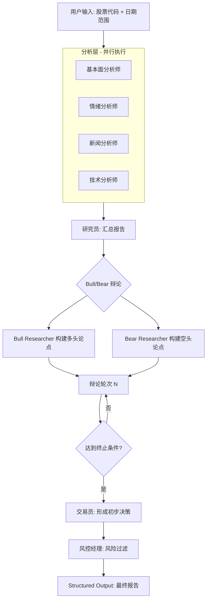
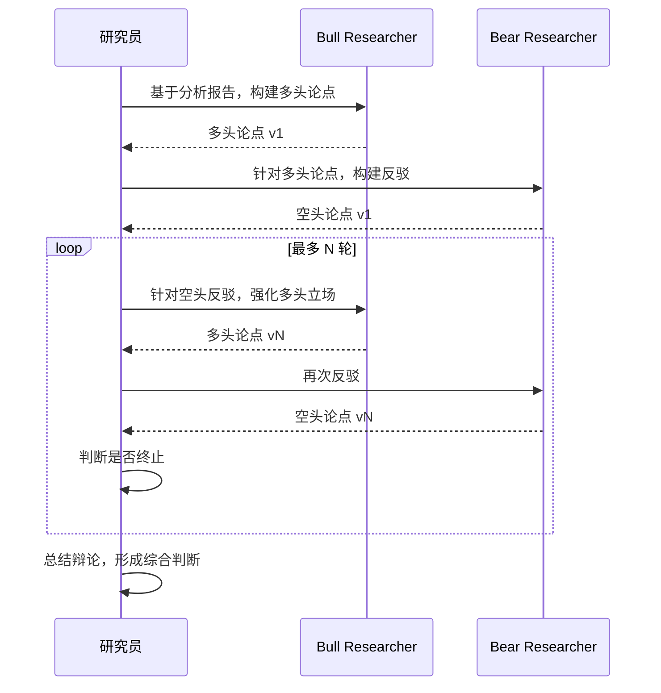

# 7.1 项目一：AI 选股分析师（基于 TradingAgents）

## 一、核心概念

投资分析从来不是单人决策的事。专业的对冲基金会同时配备基本面分析师、技术分析师、新闻事件跟踪员、风控经理，让他们各司其职、相互博弈，最终形成一份有张力的投资判断。这套分工协作的机制之所以有效，是因为单一视角的分析天然存在盲区：纯技术派容易忽视业绩雷，纯基本面派容易错过短期动量信号，而风控经理的存在是为了给所有人兜底。

TradingAgents 的核心洞见就在这里——**用多个专业化 Agent 模拟真实投资团队的角色分工，让不同"专家"在同一标的上独立分析、公开辩论，再由风控层做最终裁决**。这与我们在 Module 5 中学到的 Multi-Agent 层级协作模式高度吻合，但有一个关键差异：TradingAgents 引入了显式的 Bull/Bear 对抗辩论机制，让模型在输出结论前必须经历一轮"唱反调"的压力测试，从而显著减少模型的确认偏误（Confirmation Bias）。

对工程师来说，这个项目的价值不止于选股本身——它是一个**结构完整、可直接改造的 Multi-Agent 生产模板**：LangGraph 状态管理、Pydantic 结构化输出、并发工具调用、人工审批节点，这些第六章讲过的技术在这里都有完整的工程落地示例。

---

## 二、原理深讲

### 7.1.1 项目背景与架构解读

#### TradingAgents 论文核心思想

TradingAgents 发表于 AAAI 2025 Workshop，核心命题是：**LLM 的分析能力在多智能体框架下能否接近甚至超越单一大模型的"全知全能"模式**？

论文的实验结论给出了正面回答——在回测中，多 Agent 协作版本相比单 Agent Baseline 在风险调整收益（Sharpe Ratio）上有显著提升。原因直观：单个 LLM 调用时，提示词需要同时承载"分析基本面 + 读图 + 看情绪 + 做决策"的全部指令，导致注意力分散、推理深度不够；而角色拆分后，每个 Agent 的上下文专注、工具精准，输出质量更高。

这与软件工程里"单一职责原则"的逻辑如出一辙——不要让一个函数做所有事。

#### 五类角色分工

TradingAgents 将分析流程拆解为两层：

**分析层（Analyst Team）** — 并发执行，互不干扰：

| 角色 | 职责 | 主要工具 |
|------|------|----------|
| 基本面分析师 | 财务指标、估值模型、行业比较 | 财报 API、SEC 文件解析 |
| 情绪分析师 | 社交媒体情绪、散户情绪指数 | Reddit/X API、情绪评分模型 |
| 新闻分析师 | 重大事件、政策影响、黑天鹅识别 | 新闻聚合 API、事件提取 |
| 技术分析师 | K 线形态、均线、MACD/RSI 等指标 | Yahoo Finance、TA-Lib |

**决策层（Decision Team）** — 串行执行，有依赖关系：

| 角色 | 职责 |
|------|------|
| 研究员（Researcher） | 汇总分析层报告，主持 Bull/Bear 辩论 |
| 交易员（Trader） | 综合辩论结果形成具体买卖决策 |
| 风控经理（Risk Manager） | 基于风险偏好对决策做最终过滤 |

#### LangGraph 有状态图的应用拆解

TradingAgents 选用 LangGraph 而非简单的函数调用链，核心原因有三：

1. **状态持久化**：分析师的报告需要在多个节点间流转，LangGraph 的 `State` 对象天然承载这种"共享黑板"语义
2. **条件路由**：辩论轮次、风险等级判断都需要动态决定下一步走哪个节点
3. **断点恢复**：长分析链路（通常 8-12 次 LLM 调用）中途失败时，Checkpoint 机制可从断点续跑

整体执行流如下：



**State 结构设计是架构关键**。TradingAgents 的核心 State 大致如下（伪代码）：

```python
class TradingState(TypedDict):
    ticker: str
    date_range: tuple[str, str]
    
    # 分析层输出（并发写入）
    fundamentals_report: str
    sentiment_report: str
    news_report: str
    technical_report: str
    
    # 决策层流转
    bull_argument: str
    bear_argument: str
    debate_rounds: int
    
    # 最终决策
    trader_decision: TraderDecision  # Pydantic model
    risk_level: RiskProfile
    final_signal: Literal["BUY", "HOLD", "SELL"]
    rationale: str
```

---

### 7.1.3 核心模块精读与改造

#### Analyst Team：工具注册与并发分析机制

分析师节点本质上是"工具调用密集型 Agent"。每个分析师节点绑定一组专属工具，LangGraph 通过将这些节点配置为 `Send()` API 实现真正的并发：

```python
# 伪代码：并发分发到四个分析师
def dispatch_analysts(state: TradingState):
    return [
        Send("fundamentals_analyst", state),
        Send("sentiment_analyst", state),
        Send("news_analyst", state),
        Send("technical_analyst", state),
    ]
```

`Send()` 是 LangGraph 中实现 Map-Reduce 模式的核心原语——它将同一个 State 分发给多个节点并行处理，各节点的输出最终在 Reduce 节点（研究员）中合并。

**工具注册的最佳实践**：每个分析师对应的工具集应该尽量精简，不要把所有工具都暴露给所有 Agent。情绪分析师不需要访问财报 API，基本面分析师不需要看 Reddit。工具范围越小，模型的工具选择错误率越低。

#### Bull vs Bear 辩论机制

这是 TradingAgents 最有特色的设计。辩论不是简单地让两个 Agent 轮流发言，而是有明确的**角色约束**：

- **Bull Researcher** 被系统提示词强制要求"只输出支持做多的论据，哪怕你内心不认同"
- **Bear Researcher** 同理，被强制充当空头

这种"强制角色扮演"的设计目的是打破 LLM 的默认倾向——大模型在没有约束时会倾向于输出"中庸"结论，而刻意的对立角色能逼出更有深度的分析。

辩论的终止条件有两个，满足其一即退出：
1. 达到最大辩论轮次（通常设为 3 轮）
2. 研究员判断双方论点已充分展开（LLM 自判）



#### Risk Management：三种风险偏好实现

风控经理节点接收交易员的初步决策，并根据预设的风险偏好做修正。三种风险偏好对应不同的决策约束：

| 风险偏好 | 行为特征 | 实现机制 |
|----------|----------|----------|
| 激进（Aggressive） | 容忍高波动，追求超额收益 | 系统提示词偏向放行，阈值宽松 |
| 中性（Neutral） | 平衡风险收益 | 默认行为，无额外偏置 |
| 保守（Conservative） | 优先保本，强烈拒绝高风险操作 | 系统提示词包含严格的拒绝条件列表 |

**工程实现细节**：风险偏好不应硬编码在提示词字符串里，而应作为配置项传入 State，由风控节点在运行时动态构建提示词。这样同一套代码可以通过配置文件切换风险偏好，而无需修改任何业务逻辑。

#### Structured Output：Pydantic Schema 约束决策输出

最终决策必须结构化，否则无法被下游系统消费（回测框架、通知系统、日志库）。TradingAgents 使用 Pydantic 模型约束每个关键节点的输出：

```python
from pydantic import BaseModel, Field
from typing import Literal

class TraderDecision(BaseModel):
    signal: Literal["BUY", "HOLD", "SELL"]
    confidence: float = Field(ge=0.0, le=1.0, description="决策置信度 0-1")
    position_size: float = Field(ge=0.0, le=1.0, description="建议仓位比例")
    stop_loss_pct: float = Field(description="建议止损比例，如 0.05 代表 5%")
    take_profit_pct: float = Field(description="建议止盈比例")
    primary_reasoning: str = Field(description="最核心的决策依据，100字以内")
    key_risks: list[str] = Field(description="主要风险点，最多3条")
```

通过 `model.with_structured_output(TraderDecision)` 调用，LangGraph 节点的输出直接是类型安全的 Pydantic 对象，消除了下游解析的不确定性。

---

### 7.1.5 延伸思考

#### 如何评估 Agent 选股决策的质量

"Agent 说买就买"这种信任方式不可行——必须有量化的评估体系。接入回测框架是评估选股 Agent 质量的标准路径：

**评估维度**：

| 指标 | 含义 | 工具 |
|------|------|------|
| Sharpe Ratio | 风险调整收益 | backtrader / vectorbt |
| Max Drawdown | 最大回撤，衡量尾部风险 | 同上 |
| Win Rate | 决策胜率 | 自行统计 |
| Signal Calibration | 置信度与实际收益的相关性 | scipy 统计 |

回测流程建议：先在历史数据上跑 paper trading（模拟交易不动真钱），积累 50+ 个独立决策样本后再做统计分析。样本量太少时的回测结论不可信。

**一个常被忽略的评估盲区**：Agent 的"HOLD"决策也需要评估。如果 Agent 在大涨前频繁输出 HOLD，这和频繁输出错误的 BUY/SELL 一样有问题，但很多评估框架只统计 BUY/SELL 决策的准确率。

#### 生产化改造：定时任务 + 结果推送 + 决策日志

将 TradingAgents 从实验推向生产，核心改造点有三处：

**1. 定时触发**：使用 APScheduler（单机）或 Celery Beat（分布式）在每日收盘后（A 股 15:30，美股 16:00 ET）自动触发分析流程。需要注意节假日跳过逻辑——直接用交易日历库（`trading_calendars`）而非手写日期判断。

**2. 结果推送**：分析报告通过 Webhook 推送到飞书/钉钉/Slack。推送内容不要直接发原始 JSON——用模板渲染成可读的 Markdown 报告，包含信号、置信度、核心理由三行核心信息，详细报告附链接。

**3. 决策日志**：这是生产化最关键但最容易被忽视的环节。每次 Agent 决策必须完整记录：输入参数、各分析师报告原文、辩论过程、最终决策、时间戳。推荐写入 PostgreSQL 并接入 LangFuse Trace，这样事后既能做人工复盘，也能作为后续微调的训练数据。

---

## 三、工程视角：常见误区与最佳实践

**误区一：把 TradingAgents 当成真实交易系统直接使用**
→ **正确做法**：TradingAgents 是研究原型，不是生产级交易系统。它没有实盘接口、没有风控熔断、没有合规审计。如果要接入真实资金，必须在外层套一层规则防护：单笔上限、单日决策数量上限、人工审批节点。任何 AI 系统都不应该在没有人工监督的情况下执行真实资金操作。

**误区二：并发分析师的结果直接拼接给研究员**
→ **正确做法**：四个分析师的报告长度加总很容易超过 8000 Token，直接拼接会导致研究员的上下文中充斥无关信息。正确的做法是在研究员节点前增加一个"报告摘要"步骤，对每份分析报告做压缩（保留关键结论和数据点，去除冗余推导过程），再合并给研究员。这一步通常能将 Token 消耗降低 40-60%。

**误区三：辩论轮次越多质量越好**
→ **正确做法**：实验表明辩论超过 3 轮后，Bull/Bear 的论点开始出现大量重复，质量收益边际递减，但 Token 消耗线性增长。对大多数股票的日内分析，2-3 轮辩论是性价比最优的选择。只有对重大投资决策（如季报后的大幅调仓），才值得开启 5 轮以上辩论。

**误区四：Structured Output 的字段设计贪多求全**
→ **正确做法**：`TraderDecision` 模型不要超过 8 个字段。字段越多，LLM 填充时出现逻辑矛盾的概率越高（例如 `signal=BUY` 但 `confidence=0.2`）。先用最小可行字段集跑通流程，根据实际业务需求再迭代增加。每增加一个字段，都要同步增加对应的 Pydantic 校验规则（`Field(ge=..., le=...)`）。

**误区五：用单一股票验证后就认为系统"有效"**
→ **正确做法**：LLM 在热门股（NVDA、TSLA）上有更丰富的训练数据，表现会显著好于冷门股。测试集必须包含不同市值、不同行业、不同市场环境（牛市/熊市/震荡）的标的组合，至少覆盖 20 只以上股票的 6 个月历史决策才能得出有统计意义的评估结论。

---

## 四、延伸思考

> 🤔 思考题一：TradingAgents 的 Bull/Bear 辩论机制假设"对立论点能提升决策质量"，但这在认知科学上并非总是成立——有时强制对立反而会引导模型走向极端立场。你认为在什么类型的投资决策场景中，这种辩论机制的效果最好？什么场景下它可能适得其反？

> 🤔 思考题二：当前 TradingAgents 的评估依赖历史回测，但历史数据存在"幸存者偏差"和"未来函数"两大陷阱。如果你要为这套系统设计一个更严谨的 Forward Testing（前向测试）方案，使得测试过程不泄露未来信息，应该如何设计数据流水线和评估基础设施？

