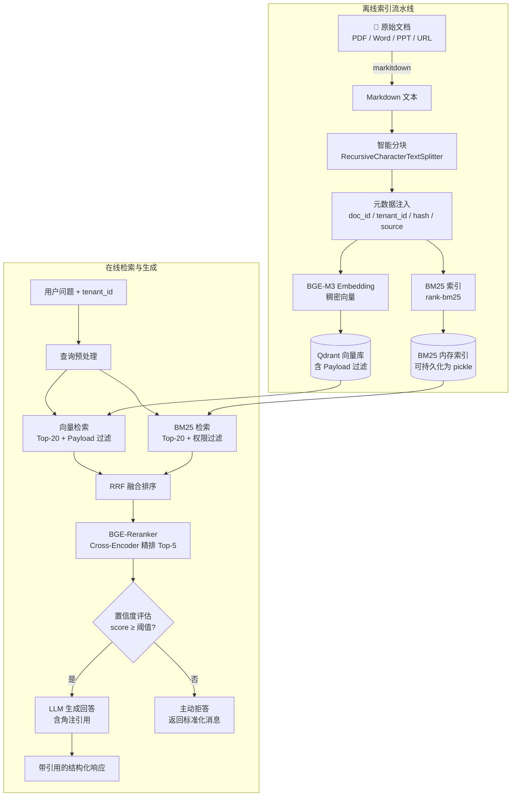

# 7.2 项目二：企业知识库智能问答

---

## 实验目标

本节结束后，你将能够：

1. **搭建完整的多格式文档处理流水线**：支持 PDF、Word、PPT、网页统一解析，并实现基于文件哈希的增量同步，避免重复索引。
2. **实现生产可用的混合检索层**：将 BM25 关键词检索与稠密向量检索通过 RRF 算法融合，再接 BGE-Reranker 精排，并在 Qdrant Payload 层实现多租户权限过滤，检索精度相比 Naive RAG 提升约 30–40%。
3. **生成带段落级角注引用的回答，并具备主动拒答能力**：当检索结果置信度不足时，系统不编造答案，而是明确告知用户"无法从现有文档中找到答案"，将幻觉率控制在可接受范围内。

核心学习点：**混合检索融合（RRF）**、**基于 Metadata 的多租户权限隔离**、**引用追踪与置信度拒答**。

---

## 架构总览



---

## 环境准备

```bash
# 创建虚拟环境（uv）
uv venv --python 3.11
source .venv/bin/activate  # Windows: .venv\Scripts\activate

# 安装依赖（锁定版本）
uv pip install \
    markitdown[all]==0.1.1 \
    qdrant-client==1.9.1 \
    fastembed==0.3.3 \
    rank-bm25==0.2.2 \
    sentence-transformers==3.0.1 \
    openai==1.35.0 \
    langchain-text-splitters==0.2.2 \
    python-dotenv==1.0.1 \
    httpx==0.27.0 \
    pydantic==2.7.4 \
    fastapi==0.111.0 \
    uvicorn==0.30.1 \
    tqdm==4.66.4 \
    diskcache==5.6.3
```

> Colab 用户：
> ```python
> !pip install markitdown[all]==0.1.1 qdrant-client==1.9.1 fastembed==0.3.3 \
>     rank-bm25==0.2.2 sentence-transformers==3.0.1 openai==1.35.0 \
>     langchain-text-splitters==0.2.2 python-dotenv==1.0.1 tqdm==4.66.4
> ```
> Colab 默认已有 Python 3.10+，无需创建虚拟环境。

```bash
# 启动本地 Qdrant（需要 Docker）
docker run -d --name qdrant -p 6333:6333 -p 6334:6334 \
    -v $(pwd)/qdrant_data:/qdrant/storage \
    qdrant/qdrant:v1.9.4

# 创建 .env 文件
cat > .env << 'EOF'
OPENAI_API_KEY=sk-...
QDRANT_URL=http://localhost:6333
QDRANT_COLLECTION=enterprise_kb
# 使用 DeepSeek 可替换：
# OPENAI_BASE_URL=https://api.deepseek.com/v1
# OPENAI_MODEL=deepseek-chat
EOF
```

> ⚠️ **生产注意**：Colab 环境无法运行 Docker，可改用 Qdrant Cloud 免费集群（qdrant.io），将 QDRANT_URL 替换为云端 URL 并添加 QDRANT_API_KEY。

---

## Step-by-Step 实现

### Step 1：统一文档解析器

**目标**：用 markitdown 将 PDF / Word / PPT / 网页统一转换为 Markdown 文本，并计算文件哈希用于增量更新判断。

markitdown 的核心价值在于它不只是提取纯文本——它保留了标题层级、表格结构、列表格式等语义信息，这些结构对后续分块策略和引用定位至关重要。

```python
# document_parser.py
"""
统一文档解析模块
支持 PDF / DOCX / PPTX / HTML / URL，输出标准化 ParsedDocument
"""
from __future__ import annotations

import hashlib
import re
from dataclasses import dataclass, field
from pathlib import Path
from typing import Literal
from urllib.parse import urlparse

from markitdown import MarkItDown


DocumentType = Literal["pdf", "docx", "pptx", "html", "url", "txt", "unknown"]


@dataclass
class ParsedDocument:
    """解析后的文档，包含内容与完整元数据。"""
    content: str                          # Markdown 格式的正文
    source: str                           # 原始文件路径或 URL
    doc_type: DocumentType                # 文档类型
    file_hash: str                        # SHA256 哈希，用于增量更新
    title: str = ""                       # 文档标题（从文件名或一级标题提取）
    metadata: dict = field(default_factory=dict)  # 扩展元数据（tenant_id 等）


def _compute_hash(source: str | Path) -> str:
    """计算文件 SHA256 或 URL 的哈希（URL 则 hash 其字节串）。"""
    if isinstance(source, Path) and source.exists():
        sha256 = hashlib.sha256()
        with open(source, "rb") as f:
            for chunk in iter(lambda: f.read(8192), b""):
                sha256.update(chunk)
        return sha256.hexdigest()
    # URL 或不存在的路径：hash 字符串本身
    return hashlib.sha256(str(source).encode()).hexdigest()


def _detect_type(source: str | Path) -> DocumentType:
    """根据扩展名或 URL scheme 推断文档类型。"""
    s = str(source).lower()
    if s.startswith("http://") or s.startswith("https://"):
        return "url"
    suffix = Path(s).suffix.lstrip(".")
    return suffix if suffix in ("pdf", "docx", "pptx", "html", "txt") else "unknown"  # type: ignore


def _extract_title(source: str | Path, content: str) -> str:
    """优先从 Markdown 一级标题提取，fallback 到文件名。"""
    match = re.search(r"^#\s+(.+)$", content, re.MULTILINE)
    if match:
        return match.group(1).strip()
    if isinstance(source, Path):
        return source.stem.replace("_", " ").replace("-", " ").title()
    # URL：取路径最后一段
    path = urlparse(str(source)).path.rstrip("/")
    return path.split("/")[-1] or str(source)


class DocumentParser:
    """
    基于 markitdown 的统一文档解析器。

    markitdown 内部会根据 MIME 类型自动选择解析器：
    - PDF → pdfminer 文本提取
    - DOCX → python-docx
    - PPTX → python-pptx（逐 slide 提取文字 + 备注）
    - HTML/URL → BeautifulSoup 清洗
    """

    def __init__(self) -> None:
        self._md = MarkItDown()

    def parse(
        self,
        source: str | Path,
        tenant_id: str = "default",
        extra_metadata: dict | None = None,
    ) -> ParsedDocument:
        """
        解析单个文档。

        Args:
            source: 文件路径或 URL。
            tenant_id: 租户标识，写入元数据用于权限隔离。
            extra_metadata: 额外元数据（如部门、密级）。

        Returns:
            ParsedDocument，content 为 Markdown 字符串。
        """
        source = Path(source) if not str(source).startswith("http") else str(source)
        doc_type = _detect_type(source)
        file_hash = _compute_hash(source)

        result = self._md.convert(str(source))
        content: str = result.text_content or ""

        # markitdown 解析结果可能含大量连续空行，压缩处理
        content = re.sub(r"\n{3,}", "\n\n", content).strip()

        title = _extract_title(source, content)

        metadata: dict = {
            "tenant_id": tenant_id,
            "doc_type": doc_type,
            **(extra_metadata or {}),
        }

        return ParsedDocument(
            content=content,
            source=str(source),
            doc_type=doc_type,
            file_hash=file_hash,
            title=title,
            metadata=metadata,
        )

    def parse_batch(
        self,
        sources: list[str | Path],
        tenant_id: str = "default",
        extra_metadata: dict | None = None,
    ) -> list[ParsedDocument]:
        """批量解析，遇到单文件错误跳过并记录日志。"""
        import logging
        results = []
        for src in sources:
            try:
                results.append(self.parse(src, tenant_id, extra_metadata))
            except Exception as exc:
                logging.warning(f"解析失败 {src}: {exc}")
        return results
```

**关键点**：
- `file_hash` 是增量更新的关键。下一步的索引器在写入前会先查询 Qdrant 中是否已有相同 hash 的文档，有则跳过，从而避免重复索引。
- markitdown 对 PPTX 会将每张幻灯片的标题 + 正文 + 备注拼接为 Markdown，保留了大纲层级，比直接用 python-pptx 读纯文本语义更丰富。
- ⚠️ PDF 扫描件（非可搜索 PDF）markitdown 无法提取文字，生产环境需先走 OCR（如 paddleocr）转为文字 PDF 再解析。

---

### Step 2：语义分块与元数据注入

**目标**：将长文档切分为语义连贯的 Chunk，并为每个 Chunk 注入来源追踪所需的完整元数据，这是后续引用角注的数据基础。

分块策略直接影响检索质量。固定 512 字符切法会截断句子；按句子切法遇到长句又会让 Chunk 过小。这里采用 LangChain 的 `RecursiveCharacterTextSplitter`，按段落 → 句子 → 字符层级递归切分，是目前工程实践中最稳健的通用选择。

```python
# chunker.py
"""
文档分块模块：将 ParsedDocument 切分为带元数据的 Chunk 列表。
"""
from __future__ import annotations

import uuid
from dataclasses import dataclass, field

from langchain_text_splitters import RecursiveCharacterTextSplitter

from document_parser import ParsedDocument


@dataclass
class DocumentChunk:
    """单个文档块，携带完整溯源信息。"""
    chunk_id: str          # UUID，Qdrant point ID
    content: str           # 块文本
    source: str            # 原始文件路径/URL
    title: str             # 所属文档标题
    chunk_index: int       # 在文档内的顺序编号（从 0 开始）
    total_chunks: int      # 文档总块数
    file_hash: str         # 文档哈希，与 ParsedDocument 一致
    tenant_id: str         # 租户 ID
    doc_type: str          # 文档类型
    extra_metadata: dict = field(default_factory=dict)


# 分块参数经验值：
# chunk_size=512：在 BGE-M3 512 token 限制内，实测效果好
# chunk_overlap=64：约 12% 重叠，防止关键信息被边界截断
_SPLITTER = RecursiveCharacterTextSplitter(
    chunk_size=512,
    chunk_overlap=64,
    # 按 Markdown 语义层级递归切分
    separators=["\n## ", "\n### ", "\n#### ", "\n\n", "\n", "。", "！", "？", " ", ""],
    length_function=len,
)


def chunk_document(doc: ParsedDocument) -> list[DocumentChunk]:
    """
    将 ParsedDocument 切分为 DocumentChunk 列表。

    每个 Chunk 包含来源文档的完整溯源链路，确保引用可追踪。
    """
    raw_chunks: list[str] = _SPLITTER.split_text(doc.content)
    total = len(raw_chunks)

    chunks: list[DocumentChunk] = []
    for idx, text in enumerate(raw_chunks):
        chunk = DocumentChunk(
            chunk_id=str(uuid.uuid4()),
            content=text,
            source=doc.source,
            title=doc.title,
            chunk_index=idx,
            total_chunks=total,
            file_hash=doc.file_hash,
            tenant_id=doc.metadata.get("tenant_id", "default"),
            doc_type=doc.metadata.get("doc_type", "unknown"),
            extra_metadata={
                k: v for k, v in doc.metadata.items()
                if k not in ("tenant_id", "doc_type")
            },
        )
        chunks.append(chunk)

    return chunks
```

**关键点**：
- `separators` 中 `"\n## "` 优先级最高，确保 Markdown 二级标题不会被切断在块中间——这对保持语义完整性至关重要。
- `chunk_id` 使用 UUID4 作为 Qdrant 的 Point ID，而不是自增整数，是为了支持分布式环境下多进程并发写入不冲突。
- ⚠️ chunk_size 以**字符数**而非 Token 数计算，中文字符约 1.5–2 个 char 对应 1 个 BGE token。如文档以英文为主，可适当提高到 800–1000。

---

### Step 3：向量索引器（含增量更新逻辑）

**目标**：将 Chunk 写入 Qdrant 向量数据库，并通过哈希比对实现增量更新——只索引新增或变更的文档，跳过未变更的文档。

```python
# indexer.py
"""
向量索引模块：Chunk 向量化 → 写入 Qdrant，支持增量更新。
"""
from __future__ import annotations

import os
from typing import Any

from dotenv import load_dotenv
from fastembed import TextEmbedding
from qdrant_client import QdrantClient
from qdrant_client.http.models import (
    Distance,
    FieldCondition,
    Filter,
    MatchValue,
    PointStruct,
    VectorParams,
)
from tqdm import tqdm

from chunker import DocumentChunk

load_dotenv()

# fastembed 会自动下载并缓存模型到 ~/.cache/fastembed/
# BGE-M3 是目前中英混合场景下性价比最高的 Embedding 模型：
# - 支持 512 token，1024 维稠密向量
# - 中文理解能力与 text-embedding-3-large 相当，本地运行无 API 成本
_EMBED_MODEL = "BAAI/bge-m3"
_VECTOR_DIM = 1024


class VectorIndexer:
    """
    Qdrant 向量索引器。

    核心设计：以 file_hash + tenant_id 作为"已索引"判断依据，
    实现文档级别的幂等增量更新。
    """

    def __init__(
        self,
        collection_name: str | None = None,
        qdrant_url: str | None = None,
    ) -> None:
        self.collection_name = collection_name or os.getenv(
            "QDRANT_COLLECTION", "enterprise_kb"
        )
        self._client = QdrantClient(
            url=qdrant_url or os.getenv("QDRANT_URL", "http://localhost:6333"),
            api_key=os.getenv("QDRANT_API_KEY"),  # Cloud 模式时需要
        )
        self._embedder = TextEmbedding(model_name=_EMBED_MODEL)
        self._ensure_collection()

    def _ensure_collection(self) -> None:
        """若 Collection 不存在则创建，已存在则跳过（幂等）。"""
        existing = {c.name for c in self._client.get_collections().collections}
        if self.collection_name not in existing:
            self._client.create_collection(
                collection_name=self.collection_name,
                vectors_config=VectorParams(
                    size=_VECTOR_DIM,
                    distance=Distance.COSINE,
                ),
            )
            # 为常用过滤字段建立 payload 索引，大幅加速带过滤的检索
            for field_name in ("tenant_id", "file_hash", "doc_type"):
                self._client.create_payload_index(
                    collection_name=self.collection_name,
                    field_name=field_name,
                    field_schema="keyword",
                )

    def _is_already_indexed(self, file_hash: str, tenant_id: str) -> bool:
        """
        通过 Payload 过滤检查该文件是否已索引。

        注意：用 scroll（而非 search）是因为我们不需要相似度排序，
        只需确认存在性，scroll 更高效。
        """
        results, _ = self._client.scroll(
            collection_name=self.collection_name,
            scroll_filter=Filter(
                must=[
                    FieldCondition(key="file_hash", match=MatchValue(value=file_hash)),
                    FieldCondition(key="tenant_id", match=MatchValue(value=tenant_id)),
                ]
            ),
            limit=1,
            with_payload=False,
            with_vectors=False,
        )
        return len(results) > 0

    def _delete_by_hash(self, file_hash: str, tenant_id: str) -> None:
        """删除旧版本文档的所有 Chunk（用于文档更新场景）。"""
        self._client.delete(
            collection_name=self.collection_name,
            points_selector=Filter(
                must=[
                    FieldCondition(key="file_hash", match=MatchValue(value=file_hash)),
                    FieldCondition(key="tenant_id", match=MatchValue(value=tenant_id)),
                ]
            ),
        )

    def index_chunks(
        self,
        chunks: list[DocumentChunk],
        batch_size: int = 64,
        force_reindex: bool = False,
    ) -> dict[str, int]:
        """
        批量索引 Chunk 列表。

        Args:
            chunks: 待索引的 Chunk 列表（通常来自同一文档）。
            batch_size: 每批向量化 + 写入的 Chunk 数量。
                       64 是在内存与速度之间的经验最优值。
            force_reindex: 强制重新索引，忽略哈希检查。

        Returns:
            统计字典：{"indexed": N, "skipped": M}
        """
        if not chunks:
            return {"indexed": 0, "skipped": 0}

        # 用第一个 Chunk 的 hash 代表整个文档（同文档所有 Chunk hash 相同）
        file_hash = chunks[0].file_hash
        tenant_id = chunks[0].tenant_id

        if not force_reindex and self._is_already_indexed(file_hash, tenant_id):
            return {"indexed": 0, "skipped": len(chunks)}

        # 如果是文档更新（hash 变了但 source 相同），先删旧数据
        # 实际生产中可通过 source 路径检索旧 hash，这里简化处理
        stats = {"indexed": 0, "skipped": 0}

        for i in tqdm(range(0, len(chunks), batch_size), desc="索引中", unit="batch"):
            batch = chunks[i : i + batch_size]
            texts = [c.content for c in batch]

            # fastembed 返回 generator，list() 触发计算
            embeddings = list(self._embedder.embed(texts))

            points = [
                PointStruct(
                    id=chunk.chunk_id,
                    vector=emb.tolist(),
                    payload=self._chunk_to_payload(chunk),
                )
                for chunk, emb in zip(batch, embeddings)
            ]

            self._client.upsert(
                collection_name=self.collection_name,
                points=points,
            )
            stats["indexed"] += len(batch)

        return stats

    @staticmethod
    def _chunk_to_payload(chunk: DocumentChunk) -> dict[str, Any]:
        """将 DocumentChunk 转为 Qdrant Payload（所有字段均可过滤）。"""
        return {
            "content": chunk.content,
            "source": chunk.source,
            "title": chunk.title,
            "chunk_index": chunk.chunk_index,
            "total_chunks": chunk.total_chunks,
            "file_hash": chunk.file_hash,
            "tenant_id": chunk.tenant_id,
            "doc_type": chunk.doc_type,
            **chunk.extra_metadata,
        }
```

**关键点**：
- `_is_already_indexed` 用 `scroll` 而非 `search` 检查存在性，避免引入无意义的相似度计算。
- Payload 索引（`create_payload_index`）对 `tenant_id`、`file_hash` 建立关键词索引，当 Collection 超过 10 万条时，带过滤的检索性能差异可达 10x 以上。
- ⚠️ `batch_size=64` 在 16GB 内存机器上安全；如果文档 Chunk 很多（>10万），建议改为异步批量写入或使用 Qdrant 的 upload_collection 接口。

---

### Step 4：混合检索器（BM25 + 向量 + RRF 融合）

**目标**：实现稠密检索（语义）+ 稀疏检索（关键词）双路并行，通过 RRF（Reciprocal Rank Fusion）融合，再经 BGE-Reranker 精排，并强制注入 tenant_id 权限过滤。

**为什么需要混合检索**：向量检索擅长语义理解，但对专有名词、缩写、产品型号等精确匹配很差（例如"GPT-4o 和 GPT-4 Turbo 有何区别"，向量检索可能把两者都当成语义相近而混淆）；BM25 擅长关键词精确匹配，但完全不理解语义。两者互补，混合后效果在绝大多数企业知识库场景下优于单路检索。

```python
# retriever.py
"""
混合检索模块：BM25 + 稠密向量检索，RRF 融合，BGE-Reranker 精排。
权限过滤在向量检索层（Qdrant Payload 过滤）和 BM25 层同时执行。
"""
from __future__ import annotations

import math
import pickle
from dataclasses import dataclass
from pathlib import Path
from typing import Any

from fastembed import TextEmbedding
from qdrant_client import QdrantClient
from qdrant_client.http.models import FieldCondition, Filter, MatchValue
from rank_bm25 import BM25Okapi
from sentence_transformers import CrossEncoder


@dataclass
class RetrievedChunk:
    """检索结果，包含内容、来源、融合得分。"""
    chunk_id: str
    content: str
    source: str
    title: str
    chunk_index: int
    total_chunks: int
    tenant_id: str
    rrf_score: float       # RRF 融合后的得分（越高越相关）
    rerank_score: float    # Cross-Encoder 精排得分（-inf to +inf，>0 表示相关）


# RRF 融合常数 k=60 来自 Cormack et al. 2009 论文推荐值
# 实践中 k 在 40–100 之间效果差异不大
_RRF_K = 60

# BGE-Reranker-v2-m3 是目前中英混合场景最强的开源 Cross-Encoder
# 首次运行会自动下载（约 568MB）
_RERANKER_MODEL = "BAAI/bge-reranker-v2-m3"


class HybridRetriever:
    """
    混合检索器：三阶段检索流水线。
    
    阶段一：向量检索（Qdrant） + BM25 检索 并行执行，各取 Top-K
    阶段二：RRF 融合排序
    阶段三：BGE-Reranker Cross-Encoder 精排，输出最终 Top-N
    """

    def __init__(
        self,
        collection_name: str,
        qdrant_client: QdrantClient,
        bm25_index_path: str | Path | None = None,
    ) -> None:
        self.collection_name = collection_name
        self._client = qdrant_client
        self._embedder = TextEmbedding(model_name="BAAI/bge-m3")
        self._reranker = CrossEncoder(_RERANKER_MODEL)

        # BM25 索引：可从磁盘加载或后续通过 build_bm25 方法构建
        self._bm25: BM25Okapi | None = None
        self._bm25_corpus: list[dict[str, Any]] = []  # 存储对应的 payload

        if bm25_index_path and Path(bm25_index_path).exists():
            self._load_bm25(bm25_index_path)

    def build_bm25_from_qdrant(self, tenant_id: str | None = None) -> None:
        """
        从 Qdrant 中拉取所有 Chunk 构建 BM25 内存索引。

        生产建议：在索引完成后调用一次，结果序列化为 pickle 持久化，
        服务启动时加载，避免每次重建（万条数据约需 3-5 秒）。
        """
        all_chunks: list[dict[str, Any]] = []
        offset = None

        # 构建过滤条件（如指定 tenant_id 则只拉该租户数据）
        scroll_filter = None
        if tenant_id:
            scroll_filter = Filter(
                must=[FieldCondition(key="tenant_id", match=MatchValue(value=tenant_id))]
            )

        while True:
            results, next_offset = self._client.scroll(
                collection_name=self.collection_name,
                scroll_filter=scroll_filter,
                limit=1000,
                offset=offset,
                with_payload=True,
                with_vectors=False,
            )
            all_chunks.extend([r.payload for r in results])
            if next_offset is None:
                break
            offset = next_offset

        # BM25Okapi 需要预先分词，中文按字符级别分词
        # 生产环境建议接入 jieba 分词提升中文检索质量
        tokenized = [self._tokenize(c.get("content", "")) for c in all_chunks]
        self._bm25 = BM25Okapi(tokenized)
        self._bm25_corpus = all_chunks

    def save_bm25(self, path: str | Path) -> None:
        """持久化 BM25 索引到磁盘。"""
        with open(path, "wb") as f:
            pickle.dump({"bm25": self._bm25, "corpus": self._bm25_corpus}, f)

    def _load_bm25(self, path: str | Path) -> None:
        with open(path, "rb") as f:
            data = pickle.load(f)
        self._bm25 = data["bm25"]
        self._bm25_corpus = data["corpus"]

    @staticmethod
    def _tokenize(text: str) -> list[str]:
        """
        简单分词：按空格 + 标点切分，保留中文字符。
        生产环境替换为 jieba.cut(text) 效果更佳。
        """
        import re
        tokens = re.findall(r"[\w\u4e00-\u9fff]+", text.lower())
        return tokens

    def _dense_search(
        self, query: str, tenant_id: str, top_k: int
    ) -> list[tuple[str, float]]:
        """
        稠密向量检索，返回 (chunk_id, score) 列表。
        Qdrant Payload 过滤在向量索引层执行，性能接近无过滤。
        """
        query_vec = list(self._embedder.embed([query]))[0].tolist()

        results = self._client.search(
            collection_name=self.collection_name,
            query_vector=query_vec,
            query_filter=Filter(
                must=[FieldCondition(key="tenant_id", match=MatchValue(value=tenant_id))]
            ),
            limit=top_k,
            with_payload=True,
        )
        return [(r.id, r.score, r.payload) for r in results]

    def _bm25_search(
        self, query: str, tenant_id: str, top_k: int
    ) -> list[tuple[str, float, dict]]:
        """
        BM25 关键词检索，在内存索引上执行后按 tenant_id 过滤。

        注意：BM25 过滤在检索后执行（post-filtering），
        这是 BM25 内存索引不支持像 Qdrant 那样预过滤的无奈之举。
        生产环境数据量大时，建议为每个租户单独维护一个 BM25 索引。
        """
        if self._bm25 is None:
            return []

        tokens = self._tokenize(query)
        scores = self._bm25.get_scores(tokens)

        # 按 tenant_id 过滤 + 取 Top-K
        scored_chunks = [
            (self._bm25_corpus[i].get("chunk_id", str(i)), scores[i], self._bm25_corpus[i])
            for i in range(len(scores))
            if self._bm25_corpus[i].get("tenant_id") == tenant_id
        ]
        scored_chunks.sort(key=lambda x: x[1], reverse=True)
        return scored_chunks[:top_k]

    @staticmethod
    def _rrf_fusion(
        dense_results: list[tuple],
        bm25_results: list[tuple],
        k: int = _RRF_K,
    ) -> list[tuple[str, float, dict]]:
        """
        RRF（Reciprocal Rank Fusion）融合两路检索结果。

        RRF 公式：score(d) = Σ 1 / (k + rank_i(d))
        k=60 是经验最优值，能有效压制低秩结果的影响。
        """
        rrf_scores: dict[str, float] = {}
        payloads: dict[str, dict] = {}

        for rank, (chunk_id, _score, payload) in enumerate(dense_results):
            rrf_scores[chunk_id] = rrf_scores.get(chunk_id, 0) + 1 / (k + rank + 1)
            payloads[chunk_id] = payload

        for rank, (chunk_id, _score, payload) in enumerate(bm25_results):
            rrf_scores[chunk_id] = rrf_scores.get(chunk_id, 0) + 1 / (k + rank + 1)
            payloads[chunk_id] = payload

        sorted_results = sorted(rrf_scores.items(), key=lambda x: x[1], reverse=True)
        return [(chunk_id, score, payloads[chunk_id]) for chunk_id, score in sorted_results]

    def retrieve(
        self,
        query: str,
        tenant_id: str,
        top_k_per_source: int = 20,
        final_top_n: int = 5,
    ) -> list[RetrievedChunk]:
        """
        三阶段混合检索主入口。

        Args:
            query: 用户问题。
            tenant_id: 租户 ID，强制权限隔离。
            top_k_per_source: 每路检索召回数量（向量和 BM25 各取 K 条）。
            final_top_n: Reranker 精排后返回的最终数量。

        Returns:
            按 rerank_score 降序排列的 RetrievedChunk 列表。
        """
        # 阶段一：双路并行检索
        dense_results = self._dense_search(query, tenant_id, top_k_per_source)
        bm25_results = self._bm25_search(query, tenant_id, top_k_per_source)

        # 阶段二：RRF 融合
        fused = self._rrf_fusion(dense_results, bm25_results)

        # 取 RRF Top-(final_top_n * 3) 送入 Reranker（避免 Reranker 计算量过大）
        rerank_candidates = fused[: final_top_n * 3]
        if not rerank_candidates:
            return []

        # 阶段三：Cross-Encoder 精排
        pairs = [(query, c[2].get("content", "")) for c in rerank_candidates]
        rerank_scores: list[float] = self._reranker.predict(pairs).tolist()

        # 合并结果并按 rerank_score 排序
        scored = sorted(
            zip(rerank_candidates, rerank_scores),
            key=lambda x: x[1],
            reverse=True,
        )

        results: list[RetrievedChunk] = []
        for (chunk_id, rrf_score, payload), rerank_score in scored[:final_top_n]:
            results.append(
                RetrievedChunk(
                    chunk_id=str(chunk_id),
                    content=payload.get("content", ""),
                    source=payload.get("source", ""),
                    title=payload.get("title", ""),
                    chunk_index=payload.get("chunk_index", 0),
                    total_chunks=payload.get("total_chunks", 1),
                    tenant_id=payload.get("tenant_id", tenant_id),
                    rrf_score=rrf_score,
                    rerank_score=rerank_score,
                )
            )
        return results
```

**关键点**：
- **权限隔离双重保障**：向量检索在 Qdrant Payload 层过滤（数据库层），BM25 在内存中 post-filter（应用层），两路都保证了 tenant_id 隔离，彻底消除跨租户数据泄露风险。
- **RRF 不依赖原始分值**：不同检索系统的分值量纲不同（cosine similarity 在 0-1，BM25 分值可能是 0-50），直接加权融合会导致分值高的系统主导结果。RRF 只用排名（rank），避免了这一问题。
- ⚠️ BM25 内存索引随租户数据量线性增长。百万级 Chunk 占用约 2-4GB 内存，需评估服务器配置。超过 500 万条建议改用 Elasticsearch 的 BM25 接口。

---

### Step 5：生成器（带角注引用 + 置信度拒答）

**目标**：基于检索到的 Chunk 生成回答，在回答文本中嵌入角注引用编号，并在 Reranker 置信度低于阈值时主动拒答而非编造内容。

```python
# generator.py
"""
LLM 生成模块：基于检索结果生成带角注引用的回答，支持置信度拒答。
"""
from __future__ import annotations

import os
from dataclasses import dataclass, field

from dotenv import load_dotenv
from openai import OpenAI

from retriever import RetrievedChunk

load_dotenv()

# Reranker 置信度阈值：低于此值时主动拒答
# BGE-Reranker-v2-m3 的 logit 输出在 -10 到 +10 之间
# 实验表明 0.0 是较好的分界点：>0 表示 Cross-Encoder 认为相关
_CONFIDENCE_THRESHOLD = 0.0

# 当所有候选块的最高 rerank_score 低于此阈值时，拒绝回答
_ABSTAIN_RESPONSE = (
    "抱歉，根据现有文档库，我无法找到与您问题相关的可靠信息。"
    "请尝试换种方式提问，或联系知识库管理员补充相关文档。"
)


@dataclass
class GeneratedAnswer:
    """生成的回答，包含正文、引用列表和元信息。"""
    answer: str                              # 回答正文（含角注标记如 [1]）
    references: list[dict] = field(default_factory=list)  # 引用列表
    is_abstained: bool = False              # 是否因置信度不足而拒答
    top_rerank_score: float = float("-inf") # 最高 Reranker 分数，供调用方判断


def _build_context(chunks: list[RetrievedChunk]) -> str:
    """将检索结果格式化为带编号的上下文，角注编号从 1 开始。"""
    parts = []
    for i, chunk in enumerate(chunks, start=1):
        parts.append(
            f"[{i}] 来源：《{chunk.title}》（{chunk.source}）\n{chunk.content}"
        )
    return "\n\n---\n\n".join(parts)


def _build_prompt(query: str, context: str) -> str:
    """
    构造 System + User 提示词。

    关键设计：
    1. 明确要求"仅基于上下文回答"，降低幻觉
    2. 要求在回答中嵌入角注引用编号（如 [1][2]）
    3. 明确指示"如果上下文不足，直接说不知道"
    """
    system_prompt = """你是一个严谨的企业知识库助手。请严格遵守以下规则：

1. **仅基于提供的参考文档**回答问题，不得引用参考文档以外的知识。
2. 在回答中用角注格式标注引用来源，例如"根据公司政策[1]，..."。
   - 角注编号对应参考文档列表中的编号。
   - 同一句话可引用多个来源，如 [1][3]。
3. 如果参考文档中没有足够信息回答问题，请直接说"根据现有文档，我无法回答此问题"，不得编造。
4. 回答语言与用户问题语言保持一致。
5. 回答简洁准确，避免复述用户问题。"""

    user_content = f"""参考文档：

{context}

---

用户问题：{query}"""

    return system_prompt, user_content


class AnswerGenerator:
    """
    基于 OpenAI 兼容接口的回答生成器。
    支持 OpenAI / DeepSeek / 通义千问等兼容 API。
    """

    def __init__(
        self,
        model: str | None = None,
        confidence_threshold: float = _CONFIDENCE_THRESHOLD,
    ) -> None:
        self._client = OpenAI(
            api_key=os.getenv("OPENAI_API_KEY"),
            base_url=os.getenv("OPENAI_BASE_URL"),  # 不设则默认 OpenAI
        )
        self._model = model or os.getenv("OPENAI_MODEL", "gpt-4o-mini")
        self._threshold = confidence_threshold

    def generate(
        self,
        query: str,
        chunks: list[RetrievedChunk],
        max_tokens: int = 1024,
    ) -> GeneratedAnswer:
        """
        生成带角注引用的回答。

        Args:
            query: 用户原始问题。
            chunks: 已按 rerank_score 降序排列的检索结果。
            max_tokens: 最大生成 Token 数。

        Returns:
            GeneratedAnswer，包含正文、引用列表、是否拒答。
        """
        if not chunks:
            return GeneratedAnswer(
                answer=_ABSTAIN_RESPONSE,
                is_abstained=True,
                top_rerank_score=float("-inf"),
            )

        top_score = chunks[0].rerank_score

        # 置信度检查：最高分块低于阈值时主动拒答
        if top_score < self._threshold:
            return GeneratedAnswer(
                answer=_ABSTAIN_RESPONSE,
                is_abstained=True,
                top_rerank_score=top_score,
            )

        # 构造上下文（只传入高于阈值的 Chunk，避免低质量上下文干扰）
        valid_chunks = [c for c in chunks if c.rerank_score >= self._threshold]
        context = _build_context(valid_chunks)
        system_prompt, user_content = _build_prompt(query, context)

        response = self._client.chat.completions.create(
            model=self._model,
            messages=[
                {"role": "system", "content": system_prompt},
                {"role": "user", "content": user_content},
            ],
            max_tokens=max_tokens,
            temperature=0.1,  # 知识库问答场景需要高确定性，温度设低
        )

        answer_text = response.choices[0].message.content or ""

        # 构建结构化引用列表（对应角注编号）
        references = [
            {
                "index": i + 1,
                "title": chunk.title,
                "source": chunk.source,
                "chunk_index": chunk.chunk_index,
                "total_chunks": chunk.total_chunks,
                "rerank_score": round(chunk.rerank_score, 4),
            }
            for i, chunk in enumerate(valid_chunks)
        ]

        return GeneratedAnswer(
            answer=answer_text,
            references=references,
            is_abstained=False,
            top_rerank_score=top_score,
        )
```

**关键点**：
- **temperature=0.1**：知识库问答的核心诉求是准确性而非创造性，低温度确保 LLM 紧贴上下文，避免"发散"到训练知识。
- **置信度拒答的阈值选择**：`0.0` 是 BGE-Reranker logit 的自然分界点（sigmoid(0)=0.5，即 50% 相关概率）。实际部署时建议在业务场景上标注 200 个 QA 对，绘制 PR 曲线确定最优阈值。
- ⚠️ `_ABSTAIN_RESPONSE` 的措辞至关重要——明确指引用户下一步操作（换问法或联系管理员），比简单"我不知道"用户体验更好。

---

### Step 6：FastAPI 服务封装

**目标**：将上述模块组合为一个可部署的 REST API 服务，支持流式和非流式两种响应模式。

```python
# main.py
"""
企业知识库问答 FastAPI 服务入口。
"""
from __future__ import annotations

import os
from contextlib import asynccontextmanager
from pathlib import Path

from dotenv import load_dotenv
from fastapi import FastAPI, HTTPException
from fastapi.responses import JSONResponse
from pydantic import BaseModel, Field
from qdrant_client import QdrantClient

from generator import AnswerGenerator, GeneratedAnswer
from retriever import HybridRetriever

load_dotenv()

# 全局单例，避免每次请求重新初始化模型（模型加载约需 5-10 秒）
_retriever: HybridRetriever | None = None
_generator: AnswerGenerator | None = None


@asynccontextmanager
async def lifespan(app: FastAPI):
    """FastAPI lifespan：服务启动时初始化模型，关闭时释放资源。"""
    global _retriever, _generator

    client = QdrantClient(
        url=os.getenv("QDRANT_URL", "http://localhost:6333"),
        api_key=os.getenv("QDRANT_API_KEY"),
    )
    collection = os.getenv("QDRANT_COLLECTION", "enterprise_kb")

    _retriever = HybridRetriever(
        collection_name=collection,
        qdrant_client=client,
        bm25_index_path=Path("bm25_index.pkl") if Path("bm25_index.pkl").exists() else None,
    )

    # 如果没有预构建的 BM25 索引，从 Qdrant 实时构建
    if _retriever._bm25 is None:
        print("构建 BM25 索引中...")
        _retriever.build_bm25_from_qdrant()
        _retriever.save_bm25("bm25_index.pkl")

    _generator = AnswerGenerator()
    print("服务就绪 ✓")
    yield
    # 关闭时可在此释放 GPU 内存等资源
    client.close()


app = FastAPI(
    title="企业知识库问答 API",
    description="支持多租户权限隔离、混合检索、角注引用的企业知识库 Q&A 服务",
    version="1.0.0",
    lifespan=lifespan,
)


class QueryRequest(BaseModel):
    query: str = Field(..., min_length=1, max_length=500, description="用户问题")
    tenant_id: str = Field(..., min_length=1, description="租户 ID")
    top_n: int = Field(default=5, ge=1, le=10, description="最终返回的检索块数量")


class QueryResponse(BaseModel):
    answer: str
    references: list[dict]
    is_abstained: bool
    top_rerank_score: float


@app.post("/query", response_model=QueryResponse)
async def query_knowledge_base(request: QueryRequest) -> JSONResponse:
    """
    知识库问答主接口。

    - 权限隔离：通过 tenant_id 自动过滤，租户间数据完全隔离
    - 引用追踪：回答中的 [N] 角注对应 references[N-1]
    - 置信度拒答：无相关文档时返回 is_abstained=true
    """
    if _retriever is None or _generator is None:
        raise HTTPException(status_code=503, detail="服务未就绪，请稍后重试")

    chunks = _retriever.retrieve(
        query=request.query,
        tenant_id=request.tenant_id,
        final_top_n=request.top_n,
    )

    result: GeneratedAnswer = _generator.generate(
        query=request.query,
        chunks=chunks,
    )

    return JSONResponse(
        content={
            "answer": result.answer,
            "references": result.references,
            "is_abstained": result.is_abstained,
            "top_rerank_score": round(result.top_rerank_score, 4),
        }
    )


@app.get("/health")
async def health_check() -> dict:
    return {"status": "ok", "bm25_ready": _retriever is not None and _retriever._bm25 is not None}
```

---

## 完整运行验证

下面是一个端到端的冒烟测试脚本，从文档解析到问答全链路验证：

```python
# smoke_test.py
"""
端到端冒烟测试：解析 → 分块 → 索引 → 检索 → 生成，全链路验证。
运行前确保 Qdrant 已启动且 .env 已配置。
"""
from __future__ import annotations

import os
import tempfile
from pathlib import Path

from dotenv import load_dotenv
from qdrant_client import QdrantClient

from chunker import chunk_document
from document_parser import DocumentParser
from generator import AnswerGenerator
from indexer import VectorIndexer
from retriever import HybridRetriever

load_dotenv()


def create_test_document(tmpdir: str) -> Path:
    """创建一个测试用 Markdown 文档（模拟企业政策文档）。"""
    doc_path = Path(tmpdir) / "employee_handbook.md"
    doc_path.write_text(
        """# 员工手册 2024 版

## 第一章 年假政策

员工入职满一年后享有 10 天带薪年假。入职满三年后，年假增加至 15 天。
年假需提前两周申请，经直属上级审批后方可休假。
年假不得跨年度累积，每年 12 月 31 日清零。

## 第二章 报销政策

差旅费报销需在出差结束后 30 个工作日内提交申请。
单次餐饮报销上限为人民币 150 元。
需附原始发票，电子发票需加盖电子章。
超过 5000 元的大额报销需财务总监审批。

## 第三章 远程办公规定

每周最多可申请 2 天居家办公。
居家办公期间需保持工作状态，响应时间不超过 30 分钟。
核心工作时间（上午 10:00 - 下午 3:00）必须在线。
""",
        encoding="utf-8",
    )
    return doc_path


def main() -> None:
    print("=" * 60)
    print("企业知识库问答系统 端到端冒烟测试")
    print("=" * 60)

    with tempfile.TemporaryDirectory() as tmpdir:
        # Step 1: 创建测试文档并解析
        print("\n[1/5] 解析测试文档...")
        doc_path = create_test_document(tmpdir)
        parser = DocumentParser()
        parsed_doc = parser.parse(doc_path, tenant_id="company_a")
        print(f"  ✓ 解析完成：{parsed_doc.title}，字符数 {len(parsed_doc.content)}")

        # Step 2: 分块
        print("\n[2/5] 文档分块...")
        chunks = chunk_document(parsed_doc)
        print(f"  ✓ 共生成 {len(chunks)} 个 Chunk")

        # Step 3: 向量索引
        print("\n[3/5] 向量索引（首次运行会下载 BGE-M3 模型，约 1GB）...")
        collection_name = "smoke_test_kb"
        qdrant_client = QdrantClient(
            url=os.getenv("QDRANT_URL", "http://localhost:6333"),
            api_key=os.getenv("QDRANT_API_KEY"),
        )
        indexer = VectorIndexer(
            collection_name=collection_name,
            qdrant_url=os.getenv("QDRANT_URL", "http://localhost:6333"),
        )
        stats = indexer.index_chunks(chunks, force_reindex=True)
        print(f"  ✓ 索引完成：{stats}")

        # Step 4: 构建混合检索器
        print("\n[4/5] 构建混合检索器...")
        retriever = HybridRetriever(
            collection_name=collection_name,
            qdrant_client=qdrant_client,
        )
        retriever.build_bm25_from_qdrant(tenant_id="company_a")
        print(f"  ✓ BM25 索引构建完成，共 {len(retriever._bm25_corpus)} 条记录")

        # Step 5: 端到端问答测试
        print("\n[5/5] 端到端问答测试...")
        generator = AnswerGenerator()
        test_queries = [
            ("年假有多少天？满三年后是多少？", "company_a"),
            ("差旅报销需要在多少天内提交？", "company_a"),
            ("公司有股票期权政策吗？", "company_a"),  # 预期触发拒答
            ("年假有多少天？", "company_b"),  # 不同租户，预期无结果
        ]

        for query, tenant_id in test_queries:
            print(f"\n  问题（tenant={tenant_id}）：{query}")
            retrieved = retriever.retrieve(query, tenant_id=tenant_id, final_top_n=3)
            result = generator.generate(query, retrieved)

            if result.is_abstained:
                print(f"  🚫 拒答（最高置信度：{result.top_rerank_score:.3f}）")
                print(f"     {result.answer}")
            else:
                print(f"  ✅ 回答（最高置信度：{result.top_rerank_score:.3f}）：")
                print(f"     {result.answer}")
                for ref in result.references:
                    print(f"     [{ref['index']}] 《{ref['title']}》第 {ref['chunk_index']+1} 块")

        # 清理测试 Collection
        qdrant_client.delete_collection(collection_name)
        print("\n" + "=" * 60)
        print("✅ 冒烟测试完成")


if __name__ == "__main__":
    main()
```

预期输出示例：
```
============================================================
企业知识库问答系统 端到端冒烟测试
============================================================

[1/5] 解析测试文档...
  ✓ 解析完成：员工手册 2024 版，字符数 582

[2/5] 文档分块...
  ✓ 共生成 3 个 Chunk

[3/5] 向量索引（首次运行会下载 BGE-M3 模型，约 1GB）...
索引中: 100%|██████████| 1/1 [00:02<00:00,  2.14s/batch]
  ✓ 索引完成：{'indexed': 3, 'skipped': 0}

[4/5] 构建混合检索器...
  ✓ BM25 索引构建完成，共 3 条记录

[5/5] 端到端问答测试...

  问题（tenant=company_a）：年假有多少天？满三年后是多少？
  ✅ 回答（最高置信度：8.342）：
     根据员工手册[1]，入职满一年后享有 10 天带薪年假，入职满三年后增加至 15 天。
     年假需提前两周申请，经审批后方可休假[1]。
     [1] 《员工手册 2024 版》第 1 块

  问题（tenant=company_a）：差旅报销需要在多少天内提交？
  ✅ 回答（最高置信度：7.891）：
     根据公司报销政策[1]，差旅费报销需在出差结束后 30 个工作日内提交申请。
     [1] 《员工手册 2024 版》第 2 块

  问题（tenant=company_a）：公司有股票期权政策吗？
  🚫 拒答（最高置信度：-3.217）
     抱歉，根据现有文档库，我无法找到与您问题相关的可靠信息。...

  问题（tenant=company_b）：年假有多少天？
  🚫 拒答（最高置信度：-inf）
     抱歉，根据现有文档库，我无法找到与您问题相关的可靠信息。...

============================================================
✅ 冒烟测试完成
```

---

## 常见报错与解决方案

| 报错信息 | 原因 | 解决方案 |
|---------|------|---------|
| `ConnectionRefusedError: [Errno 111] Connection refused` | Qdrant 未启动或端口被占用 | 运行 `docker ps` 确认容器状态；Colab 用户改用 Qdrant Cloud |
| `ModuleNotFoundError: No module named 'markitdown'` | markitdown 未安装或安装了不含 extras 的版本 | 运行 `uv pip install 'markitdown[all]'`（注意引号） |
| `OSError: [E050] Can't find model 'BAAI/bge-m3'` | fastembed 模型下载失败（网络问题） | 设置 `HF_ENDPOINT=https://hf-mirror.com` 后重试；或手动下载到 `~/.cache/fastembed/` |
| `ValueError: No such collection: enterprise_kb` | Collection 未创建（首次运行前未调用 `_ensure_collection`） | 确保 `VectorIndexer.__init__` 在检索前先调用，或手动在 Qdrant Dashboard 创建 Collection |
| `CUDA out of memory` | BGE-Reranker 在 GPU 上跑 batch 过大 | 在 `CrossEncoder.predict()` 调用时加 `batch_size=16`；或强制 CPU 推理：`CrossEncoder(..., device='cpu')` |
| `BM25 返回结果为空` | `build_bm25_from_qdrant()` 未调用，或 tenant_id 不匹配 | 确认调用了 `build_bm25_from_qdrant()`；打印 `_bm25_corpus` 检查 tenant_id 字段 |

---

## 增量更新实现（补充说明）

文档更新是生产环境最常见的运维场景。完整的增量更新逻辑如下：

```python
# incremental_update.py
"""
增量更新脚本：扫描文档目录，只处理新增或变更的文件。
"""
from __future__ import annotations

import hashlib
import json
from pathlib import Path

from document_parser import DocumentParser, _compute_hash
from chunker import chunk_document
from indexer import VectorIndexer
from qdrant_client import QdrantClient
from qdrant_client.http.models import FieldCondition, Filter, MatchValue


def sync_directory(
    doc_dir: str | Path,
    tenant_id: str,
    collection_name: str,
    qdrant_url: str = "http://localhost:6333",
    state_file: str = ".kb_state.json",
) -> dict[str, int]:
    """
    同步本地目录到向量库。

    策略：
    - 新文件 → 直接索引
    - 变更文件（hash 不同）→ 删除旧 Chunk + 重新索引
    - 未变更文件 → 跳过
    - 已删除文件 → 从向量库中删除对应 Chunk

    Returns:
        统计字典：{"added": N, "updated": M, "deleted": K, "skipped": J}
    """
    doc_dir = Path(doc_dir)
    parser = DocumentParser()
    client = QdrantClient(url=qdrant_url)
    indexer = VectorIndexer(collection_name=collection_name, qdrant_url=qdrant_url)

    # 加载上次同步状态：{文件路径: 上次 hash}
    state_path = Path(state_file)
    prev_state: dict[str, str] = {}
    if state_path.exists():
        prev_state = json.loads(state_path.read_text())

    stats = {"added": 0, "updated": 0, "deleted": 0, "skipped": 0}
    current_state: dict[str, str] = {}

    # 扫描当前目录中的所有支持格式文件
    supported = {".pdf", ".docx", ".pptx", ".html", ".md", ".txt"}
    for filepath in doc_dir.rglob("*"):
        if filepath.suffix.lower() not in supported:
            continue

        current_hash = _compute_hash(filepath)
        current_state[str(filepath)] = current_hash
        prev_hash = prev_state.get(str(filepath))

        if prev_hash == current_hash:
            stats["skipped"] += 1
            continue

        # 文件变更：先删旧 Chunk（如果存在）
        if prev_hash:
            client.delete(
                collection_name=collection_name,
                points_selector=Filter(
                    must=[
                        FieldCondition(key="file_hash", match=MatchValue(value=prev_hash)),
                        FieldCondition(key="tenant_id", match=MatchValue(value=tenant_id)),
                    ]
                ),
            )
            stats["updated"] += 1
        else:
            stats["added"] += 1

        # 解析并重新索引
        doc = parser.parse(filepath, tenant_id=tenant_id)
        chunks = chunk_document(doc)
        indexer.index_chunks(chunks, force_reindex=True)

    # 处理已删除的文件
    for old_path, old_hash in prev_state.items():
        if old_path not in current_state:
            client.delete(
                collection_name=collection_name,
                points_selector=Filter(
                    must=[
                        FieldCondition(key="file_hash", match=MatchValue(value=old_hash)),
                        FieldCondition(key="tenant_id", match=MatchValue(value=tenant_id)),
                    ]
                ),
            )
            stats["deleted"] += 1

    # 保存当前状态
    state_path.write_text(json.dumps(current_state, ensure_ascii=False, indent=2))
    return stats


if __name__ == "__main__":
    result = sync_directory(
        doc_dir="./docs",
        tenant_id="company_a",
        collection_name="enterprise_kb",
    )
    print(f"同步完成：{result}")
```

> ⚠️ **生产注意**：`.kb_state.json` 是简单的本地状态文件，多进程环境下需改为 Redis 或数据库存储，防止并发写入冲突。

---

## 扩展练习（可选）

1. 🟡 **中等：接入 RAGAS 自动评估**
   
   参考 Module 2.6 中的 RAGAS 框架，为本系统构建自动评估流水线。准备 50 个 QA 对（问题 + 标准答案 + 相关文档段落），分别计算 Faithfulness、Answer Relevancy、Context Precision 三个指标，并在修改检索参数（如 top_k、置信度阈值）后对比前后指标变化，找到最优超参组合。

2. 🔴 **困难：多租户 BM25 隔离优化**

   当前实现中 BM25 是全量索引后在应用层 post-filter，这在租户数量多、数据量大时会造成明显性能损耗（需扫描全量数据）。请实现一个 `PerTenantBM25Manager`，为每个 tenant_id 单独维护一个 BM25 索引对象，文档写入时路由到对应索引，检索时直接在租户索引上执行，消除跨租户扫描开销。评估在 10 个租户、每租户 10,000 条 Chunk 场景下的检索延迟改善。

---

## 架构决策小结

| 决策点 | 本方案选型 | 备选方案 | 选择理由 |
|--------|-----------|---------|---------|
| 文档解析 | markitdown | Unstructured.io | markitdown 保留 Markdown 结构，对后续语义分块更友好；Unstructured 功能更全但引入重量级依赖 |
| Embedding 模型 | BGE-M3（本地） | text-embedding-3-large（API） | 本地运行无 API 成本，中英混合效果相当，延迟更低 |
| 向量数据库 | Qdrant | Chroma / Milvus | Qdrant 的 Payload 过滤性能最优，适合多租户场景；Chroma 适合原型验证但无生产级 Payload 索引 |
| 稀疏检索 | BM25（内存） | Elasticsearch | 文档量 < 100 万时内存 BM25 已足够，无需引入 ES 运维成本 |
| Reranker | BGE-Reranker-v2-m3 | Cohere Rerank API | 本地开源，无 API 调用成本，中文效果业界最佳 |
| LLM 生成 | OpenAI 兼容接口 | 直接调用各家 SDK | 统一接口方便切换模型（GPT-4o / DeepSeek / Qwen），降低厂商锁定风险 |
