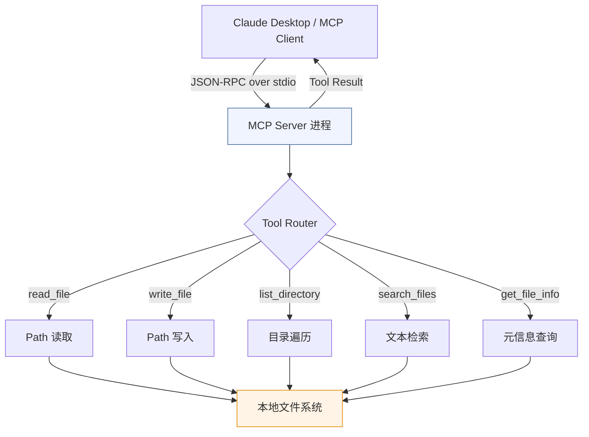

# 3.2 【动手一】文件系统操作 MCP Server

**难度** ⭐⭐ | **类型** Tools | **适合人群** 入门首选

---

## 实验目标

完成本节实验后，你将拥有一个能被 Claude 直接调用的本地文件系统 MCP Server，并通过它让 Claude 读取、写入、搜索你的本地文件。

核心学习点有三个：第一，理解 MCP 的 Tool 注册机制——为什么用装饰器而不是函数注册表；第二，掌握 stdio transport 模式的工作原理，以及何时应该用 HTTP+SSE 替代它；第三，建立对 MCP Server 安全边界设计的工程意识——一个没有路径白名单的文件系统 Server 在生产环境是危险的。

---

## 架构总览



MCP 协议的通信模型：Claude（Host 层的 Client）通过 stdio 启动 Server 子进程，双方用 JSON-RPC 2.0 格式交换消息。Server 向 Client 暴露工具列表，Claude 决定何时调用哪个工具，Server 执行后返回结果。**整个链路是同步阻塞的**——这是 stdio transport 的关键限制，处理大文件时要格外注意。

---

## 环境准备

```bash
# 创建项目目录
mkdir mcp-filesystem && cd mcp-filesystem

# 用 uv 创建虚拟环境并激活
uv venv --python 3.11
source .venv/bin/activate  # Windows: .venv\Scripts\activate

# 安装依赖（锁定版本，保证可复现）
uv pip install "mcp[cli]==1.9.2" "fastmcp==2.3.4"

# 验证安装
python -c "import mcp; print(mcp.__version__)"
```

> Colab 用户：`!pip install "mcp[cli]==1.9.2" "fastmcp==2.3.4"` 即可，无需创建虚拟环境。Colab 上通过 HTTP transport 验证，stdio 模式需要本地终端。

> ⚠️ **版本说明**：MCP Python SDK 在 1.x 阶段迭代较快，`fastmcp` 是官方提供的高层封装，底层调用 `mcp.server` 核心库。如果遇到 `ImportError: cannot import name 'FastMCP'`，检查 fastmcp 版本是否 ≥ 2.0。

---

## Step-by-Step 实现

### Step 1：初始化 Server 与安全边界

**目标**：创建 MCP Server 实例，并在初始化阶段建立路径白名单机制。不做白名单的文件系统 Server 等于给 Claude 开了一个无限制的 shell，这是生产环境绝对不可接受的。

```python
# filesystem_server.py
import os
import stat
from datetime import datetime
from pathlib import Path
from typing import Optional

from fastmcp import FastMCP

# ── 安全配置 ──────────────────────────────────────────────────────────────────
# ALLOWED_ROOT 定义 Server 可操作的根目录。
# 优先从环境变量读取，让部署时灵活配置；默认限制在当前工作目录。
ALLOWED_ROOT = Path(
    os.environ.get("MCP_ALLOWED_ROOT", Path.cwd())
).expanduser().resolve()

# 文件大小上限：避免 Claude 把一个 2GB 的日志文件整个读进上下文
MAX_FILE_SIZE_BYTES = int(os.environ.get("MCP_MAX_FILE_SIZE", 1024 * 1024))  # 默认 1MB

def _safe_path(raw: str) -> Path:
    """
    将用户传入的路径解析为绝对路径，并校验是否在白名单根目录内。
    
    使用 Path.resolve() 而非简单的字符串前缀匹配，是为了防止路径穿越攻击：
    ../../../etc/passwd 经过 resolve() 后会暴露真实绝对路径，从而被拦截。
    """
    resolved = Path(raw).expanduser().resolve()
    # is_relative_to 是 Python 3.9+ 的方法，确保路径在白名单内
    if not resolved.is_relative_to(ALLOWED_ROOT):
        raise PermissionError(
            f"路径 '{raw}' 超出允许的根目录 '{ALLOWED_ROOT}'。"
            f"请设置环境变量 MCP_ALLOWED_ROOT 扩大访问范围。"
        )
    return resolved

# ── Server 初始化 ──────────────────────────────────────────────────────────────
mcp = FastMCP(
    name="filesystem-server",
    # instructions 是 Server 级别的系统提示，会注入给调用方的 LLM。
    # 清晰说明能力边界，有助于 Claude 做出更准确的工具选择。
    instructions=(
        f"你可以操作本机文件系统，根目录限定为：{ALLOWED_ROOT}。"
        f"单文件最大读取 {MAX_FILE_SIZE_BYTES // 1024}KB。"
        "写操作会直接修改磁盘文件，请在执行前向用户确认。"
    ),
)
```

**关键点**：
- `_safe_path()` 是整个 Server 的安全核心，所有 Tool 都必须经过它处理路径，任何直接使用原始字符串的代码都是漏洞。
- `instructions` 字段不是装饰性注释，它会出现在 Claude 的 tool schema 描述中，影响模型判断何时以及如何调用这个 Server。
- ⚠️ 不要用 `str.startswith(ALLOWED_ROOT)` 做路径检查——`/tmp/safe_dir/../etc/passwd` 这类输入会绕过字符串前缀检查。

---

### Step 2：实现 `read_file` 与 `get_file_info`

**目标**：实现文件读取和元信息查询两个只读工具。只读工具是入门首选，副作用为零，适合先把整体链路跑通。

```python
@mcp.tool()
def read_file(path: str, encoding: str = "utf-8") -> str:
    """
    读取文件内容并以字符串形式返回。
    
    Args:
        path: 文件路径（相对路径基于 ALLOWED_ROOT，或绝对路径）
        encoding: 文件编码，默认 utf-8；二进制文件请先用 get_file_info 确认类型
    
    Returns:
        文件的文本内容
    """
    p = _safe_path(path)
    
    if not p.exists():
        return f"❌ 错误：文件不存在 → {p}"
    if not p.is_file():
        return f"❌ 错误：{p} 是一个目录，请用 list_directory 查看其内容"
    
    size = p.stat().st_size
    if size > MAX_FILE_SIZE_BYTES:
        # 超出大小限制时，返回明确提示而非截断内容。
        # 截断内容可能导致 Claude 对文件内容产生错误理解。
        return (
            f"❌ 文件过大：{size / 1024:.1f}KB，超出 {MAX_FILE_SIZE_BYTES // 1024}KB 限制。\n"
            f"建议：用 search_files 定位关键段落，或 get_file_info 了解文件结构。"
        )
    
    try:
        content = p.read_text(encoding=encoding)
        # 附加元信息头部，帮助 Claude 在回答时准确引用文件路径
        header = f"# 文件：{p}\n# 大小：{size} bytes | 编码：{encoding}\n\n"
        return header + content
    except UnicodeDecodeError:
        return (
            f"❌ 编码错误：无法用 {encoding} 解码 {p}。\n"
            f"尝试：read_file(path='{path}', encoding='gbk') 或 'latin-1'"
        )


@mcp.tool()
def get_file_info(path: str) -> dict:
    """
    获取文件或目录的元信息，包含大小、修改时间、权限等。
    读取大文件前建议先调用此工具确认文件类型和大小。
    
    Args:
        path: 目标路径
    
    Returns:
        包含 name/type/size_bytes/size_human/modified/permissions/readable 的字典
    """
    p = _safe_path(path)
    
    if not p.exists():
        return {"error": f"路径不存在：{p}"}
    
    s = p.stat()
    size = s.st_size
    
    # 人类可读的文件大小格式
    def _human_size(n: int) -> str:
        for unit in ("B", "KB", "MB", "GB"):
            if n < 1024:
                return f"{n:.1f} {unit}"
            n /= 1024
        return f"{n:.1f} TB"
    
    return {
        "name": p.name,
        "type": "directory" if p.is_dir() else "file",
        "suffix": p.suffix,  # 文件扩展名，如 .py / .md
        "size_bytes": size,
        "size_human": _human_size(size),
        "modified": datetime.fromtimestamp(s.st_mtime).isoformat(),
        "created": datetime.fromtimestamp(s.st_ctime).isoformat(),
        # 用人类可读格式表达权限，比八进制更直观
        "permissions": stat.filemode(s.st_mode),
        # 提前告知 Claude 这个文件读得了读不了，避免无效的 read_file 调用
        "readable": p.is_file() and size <= MAX_FILE_SIZE_BYTES,
        "within_limit": size <= MAX_FILE_SIZE_BYTES,
    }
```

**关键点**：
- Tool 的返回值类型由 MCP 序列化为 JSON。返回 `dict` 比拼接字符串更好——Claude 能精确提取字段值，而不必从字符串解析。
- `readable` 字段是主动引导 Claude 工作流的设计：如果为 `False`，Claude 会自然地转用 `search_files` 而非盲目调用 `read_file`。
- ⚠️ 不要在 Tool 内部抛出未捕获的异常。MCP 协议会把异常序列化为 error response，但错误信息对 Claude 的可读性很差；直接在返回值中描述错误更能引导 Claude 做出正确的后续决策。

---

### Step 3：实现 `list_directory` 与 `write_file`

**目标**：补全目录浏览和文件写入能力。`write_file` 是有副作用的工具，需要在 docstring 中明确声明，让 Claude 在调用前向用户确认。

```python
@mcp.tool()
def list_directory(path: str = ".", max_depth: int = 2) -> dict:
    """
    列出目录结构，以树形字典形式返回。
    
    Args:
        path: 目标目录路径，默认为 ALLOWED_ROOT
        max_depth: 最大递归深度（1=仅当前层，2=含一级子目录），最大值 4
    
    Returns:
        目录树结构字典，包含文件数量统计
    """
    p = _safe_path(path)
    
    if not p.exists():
        return {"error": f"路径不存在：{p}"}
    if not p.is_dir():
        return {"error": f"{p} 不是目录，请用 read_file 读取文件内容"}
    
    # 限制最大深度，防止在超大目录上消耗过多时间
    max_depth = min(max_depth, 4)
    
    def _build_tree(directory: Path, current_depth: int) -> dict:
        result = {
            "type": "directory",
            "name": directory.name or str(directory),
            "children": [],
        }
        
        if current_depth >= max_depth:
            # 到达深度限制时，只统计数量不展开内容
            items = list(directory.iterdir())
            result["truncated"] = True
            result["child_count"] = len(items)
            return result
        
        try:
            # sorted 保证输出顺序稳定，目录在前文件在后
            items = sorted(directory.iterdir(), key=lambda x: (x.is_file(), x.name))
        except PermissionError:
            result["error"] = "权限不足，无法读取目录内容"
            return result
        
        file_count = dir_count = 0
        for item in items:
            # 跳过隐藏文件和常见无意义目录，减少噪音
            if item.name.startswith(".") or item.name in {"__pycache__", "node_modules", ".git"}:
                continue
            
            if item.is_dir():
                dir_count += 1
                result["children"].append(_build_tree(item, current_depth + 1))
            else:
                file_count += 1
                s = item.stat()
                result["children"].append({
                    "type": "file",
                    "name": item.name,
                    "size_bytes": s.st_size,
                    "modified": datetime.fromtimestamp(s.st_mtime).strftime("%Y-%m-%d %H:%M"),
                })
        
        result["summary"] = f"{dir_count} 个目录，{file_count} 个文件"
        return result
    
    tree = _build_tree(p, current_depth=0)
    tree["root"] = str(p)
    return tree


@mcp.tool()
def write_file(path: str, content: str, overwrite: bool = False) -> dict:
    """
    将内容写入文件。此操作会直接修改磁盘，请在调用前向用户确认。
    
    Args:
        path: 目标文件路径（父目录不存在时自动创建）
        content: 要写入的文本内容
        overwrite: 是否覆盖已有文件，默认 False（防止意外覆盖）
    
    Returns:
        包含写入结果的字典：路径、字节数、是否为新建文件
    """
    p = _safe_path(path)
    
    is_new_file = not p.exists()
    
    # overwrite=False 时，对已有文件拒绝写入，让 Claude 先确认再决策
    if not is_new_file and not overwrite:
        return {
            "success": False,
            "error": (
                f"文件已存在：{p}（大小 {p.stat().st_size} bytes）。"
                f"如需覆盖，请传入 overwrite=True，或先确认用户意图。"
            ),
        }
    
    # 自动创建父目录
    p.parent.mkdir(parents=True, exist_ok=True)
    
    encoded = content.encode("utf-8")
    p.write_bytes(encoded)
    
    return {
        "success": True,
        "path": str(p),
        "bytes_written": len(encoded),
        "char_count": len(content),
        "action": "created" if is_new_file else "overwritten",
    }
```

**关键点**：
- `overwrite=False` 是一个重要的防御性设计。Claude 在任务链中调用 write_file 时，如果目标文件已存在，会收到明确的错误提示，倒逼它向用户确认，而不是默默覆盖。
- `list_directory` 过滤 `.git`、`__pycache__` 等目录，不只是性能优化——这些目录塞进上下文没有意义，反而消耗 Token。
- ⚠️ `p.parent.mkdir(parents=True, exist_ok=True)` 要在 `_safe_path()` 验证之后调用。顺序很重要：先验权限，再操作文件系统。

---

### Step 4：实现 `search_files`

**目标**：实现在目录下按关键词全文搜索文件，这是让 Claude 在大型代码库或文档库中定位信息的核心能力。

```python
@mcp.tool()
def search_files(
    keyword: str,
    directory: str = ".",
    file_pattern: str = "*",
    max_results: int = 20,
    context_lines: int = 2,
) -> dict:
    """
    在目录下递归搜索包含关键词的文件，返回匹配行及上下文。
    
    Args:
        keyword: 搜索关键词（大小写敏感）
        directory: 搜索根目录，默认为 ALLOWED_ROOT
        file_pattern: 文件名通配符过滤，如 "*.py"、"*.md"，默认匹配所有
        max_results: 最多返回的文件数量，避免结果过多撑爆上下文
        context_lines: 每个匹配行前后保留的上下文行数
    
    Returns:
        搜索结果字典，含匹配文件列表和总计数
    """
    root = _safe_path(directory)
    
    if not root.is_dir():
        return {"error": f"{root} 不是目录"}
    if not keyword:
        return {"error": "keyword 不能为空"}
    
    results = []
    total_matches = 0
    scanned_files = 0
    
    # rglob 递归遍历，file_pattern 支持 *.py 这类通配符
    for filepath in root.rglob(file_pattern):
        if not filepath.is_file():
            continue
        
        # 跳过二进制文件（简单判断：尝试读前 512 字节）
        try:
            with filepath.open("rb") as f:
                chunk = f.read(512)
            if b"\x00" in chunk:  # 包含 null byte 基本可判定为二进制
                continue
        except OSError:
            continue
        
        scanned_files += 1
        
        try:
            lines = filepath.read_text(encoding="utf-8", errors="ignore").splitlines()
        except OSError:
            continue
        
        file_matches = []
        for i, line in enumerate(lines):
            if keyword not in line:
                continue
            
            # 提取上下文行，边界处理
            ctx_start = max(0, i - context_lines)
            ctx_end = min(len(lines), i + context_lines + 1)
            context = [
                {
                    "line_no": ctx_start + j + 1,
                    "content": lines[ctx_start + j],
                    "is_match": (ctx_start + j) == i,
                }
                for j in range(ctx_end - ctx_start)
            ]
            
            file_matches.append({
                "line_no": i + 1,
                "context": context,
            })
            total_matches += 1
        
        if file_matches:
            results.append({
                "file": str(filepath.relative_to(root)),  # 返回相对路径，更简洁
                "absolute_path": str(filepath),
                "match_count": len(file_matches),
                "matches": file_matches,
            })
        
        # 达到结果上限时提前退出，不让搜索跑太久
        if len(results) >= max_results:
            break
    
    return {
        "keyword": keyword,
        "directory": str(root),
        "file_pattern": file_pattern,
        "scanned_files": scanned_files,
        "matched_files": len(results),
        "total_matches": total_matches,
        "truncated": len(results) >= max_results,
        "results": results,
    }
```

**关键点**：
- `context_lines` 参数让 Claude 看到匹配行周围的代码，而不只是一行孤立的文本。这对代码搜索场景尤其重要——函数定义通常需要看前几行注释才能理解意图。
- 二进制文件检测用 null byte 而非扩展名判断，更可靠。`.so`、`.pyc`、图片文件都会被正确跳过。
- `truncated` 字段的作用：如果 Claude 发现搜索被截断，会主动追问或换关键词缩小范围，而不是误以为搜索结果就是全部。
- ⚠️ 在代码量 10 万行以上的项目中，`rglob("*")` 可能耗时超过 10 秒。生产环境建议加 `asyncio.to_thread` 包装后改用 HTTP transport，避免阻塞 stdio 事件循环。

---

### Step 5：启动入口与配置

**目标**：完成 Server 入口，支持 stdio（Claude Desktop）和 HTTP（调试/测试）两种 transport 模式。

```python
# ── 主入口 ────────────────────────────────────────────────────────────────────
if __name__ == "__main__":
    import sys
    import argparse
    
    parser = argparse.ArgumentParser(description="文件系统 MCP Server")
    parser.add_argument(
        "--transport",
        choices=["stdio", "http"],
        default="stdio",
        help="传输方式：stdio（Claude Desktop）或 http（调试模式，默认端口 8000）",
    )
    parser.add_argument("--port", type=int, default=8000, help="HTTP 模式端口号")
    args = parser.parse_args()
    
    print(f"🚀 文件系统 MCP Server 启动", file=sys.stderr)
    print(f"   根目录：{ALLOWED_ROOT}", file=sys.stderr)
    print(f"   传输方式：{args.transport}", file=sys.stderr)
    
    if args.transport == "http":
        # HTTP 模式：用于本地调试，可以直接用 curl 或 MCP Inspector 测试
        mcp.run(transport="streamable-http", port=args.port)
    else:
        # stdio 模式：Claude Desktop 通过子进程 stdin/stdout 通信
        mcp.run(transport="stdio")
```

---

## 完整运行验证

### 方式一：Claude Desktop 接入（推荐）

编辑 Claude Desktop 配置文件，路径因系统而异：
- macOS：`~/Library/Application Support/Claude/claude_desktop_config.json`
- Windows：`%APPDATA%\Claude\claude_desktop_config.json`

```json
{
  "mcpServers": {
    "filesystem": {
      "command": "/path/to/your/.venv/bin/python",
      "args": ["/path/to/mcp-filesystem/filesystem_server.py"],
      "env": {
        "MCP_ALLOWED_ROOT": "/Users/yourname/Documents",
        "MCP_MAX_FILE_SIZE": "2097152"
      }
    }
  }
}
```

重启 Claude Desktop，在对话框右下角看到工具图标说明接入成功。验证提示词：

```
帮我列出 ~/Documents 目录结构，找到所有包含"TODO"的 Python 文件，然后把结果摘要写入 todo_summary.md
```

### 方式二：命令行单元验证（不依赖 Claude Desktop）

```python
# test_server.py
# 直接调用 Server 函数进行单元测试，不走 MCP 协议
# 适合 CI 环境或 Colab 调试

import sys, os
os.environ["MCP_ALLOWED_ROOT"] = os.path.expanduser("~/Documents")

# 把 Server 文件当模块导入
sys.path.insert(0, ".")
from filesystem_server import read_file, write_file, list_directory, search_files, get_file_info

# ── 测试 1：列目录 ────────────────────────────────────────────────────────────
print("=== list_directory ===")
result = list_directory(".", max_depth=1)
print(f"根目录：{result.get('root')}")
print(f"摘要：{result.get('summary', result.get('children', []))[:1]}")

# ── 测试 2：写文件 ────────────────────────────────────────────────────────────
print("\n=== write_file ===")
r = write_file("test_output.md", "# 测试文件\n\n由 MCP Server 创建。\n")
print(r)

# ── 测试 3：读文件 ────────────────────────────────────────────────────────────
print("\n=== read_file ===")
content = read_file("test_output.md")
print(content[:200])

# ── 测试 4：文件元信息 ────────────────────────────────────────────────────────
print("\n=== get_file_info ===")
info = get_file_info("test_output.md")
print(info)

# ── 测试 5：搜索文件 ──────────────────────────────────────────────────────────
print("\n=== search_files ===")
r = search_files("MCP", directory=".", file_pattern="*.md", max_results=5)
print(f"匹配文件数：{r['matched_files']}，总命中：{r['total_matches']}")

# ── 清理 ─────────────────────────────────────────────────────────────────────
import os
if os.path.exists("test_output.md"):
    os.remove("test_output.md")
    print("\n✅ 测试完成，临时文件已清理")
```

预期输出：
```
=== list_directory ===
根目录：/Users/yourname/Documents
摘要：[{'type': 'directory', 'name': 'Projects', ...}]

=== write_file ===
{'success': True, 'path': '/Users/yourname/Documents/test_output.md', 'bytes_written': 34, 'char_count': 22, 'action': 'created'}

=== read_file ===
# 文件：/Users/yourname/Documents/test_output.md
# 大小：34 bytes | 编码：utf-8

# 测试文件

由 MCP Server 创建。

=== get_file_info ===
{'name': 'test_output.md', 'type': 'file', 'suffix': '.md', 'size_bytes': 34, 'size_human': '34.0 B', 'modified': '2025-...', 'permissions': '-rw-r--r--', 'readable': True, 'within_limit': True}

=== search_files ===
匹配文件数：1，总命中：1

✅ 测试完成，临时文件已清理
```

### 方式三：MCP Inspector 可视化调试

```bash
# MCP Inspector 是官方提供的调试 UI，无需 Claude Desktop
npx @modelcontextprotocol/inspector python filesystem_server.py
# 浏览器打开 http://localhost:5173，可以可视化调用所有 Tool
```

---

## 常见报错与解决方案

| 报错信息 | 原因 | 解决方案 |
|---------|------|---------|
| `ModuleNotFoundError: No module named 'fastmcp'` | 虚拟环境未激活或包未安装 | 确认 `source .venv/bin/activate` 后重新 `uv pip install` |
| `PermissionError: 路径超出允许的根目录` | 传入路径不在 `MCP_ALLOWED_ROOT` 下 | 调整环境变量或使用白名单内的路径 |
| Claude Desktop 工具栏看不到 Server | 配置文件路径或 JSON 格式错误 | 用 `python -m json.tool claude_desktop_config.json` 验证 JSON 合法性 |
| `UnicodeDecodeError` 读取文件失败 | 文件是 GBK/Latin-1 编码 | 调用 `read_file(path, encoding='gbk')` 指定编码 |
| `search_files` 执行超过 10 秒 | 在超大目录下搜索且未指定 `file_pattern` | 加 `file_pattern="*.py"` 或缩小 `directory` 范围 |
| `mcp.run()` 后进程立即退出 | stdio 模式下没有从 stdin 读到数据 | stdio 模式需由 Claude Desktop 启动，调试请用 `--transport http` |

---

## 扩展练习（可选）

1. 🟡 **中等：添加 `diff_files` 工具**  
   实现比较两个文本文件差异的工具，输出 unified diff 格式。Claude 调用它后可以帮你 review 代码改动。提示：使用 `difflib.unified_diff`。

2. 🔴 **困难：路径权限分级管理**  
   当前实现只有一个全局白名单。尝试设计一个配置文件（JSON/TOML），支持定义多个路径的不同权限（只读目录 vs 读写目录），并在 `_safe_path()` 中根据操作类型（read/write）做分级校验。

> ⚠️ **生产注意**：本实验的 `write_file` 直接操作磁盘，无事务保证。生产环境建议先写入 `.tmp` 临时文件，验证成功后再原子重命名（`Path.rename()`），防止写入中途程序崩溃导致文件损坏。