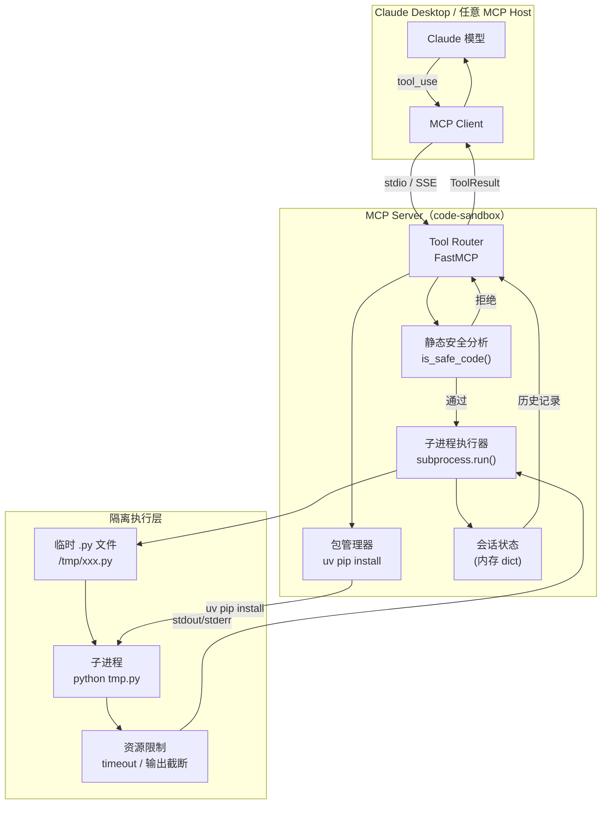

# 3.2【动手三】代码执行沙箱 MCP Server

**难度** ⭐⭐⭐⭐ | **类型** Tools | **适合人群** 有安全意识的工程师

---

## 实验目标

本节结束后，你将拥有一个可接入 Claude Desktop 的 Python 代码执行沙箱服务。Claude 能通过它运行代码、安装依赖、查看执行历史，而你无需担心恶意代码在宿主机上横行。核心学习点有三个：

1. **安全边界设计**：理解"静态分析拦截 + 子进程隔离 + 资源限制"三层防御的必要性，以及每层能防什么、防不了什么
2. **会话状态管理**：MCP Server 本身是无状态服务，但执行历史需要跨调用保存——理解如何用进程级状态在单次运行中维持"会话感"
3. **生产级工具设计**：timeout 限制、输出截断、错误格式化——这些"不起眼"的细节决定了 LLM 能否正确理解执行结果并做出下一步判断

---

## 架构总览



**数据流说明**：Claude 发出 `tool_use` 请求 → MCP Client 通过 stdio 传给 Server → 先过静态分析关卡 → 通过后写入临时文件 → 子进程执行 → 结果存入会话历史 → 返回给 Claude。整个执行环境与 MCP Server 进程隔离，子进程退出后临时文件立即删除。

---

## 环境准备

```bash
# 创建项目目录和虚拟环境
mkdir code-sandbox-mcp && cd code-sandbox-mcp
uv venv && source .venv/bin/activate   # Windows: .venv\Scripts\activate

# 安装依赖（锁定版本）
uv pip install "mcp[cli]>=1.3.0" "fastmcp>=0.4.0"

# 验证安装
python -c "import mcp; print(mcp.__version__)"
```

> **Colab 用户**：`!pip install "mcp[cli]>=1.3.0" "fastmcp>=0.4.0"` 即可，无需创建虚拟环境。注意 Colab 环境本身已经是隔离容器，子进程安全性更高。

> ⚠️ **生产注意**：`uv` 比 `pip` 快 10–100 倍，且原生支持锁文件（`uv.lock`），团队协作时强烈建议用 `uv pip compile requirements.in > requirements.lock` 锁定所有间接依赖版本，确保构建确定性。

---

## Step-by-Step 实现

### Step 1：搭建 MCP Server 骨架与会话状态

**目标**：初始化 FastMCP 实例，建立进程级会话存储，为后续所有 Tool 提供共享状态——这一步决定了"跨调用记忆"的实现方式。

```python
# sandbox_server.py
"""
代码执行沙箱 MCP Server
依赖：mcp[cli]>=1.3.0, fastmcp>=0.4.0
运行：python sandbox_server.py  （或通过 Claude Desktop 配置）
"""

from __future__ import annotations

import os
import subprocess
import sys
import tempfile
import time
from dataclasses import dataclass, field
from datetime import datetime
from pathlib import Path
from typing import Any

from fastmcp import FastMCP

# ── 服务实例 ──────────────────────────────────────────────────────────────────
mcp = FastMCP(
    "code-sandbox",
    instructions=(
        "Python 代码执行沙箱。支持运行代码、安装包、查看历史、重置环境。"
        "每次调用 execute_python 都是独立子进程，变量不跨次保留。"
        "如需多步共享状态，请在单次 execute_python 中写完整脚本。"
    ),
)

# ── 会话状态（进程级，重启后清空）────────────────────────────────────────────
@dataclass
class ExecutionRecord:
    """单次执行的完整记录"""
    timestamp: str
    code: str
    success: bool
    stdout: str
    stderr: str
    duration_ms: int
    error: str = ""

@dataclass
class SessionState:
    """跨 Tool 调用的共享会话状态"""
    history: list[ExecutionRecord] = field(default_factory=list)
    installed_packages: list[str] = field(default_factory=list)
    created_at: str = field(
        default_factory=lambda: datetime.now().isoformat(timespec="seconds")
    )

# 全局单例：MCP Server 是单进程服务，这里的全局变量在整个运行期间有效
_session = SessionState()
```

**关键点**：
- `FastMCP` 的 `instructions` 参数会注入 System Prompt，告知 Claude 这个 Server 的使用约定——比如"变量不跨次保留"这条，能防止 Claude 写出依赖上次执行结果的错误代码
- 用 `@dataclass` 而非普通 dict 存储历史，目的是结构清晰，后续序列化成 JSON 返回给 Claude 时格式一致
- ⚠️ 这里的全局状态是**进程级**的：每次 MCP Server 重启（包括 Claude Desktop 重连）都会清空。如需跨重启持久化，需要落盘到 SQLite 或文件

---

### Step 2：三层安全过滤器

**目标**：在代码进入子进程之前，用静态分析挡住最明显的攻击向量——这一层防御的价值不是"滴水不漏"，而是"提高攻击成本，拦截脚本小子"。

```python
# 危险模块黑名单：这些模块一旦被导入，几乎可以做任何事
BLOCKED_IMPORTS: frozenset[str] = frozenset({
    "os", "sys", "subprocess", "socket", "shutil",
    "pathlib", "importlib", "ctypes", "multiprocessing",
    "threading",   # 防止绕过 timeout 的线程逃逸
    "signal",      # 防止修改信号处理导致 timeout 失效
    "__import__",  # 动态导入的入口
    "builtins",    # 替换内置函数
})

# 危险调用模式：即使没有 import，这些调用也可能造成破坏
BLOCKED_PATTERNS: tuple[str, ...] = (
    "exec(",        # 动态执行任意代码
    "eval(",        # 动态求值
    "compile(",     # 编译代码对象，可绕过字符串检测
    "open(",        # 文件 I/O（读取密钥、写入文件）
    "__builtins__", # 访问/替换内置命名空间
    "globals()",    # 访问全局命名空间
    "locals()",     # 访问局部命名空间（可用于注入）
    "breakpoint()", # 可能挂起进程等待 pdb 连接
    "input(",       # 会导致子进程永久阻塞
)

def is_safe_code(code: str) -> tuple[bool, str]:
    """
    静态分析代码安全性。
    
    返回 (is_safe, reason)：通过时 reason 为空字符串。
    
    设计原则：宁可误杀合法代码，也不放过危险代码。
    这是"白名单思维"的体现：只允许已知安全的模式。
    """
    lines = code.split("\n")
    
    for i, line in enumerate(lines, start=1):
        stripped = line.strip()
        
        # 跳过注释行（单行注释，多行字符串暂不处理）
        if stripped.startswith("#"):
            continue
        
        # 检查危险 import
        for blocked in BLOCKED_IMPORTS:
            # 匹配 "import os" 和 "from os import ..." 两种形式
            if f"import {blocked}" in stripped or f"from {blocked} " in stripped:
                return False, (
                    f"第 {i} 行：禁止导入安全敏感模块 '{blocked}'。"
                    f"如需文件操作，请告知我目标需求，我会用安全方式实现。"
                )
        
        # 检查危险调用模式
        for pattern in BLOCKED_PATTERNS:
            if pattern in stripped:
                return False, (
                    f"第 {i} 行：检测到受限调用 '{pattern}'。"
                    f"该调用存在安全风险，已被沙箱策略拒绝。"
                )
    
    return True, ""
```

**关键点**：
- **为何要拦截 `threading`**：子线程不受 `subprocess.run(timeout=...)` 控制，攻击者可以在主线程 sleep 后在后台线程持续执行——这是绕过 timeout 最常见的技巧
- **为何要拦截 `input(`**：`input()` 会让子进程阻塞等待 stdin 输入，而我们的 `subprocess.run` 没有提供 stdin，会导致进程永久挂起直到 timeout——相当于 DoS 攻击
- ⚠️ **这层防御的局限性**：字符串拼接（`"im" + "port os"`）、`__import__("os")`、Base64 编码等方式可以绕过字符串匹配。真正的生产级沙箱需要 Linux namespace + seccomp + cgroup 组合。这一层的价值是"快速拦截明显威胁"，不是"万无一失"

---

### Step 3：核心执行工具 `execute_python`

**目标**：将通过安全检查的代码写入临时文件，在受限子进程中执行，收集 stdout/stderr，并将结果存入会话历史——每个环节都有明确的资源上界。

```python
# 输出长度上界（防止 LLM 因为超长 context 崩溃）
MAX_STDOUT_CHARS = 8_000
MAX_STDERR_CHARS = 2_000
DEFAULT_TIMEOUT = 10      # 秒，防止死循环
MAX_TIMEOUT = 60          # 单次最长允许执行时间

@mcp.tool()
def execute_python(code: str, timeout: int = DEFAULT_TIMEOUT) -> dict[str, Any]:
    """
    在隔离子进程中执行 Python 代码。
    
    Args:
        code:    Python 源代码字符串
        timeout: 最大执行秒数（默认 10s，最大 60s）
    
    Returns:
        {
          "success": bool,
          "stdout": str,         # 标准输出（截断至 8000 字符）
          "stderr": str,         # 标准错误（截断至 2000 字符）
          "duration_ms": int,    # 执行耗时
          "error": str,          # 沙箱层错误（非代码运行时错误）
        }
    
    注意：每次调用是独立子进程，变量不跨次保留。
    如需在多步中共享变量，请在单次调用中写完整脚本。
    """
    # ── 参数校验 ────────────────────────────────────────────────────────────
    timeout = max(1, min(timeout, MAX_TIMEOUT))  # 钳位到合法范围
    
    if not code.strip():
        return {"success": False, "error": "代码为空", "stdout": "", "stderr": "", "duration_ms": 0}
    
    # ── 安全检查 ────────────────────────────────────────────────────────────
    safe, reason = is_safe_code(code)
    if not safe:
        record = ExecutionRecord(
            timestamp=datetime.now().isoformat(timespec="seconds"),
            code=code, success=False, stdout="", stderr="",
            duration_ms=0, error=f"[安全拦截] {reason}",
        )
        _session.history.append(record)
        return {"success": False, "error": f"安全检查拒绝：{reason}", "stdout": "", "stderr": "", "duration_ms": 0}
    
    # ── 写入临时文件 ────────────────────────────────────────────────────────
    # 使用 delete=False 是因为 Windows 不允许子进程打开父进程持有的临时文件
    tmp_path: str | None = None
    try:
        with tempfile.NamedTemporaryFile(
            mode="w", suffix=".py",
            delete=False, encoding="utf-8",
            dir=tempfile.gettempdir(),    # 明确指定 /tmp，避免写到当前目录
        ) as f:
            f.write(code)
            tmp_path = f.name
        
        # ── 子进程执行 ──────────────────────────────────────────────────────
        start_time = time.monotonic()
        
        result = subprocess.run(
            [sys.executable, tmp_path],  # 使用与 server 相同的 Python 解释器
            capture_output=True,
            text=True,
            encoding="utf-8",
            errors="replace",            # 避免 UnicodeDecodeError 导致 server crash
            timeout=timeout,
            # 环境变量隔离：移除可能泄露敏感信息的变量
            env={
                "PATH": os.environ.get("PATH", ""),
                "PYTHONPATH": "",         # 防止加载宿主机的 .pth 文件
                "HOME": tempfile.gettempdir(),  # 隔离 home 目录
                "TMPDIR": tempfile.gettempdir(),
            },
        )
        
        duration_ms = int((time.monotonic() - start_time) * 1000)
        
        # 截断超长输出，防止 LLM context 爆炸
        stdout = result.stdout
        stderr = result.stderr
        truncation_note = ""
        
        if len(stdout) > MAX_STDOUT_CHARS:
            stdout = stdout[:MAX_STDOUT_CHARS]
            truncation_note = f"\n[输出已截断，原始长度 {len(result.stdout)} 字符]"
        
        stdout = stdout + truncation_note
        stderr = stderr[:MAX_STDERR_CHARS] if len(stderr) > MAX_STDERR_CHARS else stderr
        
        success = result.returncode == 0
        
        # ── 记录执行历史 ────────────────────────────────────────────────────
        record = ExecutionRecord(
            timestamp=datetime.now().isoformat(timespec="seconds"),
            code=code[:500],   # 历史中只存代码前 500 字符，控制内存占用
            success=success,
            stdout=stdout[:500],
            stderr=stderr[:200],
            duration_ms=duration_ms,
        )
        _session.history.append(record)
        
        return {
            "success": success,
            "stdout": stdout,
            "stderr": stderr,
            "duration_ms": duration_ms,
            "error": "",
        }
    
    except subprocess.TimeoutExpired:
        duration_ms = int(timeout * 1000)
        record = ExecutionRecord(
            timestamp=datetime.now().isoformat(timespec="seconds"),
            code=code[:500], success=False, stdout="", stderr="",
            duration_ms=duration_ms,
            error=f"执行超时（>{timeout}s）",
        )
        _session.history.append(record)
        return {
            "success": False,
            "error": f"执行超时（>{timeout}s），进程已强制终止。如需长时间计算，请增大 timeout 参数（最大 {MAX_TIMEOUT}s）。",
            "stdout": "", "stderr": "", "duration_ms": duration_ms,
        }
    
    except Exception as e:
        return {
            "success": False,
            "error": f"沙箱内部错误：{type(e).__name__}: {e}",
            "stdout": "", "stderr": "", "duration_ms": 0,
        }
    
    finally:
        # 无论如何都删除临时文件
        if tmp_path and Path(tmp_path).exists():
            try:
                os.unlink(tmp_path)
            except OSError:
                pass  # 删除失败不应导致 tool 报错
```

**关键点**：
- **`sys.executable` 而非硬编码 `"python"`**：确保子进程使用与 MCP Server 相同的 Python 解释器和虚拟环境，避免"我的环境里有 numpy，但子进程用了系统 Python"这类诡异问题
- **环境变量隔离**：清空 `PYTHONPATH` 防止宿主机 `.pth` 文件被子进程加载，相当于一道软性隔离。生产环境应叠加 Linux namespace 做硬隔离
- ⚠️ `errors="replace"` 看似小细节，实则关键：如果子进程输出了非 UTF-8 字节（如二进制数据），不加这个参数会导致 `UnicodeDecodeError` 让整个 MCP Server 崩溃，Claude 会收到"工具不可用"的错误而非执行结果

---

### Step 4：动态安装包 `install_package`

**目标**：让 Claude 能按需安装 pip 包，但要防止安装恶意包、控制网络访问范围——动态安装是双刃剑，必须有白名单兜底。

```python
# 允许安装的包白名单（防止安装恶意包或与系统包冲突）
# 生产环境中这个列表应从配置文件读取
ALLOWED_PACKAGES: frozenset[str] = frozenset({
    # 数据科学
    "numpy", "pandas", "scipy", "scikit-learn", "statsmodels",
    # 可视化
    "matplotlib", "seaborn", "plotly",
    # 文本处理
    "requests", "beautifulsoup4", "lxml", "httpx",
    # 工具类
    "pydantic", "python-dateutil", "pytz", "tqdm",
    # 数学
    "sympy", "mpmath",
})

@mcp.tool()
def install_package(name: str) -> dict[str, Any]:
    """
    在沙箱环境中动态安装 pip 包。
    
    Args:
        name: 包名（不含版本号，系统会安装最新稳定版）
    
    Returns:
        {"success": bool, "message": str, "package": str}
    
    注意：仅允许安装预定义白名单中的包，防止恶意包安装。
    """
    # 规范化包名（pip 对连字符/下划线不敏感，但白名单需精确匹配）
    normalized = name.strip().lower().replace("-", "_")
    canonical = name.strip().lower()
    
    if canonical not in ALLOWED_PACKAGES and normalized not in ALLOWED_PACKAGES:
        return {
            "success": False,
            "message": (
                f"包 '{name}' 不在允许列表中。"
                f"当前允许的包：{', '.join(sorted(ALLOWED_PACKAGES))}。"
                f"如需其他包，请联系管理员添加白名单。"
            ),
            "package": name,
        }
    
    # 检查是否已安装（避免重复安装浪费时间）
    if name in _session.installed_packages:
        return {
            "success": True,
            "message": f"包 '{name}' 本次会话已安装，可直接使用。",
            "package": name,
        }
    
    try:
        # 优先使用 uv（速度更快），降级到 pip
        installer = ["uv", "pip", "install"] if _uv_available() else [sys.executable, "-m", "pip", "install"]
        
        result = subprocess.run(
            [*installer, name, "--quiet"],
            capture_output=True, text=True,
            timeout=120,                  # 安装超时 2 分钟
            env=os.environ.copy(),        # 安装需要完整环境（需要访问 PyPI）
        )
        
        if result.returncode == 0:
            _session.installed_packages.append(name)
            return {
                "success": True,
                "message": f"包 '{name}' 安装成功，现在可以在代码中 import 使用。",
                "package": name,
            }
        else:
            return {
                "success": False,
                "message": f"安装失败：{result.stderr[:500]}",
                "package": name,
            }
    
    except subprocess.TimeoutExpired:
        return {
            "success": False,
            "message": "安装超时（>120s），可能是网络问题。请检查网络连接后重试。",
            "package": name,
        }

def _uv_available() -> bool:
    """检测 uv 是否可用"""
    try:
        subprocess.run(["uv", "--version"], capture_output=True, timeout=3)
        return True
    except (FileNotFoundError, subprocess.TimeoutExpired):
        return False
```

**关键点**：
- **白名单而非黑名单**：pip 生态有数百万个包，黑名单永远追不上攻击者。白名单思路是：明确列出允许安装什么，其余全拒
- **安装用 `os.environ.copy()`，执行用隔离环境**：安装阶段需要访问 PyPI（需要完整网络和 PATH），但代码执行阶段不需要，两者环境策略不同
- ⚠️ 安装会修改 MCP Server 进程自身的 Python 环境，这是"沙而不箱"：安装的包虽然有白名单，但一旦安装就会影响宿主 Server 进程。更安全的做法是给每次 execute_python 创建独立 venv，但代价是每次执行慢 2-5 秒

---

### Step 5：辅助工具与入口

**目标**：实现 `get_execution_history` 和 `reset_session` 两个管理类工具，并添加 Server 入口——这两个工具让 Claude 具备"自我审视"和"清空重来"的能力。

```python
@mcp.tool()
def get_execution_history(last_n: int = 10) -> dict[str, Any]:
    """
    获取本次会话的代码执行历史记录。
    
    Args:
        last_n: 返回最近 N 条记录（默认 10，最大 50）
    
    Returns:
        {
          "total": int,          # 本次会话总执行次数
          "session_start": str,  # 会话开始时间
          "records": list,       # 执行记录列表（倒序，最新在前）
          "installed_packages": list,
        }
    
    用途：Claude 可用此工具回顾之前执行了什么、哪些成功/失败，
    避免重复执行相同代码或重蹈已失败的覆辙。
    """
    last_n = max(1, min(last_n, 50))
    recent = _session.history[-last_n:][::-1]  # 倒序，最新在前
    
    return {
        "total": len(_session.history),
        "session_start": _session.created_at,
        "installed_packages": _session.installed_packages,
        "records": [
            {
                "timestamp": r.timestamp,
                "success": r.success,
                "duration_ms": r.duration_ms,
                "code_preview": r.code[:100] + ("..." if len(r.code) > 100 else ""),
                "stdout_preview": r.stdout[:200] + ("..." if len(r.stdout) > 200 else ""),
                "error": r.error,
            }
            for r in recent
        ],
    }


@mcp.tool()
def reset_session() -> dict[str, Any]:
    """
    清空执行历史和已安装包记录，重置会话状态。
    
    注意：此操作不会卸载已安装的 pip 包（卸载有副作用），
    仅清空会话记录。如需真正隔离，请重启 MCP Server。
    """
    global _session
    old_count = len(_session.history)
    _session = SessionState()   # 重建 SessionState，旧引用自动 GC
    
    return {
        "success": True,
        "message": f"会话已重置。清除了 {old_count} 条执行记录。",
        "note": "pip 包不会被卸载，已安装的包在本进程内仍可使用。",
    }


# ── 服务入口 ─────────────────────────────────────────────────────────────────
if __name__ == "__main__":
    print("🔒 代码执行沙箱 MCP Server 启动", flush=True)
    print(f"   Python: {sys.executable}", flush=True)
    print(f"   安全模式: 静态分析 + 子进程隔离 + 环境变量隔离", flush=True)
    mcp.run(transport="stdio")
```

**关键点**：
- `reset_session` 用 `global _session` 重建 `SessionState` 对象，而非清空列表——这样旧的 `SessionState` 对象会在 Python GC 下一轮被回收，比 `_session.history.clear()` 更彻底（不会有悬挂引用）
- ⚠️ `mcp.run(transport="stdio")` 中的 `print` 语句必须加 `flush=True`：stdio 模式下 MCP Client 监听的是 Server 的 stdout，不 flush 的 print 会被缓冲，导致启动日志出现在 MCP 协议数据之前——这会破坏协议解析

---

## 完整运行验证

### 1. 接入 Claude Desktop

在 `claude_desktop_config.json` 中添加：

```json
{
  "mcpServers": {
    "code-sandbox": {
      "command": "/path/to/your/.venv/bin/python",
      "args": ["/path/to/code-sandbox-mcp/sandbox_server.py"]
    }
  }
}
```

> macOS 配置文件位置：`~/Library/Application Support/Claude/claude_desktop_config.json`
> Windows 配置文件位置：`%APPDATA%\Claude\claude_desktop_config.json`

### 2. 本地独立验证脚本

```python
# test_sandbox.py
# 独立运行，不依赖 Claude Desktop，直接导入函数验证逻辑

import sys
sys.path.insert(0, ".")

# 直接导入验证（绕过 MCP 协议层）
from sandbox_server import execute_python, install_package, get_execution_history, reset_session, is_safe_code

def test_basic_execution():
    """测试基本代码执行"""
    result = execute_python("print('hello from sandbox')\nprint(1 + 1)")
    assert result["success"] is True, f"执行失败: {result}"
    assert "hello from sandbox" in result["stdout"]
    assert "2" in result["stdout"]
    print("✅ test_basic_execution passed")

def test_timeout():
    """测试超时保护"""
    result = execute_python("while True: pass", timeout=2)
    assert result["success"] is False
    assert "超时" in result["error"]
    print("✅ test_timeout passed")

def test_security_block_import():
    """测试危险 import 拦截"""
    result = execute_python("import os\nprint(os.getcwd())")
    assert result["success"] is False
    assert "安全检查拒绝" in result["error"]
    print("✅ test_security_block_import passed")

def test_security_block_eval():
    """测试 eval 拦截"""
    result = execute_python("result = eval('1+1')\nprint(result)")
    assert result["success"] is False
    print("✅ test_security_block_eval passed")

def test_numpy_if_available():
    """测试 numpy 可用性（需要已安装）"""
    result = execute_python(
        "import numpy as np\n"
        "arr = np.array([1, 2, 3, 4, 5])\n"
        "print(f'mean={arr.mean():.2f}, std={arr.std():.2f}')"
    )
    if result["success"]:
        assert "mean=3.00" in result["stdout"]
        print("✅ test_numpy_if_available passed")
    else:
        print("⏭  test_numpy_if_available skipped (numpy not installed)")

def test_history():
    """测试执行历史"""
    reset_session()
    execute_python("print('step 1')")
    execute_python("print('step 2')")
    history = get_execution_history(last_n=5)
    assert history["total"] == 2
    assert len(history["records"]) == 2
    print("✅ test_history passed")

def test_matplotlib_plot():
    """测试图表生成（输出到文件）"""
    code = """
import matplotlib
matplotlib.use('Agg')   # 非交互式后端，不弹窗
import matplotlib.pyplot as plt
import math

x = [i * 0.1 for i in range(63)]
y = [math.sin(v) for v in x]
plt.figure(figsize=(8, 4))
plt.plot(x, y, 'b-', linewidth=2)
plt.title('Sine Wave')
plt.savefig('/tmp/test_plot.png', dpi=72, bbox_inches='tight')
print('图表已保存到 /tmp/test_plot.png')
"""
    result = execute_python(code, timeout=15)
    if result["success"]:
        print("✅ test_matplotlib_plot passed")
        print(f"   stdout: {result['stdout'].strip()}")
    else:
        print(f"⚠️  test_matplotlib_plot: {result.get('stderr', result.get('error', ''))[:200]}")

if __name__ == "__main__":
    print("=" * 50)
    print("代码执行沙箱 - 功能验证")
    print("=" * 50)
    test_basic_execution()
    test_timeout()
    test_security_block_import()
    test_security_block_eval()
    test_numpy_if_available()
    test_history()
    test_matplotlib_plot()
    print("\n🎉 所有测试完成")
```

预期输出：
```
==================================================
代码执行沙箱 - 功能验证
==================================================
✅ test_basic_execution passed
✅ test_timeout passed
✅ test_security_block_import passed
✅ test_security_block_eval passed
⏭  test_numpy_if_available skipped (numpy not installed)
✅ test_history passed
✅ test_matplotlib_plot passed

🎉 所有测试完成
```

---

## 常见报错与解决方案

| 报错信息 | 原因 | 解决方案 |
|---------|------|---------|
| `ModuleNotFoundError: No module named 'fastmcp'` | 虚拟环境未激活或依赖未安装 | `source .venv/bin/activate && uv pip install "fastmcp>=0.4.0"` |
| `FileNotFoundError: [Errno 2] No such file or directory: 'uv'` | `uv` 未安装 | `curl -LsSf https://astral.sh/uv/install.sh | sh` 或代码会自动降级到 `pip` |
| Claude Desktop 显示工具不可用 | `claude_desktop_config.json` 路径错误或 Python 解释器路径不对 | 使用 `which python`（macOS/Linux）或 `where python`（Windows）获取绝对路径填入 config |
| `subprocess.TimeoutExpired` 但非死循环代码 | 网络请求、大文件 I/O 等 I/O 密集操作超时 | 在调用 `execute_python` 时增大 `timeout` 参数，最大支持 60s |
| 输出中文乱码（Windows） | Windows 子进程默认 GBK 编码 | 代码开头加 `import sys; sys.stdout.reconfigure(encoding='utf-8')` |
| `matplotlib` 报 `cannot connect to X server` | 服务器/Docker 环境无显示器 | 代码中加 `matplotlib.use('Agg')` 切换到非交互式后端 |

---

## 扩展练习（可选）

1. 🟡 **中等：Docker 容器级隔离**
   将 `subprocess.run` 替换为 `docker run --rm --network none --memory 128m python:3.11-slim python -c "..."` 实现真正的容器隔离。核心挑战：如何把用户代码传入容器（stdin vs 挂载临时 volume），以及如何在 Docker 不可用时优雅降级到子进程模式。

2. 🔴 **困难：持久化 Session + 跨调用共享变量**
   当前设计中每次 `execute_python` 是独立进程，变量不共享。尝试实现"持久 Python 进程"模式：启动一个长驻 Python 子进程，通过 stdin/stdout JSON 协议与之通信，让变量在多次调用间保留。需要解决：协议设计、异常隔离（一次崩溃不能导致会话丢失）、内存泄漏检测三个核心问题。

> ⚠️ **生产注意**：本节实现的是"轻量级沙箱"，适合受信任用户场景（如团队内部工具）。若面向公网或不受信任用户，必须叠加以下措施：Linux namespace 隔离（`unshare`）、seccomp syscall 过滤、cgroup 内存/CPU 限制、网络隔离（`--network none`）。完整方案参考 Jupyter Server 的 `KernelGateway` 或 E2B 的沙箱架构。
