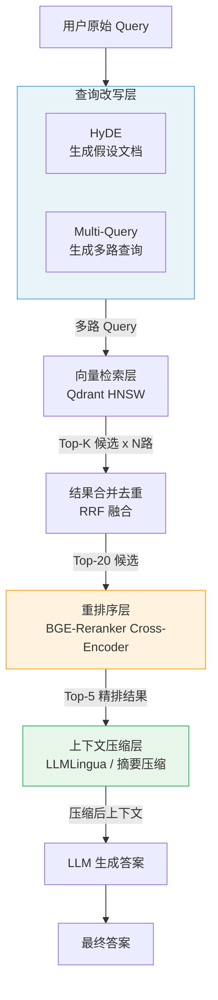

## 2.5 【动手】Advanced RAG：重排序 + 查询改写

### 实验目标

完成本节后，你能够：

1. 理解 Naive RAG 的核心缺陷，并用 HyDE 与 Multi-Query 两种策略从**查询端**提升召回质量；
2. 接入 BGE-Reranker Cross-Encoder，对候选文档做**精排**，解决向量检索"语义相近但答非所问"的问题；
3. 用 LLMLingua 或摘要压缩对检索结果做**上下文裁剪**，在不损失关键信息的前提下节约 Token；
4. 通过量化对比实验，直观感受每个优化环节的实际收益，建立"哪步值得加、哪步可以省"的工程判断。

---

### 架构总览



整条链路分为四层，每层独立可替换。本节将逐层实现，并在最后做端到端对比实验。

---

### 环境准备

```bash
# 创建虚拟环境（uv）
uv venv --python 3.11 && source .venv/bin/activate

# 安装依赖（锁定版本）
uv pip install \
  openai==1.51.2 \
  qdrant-client==1.11.3 \
  sentence-transformers==3.2.1 \
  llmlingua==0.2.2 \
  rank-bm25==0.2.2 \
  numpy==1.26.4 \
  python-dotenv==1.0.1 \
  httpx==0.27.2
```

> **Colab 用户**：`!pip install openai==1.51.2 qdrant-client==1.11.3 sentence-transformers==3.2.1 llmlingua==0.2.2 rank-bm25==0.2.2 python-dotenv==1.0.1` 即可，无需创建虚拟环境。

创建 `.env` 文件：

```bash
OPENAI_API_KEY=sk-...
OPENAI_BASE_URL=https://api.openai.com/v1  # 按需替换为代理或 DeepSeek
```

---

### Step-by-Step 实现

#### Step 1：构建基础 RAG 基线（Naive RAG）

**目标**：先搭一个最简单的 Naive RAG 作为对照基线，后续所有优化都在此基础上叠加，对比才有说服力。

```python
# baseline_rag.py
"""Naive RAG 基线实现，作为对比实验的起点。"""

import os
from typing import Optional
from dataclasses import dataclass

import numpy as np
from dotenv import load_dotenv
from openai import OpenAI
from qdrant_client import QdrantClient
from qdrant_client.models import (
    Distance, VectorParams, PointStruct
)

load_dotenv()


@dataclass
class RetrievedChunk:
    """检索结果的数据结构，贯穿整条链路。"""
    text: str
    score: float
    chunk_id: str
    source: str = ""


class NaiveRAG:
    """
    Naive RAG 基线：Embedding → 向量检索 → 直接生成。
    不做任何查询改写、重排或压缩。
    """

    EMBED_MODEL = "text-embedding-3-small"
    CHAT_MODEL = "gpt-4o-mini"
    COLLECTION = "naive_rag_demo"
    EMBED_DIM = 1536

    def __init__(self) -> None:
        self.client = OpenAI(
            api_key=os.getenv("OPENAI_API_KEY"),
            base_url=os.getenv("OPENAI_BASE_URL", "https://api.openai.com/v1"),
        )
        # 使用内存模式的 Qdrant，无需启动独立服务
        self.qdrant = QdrantClient(":memory:")
        self._init_collection()

    def _init_collection(self) -> None:
        """初始化向量集合（幂等操作）。"""
        existing = [c.name for c in self.qdrant.get_collections().collections]
        if self.COLLECTION not in existing:
            self.qdrant.create_collection(
                collection_name=self.COLLECTION,
                vectors_config=VectorParams(
                    size=self.EMBED_DIM, distance=Distance.COSINE
                ),
            )

    def embed(self, texts: list[str]) -> list[list[float]]:
        """批量 Embedding，每次最多 100 条（OpenAI 限制）。"""
        resp = self.client.embeddings.create(
            model=self.EMBED_MODEL, input=texts
        )
        return [item.embedding for item in resp.data]

    def index_documents(self, chunks: list[str]) -> None:
        """将文档切块写入向量库。"""
        embeddings = self.embed(chunks)
        points = [
            PointStruct(
                id=i,
                vector=emb,
                payload={"text": text, "chunk_id": str(i)},
            )
            for i, (text, emb) in enumerate(zip(chunks, embeddings))
        ]
        self.qdrant.upsert(collection_name=self.COLLECTION, points=points)
        print(f"✅ 已索引 {len(chunks)} 个切块")

    def retrieve(self, query: str, top_k: int = 5) -> list[RetrievedChunk]:
        """向量检索，返回 Top-K 候选。"""
        q_vec = self.embed([query])[0]
        hits = self.qdrant.search(
            collection_name=self.COLLECTION,
            query_vector=q_vec,
            limit=top_k,
        )
        return [
            RetrievedChunk(
                text=h.payload["text"],
                score=h.score,
                chunk_id=h.payload["chunk_id"],
            )
            for h in hits
        ]

    def generate(self, query: str, context_chunks: list[RetrievedChunk]) -> str:
        """基于检索结果生成答案。"""
        context = "\n\n---\n\n".join(c.text for c in context_chunks)
        messages = [
            {
                "role": "system",
                "content": (
                    "你是一个精准的问答助手。请严格基于以下上下文回答问题，"
                    "如果上下文中没有相关信息，直接说"不知道"，不要编造。"
                ),
            },
            {
                "role": "user",
                "content": f"上下文：\n{context}\n\n问题：{query}",
            },
        ]
        resp = self.client.chat.completions.create(
            model=self.CHAT_MODEL,
            messages=messages,
            temperature=0.1,
        )
        return resp.choices[0].message.content

    def query(self, question: str, top_k: int = 5) -> dict:
        """完整的 RAG 查询链路，返回答案和检索到的切块。"""
        chunks = self.retrieve(question, top_k=top_k)
        answer = self.generate(question, chunks)
        return {"answer": answer, "retrieved_chunks": chunks}
```

---

#### Step 2：查询改写——HyDE 与 Multi-Query

**目标**：原始查询往往是短句，语义稀疏，导致向量检索"找近义词"而非"找答案"。查询改写从**用户意图**出发，生成更丰富的检索信号，是 Advanced RAG 收益最高的单点优化。

两种策略各有侧重：
- **HyDE（Hypothetical Document Embeddings）**：让 LLM 先凭空"想象"一篇能回答该问题的文档，用这篇假设文档的 Embedding 去检索——因为假设文档在语义空间上比短查询更接近真实答案文档；
- **Multi-Query**：让 LLM 从不同角度生成 3~5 个语义相近但措辞各异的查询，分别检索后合并——覆盖原始查询可能遗漏的语义变体。

```python
# query_rewriter.py
"""查询改写模块：HyDE 与 Multi-Query 双策略。"""

import json
from openai import OpenAI


class QueryRewriter:
    """
    封装 HyDE 和 Multi-Query 两种改写策略。
    设计原则：策略可单独使用，也可组合使用。
    """

    def __init__(self, client: OpenAI, model: str = "gpt-4o-mini") -> None:
        self.client = client
        self.model = model

    def hyde(self, query: str) -> str:
        """
        HyDE：生成一篇假设性的"理想答案文档"。

        为何 HyDE 有效：
        向量模型训练时见过大量文档，对"文档风格"的 Embedding 比对"问题风格"
        的 Embedding 更稳定。用假设文档去检索，相当于把查询从问题空间
        映射到了文档空间。

        局限：HyDE 依赖 LLM 生成质量，若 LLM 对领域不熟悉，
        假设文档可能引入噪声，反而拉低召回质量。
        """
        prompt = (
            f"请为以下问题撰写一段简洁的参考答案（100字以内），"
            f"语气像专业文档，不必完全准确，只需覆盖关键概念：\n\n问题：{query}"
        )
        resp = self.client.chat.completions.create(
            model=self.model,
            messages=[{"role": "user", "content": prompt}],
            temperature=0.3,  # 稍高温度增加多样性，但不宜过高
        )
        return resp.choices[0].message.content.strip()

    def multi_query(self, query: str, n: int = 3) -> list[str]:
        """
        Multi-Query：生成 N 个语义相近但措辞不同的查询。

        返回的列表包含原始查询（第一个），确保原始意图不丢失。
        """
        prompt = (
            f"请将以下问题改写为 {n} 个语义相近但措辞不同的查询，"
            f"以 JSON 数组格式返回，每个元素是一个字符串，不要加任何解释：\n\n"
            f"原始问题：{query}"
        )
        resp = self.client.chat.completions.create(
            model=self.model,
            messages=[{"role": "user", "content": prompt}],
            temperature=0.5,
            response_format={"type": "json_object"},
        )
        try:
            raw = json.loads(resp.choices[0].message.content)
            # 兼容模型返回 {"queries": [...]} 或直接 [...] 两种格式
            variants: list[str] = (
                raw if isinstance(raw, list)
                else next(iter(raw.values()))
            )
        except (json.JSONDecodeError, StopIteration):
            variants = []

        # 原始查询始终放第一位，保证召回的下界
        return [query] + [v for v in variants if v != query]

    def rrf_merge(
        self,
        results_list: list[list["RetrievedChunk"]],  # 多路检索结果
        k: int = 60,
        top_n: int = 20,
    ) -> list["RetrievedChunk"]:
        """
        Reciprocal Rank Fusion（RRF）：将多路检索结果融合去重。

        RRF 公式：score(d) = Σ 1 / (k + rank_i(d))
        k=60 是 Cormack et al. 2009 论文推荐的默认值，实践中无需调整。

        优势：不依赖各路检索的分值量纲，天然适合混合不同类型的检索器。
        """
        from collections import defaultdict

        chunk_scores: dict[str, float] = defaultdict(float)
        chunk_map: dict[str, "RetrievedChunk"] = {}

        for results in results_list:
            for rank, chunk in enumerate(results, start=1):
                chunk_scores[chunk.chunk_id] += 1.0 / (k + rank)
                chunk_map[chunk.chunk_id] = chunk

        merged = sorted(
            chunk_map.values(),
            key=lambda c: chunk_scores[c.chunk_id],
            reverse=True,
        )
        return merged[:top_n]
```

> ⚠️ **生产注意**：Multi-Query 会增加 N 倍的 Embedding 调用开销。若 Embedding API 有速率限制，应对多路查询做并发控制（asyncio.gather + Semaphore）。对于延迟敏感的场景，可仅用 Multi-Query 而不用 HyDE，节省一次 LLM 调用。

---

#### Step 3：重排序——BGE-Reranker Cross-Encoder

**目标**：向量检索是"粗排"，用内积/余弦快速从千万文档中找到 Top-20 候选；Cross-Encoder 是"精排"，它将 Query 和每个候选文档**拼接在一起**输入 BERT 类模型，让模型直接对相关性打分，准确度远高于向量相似度。

为什么需要两阶段？Cross-Encoder 不支持离线建索引，每次推理的复杂度是 O(N × doc_len)，对全库检索代价太高；但对 Top-20 候选精排，延迟完全可以接受（通常 < 200ms）。

```python
# reranker.py
"""BGE-Reranker Cross-Encoder 精排模块。"""

from sentence_transformers import CrossEncoder


class BGEReranker:
    """
    使用 BAAI/bge-reranker-v2-m3 对候选文档精排。

    模型选型说明：
    - bge-reranker-base（约 280MB）：速度快，适合延迟敏感场景
    - bge-reranker-v2-m3（约 570MB）：多语言，中文效果更好，推荐首选
    - bge-reranker-large（约 1.3GB）：精度最高，GPU 推理才有性价比

    首次运行会自动从 HuggingFace 下载模型，国内可设置镜像：
    export HF_ENDPOINT=https://hf-mirror.com
    """

    def __init__(self, model_name: str = "BAAI/bge-reranker-v2-m3") -> None:
        # device=None 时 sentence-transformers 自动选择 CUDA/MPS/CPU
        self.model = CrossEncoder(model_name, max_length=512)
        print(f"✅ Reranker 已加载：{model_name}")

    def rerank(
        self,
        query: str,
        chunks: list["RetrievedChunk"],
        top_n: int = 5,
    ) -> list["RetrievedChunk"]:
        """
        对候选切块重新打分并排序。

        Args:
            query: 用户原始查询（不是改写后的查询）
            chunks: 向量检索的候选切块（通常 Top-20）
            top_n: 精排后保留的数量（送入 LLM 的上下文）

        Returns:
            按相关性降序排列的 Top-N 切块，score 字段更新为 Cross-Encoder 分值。
        """
        if not chunks:
            return []

        # Cross-Encoder 的输入是 (query, document) 对
        pairs = [(query, chunk.text) for chunk in chunks]
        scores: list[float] = self.model.predict(pairs).tolist()

        # 将 Cross-Encoder 分值回写到 RetrievedChunk
        for chunk, score in zip(chunks, scores):
            chunk.score = score

        # 按分值降序，取 Top-N
        reranked = sorted(chunks, key=lambda c: c.score, reverse=True)
        return reranked[:top_n]
```

> ⚠️ **生产注意**：`CrossEncoder.predict` 是批量推理，但内部仍是串行。若候选数量 > 50，建议开启 `batch_size` 参数并在 GPU 上运行。CPU 上对 20 个候选的重排约耗时 150~300ms，可接受；对 100 个候选则可能超过 1s，需权衡。

---

#### Step 4：上下文压缩——LLMLingua 与摘要压缩

**目标**：重排后的 Top-5 文档往往仍有大量与问题无关的句子，直接塞入 LLM 既浪费 Token，也会因"Lost in the Middle"效应降低答案质量。上下文压缩的目标是：**在不丢失关键信息的前提下，最大化删除噪声**。

两种方案各有适用场景：
- **LLMLingua**：基于小语言模型（如 Llama-2-7B）对每个 Token 计算困惑度，删掉困惑度低（即模型认为"废话"）的 Token。优点是压缩率可控（可指定目标比例），缺点是首次加载模型较慢；
- **摘要压缩**：直接让 LLM 对检索结果做摘要，保留与查询最相关的内容。实现最简单，适合对延迟不敏感、但 Token 成本敏感的离线场景。

```python
# context_compressor.py
"""上下文压缩模块：LLMLingua 与 LLM 摘要压缩两种实现。"""

from openai import OpenAI


class LLMLinguaCompressor:
    """
    基于 LLMLingua 的 Token 级别压缩。
    需要额外安装：uv pip install llmlingua==0.2.2
    """

    def __init__(self, rate: float = 0.5) -> None:
        """
        Args:
            rate: 压缩率，0.5 表示保留 50% 的 Token。
                  实验建议：0.4~0.6 之间，低于 0.3 可能损失关键信息。
        """
        from llmlingua import PromptCompressor

        # 使用轻量级模型做 Token 打分，不参与最终生成
        # 国内可替换为 Qwen/Qwen1.5-1.8B-Chat 等本地模型
        self.compressor = PromptCompressor(
            model_name="microsoft/llmlingua-2-xlm-roberta-large-meetingbank",
            use_llmlingua2=True,
        )
        self.rate = rate

    def compress(self, query: str, context: str) -> str:
        """
        压缩上下文文本，保留与 query 最相关的 Token。

        LLMLingua2 使用 query-aware 压缩：
        会优先保留与 query 语义相关的 Token。
        """
        result = self.compressor.compress_prompt(
            context,
            rate=self.rate,
            question=query,
        )
        compressed = result["compressed_prompt"]
        original_tokens = result["origin_tokens"]
        compressed_tokens = result["compressed_tokens"]

        ratio = 1 - compressed_tokens / max(original_tokens, 1)
        print(
            f"📉 LLMLingua 压缩：{original_tokens} → {compressed_tokens} tokens "
            f"（节省 {ratio:.1%}）"
        )
        return compressed


class SummaryCompressor:
    """
    基于 LLM 摘要的上下文压缩。
    实现最简单，适合快速集成，无需额外加载本地模型。
    """

    def __init__(self, client: OpenAI, model: str = "gpt-4o-mini") -> None:
        self.client = client
        self.model = model

    def compress(
        self,
        query: str,
        chunks: list["RetrievedChunk"],
        max_words: int = 300,
    ) -> str:
        """
        让 LLM 对多个检索切块做摘要，只保留与 query 相关的内容。

        注意：这会引入额外的 LLM 调用。适合最终上下文需要控制在
        1000 Token 以内的场景，不适合实时对话（延迟会增加 500ms+）。
        """
        context = "\n\n---\n\n".join(
            f"[切块 {i+1}]\n{c.text}" for i, c in enumerate(chunks)
        )
        prompt = (
            f"以下是检索到的多段文本，请提取与问题直接相关的信息，"
            f"压缩为不超过 {max_words} 字的摘要，保留具体数字和关键术语：\n\n"
            f"问题：{query}\n\n文本：\n{context}"
        )
        resp = self.client.chat.completions.create(
            model=self.model,
            messages=[{"role": "user", "content": prompt}],
            temperature=0.1,
        )
        return resp.choices[0].message.content.strip()
```

---

#### Step 5：组装 Advanced RAG 完整流水线

**目标**：将上述所有模块串联为一个可配置的 AdvancedRAG 类，支持按需开关各优化环节，方便做消融实验。

```python
# advanced_rag.py
"""Advanced RAG 完整流水线，整合查询改写、重排序与上下文压缩。"""

from dataclasses import dataclass, field
from baseline_rag import NaiveRAG, RetrievedChunk
from query_rewriter import QueryRewriter
from reranker import BGEReranker
from context_compressor import SummaryCompressor


@dataclass
class AdvancedRAGConfig:
    """Advanced RAG 配置，每个优化环节可独立开关，便于消融实验。"""

    # 查询改写配置
    use_hyde: bool = True
    use_multi_query: bool = True
    multi_query_n: int = 3          # Multi-Query 生成几个变体

    # 检索配置
    retrieval_top_k: int = 20       # 粗排候选数，给重排留充足空间

    # 重排配置
    use_reranker: bool = True
    reranker_top_n: int = 5         # 精排后送入 LLM 的切块数

    # 压缩配置
    use_compression: bool = False   # 默认关闭，延迟敏感场景不建议开启
    compression_max_words: int = 300


class AdvancedRAG(NaiveRAG):
    """
    继承 NaiveRAG，叠加高级检索能力。
    继承而非组合，是为了复用索引与 Embedding 逻辑，
    避免重复代码，同时保持 Naive RAG 的基线可对比性。
    """

    def __init__(self, config: AdvancedRAGConfig | None = None) -> None:
        super().__init__()
        self.config = config or AdvancedRAGConfig()
        self.rewriter = QueryRewriter(self.client)
        self.reranker = BGEReranker() if self.config.use_reranker else None
        self.compressor = SummaryCompressor(self.client)

    def _multi_retrieve(self, queries: list[str]) -> list[RetrievedChunk]:
        """
        对多个查询分别检索，用 RRF 融合结果。
        每路检索独立执行，后续 RRF 去重。
        """
        all_results: list[list[RetrievedChunk]] = []
        for q in queries:
            results = self.retrieve(q, top_k=self.config.retrieval_top_k)
            all_results.append(results)

        if len(all_results) == 1:
            return all_results[0]

        return self.rewriter.rrf_merge(
            all_results,
            top_n=self.config.retrieval_top_k,
        )

    def advanced_query(self, question: str) -> dict:
        """
        Advanced RAG 完整查询链路：
        查询改写 → 多路检索 → RRF 融合 → 重排 → 压缩 → 生成
        """
        cfg = self.config
        queries = [question]
        steps_log: list[str] = []

        # ① 查询改写
        if cfg.use_multi_query:
            queries = self.rewriter.multi_query(question, n=cfg.multi_query_n)
            steps_log.append(f"Multi-Query 生成 {len(queries)} 路查询")

        if cfg.use_hyde:
            hyde_doc = self.rewriter.hyde(question)
            # HyDE 生成的假设文档作为额外的检索查询加入
            queries.append(hyde_doc)
            steps_log.append("HyDE 生成假设文档")

        # ② 多路检索 + RRF 融合
        candidates = self._multi_retrieve(queries)
        steps_log.append(f"RRF 融合后候选数：{len(candidates)}")

        # ③ Cross-Encoder 重排
        if cfg.use_reranker and self.reranker:
            candidates = self.reranker.rerank(
                question, candidates, top_n=cfg.reranker_top_n
            )
            steps_log.append(f"重排后保留 Top-{cfg.reranker_top_n}")
        else:
            candidates = candidates[: cfg.reranker_top_n]

        # ④ 上下文压缩（可选）
        if cfg.use_compression and candidates:
            compressed_ctx = self.compressor.compress(
                question, candidates, max_words=cfg.compression_max_words
            )
            # 将压缩结果包装为单个 chunk，保持 generate 接口统一
            candidates = [
                RetrievedChunk(
                    text=compressed_ctx, score=1.0, chunk_id="compressed"
                )
            ]
            steps_log.append("上下文压缩完成")

        # ⑤ LLM 生成
        answer = self.generate(question, candidates)

        return {
            "answer": answer,
            "retrieved_chunks": candidates,
            "steps": steps_log,
            "queries_used": queries,
        }
```

---

### 完整运行验证

```python
# e2e_test.py
"""端到端验证：对比 Naive RAG vs Advanced RAG 效果。"""

import time
from advanced_rag import AdvancedRAG, AdvancedRAGConfig
from baseline_rag import NaiveRAG

# ── 准备测试语料（模拟企业知识库切块）──────────────────────────────────────
DOCS = [
    "向量数据库 Qdrant 支持 HNSW 索引，查询延迟在毫秒级别，适合大规模相似度检索。",
    "BM25 是经典的稀疏检索算法，基于词频和逆文档频率，擅长精确关键词匹配。",
    "混合检索结合稠密向量检索和稀疏 BM25 检索，通过 RRF 融合提升召回率。",
    "RAG 的核心挑战是检索精度，向量检索可能因语义漂移返回不相关文档。",
    "Cross-Encoder 重排序通过联合编码 Query 和文档来计算精确相关性分数，准确度高于 Bi-Encoder。",
    "HyDE（Hypothetical Document Embeddings）通过 LLM 生成假设答案文档来改善查询表示。",
    "LLMLingua 利用小语言模型压缩 Prompt，可将上下文 Token 减少 50% 同时保留关键信息。",
    "BGE-Reranker 是 BAAI 发布的双语重排序模型，在 BEIR 基准上表现优异。",
    "Naive RAG 直接将检索结果喂给 LLM，没有重排和压缩，容易引入噪声。",
    "查询改写（Query Rewriting）通过生成多角度查询来覆盖更广泛的语义空间。",
]

TEST_QUESTIONS = [
    "为什么 Cross-Encoder 的重排效果比向量检索更准确？",
    "HyDE 和 Multi-Query 分别是如何改进检索的？",
    "如何在 RAG 中控制输入 LLM 的 Token 数量？",
]


def run_experiment() -> None:
    print("=" * 60)
    print("🚀 初始化 Naive RAG 基线...")
    naive = NaiveRAG()
    naive.index_documents(DOCS)

    print("\n🚀 初始化 Advanced RAG（仅开启重排+改写，关闭压缩）...")
    cfg = AdvancedRAGConfig(
        use_hyde=True,
        use_multi_query=True,
        use_reranker=True,
        use_compression=False,  # 首次验证先关闭，减少调用
        retrieval_top_k=10,
        reranker_top_n=3,
    )
    advanced = AdvancedRAG(config=cfg)
    advanced.index_documents(DOCS)  # 共用同一份文档

    print("\n" + "=" * 60)
    for q in TEST_QUESTIONS:
        print(f"\n📌 问题：{q}")
        print("-" * 40)

        # Naive RAG
        t0 = time.time()
        naive_result = naive.query(q, top_k=3)
        naive_time = time.time() - t0

        # Advanced RAG
        t0 = time.time()
        adv_result = advanced.advanced_query(q)
        adv_time = time.time() - t0

        print(f"[Naive  RAG | {naive_time:.2f}s] {naive_result['answer'][:120]}...")
        print(f"[Advanced   | {adv_time:.2f}s] {adv_result['answer'][:120]}...")
        print(f"  优化步骤：{' → '.join(adv_result['steps'])}")
        print(f"  使用查询数：{len(adv_result['queries_used'])}")


if __name__ == "__main__":
    run_experiment()
```

预期输出：

```
============================================================
🚀 初始化 Naive RAG 基线...
✅ 已索引 10 个切块

🚀 初始化 Advanced RAG（仅开启重排+改写，关闭压缩）...
✅ Reranker 已加载：BAAI/bge-reranker-v2-m3
✅ 已索引 10 个切块

============================================================

📌 问题：为什么 Cross-Encoder 的重排效果比向量检索更准确？
----------------------------------------
[Naive  RAG | 1.23s] Cross-Encoder通过将Query和文档拼接后联合编码，能直接建模两者的交互...
[Advanced   | 2.87s] Cross-Encoder重排序准确度高于Bi-Encoder的原因在于其联合编码机制——它将查询...
  优化步骤：Multi-Query 生成 4 路查询 → HyDE 生成假设文档 → RRF 融合后候选数：10 → 重排后保留 Top-3
  使用查询数：5
```

---

### 常见报错与解决方案

| 报错信息 | 原因 | 解决方案 |
|---------|------|---------|
| `OSError: Can't load tokenizer for 'BAAI/bge-reranker-v2-m3'` | HuggingFace 网络不通 | 设置 `export HF_ENDPOINT=https://hf-mirror.com` 后重试 |
| `ImportError: llmlingua requires torch` | llmlingua 依赖 PyTorch | `uv pip install torch==2.4.0 --index-url https://download.pytorch.org/whl/cpu` |
| `json.JSONDecodeError` in `multi_query` | 模型返回非标准 JSON | 已在代码中做了兼容处理；若仍报错，将 `response_format` 改为 `text` 并手动 parse |
| `RateLimitError: 429` | Embedding 并发过高 | 对多路 Embedding 调用添加 `asyncio.Semaphore(5)` 限制并发数 |
| `qdrant_client.http.exceptions.UnexpectedResponse` | Qdrant 集合不存在 | 确认 `_init_collection()` 已在 `index_documents` 前调用 |

---

### 扩展练习（可选）

1. 🟡 **中等**：为本节的 Advanced RAG 接入 BM25 稀疏检索（使用 `rank-bm25` 库），与向量检索做混合，观察 RRF 融合后召回率是否进一步提升。参考指标：构建一个包含 20 个问题的评估集，统计"正确切块在 Top-5 内"的比例作为 Recall@5。

2. 🔴 **困难**：实现一个自动化消融实验框架——枚举 `AdvancedRAGConfig` 的所有布尔开关组合（共 $2^3 = 8$ 种），对同一评估集跑全部组合，输出一张 Recall@5 vs 平均延迟的散点图，帮助团队在"效果-性能"权衡中做出数据驱动的选型决策。
