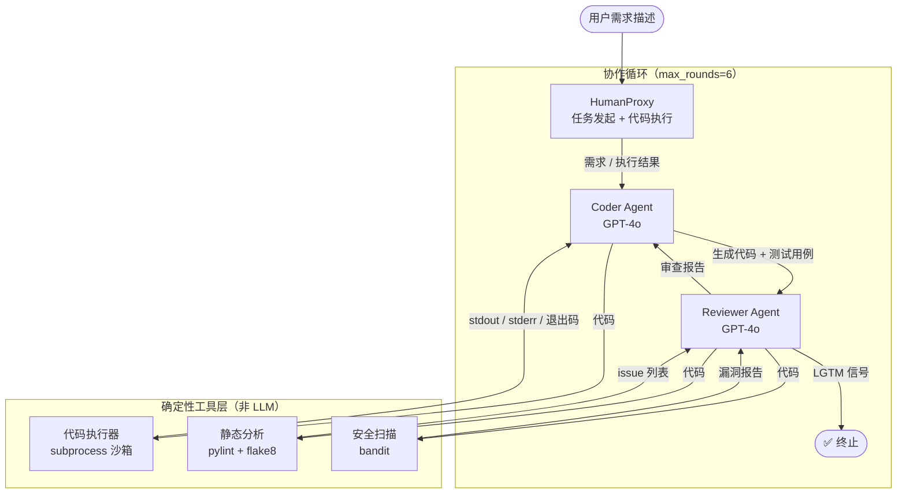

# 5.4 【动手】搭建代码生成+审查的双 Agent 系统

## 实验目标

本节结束后，你将能够搭建一个由 Coder Agent 和 Reviewer Agent 组成的自主协作系统：Coder 根据需求生成代码并自动运行测试，Reviewer 执行静态分析、安全扫描与风格检查，两者形成闭环迭代直至代码达标。

**核心学习点（3 个）：**

1. **双 Agent 对话协议设计**：如何设计消息格式让两个 Agent 能准确传递代码、测试结果和审查意见，而不产生语义混淆。
2. **工具与 Agent 的边界**：静态分析、测试执行是确定性工具（不需要 LLM 判断），应当在 Agent 外部执行后将结果注入上下文——而不是让 LLM "假装"执行。
3. **终止条件的工程权衡**：通过率阈值和最大轮次是两个不同维度的保护机制，缺一不可，本节展示如何同时实现两者。

---

## 架构总览



**架构关键决策**：所有确定性检查（测试运行、lint、bandit）都在 Python 层完成，结果以结构化文本注入 Agent 的下一条消息。这样做的原因：LLM 无法真正"执行"代码，让它假装执行只会引入幻觉；而确定性工具的结果是事实，必须先于 LLM 推理拿到。

---

## 环境准备

```bash
# 创建虚拟环境（uv）
uv venv --python 3.11 && source .venv/bin/activate

# 安装依赖（锁定版本）
uv pip install \
    pyautogen==0.2.38 \
    pylint==3.3.1 \
    bandit==1.8.3 \
    flake8==7.1.1 \
    pytest==8.3.4 \
    python-dotenv==1.0.1 \
    openai==1.57.0
```

> Colab 用户：`!pip install pyautogen==0.2.38 pylint==3.3.1 bandit==1.8.3 flake8==7.1.1 pytest==8.3.4 python-dotenv==1.0.1` 即可

```bash
# 创建项目结构
mkdir dual_agent_system && cd dual_agent_system
touch .env tools.py agents.py main.py
```

```bash
# .env 文件
OPENAI_API_KEY=sk-...
```

---

## Step-by-Step 实现

### Step 1：构建确定性工具层

**目标**：封装代码执行、静态分析、安全扫描三个工具，让它们返回结构化字符串，方便注入 Agent 消息。工具层必须是"愚蠢但准确"的——不做任何 LLM 调用，只执行并返回事实。

```python
# tools.py
"""
确定性工具层：代码执行、静态分析、安全扫描。
所有函数均在独立进程中运行，与主进程隔离，防止恶意代码污染状态。
"""

import subprocess
import tempfile
import textwrap
from pathlib import Path
from dataclasses import dataclass


@dataclass
class ToolResult:
    """工具执行结果的统一返回格式"""
    success: bool
    output: str
    score: float  # 0.0 ~ 1.0，供终止条件判断用


def _write_temp_file(code: str, suffix: str = ".py") -> Path:
    """将代码写入临时文件，返回路径。调用方负责清理。"""
    tmp = tempfile.NamedTemporaryFile(
        mode="w", suffix=suffix, delete=False, encoding="utf-8"
    )
    tmp.write(code)
    tmp.flush()
    return Path(tmp.name)


def execute_code_with_tests(implementation: str, test_code: str) -> ToolResult:
    """
    在独立进程中执行实现代码 + pytest 测试用例。

    Args:
        implementation: 被测代码字符串
        test_code: pytest 格式的测试代码字符串

    Returns:
        ToolResult，success=True 表示所有测试通过
    """
    impl_path = _write_temp_file(implementation, ".py")
    # 测试文件 import 实现模块，因此需要放在同一目录
    test_path = impl_path.parent / f"test_{impl_path.name}"

    # 在测试文件顶部注入 sys.path，保证 import 能找到实现文件
    test_with_import = textwrap.dedent(f"""\
        import sys, pathlib
        sys.path.insert(0, str(pathlib.Path(r"{impl_path}").parent))
        from {impl_path.stem} import *  # noqa: F401,F403
        {test_code}
    """)
    test_path.write_text(test_with_import, encoding="utf-8")

    try:
        result = subprocess.run(
            ["python", "-m", "pytest", str(test_path), "-v", "--tb=short", "--no-header"],
            capture_output=True,
            text=True,
            timeout=30,  # 单次测试最多 30 秒，防止死循环
        )
        output = result.stdout + result.stderr

        # 解析通过率：从 pytest 最后一行 "X passed, Y failed" 提取
        passed, total = _parse_pytest_summary(output)
        score = passed / total if total > 0 else 0.0
        success = result.returncode == 0

        return ToolResult(
            success=success,
            output=f"[测试执行结果]\n{output.strip()}\n通过率: {passed}/{total} ({score:.0%})",
            score=score,
        )
    except subprocess.TimeoutExpired:
        return ToolResult(success=False, output="[错误] 测试超时（>30s），可能存在死循环", score=0.0)
    finally:
        impl_path.unlink(missing_ok=True)
        test_path.unlink(missing_ok=True)


def _parse_pytest_summary(output: str) -> tuple[int, int]:
    """从 pytest 输出解析通过数和总数，返回 (passed, total)。"""
    import re
    # 匹配 "3 passed" / "2 passed, 1 failed" 等模式
    passed = sum(int(m) for m in re.findall(r"(\d+) passed", output))
    failed = sum(int(m) for m in re.findall(r"(\d+) failed", output))
    error = sum(int(m) for m in re.findall(r"(\d+) error", output))
    total = passed + failed + error
    return passed, max(total, 1)


def run_static_analysis(code: str) -> ToolResult:
    """
    运行 pylint + flake8 静态分析。

    pylint 给出 0-10 评分，我们要求 >= 8.0 才算通过。
    flake8 检测 PEP8 违规，零容忍 E/W 级别错误。
    """
    code_path = _write_temp_file(code)
    issues: list[str] = []
    pylint_score = 0.0

    try:
        # pylint：忽略 C0114/C0116（docstring 缺失），专注逻辑错误
        pylint_result = subprocess.run(
            ["python", "-m", "pylint", str(code_path),
             "--disable=C0114,C0116,C0115",
             "--output-format=text"],
            capture_output=True, text=True, timeout=15
        )
        pylint_output = pylint_result.stdout
        issues.append(f"[pylint]\n{pylint_output.strip()}")

        # 提取 pylint 评分："Your code has been rated at 8.50/10"
        import re
        match = re.search(r"rated at ([\d.]+)/10", pylint_output)
        pylint_score = float(match.group(1)) if match else 5.0

        # flake8：只报告 E（错误）和 W（警告），忽略 E501（行长度）
        flake8_result = subprocess.run(
            ["python", "-m", "flake8", str(code_path), "--max-line-length=100",
             "--select=E,W", "--exclude=E501"],
            capture_output=True, text=True, timeout=15
        )
        flake8_output = flake8_result.stdout.strip()
        if flake8_output:
            issues.append(f"[flake8]\n{flake8_output}")
        else:
            issues.append("[flake8] ✅ 无 PEP8 违规")

        # 综合评分：pylint 权重 0.7，flake8 通过权重 0.3
        flake8_clean = flake8_result.returncode == 0
        combined_score = (pylint_score / 10.0) * 0.7 + (1.0 if flake8_clean else 0.0) * 0.3
        success = pylint_score >= 8.0 and flake8_clean

        return ToolResult(
            success=success,
            output="\n\n".join(issues) + f"\n\n综合评分: {combined_score:.2f}/1.00",
            score=combined_score,
        )
    finally:
        code_path.unlink(missing_ok=True)


def run_security_scan(code: str) -> ToolResult:
    """
    使用 bandit 扫描常见安全漏洞。

    bandit 严重级别：LOW / MEDIUM / HIGH。
    我们对 HIGH 级别零容忍，MEDIUM 级别超过 2 个即不通过。
    """
    code_path = _write_temp_file(code)

    try:
        result = subprocess.run(
            ["python", "-m", "bandit", str(code_path), "-f", "text", "-ll"],
            capture_output=True, text=True, timeout=15
        )
        output = result.stdout + result.stderr

        import re
        high_count = len(re.findall(r"Severity: High", output, re.IGNORECASE))
        medium_count = len(re.findall(r"Severity: Medium", output, re.IGNORECASE))

        success = high_count == 0 and medium_count <= 2
        # 安全分：HIGH 每个扣 0.3，MEDIUM 每个扣 0.1
        score = max(0.0, 1.0 - high_count * 0.3 - medium_count * 0.1)

        summary = f"HIGH: {high_count} 个  MEDIUM: {medium_count} 个"
        return ToolResult(
            success=success,
            output=f"[bandit 安全扫描]\n{output.strip()}\n{summary}",
            score=score,
        )
    finally:
        code_path.unlink(missing_ok=True)
```

**关键点**：
- 每个工具使用独立的临时文件 + 子进程，执行后立即清理，防止文件堆积。
- `ToolResult.score` 是 0–1 浮点数，后续终止条件会聚合多个工具的 score 做判断。
- ⚠️ `execute_code_with_tests` 中用 `sys.path.insert` 让测试 import 实现模块，这是在无包结构临时文件场景下最稳定的做法。不要尝试 `importlib`——它在临时目录下的行为依赖 Python 版本。

---

### Step 2：定义 Coder Agent

**目标**：Coder Agent 的职责是"写代码 + 写测试 + 根据反馈修改"。其 System Prompt 必须明确输出格式，否则 Reviewer 无法可靠地提取代码块。

```python
# agents.py
"""
双 Agent 系统核心模块：Coder + Reviewer 定义与协作编排。
"""

import os
import re
from typing import Optional
from dotenv import load_dotenv
import autogen

from tools import execute_code_with_tests, run_static_analysis, run_security_scan, ToolResult

load_dotenv()

# ── LLM 配置 ──────────────────────────────────────────────
LLM_CONFIG = {
    "config_list": [
        {
            "model": "gpt-4o",
            "api_key": os.environ["OPENAI_API_KEY"],
        }
    ],
    "temperature": 0.2,  # 代码生成场景低温度更稳定
    "cache_seed": None,   # 生产中关闭缓存保证每次迭代新鲜推理
}

# ── Coder Agent System Prompt ──────────────────────────────
CODER_SYSTEM_PROMPT = """\
你是一位资深 Python 工程师，专注于编写生产质量的代码。

## 你的职责
1. 根据用户需求或 Reviewer 的修改意见，输出 Python 实现代码和对应的 pytest 测试用例。
2. 每次输出必须同时包含实现代码和测试代码，缺一不可。
3. 代码要求：类型注解完整、函数有 docstring、无魔法数字。

## 输出格式（严格遵守，方便程序解析）
```python:implementation
# 此处为实现代码，放在 implementation 标签内
def your_function(...) -> ...:
    ...
```

```python:tests
# 此处为 pytest 测试用例，放在 tests 标签内
def test_your_function():
    ...
```

## 修改原则
- 收到 Reviewer 反馈时，重点修复被标记为 HIGH 或 MEDIUM 级别的问题。
- 若 pylint 评分低于 8.0，优先提升代码结构和命名质量。
- 修改后说明你改了什么、为什么这样改（1-3 句话）。
"""


def make_coder_agent() -> autogen.AssistantAgent:
    """创建 Coder Agent 实例。"""
    return autogen.AssistantAgent(
        name="Coder",
        system_message=CODER_SYSTEM_PROMPT,
        llm_config=LLM_CONFIG,
    )
```

**关键点**：
- System Prompt 中指定了 ` ```python:implementation ` 和 ` ```python:tests ` 两个标签。这是自定义标记，不是标准 Markdown——后续解析器会通过正则 `r"```python:(\w+)\n(.*?)```"` 提取。不使用语言名 `python` 而是加 `:标签` 是为了区分两个代码块。
- `temperature=0.2` 在代码生成场景下比默认的 0.7 稳定得多，可以减少随机引入的 bug。

---

### Step 3：定义 Reviewer Agent

**目标**：Reviewer Agent 不直接运行工具——工具由编排层调用后，将结果注入 Reviewer 的消息。Reviewer 的 LLM 负责综合所有工具报告，输出人类可读的审查意见。

```python
# 继续 agents.py

# ── Reviewer Agent System Prompt ──────────────────────────
REVIEWER_SYSTEM_PROMPT = """\
你是一位严格的代码审查专家，负责综合多个自动化检查工具的结果，给出清晰的修改指令。

## 你收到的上下文
每轮你会收到：
1. Coder 提交的实现代码和测试代码
2. 自动化检查报告（测试执行、pylint/flake8 静态分析、bandit 安全扫描）

## 审查决策规则
- 所有测试通过 AND 静态分析综合评分 >= 0.85 AND 安全评分 >= 0.9 → 输出 "LGTM"
- 否则 → 列出具体问题和修改建议，格式如下：

## 审查意见格式
**整体评分**：X.XX/1.00（各工具评分加权平均）
**通过状态**：✅ 通过 / ❌ 需修改

**问题清单**（仅在需修改时列出）：
1. [HIGH] 问题描述 → 修改建议
2. [MEDIUM] 问题描述 → 修改建议
3. [LOW] 问题描述 → 修改建议（可选修复）

若代码已达标，只需回复：LGTM ✅ 代码通过全部审查，可以合并。
"""


def make_reviewer_agent() -> autogen.AssistantAgent:
    """创建 Reviewer Agent 实例。"""
    return autogen.AssistantAgent(
        name="Reviewer",
        system_message=REVIEWER_SYSTEM_PROMPT,
        llm_config=LLM_CONFIG,
        # is_termination_msg 在编排层统一处理，此处不设置
    )
```

---

### Step 4：构建协作循环与终止条件

**目标**：这是整个系统最核心的编排逻辑。我们不直接使用 AutoGen 的 `GroupChat`，而是手动实现协作循环——原因是需要在每轮 Coder 输出后插入工具调用，而 AutoGen 的默认对话流不支持在消息之间注入确定性工具结果。

```python
# 继续 agents.py

def _extract_code_blocks(message: str) -> dict[str, str]:
    """
    从 Coder 输出中提取 implementation 和 tests 代码块。
    
    Returns:
        {"implementation": "...", "tests": "..."} 或空 dict（解析失败时）
    """
    pattern = re.compile(r"```python:(\w+)\n(.*?)```", re.DOTALL)
    blocks = {match.group(1): match.group(2).strip() for match in pattern.finditer(message)}
    return blocks


def _compute_overall_score(
    test_result: ToolResult,
    lint_result: ToolResult,
    security_result: ToolResult,
) -> float:
    """
    综合评分计算：
    - 测试通过率权重最高（0.5），这是功能正确性的直接指标
    - 静态分析权重 0.3，安全扫描权重 0.2
    """
    return (
        test_result.score * 0.5
        + lint_result.score * 0.3
        + security_result.score * 0.2
    )


def run_dual_agent_loop(
    requirement: str,
    *,
    pass_threshold: float = 0.85,
    max_rounds: int = 6,
    verbose: bool = True,
) -> dict:
    """
    执行双 Agent 协作循环。

    Args:
        requirement: 用户需求描述（自然语言）
        pass_threshold: 综合评分达到此值则视为通过，默认 0.85
        max_rounds: 最大协作轮次，防止无限循环，默认 6（即 3 次完整 Coder→Reviewer 往返）
        verbose: 是否打印详细执行日志

    Returns:
        {
            "success": bool,
            "rounds": int,
            "final_code": str,
            "final_score": float,
            "history": list[dict]  # 每轮的消息和评分记录
        }
    """
    coder = make_coder_agent()
    reviewer = make_reviewer_agent()
    history: list[dict] = []

    # 初始消息：将需求发给 Coder
    current_message = f"请根据以下需求，编写实现代码和 pytest 测试用例：\n\n{requirement}"
    last_implementation = ""
    final_score = 0.0

    for round_num in range(1, max_rounds + 1):
        if verbose:
            print(f"\n{'='*60}")
            print(f"🔄 第 {round_num} 轮 / 共 {max_rounds} 轮")
            print(f"{'='*60}")

        # ── Phase A：Coder 生成代码 ────────────────────────────
        coder_response = coder.generate_reply(
            messages=[{"role": "user", "content": current_message}]
        )
        if verbose:
            print(f"\n[Coder] 输出：\n{coder_response[:500]}...")  # 截断显示

        # 提取代码块
        blocks = _extract_code_blocks(coder_response)
        if "implementation" not in blocks or "tests" not in blocks:
            # Coder 没有按格式输出，强制提示重试（不消耗轮次）
            current_message = (
                "你的输出缺少必要的代码块。请严格按照格式输出：\n"
                "```python:implementation\n...\n```\n"
                "和\n"
                "```python:tests\n...\n```"
            )
            if verbose:
                print("⚠️  Coder 输出格式错误，要求重试...")
            continue

        implementation = blocks["implementation"]
        test_code = blocks["tests"]
        last_implementation = implementation

        # ── Phase B：运行确定性工具 ───────────────────────────
        if verbose:
            print("\n🔧 运行自动化检查...")

        test_result = execute_code_with_tests(implementation, test_code)
        lint_result = run_static_analysis(implementation)
        security_result = run_security_scan(implementation)

        final_score = _compute_overall_score(test_result, lint_result, security_result)

        if verbose:
            print(f"  测试: {test_result.score:.0%}  "
                  f"静态分析: {lint_result.score:.2f}  "
                  f"安全: {security_result.score:.2f}  "
                  f"综合: {final_score:.2f}")

        # ── Phase C：记录本轮历史 ─────────────────────────────
        round_record = {
            "round": round_num,
            "coder_output": coder_response,
            "implementation": implementation,
            "test_result": test_result.output,
            "lint_result": lint_result.output,
            "security_result": security_result.output,
            "score": final_score,
        }
        history.append(round_record)

        # ── Phase D：检查终止条件 ─────────────────────────────
        if final_score >= pass_threshold:
            if verbose:
                print(f"\n✅ 综合评分 {final_score:.2f} >= 阈值 {pass_threshold}，触发提前终止")
            return {
                "success": True,
                "rounds": round_num,
                "final_code": implementation,
                "final_score": final_score,
                "history": history,
            }

        if round_num == max_rounds:
            if verbose:
                print(f"\n⛔ 已达最大轮次 {max_rounds}，强制终止（最终评分: {final_score:.2f}）")
            break

        # ── Phase E：将工具结果 + Coder 代码发给 Reviewer ──────
        reviewer_input = (
            f"## 第 {round_num} 轮代码审查\n\n"
            f"### 实现代码\n```python\n{implementation}\n```\n\n"
            f"### 自动化检查报告\n\n"
            f"{test_result.output}\n\n"
            f"{lint_result.output}\n\n"
            f"{security_result.output}\n\n"
            f"综合评分：{final_score:.2f}/1.00（阈值 {pass_threshold}）\n\n"
            "请给出审查意见，若已达标则回复 LGTM。"
        )

        reviewer_response = reviewer.generate_reply(
            messages=[{"role": "user", "content": reviewer_input}]
        )
        if verbose:
            print(f"\n[Reviewer] 意见：\n{reviewer_response}")

        history[-1]["reviewer_feedback"] = reviewer_response

        # 检查 Reviewer 是否已经说 LGTM（双重保险，理论上评分应先触发）
        if "LGTM" in reviewer_response:
            if verbose:
                print("\n✅ Reviewer 明确标注 LGTM，终止循环")
            return {
                "success": True,
                "rounds": round_num,
                "final_code": implementation,
                "final_score": final_score,
                "history": history,
            }

        # ── Phase F：将 Reviewer 意见传回给 Coder ─────────────
        current_message = (
            f"Reviewer 提出了以下修改意见，请根据反馈重新实现：\n\n"
            f"{reviewer_response}\n\n"
            "请输出完整的修改后代码（不要只输出 diff，输出完整实现和测试）。"
        )

    return {
        "success": False,
        "rounds": max_rounds,
        "final_code": last_implementation,
        "final_score": final_score,
        "history": history,
    }
```

**关键点**：
- **两级终止条件**：评分阈值（`pass_threshold`）是质量门禁，最大轮次（`max_rounds`）是安全阀，两者在不同维度保护系统。只有阈值没有轮次上限，会在 Coder 和 Reviewer 意见不一致时产生死循环。
- **格式错误不消耗轮次**：当 Coder 没有按格式输出时，我们 `continue` 而不增加有效轮次计数。这保证了"最大轮次"指的是有效迭代次数，而不是包含格式重试的总消息数。
- ⚠️ `generate_reply` 每次都传入完整 `messages`，这意味着 AutoGen 的内置记忆不生效。我们手动管理 `current_message`，让每次调用都是无状态的——这在 Agent 轮次之间注入工具结果时更可控。

---

### Step 5：入口文件与配置

```python
# main.py
"""
双 Agent 代码生成+审查系统入口。
"""

from agents import run_dual_agent_loop


def main() -> None:
    # 示例需求：实现一个带缓存的斐波那契计算函数
    requirement = """
    实现一个 Python 函数 `fibonacci(n: int) -> int`，要求：
    1. 使用 LRU 缓存避免重复计算
    2. 对负数输入抛出 ValueError，错误信息为 "n must be non-negative"
    3. 支持 n=0（返回 0）和 n=1（返回 1）
    4. 函数本身不能有副作用（纯函数）
    同时实现 `fibonacci_sequence(count: int) -> list[int]`，返回前 count 个斐波那契数列。
    """

    result = run_dual_agent_loop(
        requirement,
        pass_threshold=0.85,
        max_rounds=6,
        verbose=True,
    )

    print("\n" + "="*60)
    print("📊 最终结果")
    print("="*60)
    print(f"状态: {'✅ 成功' if result['success'] else '❌ 未达标'}")
    print(f"轮次: {result['rounds']}")
    print(f"综合评分: {result['final_score']:.2f}/1.00")
    print(f"\n最终代码：\n{result['final_code']}")


if __name__ == "__main__":
    main()
```

---

## 完整运行验证

```python
# 端到端冒烟测试（直接复制运行）
# smoke_test.py

import os
os.environ["OPENAI_API_KEY"] = "your-key-here"  # 或从 .env 读取

from agents import run_dual_agent_loop

result = run_dual_agent_loop(
    requirement="实现 `add(a: int, b: int) -> int` 函数，对非整数输入抛出 TypeError。",
    pass_threshold=0.80,
    max_rounds=3,
    verbose=True,
)

assert result["final_code"] != "", "final_code 不应为空"
print(f"\n冒烟测试完成：{result['rounds']} 轮，评分 {result['final_score']:.2f}")
```

预期输出示例：
```
============================================================
🔄 第 1 轮 / 共 3 轮
============================================================

[Coder] 输出：
```python:implementation
from functools import lru_cache
...

🔧 运行自动化检查...
  测试: 100%  静态分析: 0.91  安全: 1.00  综合: 0.87

✅ 综合评分 0.87 >= 阈值 0.80，触发提前终止

============================================================
📊 最终结果
============================================================
状态: ✅ 成功
轮次: 1
综合评分: 0.87/1.00

最终代码：
def add(a: int, b: int) -> int:
    ...

冒烟测试完成：1 轮，评分 0.87
```

---

## 常见报错与解决方案

| 报错信息 | 原因 | 解决方案 |
|---------|------|---------|
| `ModuleNotFoundError: No module named 'autogen'` | 包名歧义，pip 上有多个 autogen | 确认安装的是 `pyautogen`：`uv pip install pyautogen==0.2.38` |
| `openai.AuthenticationError: Invalid API key` | `.env` 未加载或 key 错误 | 确认 `load_dotenv()` 在 `os.environ["OPENAI_API_KEY"]` 之前调用 |
| `FileNotFoundError: pylint` | pylint 未安装或不在 PATH | `uv pip install pylint`，Colab 需 `!pip install pylint` |
| `subprocess.TimeoutExpired` | 测试代码有死循环 | Coder 生成了无限循环的测试，检查 `test_code` 内容；可将 timeout 从 30s 降到 10s |
| `KeyError: 'implementation'` | Coder 输出不含代码块标签 | 检查 System Prompt 是否完整传入；部分模型需要在 `current_message` 中再次强调格式 |
| `bandit: command not found` | bandit 用 `python -m` 调用但未安装 | `uv pip install bandit==1.8.3` |

> ⚠️ **生产注意**：本实验中的 `subprocess` 沙箱并非真正安全隔离——Coder 生成的代码在当前进程的用户权限下执行，可以访问文件系统。生产环境请替换为 [E2B](https://e2b.dev/) 或 Docker 容器化的代码执行沙箱，使用网络隔离 + 资源限制（CPU/Memory cgroup）。

> ⚠️ **生产注意**：`generate_reply` 每次调用都消耗 LLM Token。6 轮循环 × 2 个 Agent = 最多 12 次 API 调用。建议在 `LLM_CONFIG` 中设置 `max_tokens` 限制单次输出长度，并接入 Token 计数日志（参考 Module 6.2）。

---

## 扩展练习（可选）

1. 🟡 **中等：增加 Reviewer 的分层反馈策略**。当前 Reviewer 同等对待所有问题。改进方案：让 Reviewer 输出 `{"must_fix": [...], "nice_to_have": [...]}` 结构，Coder 在最后一轮时只修复 `must_fix` 问题，跳过 `nice_to_have`——这模拟真实 Code Review 中的优先级管理。

2. 🔴 **困难：引入第三个 Security Agent 专职做威胁建模**。当 bandit 发现 MEDIUM 级别以上问题时，不直接把 bandit 报告发给 Reviewer，而是先经过 Security Agent 做威胁分析（"这个 SQL 注入风险的实际可利用性是高/中/低？"），Security Agent 的结论再和 lint 结果一起发给 Reviewer。这是 Module 5.1 中"流水线模式"的实际应用，需要修改 `run_dual_agent_loop` 引入三方通信逻辑。
