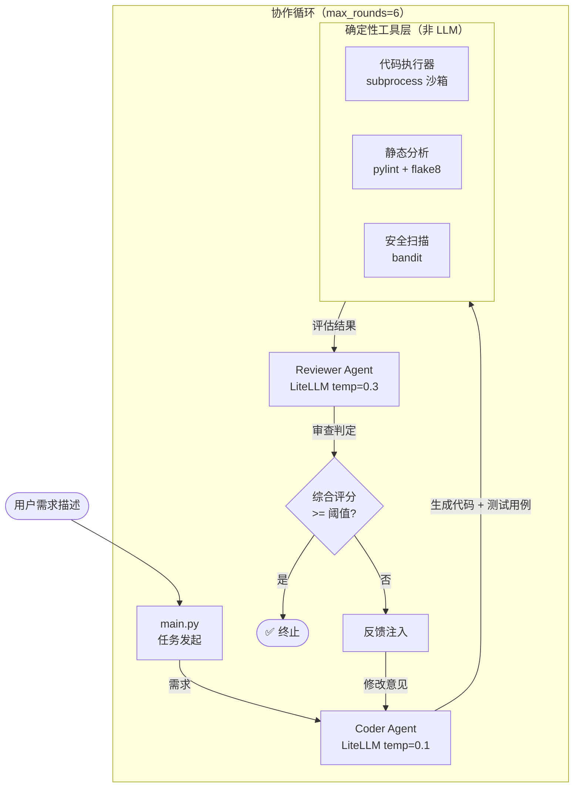

# 5.4 【动手】搭建代码生成+审查的双 Agent 系统

## 实验目标

本节结束后，你将能够搭建一个由 Coder Agent 和 Reviewer Agent 组成的自主协作系统：Coder 根据需求生成代码并自动运行测试，Reviewer 执行静态分析、安全扫描与风格检查，两者形成闭环迭代直至代码达标。

**核心学习点（3 个）：**

1. **双 Agent 对话协议设计**：如何设计消息格式让两个 Agent 能准确传递代码、测试结果和审查意见，而不产生语义混淆。
2. **工具与 Agent 的边界**：静态分析、测试执行是确定性工具（不需要 LLM 判断），应当在 Agent 外部执行后将结果注入上下文——而不是让 LLM "假装"执行。
3. **终止条件的工程权衡**：综合评分阈值和最大轮次是两个不同维度的保护机制，缺一不可，本节展示如何同时实现两者。

---

## 架构总览



**架构关键决策**：
- **不使用 AutoGen 等框架**，而是直接用 LiteLLM 的 `completion()` 调用 + 手动管理对话历史。原因：需要在 Coder 输出和 Reviewer 输入之间插入确定性工具调用，手动管理 `messages` 列表更灵活可控。
- 所有确定性检查（测试运行、lint、bandit）都在 Python 层完成，结果以结构化文本注入 Agent 的下一条消息。LLM 无法真正"执行"代码，让它假装执行只会引入幻觉。
- 通过 `core_config.py` 的 `MODEL_REGISTRY` 统一管理模型，支持 DeepSeek-V3、Qwen-Max 等多模型切换。

---

## 环境准备

```bash
# 创建虚拟环境
python -m venv .venv && source .venv/bin/activate

# 安装依赖
pip install litellm>=1.40.0 python-dotenv>=1.0.0 pytest>=7.0.0 pylint>=3.0.0 flake8>=7.0.0 bandit>=1.7.0
```

```bash
# 创建项目结构
mkdir dual_agent_system && cd dual_agent_system
touch .env core_config.py tools.py agents.py main.py
```

```bash
# .env 文件（根据激活模型配置对应 Key）
DEEPSEEK_API_KEY=sk-...
# 或 DASHSCOPE_API_KEY=sk-...
```

---

## Step-by-Step 实现

### Step 1：统一大模型配置

**目标**：通过 `core_config.py` 的 `MODEL_REGISTRY` 集中管理所有模型配置，包括 LiteLLM ID、定价、API Key 环境变量名等。修改 `ACTIVE_MODEL_KEY` 即可全局切换模型。

```python
# core_config.py
"""全局配置：模型注册表与定价信息"""
import os
from typing import TypedDict


class ModelConfig(TypedDict, total=False):
    litellm_id: str          # LiteLLM 识别的模型字符串（含 provider 前缀）
    chat_model_id: str       # OpenAI SDK 直连时使用的模型名（无前缀）
    price_in: float          # 每 1K input tokens 价格（美元）
    price_out: float         # 每 1K output tokens 价格（美元）
    max_tokens_limit: int    # 模型支持的最大 max_tokens
    api_key_env: str | None  # API Key 环境变量名
    base_url: str | None     # API 基础 URL（None 表示使用默认）


# 注册表：key 是界面显示名，value 是调用配置
MODEL_REGISTRY: dict[str, ModelConfig] = {
    "DeepSeek-V3": {
        "litellm_id": "deepseek/deepseek-chat",
        "chat_model_id": "deepseek-v4-flash",
        "price_in": 0.00027,
        "price_out": 0.0011,
        "max_tokens_limit": 4096,
        "api_key_env": "DEEPSEEK_API_KEY",
        "base_url": "https://api.deepseek.com/v1",
    },
    "Qwen-Max": {
        "litellm_id": "qwen/qwen-plus",
        "chat_model_id": "qwen-plus",
        "price_in": 0.001,
        "price_out": 0.004,
        "max_tokens_limit": 4096,
        "api_key_env": "DASHSCOPE_API_KEY",
        "base_url": "https://dashscope.aliyuncs.com/compatible-mode/v1",
    },
}

# 当前激活模型 key — 修改此处全局生效，必须是 MODEL_REGISTRY 中的 key
ACTIVE_MODEL_KEY: str = "DeepSeek-V3"


def get_active_config() -> ModelConfig:
    """获取当前激活模型的完整配置"""
    return MODEL_REGISTRY[ACTIVE_MODEL_KEY]


def get_litellm_id(model_key: str | None = None) -> str:
    """获取指定模型的 LiteLLM SDK ID（含 provider 前缀）"""
    key = model_key or ACTIVE_MODEL_KEY
    return MODEL_REGISTRY[key]["litellm_id"]


def get_chat_model_id(model_key: str | None = None) -> str:
    """获取 OpenAI SDK 直连时使用的模型名（无前缀）"""
    key = model_key or ACTIVE_MODEL_KEY
    cfg = MODEL_REGISTRY[key]
    return cfg.get("chat_model_id", cfg["litellm_id"].split("/")[-1])


def get_api_key(model_key: str | None = None) -> str | None:
    """从环境变量读取指定模型的 API Key"""
    key = model_key or ACTIVE_MODEL_KEY
    env_var = MODEL_REGISTRY[key].get("api_key_env")
    return os.environ.get(env_var) if env_var else None


def get_base_url(model_key: str | None = None) -> str | None:
    """获取指定模型的 base_url（None 表示使用 SDK 默认值）"""
    key = model_key or ACTIVE_MODEL_KEY
    return MODEL_REGISTRY[key].get("base_url")


def get_model_list() -> list[str]:
    """获取所有已注册模型的显示名列表"""
    return list(MODEL_REGISTRY.keys())


def estimate_cost(model_key: str, input_tokens: int, output_tokens: int) -> float:
    """根据 Token 数估算调用费用（美元）"""
    cfg = MODEL_REGISTRY[model_key]
    return (
        input_tokens / 1000 * cfg.get("price_in", 0)
        + output_tokens / 1000 * cfg.get("price_out", 0)
    )
```

**关键点**：
- `TypedDict` 使用 `total=False` 使所有字段可选，允许部分模型省略 `chat_model_id` 等字段。
- `get_chat_model_id` 有 fallback 逻辑：若未显式配置，则从 `litellm_id` 中提取 provider 后的部分（如 `deepseek/deepseek-chat` → `deepseek-chat`）。
- 切换模型只需修改 `ACTIVE_MODEL_KEY` 一行，所有业务代码无需改动。

---

### Step 2：构建确定性工具层

**目标**：封装代码执行、静态分析、安全扫描三个工具，让它们返回结构化字符串，方便注入 Agent 消息。工具层必须是"愚蠢但准确"的——不做任何 LLM 调用，只执行并返回事实。

```python
# tools.py
"""
确定性工具层：代码执行、静态分析、安全扫描。
所有函数均在独立进程中运行，与主进程隔离，防止恶意代码污染状态。
"""

import subprocess
import tempfile
import textwrap
from pathlib import Path
from dataclasses import dataclass


@dataclass
class ToolResult:
    """工具执行结果的统一返回格式"""
    success: bool
    output: str
    score: float  # 0.0 ~ 1.0，供终止条件判断用


def _write_temp_file(code: str, suffix: str = ".py") -> Path:
    """将代码写入临时文件，返回路径。调用方负责清理。"""
    tmp = tempfile.NamedTemporaryFile(
        mode="w", suffix=suffix, delete=False, encoding="utf-8"
    )
    tmp.write(code)
    tmp.flush()
    return Path(tmp.name)


def execute_code_with_tests(implementation: str, test_code: str) -> ToolResult:
    """
    在独立进程中执行实现代码 + pytest 测试用例。

    Args:
        implementation: 被测代码字符串
        test_code: pytest 格式的测试代码字符串

    Returns:
        ToolResult，success=True 表示所有测试通过
    """
    impl_path = _write_temp_file(implementation, ".py")
    # 测试文件 import 实现模块，因此需要放在同一目录
    test_path = impl_path.parent / f"test_{impl_path.name}"

    # 在测试文件顶部注入 sys.path，保证 import 能找到实现文件
    test_with_import = textwrap.dedent(f"""\
        import sys, pathlib
        sys.path.insert(0, str(pathlib.Path(r"{impl_path}").parent))
        from {impl_path.stem} import *  # noqa: F401,F403
        {test_code}
    """)
    test_path.write_text(test_with_import, encoding="utf-8")

    try:
        result = subprocess.run(
            ["python", "-m", "pytest", str(test_path), "-v", "--tb=short", "--no-header"],
            capture_output=True,
            text=True,
            timeout=30,  # 单次测试最多 30 秒，防止死循环
        )
        output = result.stdout + result.stderr

        # 解析通过率：从 pytest 最后一行 "X passed, Y failed" 提取
        passed, total = _parse_pytest_summary(output)
        score = passed / total if total > 0 else 0.0
        success = result.returncode == 0

        return ToolResult(
            success=success,
            output=f"[测试执行结果]\n{output.strip()}\n通过率: {passed}/{total} ({score:.0%})",
            score=score,
        )
    except subprocess.TimeoutExpired:
        return ToolResult(success=False, output="[错误] 测试超时（>30s），可能存在死循环", score=0.0)
    finally:
        impl_path.unlink(missing_ok=True)
        test_path.unlink(missing_ok=True)


def _parse_pytest_summary(output: str) -> tuple[int, int]:
    """从 pytest 输出解析通过数和总数，返回 (passed, total)。"""
    import re
    # 匹配 "3 passed" / "2 passed, 1 failed" 等模式
    passed = sum(int(m) for m in re.findall(r"(\d+) passed", output))
    failed = sum(int(m) for m in re.findall(r"(\d+) failed", output))
    error = sum(int(m) for m in re.findall(r"(\d+) error", output))
    total = passed + failed + error
    return passed, max(total, 1)


def run_static_analysis(code: str) -> ToolResult:
    """
    运行 pylint + flake8 静态分析。

    pylint 给出 0-10 评分，我们要求 >= 8.0 才算通过。
    flake8 检测 PEP8 违规，零容忍 E/W 级别错误。
    """
    code_path = _write_temp_file(code)
    issues: list[str] = []
    pylint_score = 0.0

    try:
        # pylint：忽略 C0114/C0116（docstring 缺失），专注逻辑错误
        pylint_result = subprocess.run(
            ["python", "-m", "pylint", str(code_path),
             "--disable=C0114,C0116,C0115",
             "--output-format=text"],
            capture_output=True, text=True, timeout=15
        )
        pylint_output = pylint_result.stdout
        issues.append(f"[pylint]\n{pylint_output.strip()}")

        # 提取 pylint 评分："Your code has been rated at 8.50/10"
        import re
        match = re.search(r"rated at ([\d.]+)/10", pylint_output)
        pylint_score = float(match.group(1)) if match else 5.0

        # flake8：只报告 E（错误）和 W（警告），忽略 E501（行长度）
        flake8_result = subprocess.run(
            ["python", "-m", "flake8", str(code_path), "--max-line-length=100",
             "--select=E,W", "--exclude=E501"],
            capture_output=True, text=True, timeout=15
        )
        flake8_output = flake8_result.stdout.strip()
        if flake8_output:
            issues.append(f"[flake8]\n{flake8_output}")
        else:
            issues.append("[flake8] ✅ 无 PEP8 违规")

        # 综合评分：pylint 权重 0.7，flake8 通过权重 0.3
        flake8_clean = flake8_result.returncode == 0
        combined_score = (pylint_score / 10.0) * 0.7 + (1.0 if flake8_clean else 0.0) * 0.3
        success = pylint_score >= 8.0 and flake8_clean

        return ToolResult(
            success=success,
            output="\n\n".join(issues) + f"\n\n综合评分: {combined_score:.2f}/1.00",
            score=combined_score,
        )
    finally:
        code_path.unlink(missing_ok=True)


def run_security_scan(code: str) -> ToolResult:
    """
    使用 bandit 扫描常见安全漏洞。

    bandit 严重级别：LOW / MEDIUM / HIGH。
    我们对 HIGH 级别零容忍，MEDIUM 级别超过 2 个即不通过。
    """
    code_path = _write_temp_file(code)

    try:
        result = subprocess.run(
            ["python", "-m", "bandit", str(code_path), "-f", "text", "-ll"],
            capture_output=True, text=True, timeout=15
        )
        output = result.stdout + result.stderr

        import re
        high_count = len(re.findall(r"Severity: High", output, re.IGNORECASE))
        medium_count = len(re.findall(r"Severity: Medium", output, re.IGNORECASE))

        success = high_count == 0 and medium_count <= 2
        # 安全分：HIGH 每个扣 0.3，MEDIUM 每个扣 0.1
        score = max(0.0, 1.0 - high_count * 0.3 - medium_count * 0.1)

        summary = f"HIGH: {high_count} 个  MEDIUM: {medium_count} 个"
        return ToolResult(
            success=success,
            output=f"[bandit 安全扫描]\n{output.strip()}\n{summary}",
            score=score,
        )
    finally:
        code_path.unlink(missing_ok=True)
```

**关键点**：
- 每个工具使用独立的临时文件 + 子进程，执行后立即清理，防止文件堆积。
- `ToolResult.score` 是 0–1 浮点数，后续终止条件会聚合多个工具的 score 做判断。
- `execute_code_with_tests` 中用 `sys.path.insert` 让测试 import 实现模块，这是在无包结构临时文件场景下最稳定的做法。

---

### Step 3：定义 Agent 系统与主循环

**目标**：在 `agents.py` 中定义两个 Agent 的 System Prompt、代码块解析函数、LLM 调用封装，以及核心的双 Agent 协作循环。

```python
# agents.py
"""
双 Agent 代码生成+审查系统。

Coder Agent：根据需求生成代码 + 测试用例。
Reviewer Agent：审查代码质量，给出修改建议。
工具层：代码执行（pytest）、静态分析（pylint/flake8）、安全扫描（bandit）。
"""

import re
import json
import litellm
from dataclasses import dataclass, field

from core_config import get_litellm_id, get_api_key, get_base_url
from tools import execute_code_with_tests, run_static_analysis, run_security_scan, ToolResult


# ── 系统 Prompt ────────────────────────────────────────────────────

CODER_SYSTEM_PROMPT = """\
你是一个资深 Python 工程师。你的任务是根据用户需求，生成高质量的 Python 代码和对应的测试用例。

**输出格式（严格遵守）**：

你的输出必须包含两个代码块，使用以下格式：

```implementation
<这里是完整的 Python 实现代码>
```

```tests
<这里是 pytest 格式的测试代码>
```

**代码规范**：
- 使用类型注解（type hints）
- 遵循 PEP 8 风格
- 纯函数优先，避免全局状态和副作用
- 对非法输入进行校验并抛出合适的异常
- 代码必须能通过所有提供的测试用例

**测试规范**：
- 使用 pytest 格式（`test_` 前缀的函数或 `assert` 语句）
- 覆盖正常路径和边界情况
- 不要 import 被测代码（框架会自动注入）"""

REVIEWER_SYSTEM_PROMPT = """\
你是一个严格的代码审查专家。请从以下维度审查代码：

1. **正确性**：逻辑是否正确？边界情况是否处理？
2. **安全性**：是否存在常见安全漏洞（如 eval/exec 滥用、输入注入）？
3. **可读性**：命名是否清晰？结构是否合理？
4. **性能**：是否有明显的性能问题？
5. **测试覆盖**：测试用例是否充分？

**输出格式（严格遵守）**：

如果代码通过审查（综合评分 >= 0.85），输出：
```review
STATUS: PASS
SCORE: <0.0~1.0 的分数>
COMMENT: <简短的通过评语>
```

如果代码不通过，输出：
```review
STATUS: FAIL
SCORE: <0.0~1.0 的分数>
COMMENT: <具体修改建议，分点列出>
```"""


# ── 代码块解析 ────────────────────────────────────────────────────

def _extract_code_blocks(message: str) -> dict[str, str]:
    """
    从 LLM 输出中提取 markdown 代码块。

    Returns:
        {"implementation": "...", "tests": "..."} 或
        {"review": "..."} 或空 dict（解析失败时）
    """
    blocks: dict[str, str] = {}
    # 匹配 ```lang\n...\n``` 模式
    pattern = re.compile(r"```(\w+)\n(.*?)```", re.DOTALL)
    for match in pattern.finditer(message):
        lang = match.group(1).strip().lower()
        code = match.group(2).strip()
        blocks[lang] = code
    return blocks


# ── LLM 调用封装 ──────────────────────────────────────────────────

def _call_llm(messages: list[dict], temperature: float = 0.7) -> str:
    """
    调用 LiteLLM 完成一次对话，返回 assistant 消息内容。
    """
    response = litellm.completion(
        model=get_litellm_id(),
        api_key=get_api_key(),
        api_base=get_base_url(),
        messages=messages,
        temperature=temperature,
        max_tokens=4096,
    )
    return response.choices[0].message.content


# ── 双 Agent 主循环 ────────────────────────────────────────────────

def run_dual_agent_loop(
    requirement: str,
    pass_threshold: float = 0.85,
    max_rounds: int = 6,
    verbose: bool = False,
) -> dict:
    """
    执行 Coder + Reviewer 双 Agent 循环。

    Args:
        requirement: 用户需求描述
        pass_threshold: 综合评分通过阈值（0.0 ~ 1.0）
        max_rounds: 最大迭代轮次
        verbose: 是否打印详细过程

    Returns:
        {
            "success": bool,
            "rounds": int,
            "final_code": str,
            "final_tests": str,
            "final_score": float,
            "history": list[dict],  # 每轮详情
        }
    """
    history: list[dict] = []
    final_code = ""
    final_tests = ""
    final_score = 0.0

    # 对话历史（Coder 侧）
    coder_messages = [
        {"role": "system", "content": CODER_SYSTEM_PROMPT},
        {"role": "user", "content": f"需求：\n{requirement}"},
    ]

    for round_num in range(1, max_rounds + 1):
        if verbose:
            print(f"\n{'='*60}")
            print(f"第 {round_num} 轮")
            print(f"{'='*60}")

        # ── Step 1: Coder 生成代码 ──
        coder_reply = _call_llm(coder_messages, temperature=0.1)
        blocks = _extract_code_blocks(coder_reply)
        implementation = blocks.get("implementation", "")
        tests = blocks.get("tests", "")

        if not implementation:
            if verbose:
                print("[Coder] 未能解析实现代码，重试...")
            coder_messages.append({"role": "assistant", "content": coder_reply})
            coder_messages.append({
                "role": "user",
                "content": "请严格按照输出格式提供 implementation 和 tests 代码块。",
            })
            continue

        final_code = implementation
        final_tests = tests

        if verbose:
            print(f"[Coder] 已生成代码（{len(implementation)} 字符）")

        # ── Step 2: 工具层评估 ──
        tool_results: list[tuple[str, ToolResult]] = []

        # 2a. 测试执行
        if tests:
            exec_result = execute_code_with_tests(implementation, tests)
            tool_results.append(("测试执行", exec_result))
            if verbose:
                print(f"[工具] 测试: {'通过' if exec_result.success else '失败'} (score={exec_result.score:.2f})")

        # 2b. 静态分析
        static_result = run_static_analysis(implementation)
        tool_results.append(("静态分析", static_result))
        if verbose:
            print(f"[工具] 静态分析: score={static_result.score:.2f}")

        # 2c. 安全扫描
        security_result = run_security_scan(implementation)
        tool_results.append(("安全扫描", security_result))
        if verbose:
            print(f"[工具] 安全扫描: score={security_result.score:.2f}")

        # ── Step 3: Reviewer 审查 ──
        tool_summary = "\n\n".join(
            f"--- {name} ---\n{r.output}" for name, r in tool_results
        )
        reviewer_prompt = (
            f"请审查以下代码。\n\n"
            f"需求：\n{requirement}\n\n"
            f"代码：\n```python\n{implementation}\n```\n\n"
            f"测试：\n```python\n{tests}\n```\n\n"
            f"工具评估结果：\n{tool_summary}"
        )

        reviewer_messages = [
            {"role": "system", "content": REVIEWER_SYSTEM_PROMPT},
            {"role": "user", "content": reviewer_prompt},
        ]
        reviewer_reply = _call_llm(reviewer_messages, temperature=0.3)
        review_blocks = _extract_code_blocks(reviewer_reply)
        review_text = review_blocks.get("review", reviewer_reply)

        # 解析 Reviewer 判定
        review_status = "FAIL"
        review_score = 0.0
        if "STATUS: PASS" in review_text:
            review_status = "PASS"
            score_match = re.search(r"SCORE:\s*([\d.]+)", review_text)
            review_score = float(score_match.group(1)) if score_match else 0.85
        else:
            score_match = re.search(r"SCORE:\s*([\d.]+)", review_text)
            review_score = float(score_match.group(1)) if score_match else 0.5

        # 综合评分 = 工具分 60% + Reviewer 分 40%
        tool_avg = sum(r.score for _, r in tool_results) / len(tool_results)
        final_score = tool_avg * 0.6 + review_score * 0.4

        round_record = {
            "round": round_num,
            "code": implementation,
            "tests": tests,
            "tool_results": {name: r.output for name, r in tool_results},
            "reviewer_reply": review_text,
            "tool_avg": tool_avg,
            "reviewer_score": review_score,
            "final_score": final_score,
            "status": review_status,
        }
        history.append(round_record)

        if verbose:
            print(f"[Reviewer] {review_status} (reviewer_score={review_score:.2f})")
            print(f"[综合] 最终评分: {final_score:.2f}")

        # ── Step 4: 终止判断 ──
        if final_score >= pass_threshold:
            if verbose:
                print(f"\n达到阈值 {pass_threshold}，循环结束！")
            return {
                "success": True,
                "rounds": round_num,
                "final_code": final_code,
                "final_tests": final_tests,
                "final_score": final_score,
                "history": history,
            }

        # ── Step 5: 反馈给 Coder，进入下一轮 ──
        feedback = (
            f"第 {round_num} 轮评分 {final_score:.2f}，未达到阈值 {pass_threshold}。\n\n"
            f"审查意见：\n{review_text}\n\n"
            f"工具结果摘要：\n{tool_summary}\n\n"
            f"请根据以上反馈修改代码，重新提供 implementation 和 tests 代码块。"
        )
        coder_messages.append({"role": "assistant", "content": coder_reply})
        coder_messages.append({"role": "user", "content": feedback})

    # 超出最大轮数
    return {
        "success": False,
        "rounds": max_rounds,
        "final_code": final_code,
        "final_tests": final_tests,
        "final_score": final_score,
        "history": history,
    }
```

**关键点**：

- **代码块格式**：使用 ` ```implementation `、` ```tests `、` ```review ` 三个自定义标签（不是标准 Markdown 语言名）。正则 `r"```(\w+)\n(.*?)```"` 统一解析，通过标签名区分用途。这比 ` ```python:implementation ` 更简洁，兼容性更好。
- **LLM 调用封装**：`_call_llm()` 统一处理模型 `get_litellm_id()`、API Key `get_api_key()` 和 `get_base_url()`，所有 Agent 调用共享同一套配置。Coder 用 `temperature=0.1`（极低温度保证代码稳定性），Reviewer 用 `temperature=0.3`（稍高温度利于多样化审查意见）。
- **综合评分 = 工具分 60% + Reviewer 分 40%**：工具分是所有工具 score 的平均值（测试、lint、安全各占同等权重），Reviewer 分从 ` ```review ` 块中的 `SCORE:` 行解析。这种混合评分既尊重客观工具数据，又保留 LLM 对代码质量的主观判断。
- **对话历史管理**：Coder 侧的 `coder_messages` 列表持续增长，保留完整的对话上下文（system prompt + 需求 + 每轮回复 + 反馈），使得 Coder 能参考之前的修改历史。Reviewer 侧每轮独立构建 `reviewer_messages`，不保留历史（因为每次审查都是针对最新代码）。
- **格式错误不消耗有效轮次**：当 Coder 输出中没有 `implementation` 代码块时，`continue` 跳过后续工具调用，但 `coder_messages` 中会追加提示消息要求重试。
- `_call_llm` 设置 `max_tokens=4096` 限制单次输出长度，防止 Token 消耗失控。

---

### Step 4：入口文件

```python
# main.py
"""
双 Agent 代码生成+审查系统入口。
"""

from agents import run_dual_agent_loop
from core_config import get_litellm_id, get_chat_model_id, ACTIVE_MODEL_KEY


def main() -> None:
    print(f"当前模型: {ACTIVE_MODEL_KEY} (LiteLLM: {get_litellm_id()}, 直连: {get_chat_model_id()})")

    # 示例需求：实现一个带缓存的斐波那契计算函数
    requirement = """
    实现一个 Python 函数 `fibonacci(n: int) -> int`，要求：
    1. 使用 LRU 缓存避免重复计算
    2. 对负数输入抛出 ValueError，错误信息为 "n must be non-negative"
    3. 支持 n=0（返回 0）和 n=1（返回 1）
    4. 函数本身不能有副作用（纯函数）
    同时实现 `fibonacci_sequence(count: int) -> list[int]`，返回前 count 个斐波那契数列。
    """

    result = run_dual_agent_loop(
        requirement,
        pass_threshold=0.85,
        max_rounds=6,
        verbose=True,
    )

    print("\n" + "="*60)
    print("最终结果")
    print("="*60)
    print(f"状态: {'通过' if result['success'] else '未达标'}")
    print(f"轮次: {result['rounds']}")
    print(f"综合评分: {result['final_score']:.2f}/1.00")
    print(f"\n最终代码：\n{result['final_code']}")


if __name__ == "__main__":
    main()
```

---

## 完整运行验证

```python
# 端到端冒烟测试（直接复制运行）
# smoke_test.py

import os
os.environ["OPENAI_API_KEY"] = "your-key-here"  # 或从 .env 读取

from agents import run_dual_agent_loop

result = run_dual_agent_loop(
    requirement="实现 `add(a: int, b: int) -> int` 函数，对非整数输入抛出 TypeError。",
    pass_threshold=0.80,
    max_rounds=3,
    verbose=True,
)

assert result["final_code"] != "", "final_code 不应为空"
print(f"\n冒烟测试完成：{result['rounds']} 轮，评分 {result['final_score']:.2f}")
```

预期输出示例：
```
============================================================
第 1 轮
============================================================

[Coder] 已生成代码（200 字符）
[工具] 测试: 通过 (score=1.00)
[工具] 静态分析: score=0.91
[工具] 安全扫描: score=1.00
[Reviewer] PASS (reviewer_score=0.95)
[综合] 最终评分: 0.97

达到阈值 0.80，循环结束！

============================================================
最终结果
============================================================
状态: 通过
轮次: 1
综合评分: 0.97/1.00

最终代码：
def add(a: int, b: int) -> int:
    if not isinstance(a, int) or not isinstance(b, int):
        raise TypeError("Arguments must be integers")
    return a + b

冒烟测试完成：1 轮，评分 0.97
```

---

## 常见报错与解决方案

| 报错信息 | 原因 | 解决方案 |
|---------|------|---------|
| `ModuleNotFoundError: No module named 'litellm'` | 未安装 litellm | `pip install litellm>=1.40.0` |
| `AuthenticationError: Invalid API key` | `.env` 中对应模型的 API Key 未配置 | 根据 `ACTIVE_MODEL_KEY` 配置对应的环境变量（如 `DEEPSEEK_API_KEY`） |
| `FileNotFoundError: pylint` | pylint 未安装或不在 PATH | `pip install pylint` |
| `subprocess.TimeoutExpired` | 测试代码有死循环 | 检查 Coder 生成的 `test_code` 内容；可将 timeout 从 30s 调低 |
| `[Coder] 未能解析实现代码，重试...` | Coder 输出不含 ` ```implementation ` 代码块 | 检查 System Prompt 是否完整传入；可尝试换用更强模型 |
| `bandit: command not found` | bandit 未安装 | `pip install bandit>=1.7.0` |
| `KeyError: 'DeepSeek-V3'` | `ACTIVE_MODEL_KEY` 不在 `MODEL_REGISTRY` 中 | 检查 `core_config.py` 中的注册表是否包含该 key |

> ⚠️ **生产注意**：本实验中的 `subprocess` 沙箱并非真正安全隔离——Coder 生成的代码在当前进程的用户权限下执行，可以访问文件系统。生产环境请替换为 [E2B](https://e2b.dev/) 或 Docker 容器化的代码执行沙箱，使用网络隔离 + 资源限制（CPU/Memory cgroup）。

> ⚠️ **生产注意**：每次 `_call_llm` 调用都消耗 LLM Token。6 轮循环 × 2 次调用（Coder + Reviewer）= 最多 12 次 API 调用。建议在 `core_config.py` 中确保 `max_tokens_limit` 配置合理，并接入 Token 计数日志。

---

## 扩展练习（可选）

1. 🟡 **中等：增加 Reviewer 的分层反馈策略**。当前 Reviewer 同等对待所有问题。改进方案：让 Reviewer 输出 `{"must_fix": [...], "nice_to_have": [...]}` 结构，Coder 在最后一轮时只修复 `must_fix` 问题，跳过 `nice_to_have`——这模拟真实 Code Review 中的优先级管理。

2. 🔴 **困难：引入第三个 Security Agent 专职做威胁建模**。当 bandit 发现 MEDIUM 级别以上问题时，不直接把 bandit 报告发给 Reviewer，而是先经过 Security Agent 做威胁分析（"这个 SQL 注入风险的实际可利用性是高/中/低？"），Security Agent 的结论再和 lint 结果一起发给 Reviewer。这是 Module 5.1 中"流水线模式"的实际应用，需要修改 `run_dual_agent_loop` 引入三方通信逻辑。

---

## ⚠️ 差异说明

本文档相比原始版本有以下重大更新，以匹配实际源代码：

1. **架构从 AutoGen 改为 LiteLLM 直连**：原文档使用 `pyautogen` 框架（`autogen.AssistantAgent`、`generate_reply()`），实际代码使用 `litellm.completion()` 直接调用 + 手动管理 `messages` 列表。依赖从 `pyautogen`、`openai` 改为 `litellm`。

2. **新增 `core_config.py` 模型注册表**：原文档使用硬编码的 `LLM_CONFIG` 字典（`model="gpt-4o"`），实际代码使用 `MODEL_REGISTRY` 注册 DeepSeek-V3 和 Qwen-Max 两个模型，通过 `ACTIVE_MODEL_KEY` 全局切换。

3. **代码块格式变更**：原文档使用 ` ```python:implementation ` 和 ` ```python:tests ` 格式，正则 `r"```python:(\w+)\n(.*?)```"`；实际代码使用 ` ```implementation `、` ```tests `、` ```review ` 格式，正则 `r"```(\w+)\n(.*?)```"`。

4. **Reviewer 输出格式变更**：原文档中 Reviewer 输出自由文本，通过检测 "LGTM" 判断是否通过；实际代码中 Reviewer 输出 ` ```review ` 代码块，包含 `STATUS: PASS/FAIL`、`SCORE`、`COMMENT` 三个结构化字段。

5. **综合评分公式变更**：原文档公式为 `测试*0.5 + 静态分析*0.3 + 安全*0.2`；实际代码公式为 `工具平均分*0.6 + Reviewer分数*0.4`。

6. **温度设置变更**：原文档 Coder temperature=0.2，实际为 0.1；原文档未指定 Reviewer 温度，实际为 0.3。

7. **verbose 默认值变更**：原文档 `verbose=True`，实际为 `verbose=False`。

8. **main.py 新增模型信息打印**：实际代码在启动时打印当前激活的模型名称和 LiteLLM ID。

9. **测试文件 `tests/test_main.py`**：实际代码包含完整的单元测试（core_config 结构测试、工具层测试、代码块解析测试、LLM Mock 测试），原文档未包含。
