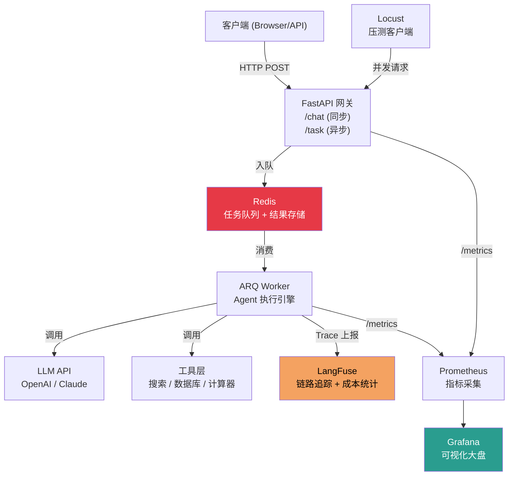

# 6.6 【动手】构建带监控的生产级 Agent 服务

## 实验目标

本节结束后，你将能够：
- 用 FastAPI + ARQ 搭建一个支持异步任务的 Agent 服务，不再被 LLM 调用的高延迟阻塞主线程
- 通过 LangFuse 实现完整的 Agent 执行链路追踪（Trace），精确定位每次工具调用的耗时与 Token 消耗
- 用 Locust 对服务进行压测，找出 CPU/内存/LLM 调用三个维度的瓶颈，给出容量规划结论

**核心学习点**：① 异步任务队列解耦 Agent 长任务与 HTTP 响应；② 可观测性不是锦上添花，是生产稳定性的基础设施；③ 压测不是为了"跑一遍"，是为了找到系统的承压边界。

---

## 架构总览



整体思路：HTTP 网关只负责接收请求和返回 task_id，实际的 Agent 执行由 ARQ Worker 异步完成。这样即使 Agent 跑了 2 分钟，HTTP 连接也不会超时。LangFuse 负责记录每次 LLM 调用的完整上下文，Prometheus + Grafana 负责运营指标监控。

---

## 环境准备

```bash
# 创建虚拟环境（uv）
uv venv --python 3.11 && source .venv/bin/activate

# 安装依赖（锁定版本）
uv pip install \
    fastapi==0.115.6 \
    uvicorn[standard]==0.32.1 \
    arq==0.26.1 \
    redis==5.2.1 \
    langchain-openai==0.3.0 \
    langchain-community==0.3.0 \
    langfuse==2.57.2 \
    prometheus-client==0.21.1 \
    python-dotenv==1.0.1 \
    httpx==0.28.1 \
    pydantic==2.10.4 \
    locust==2.32.6
```

> Colab 用户：`!pip install fastapi uvicorn arq redis langchain-openai langfuse prometheus-client locust` 即可，Redis 使用 `!apt-get install -y redis-server && redis-server --daemonize yes` 启动本地实例。

```bash
# 启动 Redis（本地 Docker）
docker run -d --name redis-agent -p 6379:6379 redis:7-alpine

# 环境变量配置（.env 文件）
cat > .env << 'EOF'
OPENAI_API_KEY=sk-xxxx
LANGFUSE_PUBLIC_KEY=pk-xxxx
LANGFUSE_SECRET_KEY=sk-xxxx
LANGFUSE_HOST=https://cloud.langfuse.com
REDIS_URL=redis://localhost:6379
EOF
```

> ⚠️ 生产注意：LangFuse 支持自托管（Docker Compose 一键启动），数据不出境场景务必自托管，参考 [langfuse.com/docs/deployment/self-host](https://langfuse.com/docs/deployment/self-host)。

---

## Step-by-Step 实现

### Step 1：定义数据模型与配置

**目标**：集中管理所有配置，用 Pydantic 做类型安全保障，避免后续到处写 `os.getenv`。

```python
# config.py
from __future__ import annotations
from functools import lru_cache
from pydantic_settings import BaseSettings  # pydantic v2 拆包，需 pip install pydantic-settings


class Settings(BaseSettings):
    """应用配置，自动从 .env 文件读取。"""

    openai_api_key: str
    langfuse_public_key: str
    langfuse_secret_key: str
    langfuse_host: str = "https://cloud.langfuse.com"
    redis_url: str = "redis://localhost:6379"

    # Agent 运行参数
    agent_max_iterations: int = 10
    agent_timeout_seconds: int = 120

    # 成本控制：单次请求最大 Token 消耗
    max_tokens_per_request: int = 4000

    class Config:
        env_file = ".env"
        env_file_encoding = "utf-8"


@lru_cache(maxsize=1)
def get_settings() -> Settings:
    """全局单例配置，避免重复读取 .env 文件。"""
    return Settings()
```

```python
# models.py
from __future__ import annotations
from datetime import datetime
from enum import Enum
from typing import Any
from pydantic import BaseModel, Field


class TaskStatus(str, Enum):
    PENDING = "pending"
    RUNNING = "running"
    SUCCESS = "success"
    FAILED = "failed"


class ChatRequest(BaseModel):
    """同步对话请求体。"""
    message: str = Field(..., min_length=1, max_length=2000, description="用户输入")
    session_id: str = Field(default="default", description="会话 ID，用于多轮记忆")
    user_id: str | None = Field(default=None, description="用户标识，用于成本归因")


class TaskRequest(BaseModel):
    """异步任务请求体。"""
    message: str = Field(..., min_length=1, max_length=2000)
    session_id: str = "default"
    user_id: str | None = None


class TaskResponse(BaseModel):
    """提交任务后立即返回的响应。"""
    task_id: str
    status: TaskStatus = TaskStatus.PENDING
    created_at: datetime = Field(default_factory=datetime.utcnow)


class TaskResult(BaseModel):
    """任务结果查询响应。"""
    task_id: str
    status: TaskStatus
    result: str | None = None
    error: str | None = None
    duration_ms: int | None = None
    token_usage: dict[str, int] | None = None
    created_at: datetime
    completed_at: datetime | None = None
```

### Step 2：构建带 LangFuse 追踪的 Agent

**目标**：将 LangFuse 的 Trace 能力注入 LangChain Agent，做到每次工具调用、每次 LLM 请求都被完整记录，无需改动业务逻辑。

```python
# agent.py
from __future__ import annotations
import time
import logging
from typing import Any

from langchain.agents import AgentExecutor, create_react_agent
from langchain.tools import Tool
from langchain_openai import ChatOpenAI
from langchain import hub
from langfuse.callback import CallbackHandler as LangfuseCallbackHandler

from config import get_settings

logger = logging.getLogger(__name__)
settings = get_settings()


def build_tools() -> list[Tool]:
    """
    构建工具列表。
    生产环境这里会接入 Tavily 搜索、数据库查询等真实工具。
    本节用简单工具确保代码可立即运行。
    """

    def calculator(expression: str) -> str:
        """安全计算数学表达式，仅允许数字和基本运算符。"""
        allowed_chars = set("0123456789+-*/()., ")
        if not all(c in allowed_chars for c in expression):
            return "错误：表达式包含不允许的字符"
        try:
            result = eval(expression, {"__builtins__": {}}, {})  # noqa: S307
            return str(result)
        except Exception as e:
            return f"计算错误：{e}"

    def get_current_time(_: str) -> str:
        """返回当前时间，演示无参工具的用法。"""
        from datetime import datetime
        return datetime.now().strftime("%Y-%m-%d %H:%M:%S UTC+8")

    def mock_search(query: str) -> str:
        """模拟搜索工具，生产环境替换为 Tavily/Brave Search。"""
        return f"搜索结果（模拟）：关于「{query}」，根据最新资料显示..."

    return [
        Tool(name="calculator", func=calculator, description="计算数学表达式，输入: 数学表达式字符串"),
        Tool(name="get_time", func=get_current_time, description="获取当前时间，输入: 任意字符串"),
        Tool(name="search", func=mock_search, description="搜索网络信息，输入: 搜索关键词"),
    ]


def create_langfuse_handler(
    session_id: str,
    user_id: str | None,
    trace_name: str = "agent_run",
) -> LangfuseCallbackHandler:
    """
    为每次 Agent 执行创建独立的 LangFuse Handler。

    关键设计：每个请求用独立的 Handler，确保 trace 不会跨请求污染。
    session_id 和 user_id 传入后，LangFuse 界面可以按用户/会话过滤。
    """
    return LangfuseCallbackHandler(
        public_key=settings.langfuse_public_key,
        secret_key=settings.langfuse_secret_key,
        host=settings.langfuse_host,
        session_id=session_id,
        user_id=user_id,
        trace_name=trace_name,
        tags=["production", "react-agent"],
    )


async def run_agent(
    message: str,
    session_id: str = "default",
    user_id: str | None = None,
) -> dict[str, Any]:
    """
    执行 Agent 并返回结果与元数据。

    返回值包含：
    - output: Agent 最终回答
    - duration_ms: 总耗时
    - token_usage: 各阶段 Token 消耗（由 LangFuse Handler 汇总）
    """
    start_time = time.monotonic()

    llm = ChatOpenAI(
        model="gpt-4o-mini",  # 生产环境根据任务复杂度动态路由
        temperature=0,
        max_tokens=settings.max_tokens_per_request,
        api_key=settings.openai_api_key,
        streaming=False,
    )

    tools = build_tools()
    # 使用 LangChain Hub 的标准 ReAct 提示词，生产环境建议固定版本 hash
    prompt = hub.pull("hwchase17/react")

    agent = create_react_agent(llm=llm, tools=tools, prompt=prompt)

    langfuse_handler = create_langfuse_handler(
        session_id=session_id,
        user_id=user_id,
    )

    agent_executor = AgentExecutor(
        agent=agent,
        tools=tools,
        max_iterations=settings.agent_max_iterations,
        handle_parsing_errors=True,  # LLM 输出格式错误时不 crash，而是重试
        verbose=False,  # 生产环境关闭，避免日志膨胀
    )

    try:
        result = await agent_executor.ainvoke(
            {"input": message},
            config={"callbacks": [langfuse_handler]},
        )
        # 确保 LangFuse 数据已上报（异步批量上报，需主动 flush）
        langfuse_handler.flush()

        duration_ms = int((time.monotonic() - start_time) * 1000)
        logger.info(
            "agent_run_success",
            extra={"session_id": session_id, "duration_ms": duration_ms},
        )

        return {
            "output": result["output"],
            "duration_ms": duration_ms,
            "token_usage": {},  # LangFuse Handler 已记录详细用量，此处简化
        }

    except Exception as e:
        langfuse_handler.flush()
        duration_ms = int((time.monotonic() - start_time) * 1000)
        logger.error(
            "agent_run_failed",
            extra={"session_id": session_id, "error": str(e), "duration_ms": duration_ms},
        )
        raise
```

**关键点**：
- `langfuse_handler.flush()` 必须在请求结束前调用。LangFuse 默认异步批量上报，不 flush 会在进程退出时丢失最后一批数据，这个问题在 Serverless 环境尤其严重。
- `handle_parsing_errors=True` 是生产必开项。LLM 偶尔会输出格式不合法的 Action，这个参数会把错误信息回传给 LLM 让它重试，而不是直接抛异常。
- ⚠️ `hub.pull("hwchase17/react")` 会在首次运行时从网络拉取 Prompt，本地开发没问题，生产环境建议将 Prompt 内容固化到代码里或缓存到 Redis，避免网络故障导致服务启动失败。

### Step 3：构建 ARQ 异步任务 Worker

**目标**：将 Agent 执行从 HTTP 请求中解耦。ARQ 相比 Celery 的优势是原生 asyncio，与 FastAPI 的异步生态天然契合，且无需 Kombu/Billiard 等重依赖。

```python
# worker.py
from __future__ import annotations
import json
import logging
import uuid
from datetime import datetime, timezone
from typing import Any

from arq import create_pool
from arq.connections import RedisSettings

from agent import run_agent
from config import get_settings

logger = logging.getLogger(__name__)
settings = get_settings()


def _redis_settings() -> RedisSettings:
    """从 REDIS_URL 解析 ARQ 需要的 RedisSettings 对象。"""
    from urllib.parse import urlparse
    parsed = urlparse(settings.redis_url)
    return RedisSettings(
        host=parsed.hostname or "localhost",
        port=parsed.port or 6379,
        password=parsed.password,
    )


async def execute_agent_task(
    ctx: dict[str, Any],
    task_id: str,
    message: str,
    session_id: str,
    user_id: str | None,
) -> None:
    """
    ARQ Worker 执行的任务函数。

    ctx 由 ARQ 注入，包含 Redis 连接等上下文。
    任务结果通过 Redis 存储，供 FastAPI 查询接口读取。
    """
    redis = ctx["redis"]
    result_key = f"task_result:{task_id}"
    created_at = datetime.now(timezone.utc).isoformat()

    # 更新状态为 running
    await redis.set(
        result_key,
        json.dumps({
            "task_id": task_id,
            "status": "running",
            "created_at": created_at,
        }),
        ex=3600,  # 结果保留 1 小时
    )

    try:
        agent_result = await run_agent(
            message=message,
            session_id=session_id,
            user_id=user_id,
        )

        await redis.set(
            result_key,
            json.dumps({
                "task_id": task_id,
                "status": "success",
                "result": agent_result["output"],
                "duration_ms": agent_result["duration_ms"],
                "token_usage": agent_result.get("token_usage"),
                "created_at": created_at,
                "completed_at": datetime.now(timezone.utc).isoformat(),
            }),
            ex=3600,
        )

    except Exception as e:
        logger.exception("task_failed", extra={"task_id": task_id})
        await redis.set(
            result_key,
            json.dumps({
                "task_id": task_id,
                "status": "failed",
                "error": str(e),
                "created_at": created_at,
                "completed_at": datetime.now(timezone.utc).isoformat(),
            }),
            ex=3600,
        )


class WorkerSettings:
    """ARQ Worker 全局配置。"""

    # 注册所有任务函数
    functions = [execute_agent_task]

    # Redis 连接配置
    redis_settings = _redis_settings()

    # 并发控制：同时最多执行 5 个 Agent 任务
    # 核心考量：LLM API 有速率限制，并发过高会触发 429
    max_jobs = 5

    # 任务超时：超过 2 分钟强制终止
    job_timeout = 120

    # 心跳间隔
    health_check_interval = 30
```

**关键点**：
- `max_jobs = 5` 的数字不是拍脑袋定的。假设每个 Agent 平均 3 次 LLM 调用，OpenAI gpt-4o-mini 的 RPM 限制是 500，5 并发 × 3 调用 = 15 RPM，留有充足余量。实际值应根据你的 API Tier 计算。
- 任务结果存 Redis 而非数据库，是因为结果时效性短（1小时即过期），不需要持久化。如果业务需要查历史任务，才值得写入 PostgreSQL。

### Step 4：构建 FastAPI 网关与 Prometheus 指标

**目标**：提供同步（短任务）和异步（长任务）两种接口，并暴露 Prometheus metrics endpoint 供监控系统抓取。

```python
# main.py
from __future__ import annotations
import json
import logging
import uuid
from contextlib import asynccontextmanager
from datetime import datetime, timezone
from typing import AsyncGenerator

from arq import create_pool
from arq.connections import ArqRedis, RedisSettings
from fastapi import FastAPI, HTTPException, Request
from fastapi.responses import JSONResponse
from prometheus_client import (
    Counter,
    Histogram,
    generate_latest,
    CONTENT_TYPE_LATEST,
    CollectorRegistry,
)
from starlette.responses import Response

from agent import run_agent
from config import get_settings
from models import (
    ChatRequest,
    TaskRequest,
    TaskResponse,
    TaskResult,
    TaskStatus,
)
from worker import WorkerSettings

logger = logging.getLogger(__name__)
settings = get_settings()

# ─── Prometheus 指标定义 ────────────────────────────────────────────────────
# 每个指标的 label 设计直接影响 Grafana 的查询灵活度
REQUEST_COUNTER = Counter(
    "agent_requests_total",
    "Total number of agent requests",
    ["endpoint", "status"],  # 按接口和状态码分层
)

LATENCY_HISTOGRAM = Histogram(
    "agent_request_duration_seconds",
    "Agent request duration in seconds",
    ["endpoint"],
    buckets=[0.5, 1.0, 2.0, 5.0, 10.0, 30.0, 60.0, 120.0],  # 适配 LLM 长尾延迟
)

TASK_QUEUE_GAUGE = Counter(
    "agent_tasks_enqueued_total",
    "Total tasks enqueued to ARQ worker",
)

# ─── 应用生命周期管理 ─────────────────────────────────────────────────────────
arq_pool: ArqRedis | None = None


@asynccontextmanager
async def lifespan(app: FastAPI) -> AsyncGenerator[None, None]:
    """FastAPI 生命周期管理：启动时建立 Redis 连接池，关闭时清理。"""
    global arq_pool
    logger.info("connecting_to_redis", extra={"url": settings.redis_url})

    from urllib.parse import urlparse
    parsed = urlparse(settings.redis_url)
    arq_pool = await create_pool(
        RedisSettings(
            host=parsed.hostname or "localhost",
            port=parsed.port or 6379,
            password=parsed.password,
        )
    )
    logger.info("redis_connected")
    yield
    # 关闭时释放连接池
    await arq_pool.close()
    logger.info("redis_disconnected")


app = FastAPI(
    title="Production Agent Service",
    version="1.0.0",
    lifespan=lifespan,
)


# ─── 中间件：自动记录延迟 ─────────────────────────────────────────────────────
@app.middleware("http")
async def metrics_middleware(request: Request, call_next):
    """对每个请求自动记录延迟和状态码，无需在每个路由里手动埋点。"""
    import time
    start = time.monotonic()
    response = await call_next(request)
    duration = time.monotonic() - start

    endpoint = request.url.path
    LATENCY_HISTOGRAM.labels(endpoint=endpoint).observe(duration)
    REQUEST_COUNTER.labels(endpoint=endpoint, status=str(response.status_code)).inc()

    return response


# ─── 路由 ─────────────────────────────────────────────────────────────────────
@app.get("/health")
async def health_check() -> dict:
    """健康检查接口，供 K8s/ECS 探针和 docker-compose healthcheck 使用。"""
    return {"status": "healthy", "timestamp": datetime.now(timezone.utc).isoformat()}


@app.get("/metrics")
async def prometheus_metrics() -> Response:
    """Prometheus 抓取接口，返回 text/plain 格式指标数据。"""
    return Response(
        content=generate_latest(),
        media_type=CONTENT_TYPE_LATEST,
    )


@app.post("/chat", summary="同步对话接口（适合 <30s 的短任务）")
async def chat(request: ChatRequest) -> dict:
    """
    同步执行 Agent 并返回结果。

    ⚠️ 适用场景：预期响应时间 < 30s 的请求。
    超过这个阈值建议切换 /task 异步接口，否则客户端容易超时。
    """
    try:
        result = await run_agent(
            message=request.message,
            session_id=request.session_id,
            user_id=request.user_id,
        )
        return {
            "output": result["output"],
            "duration_ms": result["duration_ms"],
            "session_id": request.session_id,
        }
    except Exception as e:
        logger.exception("chat_endpoint_error")
        raise HTTPException(status_code=500, detail=str(e))


@app.post("/task", response_model=TaskResponse, summary="异步任务接口（适合长任务）")
async def submit_task(request: TaskRequest) -> TaskResponse:
    """
    将 Agent 任务提交到 ARQ 队列，立即返回 task_id。
    客户端通过 GET /task/{task_id} 轮询结果。
    """
    if arq_pool is None:
        raise HTTPException(status_code=503, detail="任务队列未就绪")

    task_id = str(uuid.uuid4())

    # 在 Redis 中预先写入 pending 状态
    result_key = f"task_result:{task_id}"
    await arq_pool.set(
        result_key,
        json.dumps({
            "task_id": task_id,
            "status": "pending",
            "created_at": datetime.now(timezone.utc).isoformat(),
        }),
        ex=3600,
    )

    # 入队
    await arq_pool.enqueue_job(
        "execute_agent_task",
        task_id=task_id,
        message=request.message,
        session_id=request.session_id,
        user_id=request.user_id,
    )
    TASK_QUEUE_GAUGE.inc()

    return TaskResponse(task_id=task_id)


@app.get("/task/{task_id}", response_model=TaskResult, summary="查询异步任务结果")
async def get_task_result(task_id: str) -> TaskResult:
    """轮询任务状态。前端建议以 2s 间隔轮询，任务完成后停止。"""
    if arq_pool is None:
        raise HTTPException(status_code=503, detail="服务未就绪")

    result_key = f"task_result:{task_id}"
    raw = await arq_pool.get(result_key)

    if raw is None:
        raise HTTPException(status_code=404, detail=f"任务 {task_id} 不存在或已过期")

    data = json.loads(raw)
    return TaskResult(
        task_id=data["task_id"],
        status=TaskStatus(data["status"]),
        result=data.get("result"),
        error=data.get("error"),
        duration_ms=data.get("duration_ms"),
        token_usage=data.get("token_usage"),
        created_at=datetime.fromisoformat(data["created_at"]),
        completed_at=(
            datetime.fromisoformat(data["completed_at"])
            if data.get("completed_at")
            else None
        ),
    )
```

### Step 5：配置 Grafana Dashboard

**目标**：用 docker-compose 一键启动 Prometheus + Grafana，导入预配置 Dashboard，5 分钟内看到核心指标。

```yaml
# docker-compose.monitoring.yml
version: "3.8"

services:
  prometheus:
    image: prom/prometheus:v2.55.1
    ports:
      - "9090:9090"
    volumes:
      - ./monitoring/prometheus.yml:/etc/prometheus/prometheus.yml:ro
    command:
      - '--config.file=/etc/prometheus/prometheus.yml'
      - '--storage.tsdb.retention.time=7d'

  grafana:
    image: grafana/grafana:11.4.0
    ports:
      - "3000:3000"
    environment:
      GF_SECURITY_ADMIN_PASSWORD: admin123
      GF_USERS_ALLOW_SIGN_UP: "false"
    volumes:
      - grafana_data:/var/lib/grafana
      - ./monitoring/grafana/provisioning:/etc/grafana/provisioning:ro

volumes:
  grafana_data:
```

```yaml
# monitoring/prometheus.yml
global:
  scrape_interval: 15s

scrape_configs:
  - job_name: "agent-service"
    static_configs:
      - targets: ["host.docker.internal:8000"]  # macOS/Windows Docker 访问宿主机
    # Linux 环境改为宿主机实际 IP，如 172.17.0.1:8000
```

```python
# monitoring/import_dashboard.py
"""
自动向 Grafana 导入 Agent 服务监控 Dashboard。
运行：python monitoring/import_dashboard.py
"""
import json
import httpx

GRAFANA_URL = "http://localhost:3000"
AUTH = ("admin", "admin123")

# 核心 Dashboard 配置（精简版，聚焦最重要的 4 个指标）
dashboard_config = {
    "dashboard": {
        "title": "Agent Service Overview",
        "refresh": "30s",
        "panels": [
            {
                "title": "请求 QPS（按接口）",
                "type": "graph",
                "gridPos": {"h": 8, "w": 12, "x": 0, "y": 0},
                "targets": [{
                    "expr": 'rate(agent_requests_total[1m])',
                    "legendFormat": "{{endpoint}} - {{status}}",
                }],
            },
            {
                "title": "P50/P90/P99 延迟（秒）",
                "type": "graph",
                "gridPos": {"h": 8, "w": 12, "x": 12, "y": 0},
                "targets": [
                    {
                        "expr": 'histogram_quantile(0.50, rate(agent_request_duration_seconds_bucket[5m]))',
                        "legendFormat": "P50",
                    },
                    {
                        "expr": 'histogram_quantile(0.90, rate(agent_request_duration_seconds_bucket[5m]))',
                        "legendFormat": "P90",
                    },
                    {
                        "expr": 'histogram_quantile(0.99, rate(agent_request_duration_seconds_bucket[5m]))',
                        "legendFormat": "P99",
                    },
                ],
            },
            {
                "title": "错误率（5xx）",
                "type": "singlestat",
                "gridPos": {"h": 4, "w": 6, "x": 0, "y": 8},
                "targets": [{
                    "expr": 'rate(agent_requests_total{status=~"5.."}[5m]) / rate(agent_requests_total[5m]) * 100',
                    "legendFormat": "错误率 %",
                }],
            },
            {
                "title": "异步任务入队总量",
                "type": "singlestat",
                "gridPos": {"h": 4, "w": 6, "x": 6, "y": 8},
                "targets": [{
                    "expr": 'agent_tasks_enqueued_total',
                    "legendFormat": "累计入队",
                }],
            },
        ],
        "schemaVersion": 39,
    },
    "overwrite": True,
    "folderId": 0,
}

resp = httpx.post(
    f"{GRAFANA_URL}/api/dashboards/db",
    json=dashboard_config,
    auth=AUTH,
    timeout=10,
)
print(f"Dashboard 导入结果：{resp.status_code} - {resp.json()}")
```

### Step 6：Locust 压测与容量规划

**目标**：用真实流量模型模拟并发，找出系统在哪里先撑不住——是 FastAPI Worker 进程、Redis 连接、还是 LLM API 速率限制。

```python
# locustfile.py
from __future__ import annotations
import json
import time
import random
from locust import HttpUser, task, between, events
from locust.runners import MasterRunner


# 测试用的问题集，覆盖不同复杂度
QUESTIONS = [
    "现在几点了？",                          # 简单：单工具调用
    "计算 (123 * 456 + 789) / 3 的结果",   # 中等：计算器工具
    "搜索一下最新的 AI Agent 进展，并计算如果每天学习 2 小时，30 天能学多少小时", # 复杂：多工具
]


class AgentUser(HttpUser):
    """模拟真实用户行为：提交任务 → 轮询结果。"""

    # 每个虚拟用户在两次请求之间等待 1-3 秒，模拟真实用户节奏
    wait_time = between(1, 3)

    @task(3)
    def test_sync_chat(self):
        """测试同步接口（权重 3：高频）。"""
        question = random.choice(QUESTIONS[:2])  # 同步接口只测简单问题
        with self.client.post(
            "/chat",
            json={
                "message": question,
                "session_id": f"locust-{self.user_id}",
                "user_id": f"user-{self.user_id}",
            },
            timeout=60,
            catch_response=True,
        ) as response:
            if response.status_code == 200:
                response.success()
            else:
                response.failure(f"状态码 {response.status_code}: {response.text[:200]}")

    @task(1)
    def test_async_task(self):
        """测试异步接口（权重 1：低频）：提交任务 → 轮询结果。"""
        question = random.choice(QUESTIONS)

        # Step 1: 提交任务
        submit_resp = self.client.post(
            "/task",
            json={
                "message": question,
                "session_id": f"locust-async-{self.user_id}",
            },
            timeout=10,
        )

        if submit_resp.status_code != 200:
            return

        task_id = submit_resp.json().get("task_id")
        if not task_id:
            return

        # Step 2: 轮询结果（最多等 120s）
        max_polls = 40
        for _ in range(max_polls):
            time.sleep(3)
            poll_resp = self.client.get(f"/task/{task_id}", timeout=10)
            if poll_resp.status_code == 200:
                data = poll_resp.json()
                if data["status"] in ("success", "failed"):
                    break


@events.quitting.add_listener
def on_locust_quit(environment, **kwargs):
    """压测结束时打印容量规划建议。"""
    stats = environment.runner.stats.total
    print("\n" + "="*60)
    print("📊 压测结论与容量规划建议")
    print("="*60)
    print(f"总请求数: {stats.num_requests}")
    print(f"失败数: {stats.num_failures}")
    print(f"失败率: {stats.fail_ratio:.2%}")
    print(f"RPS (avg): {stats.current_rps:.1f}")
    print(f"P50 延迟: {stats.get_response_time_percentile(0.50):.0f}ms")
    print(f"P90 延迟: {stats.get_response_time_percentile(0.90):.0f}ms")
    print(f"P99 延迟: {stats.get_response_time_percentile(0.99):.0f}ms")

    # 容量规划：根据压测结果推算生产所需实例数
    target_rps = 100  # 生产目标 QPS
    current_rps = max(stats.current_rps, 0.1)
    scale_factor = target_rps / current_rps
    print(f"\n若目标 QPS={target_rps}，当前压测 RPS={current_rps:.1f}")
    print(f"建议实例数倍数: {scale_factor:.1f}x（含 20% buffer 则 {scale_factor*1.2:.1f}x）")
```

**启动压测**：
```bash
# 先启动服务（在另一个终端）
uvicorn main:app --host 0.0.0.0 --port 8000 --workers 4

# 启动 ARQ Worker（在另一个终端）
arq worker.WorkerSettings

# 运行压测：10 个并发用户，在 30s 内爬坡，持续 5 分钟
locust -f locustfile.py \
    --host http://localhost:8000 \
    --users 10 \
    --spawn-rate 2 \
    --run-time 5m \
    --headless \
    --html locust_report.html
```

---

## 完整运行验证

将以下所有组件按顺序启动后，执行端到端冒烟测试：

```bash
# Terminal 1: 启动 FastAPI 服务
uvicorn main:app --reload --port 8000

# Terminal 2: 启动 ARQ Worker
arq worker.WorkerSettings

# Terminal 3: 启动监控栈
docker-compose -f docker-compose.monitoring.yml up -d
python monitoring/import_dashboard.py
```

```python
# smoke_test.py — 端到端冒烟测试，验证完整链路
import asyncio
import httpx
import time

BASE_URL = "http://localhost:8000"


async def smoke_test():
    async with httpx.AsyncClient(timeout=120) as client:
        print("1️⃣ 健康检查...")
        resp = await client.get(f"{BASE_URL}/health")
        assert resp.status_code == 200, f"健康检查失败: {resp.text}"
        print(f"   ✅ {resp.json()}")

        print("\n2️⃣ 同步对话接口...")
        resp = await client.post(f"{BASE_URL}/chat", json={
            "message": "现在几点了？",
            "session_id": "smoke-test-001",
            "user_id": "tester",
        })
        assert resp.status_code == 200, f"同步接口失败: {resp.text}"
        data = resp.json()
        print(f"   ✅ 回答: {data['output'][:50]}...")
        print(f"   ✅ 耗时: {data['duration_ms']}ms")

        print("\n3️⃣ 异步任务接口...")
        resp = await client.post(f"{BASE_URL}/task", json={
            "message": "计算 42 * 1337 + 100 的结果",
            "session_id": "smoke-test-002",
        })
        assert resp.status_code == 200, f"提交任务失败: {resp.text}"
        task_id = resp.json()["task_id"]
        print(f"   ✅ 任务 ID: {task_id}")

        print("   ⏳ 轮询任务结果...")
        for attempt in range(30):
            await asyncio.sleep(3)
            poll_resp = await client.get(f"{BASE_URL}/task/{task_id}")
            result = poll_resp.json()
            status = result["status"]
            print(f"   第 {attempt+1} 次轮询，状态: {status}")
            if status == "success":
                print(f"   ✅ 任务完成: {result['result'][:80]}...")
                print(f"   ✅ 耗时: {result['duration_ms']}ms")
                break
            elif status == "failed":
                raise AssertionError(f"任务失败: {result['error']}")
        else:
            raise AssertionError("任务超时（90s），请检查 ARQ Worker 是否正常运行")

        print("\n4️⃣ Prometheus 指标验证...")
        resp = await client.get(f"{BASE_URL}/metrics")
        assert "agent_requests_total" in resp.text, "Prometheus 指标未找到"
        print("   ✅ 指标上报正常")

        print("\n🎉 所有冒烟测试通过！打开 http://localhost:3000 查看 Grafana Dashboard")


asyncio.run(smoke_test())
```

预期输出：
```
1️⃣ 健康检查...
   ✅ {'status': 'healthy', 'timestamp': '2025-01-15T10:23:45.123456+00:00'}

2️⃣ 同步对话接口...
   ✅ 回答: 当前时间是 2025-01-15 18:23:46 UTC+8...
   ✅ 耗时: 2341ms

3️⃣ 异步任务接口...
   ✅ 任务 ID: f7a3c2e1-8b4d-4f9a-a123-456789abcdef
   ⏳ 轮询任务结果...
   第 1 次轮询，状态: running
   第 2 次轮询，状态: success
   ✅ 任务完成: 42 * 1337 + 100 = 56254 + 100 = 56354...
   ✅ 耗时: 4872ms

4️⃣ Prometheus 指标验证...
   ✅ 指标上报正常

🎉 所有冒烟测试通过！打开 http://localhost:3000 查看 Grafana Dashboard
```

---

## 常见报错与解决方案

| 报错信息 | 原因 | 解决方案 |
|---------|------|---------|
| `arq.jobs.JobNotFound` | task_id 对应的 Redis key 已过期（默认 1 小时） | 增加 `ex` 参数，或将结果持久化到数据库 |
| `langfuse.errors.AuthorizationError` | LANGFUSE_PUBLIC_KEY 或 SECRET_KEY 配置错误 | 检查 `.env` 文件，LangFuse Cloud 的 key 前缀分别为 `pk-lf-` 和 `sk-lf-` |
| `redis.exceptions.ConnectionError` | Redis 未启动或端口不通 | 执行 `docker ps` 确认 Redis 容器运行，或 `redis-cli ping` 测试连通性 |
| `langchain.errors.OutputParserException` | LLM 输出不符合 ReAct 格式 | 已在代码中设置 `handle_parsing_errors=True`，若频繁触发，考虑升级到 gpt-4o 系列 |
| `httpx.ReadTimeout` 压测时大量出现 | LLM 调用超时，单请求超过 Locust 的 timeout 设置 | 将 Locust 的 `timeout` 参数从 60 提高到 120，或降低并发数 |
| `hub.pull` 卡住不动 | LangChain Hub 网络访问超时 | 将 ReAct Prompt 固化到本地（见下方代码） |

**本地固化 ReAct Prompt（解决 `hub.pull` 网络问题）**：
```python
from langchain.prompts import PromptTemplate

# 标准 ReAct Prompt 本地化版本
REACT_PROMPT = PromptTemplate.from_template("""Answer the following questions as best you can. You have access to the following tools:

{tools}

Use the following format:

Question: the input question you must answer
Thought: you should always think about what to do
Action: the action to take, should be one of [{tool_names}]
Action Input: the input to the action
Observation: the result of the action
... (this Thought/Action/Action Input/Observation can repeat N times)
Thought: I now know the final answer
Final Answer: the final answer to the original input question

Begin!

Question: {input}
Thought:{agent_scratchpad}""")
```

---

## 扩展练习（可选）

1. 🟡 **中等**：在 `LATENCY_HISTOGRAM` 的 label 中增加 `model` 维度（记录每次 LLM 调用使用的模型名），并在 Grafana 中创建按模型分组的延迟对比图，量化 gpt-4o-mini 和 gpt-4o 的延迟差异。

2. 🔴 **困难**：实现 SSE 流式输出版本的 `/chat/stream` 接口——LangChain Agent 的中间 Thought 步骤实时推送给客户端（而不是等最终答案），并在 LangFuse 中正确记录流式调用的 Token 消耗。提示：需要用 `astream_events` API 配合 `StreamingResponse`。
