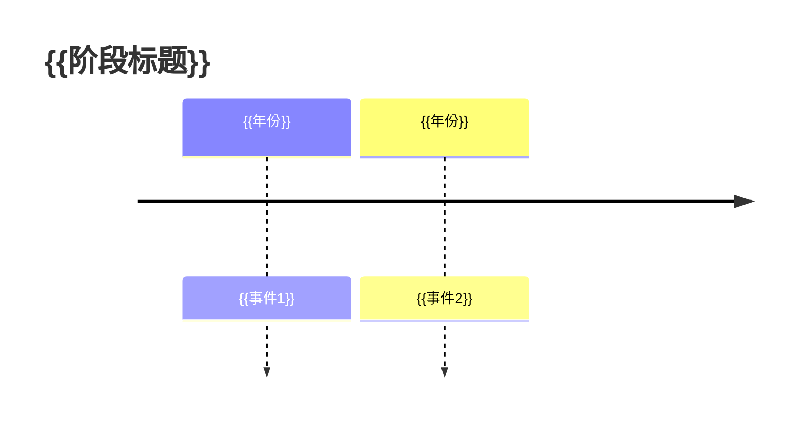

你是一位资深 AI 工程师，拥有 5 年以上大模型应用落地经验，曾在一线互联网公司主导过多个 RAG、Agent、多模态系统的生产化落地。

你正在为一本开源技术手册撰写内容，手册名称为：《AI Agent 与大模型应用开发实战手册》，手册面向两类读者：
1. 有 Python 基础、想快速落地 AI 产品的工程师
2. 准备大厂 AI 工程师面试的求职者

写作要求：
- 语言：中文，技术术语保留英文原词（如 Token、Embedding、ReAct）
- 风格：严谨但不学院派，像高级工程师在做 Tech Talk
- 深度：能讲清楚"为什么"，而不只是"是什么"
- 实用：每个知识点都要有工程视角的判断，如适用场景、常见坑、选型建议
- 不要废话，不要过度铺垫，直接进入核心内容
- 代码示例必须完整可运行，包含必要的 import 和注释
- Mermaid 图表使用标准语法，确保可正确渲染

《AI Agent 与大模型应用开发实战手册》大纲内容如下：

---

# AI Agent 与大模型应用开发实战手册

## Module 0：写给读者

### 学习路线图（配技能树图）

- **通用技能主干（所有读者必过）**
  - 入门阶段：LLM API 调用 → Prompt 工程 → RAG 基础
  - 进阶阶段：Function Calling / MCP → 单 Agent → Multi-Agent
  - 生产阶段：可观测性 → 成本优化 → 安全加固
  - 技能树节点说明：每节点标注预计学习时长与前置依赖

- **通道一：工程实战快速通道（6–8 周）**
  - 适合人群
    - 有 Python 基础、想尽快做出可运行 AI 产品的开发者
    - 在职工程师、产品经理、想转型 AI 应用方向的从业者
    - 参加黑客松 / 快速验证 MVP 的创业者
  - 阅读策略：优先「动手实验」节，理论部分速读后直接跑代码
  - 推荐学习路径（按周）
    - Week 1：Module 0 环境搭建 → Module 1.1 LLM 核心概念 → Module 1.3 主流 API 接入【动手：统一调用层】
    - Week 2：Module 1.2 Prompt Engineering【动手一~三】→ Module 2.4【动手：本地知识库问答】
    - Week 3：Module 2.5 Advanced RAG【动手】→ Module 3.3【动手：接入搜索/数据库工具】
    - Week 4：Module 4.2 ReAct 实战 → Module 4.5【动手：LangGraph 有状态 Agent】
    - Week 5：Module 5.4【动手：双 Agent 代码生成审查系统】→ Module 6.1–6.3 流式输出 / 成本控制 / 缓存
    - Week 6：Module 6.6【动手：生产级 Agent 监控服务】→ Module 7 任选 1 个垂直项目完整跑通
    - Week 7–8：Module 7.5【动手：Docker + 云端部署全流程】
  - 可跳过节点（不影响主线动手实验）
    - Module 1.2.2–1.2.3 LoRA / QLoRA 数学原理精讲（了解结论即可）
    - Module 4.3 ToT / GoT 高级规划策略（生产中低频）
    - Module 8 技术演进史全文（可在学完后作背景阅读）
    - 所有面试题集（实战通道暂不强制）
  - 里程碑检验
    - ✅ Week 2 结束：能独立搭建一个本地 RAG 问答系统
    - ✅ Week 4 结束：能用 LangGraph 跑通一个带工具调用的 ReAct Agent
    - ✅ Week 8 结束：有一个完整部署到云端、可公开访问的 AI Agent 项目

- **通道二：求职面试深度通道（10–12 周）**
  - 适合人群
    - 准备冲击大厂 / AI 独角兽 AI 工程师 / 算法工程师岗位的求职者
    - 已有工程经验、想系统补齐原理深度与面试表达的候选人
    - 在校研究生、想打通「学术 → 工程」链路的同学
  - 阅读策略：理论精读 + 动手实验 + 面试题集三线并进，每章留复盘时间
  - 推荐学习路径（按周）
    - Week 1–2：Module 1 全文精读（含 LoRA 原理）+ 🎯 面试题集：Prompt / LLM 原理类 全部手写答案
    - Week 3–4：Module 2 全文精读（含 RAGAS 评估体系）+ 🎯 面试题集：RAG 设计与优化类 全部手写答案
    - Week 5：Module 3 全文精读 + 🎯 面试题集：工具调用类 + 独立实现 MCP Server 动手三
    - Week 6–7：Module 4–5 全文精读（含记忆系统 / Multi-Agent 原理）+ 🎯 面试题集：Agent 架构 + 多 Agent 设计类 全部手写答案
    - Week 8：Module 6 全文精读（含安全与可观测性）+ 🎯 面试题集：工程落地类 全部手写答案
    - Week 9：Module 7 完成全部四个垂直项目（可选其中最相关的两个深做）
    - Week 10：Module 8.1–8.3 技术演进史精读 + 🎯 面试题集：技术演进与视野类 准备开放题叙述框架
    - Week 11–12：附录框架对比表背诵 + 模拟面试 2 轮（含系统设计题）
  - 面试题集使用方法
    - 第一遍：合上资料独立作答，限时 10 分钟 / 题
    - 第二遍：对照参考答案找差距，标注「会答但说不清楚」的知识点
    - 第三遍：对着镜头或搭档口头复述，模拟真实面试节奏
    - 高频重点标注：每章面试题中标注 ⭐ 的为近两年真实出现题目
  - 里程碑检验
    - ✅ Week 4 结束：能清晰口述 RAG 全流程并回答「向量检索丢失关键词怎么补救」类深度追问
    - ✅ Week 8 结束：能独立完成 45 分钟系统设计题（如「设计支持千万用户的 LLM 网关架构」）
    - ✅ Week 12 结束：能用 STAR 格式讲清楚至少 2 个完整 AI Agent 项目经历

- **通道选择快速决策**
  - 「我想 3 个月内上线一个 AI 产品」→ 工程实战快速通道
  - 「我在准备 3 个月后的大厂面试」→ 求职面试深度通道
  - 「我是在职工程师，边学边用」→ 工程通道主线 + 每章面试题选做
  - 「我是研究生 / 转行选手，时间充裕」→ 深度通道全量学习

### 环境搭建（Python / Node.js / API Keys）

- Python 环境：pyenv + uv 包管理器配置
- Node.js 环境：nvm + pnpm 配置
- API Keys 获取与安全管理（.env + python-dotenv）
- 推荐 IDE 插件清单（VS Code / Cursor + Claude Code 接入）

### 如何使用本资料

- 理论 + 动手实验的配合方式说明
- 代码仓库结构说明（monorepo 约定）
- 本地运行 / Colab 运行两种模式切换指南

## Module 1：大模型基础与 API 实战

### 1.1 LLM 核心概念（Token、Temperature、上下文窗口）

- Tokenization 原理：BPE 算法与 tiktoken 实战计数
- Temperature / Top-p / Top-k 采样策略对比与适用场景
- 上下文窗口管理：滑动窗口与摘要压缩策略
- 主流模型上下文长度与价格横向对比表（2026 最新版）

### 1.2 大模型微调实战（LoRA / QLoRA）

#### 1.2.1 微调技术全景与选型决策

- 为什么需要微调：Prompt Engineering / RAG / 微调 三路线适用边界对比
  - 决策维度：任务数据量 / 更新频率 / 推理成本 / 隐私要求
- 参数高效微调（PEFT）演进路线
  - Adapter Tuning → Prefix Tuning → P-Tuning v2
  - LoRA → QLoRA → DoRA → LoRA+ 各方法核心差异一览
- 何时选全参数微调 vs PEFT：显存墙与效果天花板的权衡

#### 1.2.2 LoRA 原理精讲

- 低秩分解数学直觉：为何 ΔW = BA 能近似全量更新（Hu et al., 2021, arXiv:2106.09685）
- 关键超参解析：rank（r）/ alpha / dropout / target_modules
  - rank 选择经验：r=8 vs r=64 对不同任务的效果影响实验
- LoRA 权重合并：训练后如何 merge 回基座模型实现零推理开销

#### 1.2.3 QLoRA 原理精讲

- NF4 量化：为何用 Normal Float 4-bit 而非 INT4（Dettmers et al., 2023, arXiv:2305.14314）
- 双重量化（Double Quantization）与分页优化器
  - 显存节省量化：70B 模型在单张 A100 上可训练的原理
- QLoRA vs LoRA 效果与速度 Benchmark 对比解读

#### 1.2.4 数据工程：微调数据的准备与质量控制

- 数据格式规范：Alpaca / ShareGPT / ChatML 三种主流格式对比
- 数据量经验法则：百条精标 vs 万条弱标的质量 - 数量权衡
- 数据清洗流水线
  - 去重：MinHash 近似去重防止过拟合
  - 质量过滤：困惑度过滤 + LLM 自动评分筛选低质样本
  - 数据增强：Self-Instruct 范式用 LLM 自动扩充指令数据
- 合成数据：用 GPT-4 / Claude 生成高质量训练对的最佳实践

#### 1.2.5 【动手一】用 QLoRA 微调 Qwen2.5-7B 指令模型

- 环境搭建：transformers + peft + bitsandbytes + trl 版本锁定
- 数据准备：构建 500 条客服对话数据集（含清洗脚本）
- 训练配置：BitsAndBytesConfig + LoraConfig 参数详解
- SFTTrainer 启动训练：单卡 / 多卡（DeepSpeed ZeRO-2）两种模式
- 训练监控：Loss 曲线解读 + 过拟合早停策略
- 模型导出：GGUF / ONNX 格式转换供 Ollama 本地部署

#### 1.2.6 【动手二】微调效果评估与对比实验

- 基线对比：原始基座 vs Prompt Engineering vs 微调后 三方横评
- 自动评估：ROUGE / BERTScore / LLM-as-Judge 三种指标应用
- 消融实验：rank 大小 / 训练轮次 / 数据量 对效果的影响曲线
- 过拟合诊断：训练集 vs 验证集 Loss 分叉点检测与处理

#### 1.2.7 【动手三】基于 Unsloth 的高效微调加速实战

- Unsloth 核心优化：手写 Triton Kernel 使训练提速 2x、显存减半
- 一键启动脚本：Llama-3 / Qwen2.5 / Mistral 通用微调模板
- Colab 免费 T4 实战：15GB 显存跑通 7B 模型微调全流程

#### 1.2.8 生产化部署考量

- 多 LoRA 适配器动态切换：vLLM LoRA 热加载服务化方案
- 持续微调（Continual Fine-tuning）：新数据增量更新防灾难遗忘
- 微调 vs RAG 动态决策：高频更新知识用 RAG、稳定风格用微调

#### 🎯 面试题集：微调方向

- 原理题：LoRA 为何选择在 Attention 的 Q/V 矩阵上加适配器？
- 原理题：QLoRA 的 NF4 量化相比 INT4 在精度上有何优势？
- 工程题：微调数据只有 200 条，如何防止过拟合？
- 工程题：生产环境需要同时服务 10 个不同 LoRA 适配器，如何设计？
- 设计题：为一个法律文书润色场景，设计从数据收集到上线的完整微调方案

### 1.3 Prompt Engineering 实战

- **零样本 / 少样本**
  - 零样本设计原则：角色设定 + 任务描述 + 输出格式三件套
  - 少样本示例选择策略：多样性 vs 相似性权衡
- **CoT（Chain of Thought）**
  - 标准 CoT vs Zero-shot CoT（"Let's think step by step"）
  - Self-Consistency：多路 CoT 投票提升准确率
  - CoT 在数学推理 / 代码生成 / 逻辑判断上的对比实验
- **【动手】参考《大模型基础实战-动手实践》**
  - 【动手一】流式输出 + 实时思维链可视化
  - 【动手二】构建一个提示词调试器
  - 【动手三】多语言翻译质量评估器
  - 【动手四】自动化 Prompt 优化器（DSPy 入门）

### 1.4 主流 API 对比接入

- 对比维度：能力、速率限制、价格、延迟、多模态支持
- 接入清单：OpenAI / Claude / Gemini / DeepSeek / 通义千问
- **【动手】统一封装多模型调用层**
  - 基于 LiteLLM 实现统一接口与 Fallback 路由
  - 异步并发调用封装（asyncio + httpx）
  - 单元测试：Mock API 与 Cost 计算校验

### 🎯 面试题集：Prompt / LLM 原理类

- 原理题：Transformer 注意力机制、KV Cache、位置编码
- 工程题：如何处理超长上下文？如何降低幻觉？
- 设计题：为客服场景设计一套 Prompt 管理体系

## Module 2：RAG（检索增强生成）

### 2.1 RAG 架构全景

- Naive RAG → Advanced RAG → Modular RAG 演进路线
- 离线阶段：文档解析 → 切块 → 向量化 → 索引
- 在线阶段：查询理解 → 检索 → 重排 → 生成

### 2.2 Embedding 与向量数据库

- Embedding 模型选型：text-embedding-3 / BGE / GTE 对比
- 向量数据库横向对比：Chroma / Qdrant / Milvus / PGVector
- 索引类型：HNSW vs IVF-Flat 的原理与选型建议
- 多租户隔离与权限控制设计模式

### 2.3 检索策略（稠密/稀疏/混合）

- 稠密检索：语义向量相似度（cosine / dot product）
- 稀疏检索：BM25 关键词匹配原理与 Elasticsearch 实战
- 混合检索：RRF 融合算法 + 权重调优策略

### 2.4 【动手】从零搭建本地知识库问答系统

- 文档解析：PDF / Word / 网页的结构化提取（pypdf / markitdown）
- 智能切块策略：固定大小 vs 语义切块 vs 章节切块对比实验
- 本地 Embedding + Qdrant 向量库 + LLM 问答链路打通
- 简单 Web 界面封装（Chainlit 或 Streamlit）

### 2.5 【动手】Advanced RAG：重排序 + 查询改写

- 查询改写：HyDE（假设文档嵌入）与 Multi-Query 策略
- 重排序：Cross-Encoder（BGE-Reranker）接入实战
- 上下文压缩：LLMLingua / 摘要压缩减少无关内容
- 对比实验：改造前后的检索准确率与端到端效果变化

### 2.6 RAG 评估体系（RAGAS 框架）

- 四大核心指标：Faithfulness / Answer Relevancy / Context Precision / Context Recall 含义与计算方式
- 构建黄金评估数据集：人工标注 vs LLM 自动生成 QA 对
- CI 集成：每次改动自动跑 RAGAS 回归防止效果退化

### 🎯 面试题集：RAG 设计与优化类

- 原理题：向量检索为何会丢失关键词精确匹配？如何补救？
- 工程题：文档更新时如何保持向量库一致性？
- 设计题：为法律文书场景设计一套可追溯引用的 RAG 系统

## Module 3：Function Calling / MCP 与工具使用

### 3.1 Function Calling 原理与协议

- JSON Schema 工具定义规范与参数设计最佳实践
- 并行工具调用（Parallel Tool Use）与串行调用的选择
- Structured Output 与 Function Calling 的关系与区别

### 3.2 MCP 协议详解

- MCP 架构：Host / Client / Server 三层模型
- Transport 层：stdio vs HTTP+SSE 两种通信方式
- 能力类型：Tools / Resources / Prompts 三类能力注册
- **【动手】参考《搭建mcp_server》**
  - 【动手一】：文件系统操作 MCP Server
  - 【动手二】：数据库查询 MCP Server
  - 【动手三】：代码执行沙箱 MCP Server

### 3.3 【动手】给 LLM 接入搜索 / 计算器 / 数据库工具

- 搜索工具：接入 Tavily / Brave Search API
- 代码执行工具：沙箱环境（E2B / Modal）安全执行
- 数据库工具：Text-to-SQL 生成 + 执行 + 结果解释链路

### 3.4 工具可靠性与错误处理

- 工具调用失败重试策略（指数退避 + 最大重试次数）
- 参数验证：Pydantic 强校验 + 错误信息反馈给 LLM
- 工具调用超时与熔断机制设计

### 🎯 面试题集：工具调用类

- 原理题：模型如何"决定"调用哪个工具？微调 vs 提示词？
- 工程题：工具数量爆炸（100+ 工具）时如何做工具路由？
- 设计题：设计一套可插拔的工具权限管理体系

## Module 4：AI Agent 核心架构

### 4.1 Agent 定义：感知-规划-行动循环

- 与传统 RPA / 规则引擎的核心区别
- Agent 的四大核心能力：记忆、工具、规划、行动
- Agent 可靠性问题现状：任务完成率 benchmark 解读

### 4.2 ReAct 范式实战

- Thought → Action → Observation 循环机制详解
- 从零实现一个 ReAct Agent（不依赖框架）
- ReAct 常见失败模式：幻觉行动、死循环、过早停止

### 4.3 Planning 策略（ToT / GoT / Plan-and-Execute）

- Tree of Thought：广度优先搜索与最优路径选择
- Plan-and-Execute：先规划全局再逐步执行的分离架构
- 动态重规划：执行结果反馈触发计划调整

### 4.4 记忆系统设计

- **短期记忆（对话上下文）**
  - 滑动窗口裁剪 vs 摘要压缩 vs 重要性保留策略
  - 多轮对话状态追踪与实体提取
- **长期记忆（向量存储）**
  - 记忆写入时机：何时值得记？记什么粒度？
  - 记忆检索：时间衰减权重 + 相关性混合排序
- **外部记忆（数据库）**
  - 结构化记忆：用户画像 / 任务状态存 PostgreSQL
  - 图记忆：知识图谱存 Neo4j 表达实体关系

### 4.5 【动手】用 LangGraph 构建有状态 Agent

- LangGraph 核心概念：State / Node / Edge / Graph
- 条件边（Conditional Edge）实现动态路由
- Checkpoint 持久化：中断恢复与人工审批节点
- 可视化调试：LangGraph Studio 本地调试工作流

### 🎯 面试题集：Agent 架构设计类

- 原理题：ReAct 和 Plan-and-Execute 各适合什么场景？
- 工程题：Agent 任务执行 10 步后上下文爆炸怎么处理？
- 设计题：为一个需要人工审批的采购流程设计 Agent 架构

## Module 5：Multi-Agent 系统

### 5.1 多 Agent 协作模式（层级 / 对等 / 流水线）

- 层级模式：Supervisor Agent 分发与汇总子 Agent 结果
- 对等模式：Agent 间直接通信与共识机制
- 流水线模式：有向无环图（DAG）任务依赖编排
- 模式选型决策树：任务类型 → 推荐架构

### 5.2 AutoGen 框架实战

- ConversableAgent 与 GroupChat 核心抽象
- 代码执行沙箱（Docker executor）安全配置
- Human-in-the-Loop：动态插入人工反馈节点

### 5.3 CrewAI 角色分工实战

- Agent / Task / Crew 三层抽象建模
- 角色设计最佳实践：goal + backstory 对输出质量的影响
- Process 类型：Sequential vs Hierarchical 对比

### 5.4 【动手】搭建代码生成+审查的双 Agent 系统

- Coder Agent：根据需求生成代码 + 自动运行测试
- Reviewer Agent：静态分析 + 安全扫描 + 风格检查
- 协作循环：Reviewer 意见反馈 → Coder 迭代修改
- 终止条件设计：通过率阈值 vs 最大轮次保护

### 🎯 面试题集：多 Agent 设计类

- 原理题：多 Agent 系统中如何防止 Agent 间信息污染？
- 工程题：Agent 数量增多后如何控制总 Token 消耗？
- 设计题：用 Multi-Agent 设计一套自动化内容审核系统

## Module 6：生产级落地关键技术

### 6.1 流式输出与用户体验

- SSE（Server-Sent Events）服务端实现（FastAPI）
- 前端流式渲染：React + ReadableStream 接入
- 中间过程透出：Tool Call 状态实时展示给用户

### 6.2 成本控制与 Token 优化

- 请求层：Prompt 压缩 + 动态截断 + 摘要替换
- 模型层：任务路由（复杂 → 强模型，简单 → 弱模型）
- 监控层：按 User / Feature / Session 维度统计成本

### 6.3 缓存策略（Prompt Cache / Semantic Cache）

- Prompt Cache：Claude / OpenAI 官方缓存机制原理与命中率优化
- Semantic Cache：GPTCache / Zep 语义相似度缓存实战
- 缓存失效策略：TTL vs 内容变更触发失效

### 6.4 安全与对齐（Prompt Injection 防御）

- 攻击类型：直接注入 / 间接注入 / 越狱技巧分类
- 防御策略：输入净化 + 特权提示隔离 + 输出验证
- 【动手】构建一个 Prompt Injection 检测分类器

### 6.5 可观测性（LangSmith / LangFuse）

- Trace 采集：完整 Agent 执行链路的 Span 记录
- 核心指标：延迟 P99 / Token 消耗 / 工具调用成功率
- 告警配置：异常延迟与错误率阈值触发告警

### 6.6 【动手】构建带监控的生产级 Agent 服务

- 服务框架：FastAPI + 异步任务队列（Celery / ARQ）
- 接入 LangFuse：一行代码埋点全链路 Trace
- Grafana Dashboard：核心指标可视化大盘
- 压测与容量规划：Locust 模拟并发 + 瓶颈定位

### 🎯 面试题集：工程落地类

- 原理题：Semantic Cache 如何避免错误缓存命中？
- 工程题：Agent 服务 P99 延迟 30s 如何排查优化？
- 设计题：设计一套支持千万用户的 LLM 网关架构

## Module 7：垂直场景实战项目

### 项目一：AI 选股分析师（基于 TradingAgents）

#### 7.1.1 项目背景与架构解读

- TradingAgents 论文核心思想（AAAI 2025 Workshop）
- 五类角色分工：基本面/情绪/新闻/技术分析师 + 研究员/交易员/风控经理
- LangGraph 有状态图在本项目中的应用拆解

#### 7.1.2 环境搭建与数据接入

- 安装配置：pip install tradingagents + API Keys 配置
- 数据源接入：Yahoo Finance / FinnHub / Reddit API
- 多 LLM 后端切换：OpenAI / Claude / DeepSeek / 本地 Ollama

#### 7.1.3 核心模块精读与改造

- Analyst Team 源码解读：工具注册与并发分析机制
- Bull vs Bear 辩论机制：对等 Agent 博弈实现原理
- Risk Management 三种风险偏好（激进/中性/保守）实现
- Structured Output：Pydantic Schema 约束决策输出

#### 7.1.4 动手实验

- 实验一：分析 NVDA / TSLA 并解读五级评级输出
- 实验二：接入 A 股数据源（东方财富 / AKShare）
- 实验三：开启 Checkpoint 实现中断续跑
- 实验四：替换 DeepSeek 为主模型对比分析质量

#### 7.1.5 延伸思考

- 如何评估 Agent 选股决策的质量（回测框架接入）
- 生产化改造：定时任务 + 结果推送 + 决策日志

### 项目二：企业知识库智能问答

#### 7.2.1 需求分析：多文档格式、权限隔离、引用溯源

#### 7.2.2 文档处理流水线

- 多格式解析：PDF / Word / PPT / 网页（markitdown）
- 增量更新：文档变更检测与向量库差量同步

#### 7.2.3 高质量检索层

- 混合检索（BM25 + 向量）+ BGE-Reranker 重排
- 权限过滤：基于 Metadata 的多租户数据隔离

#### 7.2.4 生成与引用

- 带段落级引用的回答生成（角注格式）
- 置信度评估：无答案时主动拒答而非编造

#### 7.2.5 评估与上线

- RAGAS 评估 + 人工抽样复核双轨制
- Chainlit 前端 + FastAPI 后端生产部署

### 项目三：数据分析 Agent（Text-to-SQL）

#### 7.3.1 架构设计：NL → SQL → 执行 → 可视化完整链路

#### 7.3.2 Schema 感知

- 数据库元数据注入：表结构 + 字段注释 + 样例数据
- 大规模 Schema（100+ 表）的动态检索策略

#### 7.3.3 SQL 可靠性提升

- 自我修正循环：执行报错 → 反馈给 LLM → 重写
- 只读沙箱防护 + 慢查询检测

#### 7.3.4 结果可视化

- LLM 自动推断图表类型（柱状 / 折线 / 饼图）
- 用 Plotly 渲染 + 摘要文字解读图表含义

### 项目四：自动化工作流 Agent

#### 7.4.1 场景定义：邮件 → 任务提取 → 系统写入 → 通知

#### 7.4.2 工具集集成

- 通信工具：Gmail / Slack MCP Server 接入
- 任务管理：Notion / Jira API 写入工具封装

#### 7.4.3 触发与调度

- 事件触发：Webhook 监听 vs 定时轮询两种模式
- 任务队列：Celery + Redis 实现异步 Agent 调度

#### 7.4.4 人工审批节点

- LangGraph 中断点设计：高风险操作前暂停等待
- 审批界面：Slack Bot 一键 Approve / Reject

### 项目五：AI Agent 云端生产部署全流程

#### 7.5.1 部署架构选型与决策框架

- 三种部署模型横向对比
  - 长驻容器（ECS / EC2）：适合有状态 Agent、长任务、高并发
  - Serverless 函数（Lambda / 函数计算）：适合事件触发、低频调用、成本敏感
  - 容器编排（K8s / ECS Fargate）：适合弹性伸缩、多服务协作的生产级场景
- AI Agent 的部署特殊性分析
  - 冷启动敏感：LLM 调用链路长，Lambda 冷启动代价评估
  - 执行时长限制：Lambda 15min 上限 vs Agent 长任务的冲突与解法
  - 状态持久化：无状态函数如何承载有状态 Agent（Checkpoint 外化策略）
- 本节目标架构：以项目二「企业知识库问答」为载体，完整演示从本地到云端全链路

#### 7.5.2 Docker 容器化

- Dockerfile 最佳实践
  - 基础镜像选型：python:3.11-slim vs nvidia/cuda（GPU 推理场景）
  - 多阶段构建：builder 层安装依赖，runtime 层精简体积
  - 依赖锁定：uv pip compile 生成 requirements.lock 保证构建确定性
  - 非 root 用户运行：安全加固的最小权限原则
- 环境变量与密钥管理
  - .env 文件本地开发 vs 云端 Secrets Manager 生产注入的双轨策略
  - ARG vs ENV 指令区别：构建期参数与运行期变量的正确用法
- docker-compose 本地联调
  - 服务编排：FastAPI Agent 服务 + Qdrant 向量库 + Redis 缓存 三服务联动
  - Volume 挂载：向量索引数据持久化到宿主机目录
  - 健康检查（healthcheck）：依赖服务就绪后再启动 Agent 服务
- **【动手】构建并本地运行知识库问答 Agent 容器**
  - 构建镜像：docker build + 镜像体积优化（目标 < 500MB）
  - 本地冒烟测试：curl 验证 /chat 接口全链路可用
  - 镜像推送：docker push 到 ECR（AWS）/ ACR（阿里云）私有仓库

#### 7.5.3 AWS Lambda 无服务器部署

- Lambda 容器镜像部署模式（区别于 ZIP 包部署）
  - 为何选容器镜像：AI Agent 依赖包普遍超过 250MB ZIP 限制
  - Lambda Web Adapter：让 FastAPI 应用无需改造直接运行在 Lambda 上
- 冷启动优化专题
  - Provisioned Concurrency：预热实例彻底消除冷启动（成本权衡分析）
  - 镜像精简策略：移除 torch 训练依赖，仅保留推理依赖，体积从 3GB → 800MB
  - /tmp 目录缓存：将 Embedding 模型文件缓存到 /tmp 跨调用复用
- 长任务处理方案（突破 15 分钟限制）
  - 方案一：Lambda 触发 → SQS 入队 → ECS Fargate 消费长任务
  - 方案二：Step Functions 编排多个 Lambda 函数接力执行 Agent 各阶段
- API Gateway + Lambda 集成
  - HTTP API vs REST API 选型：AI 应用推荐 HTTP API（低延迟低成本）
  - 流式响应支持：Lambda Response Streaming 实现 SSE 流式输出
  - 自定义域名 + TLS 证书：ACM + Route53 配置生产域名
- IAM 权限最小化配置
  - Lambda Execution Role 按需授权：仅开放 S3 读、Secrets Manager 读等必要权限
  - VPC 内网访问：Lambda 连接 RDS / ElastiCache 的私有子网配置
- **【动手】将自动化工作流 Agent 部署到 Lambda**
  - ECR 推送镜像 → Lambda 函数创建 → API Gateway 触发器配置
  - Secrets Manager 注入 OpenAI Key / Slack Token
  - CloudWatch Logs 验证执行日志与错误追踪
  - 压测验证：用 Artillery 模拟并发请求，观察 Lambda 自动扩容行为

#### 7.5.4 阿里云函数计算（FC 3.0）部署

- FC 3.0 核心概念映射（对照 AWS Lambda 快速上手）
  - 函数 / 触发器 / 层（Layer）与 Lambda 概念对照表
  - 自定义运行时（Custom Runtime）：支持任意语言和框架的容器镜像部署
- 国内场景特有优化
  - VPC 内网访问：函数计算连接 RDS / Redis / Qdrant（ECS 自建）走内网
  - OSS 触发器：文档上传 OSS → 自动触发知识库索引函数的事件驱动架构
  - 模型 API 路由：国内访问 OpenAI 的网络方案 vs 切换为通义千问 / DeepSeek
- 函数层（Layer）管理依赖
  - 将 langchain / qdrant-client 等大依赖打包为 Layer 复用
  - Layer 版本管理与函数绑定：实现依赖独立升级
- 定时触发器配置（对应项目一选股 Agent 定时运行场景）
  - Cron 表达式配置每日盘后自动触发 Agent 分析
  - 执行结果写入 OSS + 钉钉 Webhook 推送分析报告
- **【动手】将企业知识库问答 Agent 部署到阿里云 FC**
  - ACR 推送镜像 → FC 创建函数 → HTTP 触发器绑定自定义域名
  - 阿里云 KMS 密钥管理服务注入 API Key
  - SLS 日志服务：查询完整 Agent 执行 Trace
  - 弹性并发配置：预留实例数设置与按量付费的成本计算实战

#### 7.5.5 CI/CD 自动化部署流水线

- GitHub Actions 全流程
  - Lint + 单元测试（pytest）→ Docker Build → 推送 ECR/ACR → 部署触发
  - 多环境管理：dev / staging / prod 三套环境的分支策略（main / release）
  - OIDC 无密钥鉴权：GitHub Actions 直接获取 AWS/阿里云临时凭证，无需存储 AK/SK
- 蓝绿部署与金丝雀发布
  - Lambda 别名（Alias）+ 流量权重：10% 流量灰度新版本
  - 自动回滚触发条件：错误率超阈值自动切回旧版本
- **【动手】搭建从 git push 到自动上线的 5 分钟部署流水线**
  - .github/workflows/deploy.yml 完整配置文件逐行解读
  - 部署通知：Slack 机器人推送「部署成功 / 失败」结果到研发频道

#### 7.5.6 云端运行成本分析与优化

- Lambda / FC 成本构成拆解：请求次数费 + 执行时长费 + 网络流量费
- AI Agent 典型场景成本估算
  - 低频场景（1000次/天）：Serverless 月成本估算
  - 高频场景（100万次/天）：Serverless vs 长驻容器的盈亏平衡点计算
- 降本策略清单
  - ARM 架构实例（Lambda Graviton2）：同等性能成本降低 20%
  - Spot 实例：非关键任务使用 Spot 节省 60-70% 计算成本
  - LLM 调用成本：Prompt Cache 命中率优化 + 模型降级路由

#### 🎯 面试题集：云端部署类

- 原理题：为什么 AI Agent 不适合直接部署在 Lambda 上？有哪些应对策略？
- 原理题：容器镜像多阶段构建的核心价值是什么？如何将镜像从 3GB 压缩到 500MB？
- 工程题：Agent 服务上线后 P99 延迟突然从 3s 飙升到 30s，如何排查？
- 工程题：生产环境 API Key 如何安全管理？直接写环境变量有什么问题？
- 设计题：为一个日调用量 50 万次的企业知识库问答服务，设计兼顾成本、可用性、安全性的完整云端部署架构

## Module 8：AI 大模型与 Agent 技术演进全景

### 8.1 大语言模型发展史：从统计模型到涌现智能

#### 8.1.1 前深度学习时代（2000–2017）

- N-gram 语言模型与 Word2Vec 词向量的奠基意义
- Seq2Seq + Attention 机制的提出（Bahdanau et al., 2015, arXiv:1409.0473）
- ELMo 动态词向量：迈向上下文感知表示（Peters et al., 2018, arXiv:1802.05365）

#### 8.1.2 Transformer 革命（2017–2019）

- "Attention Is All You Need"：架构解析与历史地位（Vaswani et al., 2017, arXiv:1706.03762）
- BERT：双向预训练范式开创"先预训练后微调"时代（Devlin et al., 2018, arXiv:1810.04805）
- GPT-1/2：自回归生成路线的确立与"太危险不发布"风波（OpenAI Blog, 2019）

#### 8.1.3 规模定律与涌现能力（2020–2022）

- Scaling Laws：参数量 / 数据 / 算力的幂律关系（Kaplan et al., 2020, arXiv:2001.08361）
- GPT-3（175B）：少样本学习能力的震撼亮相（Brown et al., 2020, arXiv:2005.14165）
- 涌现能力（Emergent Abilities）的发现与争议（Wei et al., 2022, arXiv:2206.07682）
- Chinchilla 定律：重新校准最优训练算力分配比（Hoffmann et al., 2022, arXiv:2203.15556）

#### 8.1.4 指令对齐与 RLHF 时代（2022–2023）

- InstructGPT：RLHF 使模型"听话"的里程碑（Ouyang et al., 2022, arXiv:2203.02155）
- ChatGPT 现象级发布：产品形态定义行业标准（2022.11）
- GPT-4 技术报告：多模态与安全评估框架（OpenAI, 2023, arXiv:2303.08774）
- Claude 系列：Constitutional AI 与无害性对齐新路线（Anthropic, Bai et al., 2022, arXiv:2212.08073）
- LLaMA 开源震撼：Meta 释放可本地运行的强力底座（Touvron et al., 2023, arXiv:2302.13971）

#### 8.1.5 开源生态爆发与长上下文竞赛（2023–2024）

- Llama 2 / Mistral / Gemma / Qwen / DeepSeek：开源模型能力追平闭源的关键节点梳理
- 长上下文竞赛：8K → 32K → 1M Token 背后的位置编码创新（RoPE / YaRN / ALiBi 对比）
- MoE 架构复兴：Mixtral / DeepSeek-MoE 高效稀疏激活（Jiang et al., 2024, arXiv:2401.04088）
- 多模态融合：GPT-4V / Gemini / LLaVA 打通视觉语言

#### 8.1.6 推理模型范式（2024–2025）

- OpenAI o1 / o3：慢思考（Slow Thinking）与测试时计算扩展（Test-Time Compute Scaling）
- DeepSeek-R1：开源推理模型的突破与 GRPO 训练方法（DeepSeek, 2025, arXiv:2501.12948）
- Claude 3.7 Sonnet：混合推理模式（快思/慢想可控切换）
- 推理模型 vs 指令模型：适用场景的分野与成本权衡

### 8.2 AI Agent 发展史：从脚本自动化到自主决策系统

#### 8.2.1 前 LLM Agent 时代（–2022）

- 符号 AI 与专家系统：规则驱动的"硬编码"自动化
- 强化学习 Agent：AlphaGo / OpenAI Five 的封闭场景巅峰
- RPA：流程固定时的工业级自动化方案与局限

#### 8.2.2 LLM Agent 萌芽期（2022–2023）

- ReAct：思维链与行动结合的 Agent 范式开山之作（Yao et al., 2022, arXiv:2210.03629）
- Toolformer：模型自学习何时调用工具（Schick et al., 2023, arXiv:2302.04761）
- AutoGPT（2023.03）：第一个引发大众关注的开源 Agent，GitHub 瞬间破 10 万 Star 与其局限性复盘
- HuggingGPT / TaskMatrix：工具调度编排的早期探索（Shen et al., 2023, arXiv:2303.04671）

#### 8.2.3 框架与协议的规范化（2023–2024）

- LangChain 生态崛起：Chain / Agent / Memory 抽象奠基
- OpenAI Function Calling 发布（2023.06）：工具调用从 Prompt Hack 走向原生协议
- LangGraph（2024.01）：有状态图执行引擎解决循环与分支
- AutoGen（Microsoft, 2023）：多 Agent 对话框架（Wu et al., 2023, arXiv:2308.08155）
- CrewAI / Swarm（OpenAI）：角色分工范式的工程化实践
- MCP 协议（Anthropic, 2024.11）：统一工具接入接口，结束"各自为战"时代

#### 8.2.4 Computer Use 与 GUI Agent（2024）

- Claude Computer Use（2024.10）：直接操控桌面的开创性 API 发布
- OS-Copilot / UFO（Microsoft）：操作系统级 Agent 探索（Zhang et al., 2024, arXiv:2402.07939）
- WebVoyager / SeeAct：纯视觉驱动网页自动化（He et al., 2024, arXiv:2401.13919）

#### 8.2.5 Agentic AI 走向生产（2024–2025）

- OpenAI Operator（2025.01）：官方商业 Agent 产品落地
- Google Vertex AI Agent Builder / Gemini Agent：企业级 Agent 平台的云厂商卡位战
- Claude 4 系列 Extended Thinking + Agentic Task：长任务持久执行能力与中断恢复机制
- Agent 可靠性成为核心议题：GAIA / SWE-Bench / τ-Bench 等 Agent Benchmark 解读

### 8.3 关键技术专题演进：六条技术支线的来世今生

#### 8.3.1 上下文长度：从 512 Token 到无限流式记忆

- 技术演进：绝对位置编码 → RoPE → ALiBi → 环形注意力
- Mamba / SSM 架构：线性复杂度挑战 Transformer 权威（Gu & Dao, 2023, arXiv:2312.00752）
- 大上下文不等于大利用率：Lost in the Middle 问题研究（Liu et al., 2023, arXiv:2307.03172）

#### 8.3.2 RAG 技术演进：关键字检索到知识图谱增强

- Naive RAG → Advanced RAG → Modular RAG 三代架构演进（Gao et al., 2023, arXiv:2312.10997）
- GraphRAG（Microsoft, 2024）：图结构知识增强推理（Edge et al., 2024, arXiv:2404.16130）
- RAG vs 长上下文 vs 微调：三种知识注入路线的选型决策框架（成本 / 时效性 / 准确性三角权衡）

#### 8.3.3 多模态：从 CLIP 到全模态统一模型

- CLIP（2021）奠定视觉语言对齐基础（Radford et al., 2021, arXiv:2103.00020）
- GPT-4o / Gemini 1.5：原生多模态 vs 后融合架构对比
- 音视频 + 代码 + 结构数据的全模态大一统趋势研判

#### 8.3.4 高效推理：从量化压缩到推理加速芯片生态

- 量化技术：FP16 → INT8 → GPTQ → AWQ → 1-bit（BitNet）
- 推测解码：草稿模型加速主模型生成吞吐
- vLLM / TensorRT-LLM / SGLang：PagedAttention 等关键工程创新梳理

#### 8.3.5 对齐技术：从 RLHF 到 DPO 到宪法 AI

- RLHF → PPO → DPO → GRPO 训练范式演进与工程代价对比（Rafailov et al., 2023, arXiv:2305.18290 [DPO]）
- Constitutional AI（Anthropic）：用原则替代人工偏好标注的新路线
- 超级对齐：GPT-4 监督 GPT-4 的弱对强泛化研究（OpenAI, 2023, arXiv:2312.09390）

#### 8.3.6 微调技术：从全参数到极低成本适配

- Full Fine-Tuning → Adapter → Prefix Tuning → LoRA → QLoRA → DoRA 演进路线（Hu et al., 2021, arXiv:2106.09685 [LoRA]）
- 微调 vs RAG vs Prompt Engineering 三路线决策树（数据量 / 更新频率 / 成本 三维度）

### 8.4 各大厂商技术路线图与战略研判

- **OpenAI**：从 GPT 到 AGI 的超级对齐与商业化并行路线
  - 核心押注：o 系列推理 + Operator Agent + 硬件自研
  - 开放策略转变：从 API 优先到生态闭环的战略摩擦
- **Anthropic**：安全优先驱动的技术差异化
  - 核心押注：Extended Thinking + Computer Use + MCP 生态
  - Constitutional AI 与可解释性研究的长期战略布局
- **Google DeepMind**：Gemini 生态与科学 AI 双线并进
  - 核心押注：原生多模态 + 长上下文 + AlphaFold 类科研 AI
  - 云端 + 端侧（Gemini Nano）的全栈部署战略
- **Meta**：开源战略的战略意图与生态构建
  - LLaMA 系列开源路线：用生态遏制闭源垄断
  - FAIR 研究与产品落地的双轮驱动模式
- **中国大模型阵营**：DeepSeek / Qwen / Kimi / 文心的差异化路线
  - DeepSeek：极致成本效率（MoE + GRPO）震撼开源界
  - Qwen（阿里）：多模态全栈 + 超长上下文的企业级路线
  - Kimi（月之暗面）：长上下文垂直突破的产品化案例

### 8.5 未来演进路线图（2025–2030）

#### 8.5.1 模型能力演进预判

- 推理能力：Test-Time Compute Scaling 红利是否持续？
- 世界模型：从文本预测走向因果推理与环境建模
- 具身智能：LLM 赋能机器人控制的技术融合路径
- 端侧大模型：1–7B 参数在手机 / 眼镜 / 汽车的部署前景

#### 8.5.2 Agent 架构演进预判

- 长任务持久化 Agent：多天连续执行任务的记忆与状态挑战
- 自主学习 Agent：从执行任务到从经验中更新权重
- Agent 互联网：跨组织 Agent 协作的身份认证与信任协议
- 个人 AI：拥有完整用户上下文的长期陪伴型 Agent 形态

#### 8.5.3 技术瓶颈与开放性挑战

- 幻觉根治难题：检索增强 vs 不确定性量化 vs 神经符号融合三条路
- 可靠性天花板：为何 Agent 任务完成率难以突破 80%？
- 多模态推理鸿沟：视觉常识与空间推理的系统性缺陷
- 评估体系缺失：现有 Benchmark 是否真正衡量了智能？

#### 8.5.4 基础设施与生态演进预判

- 推理芯片格局：NVIDIA H 系列 vs 谷歌 TPU vs Groq / Cerebras 等新架构的竞争格局
- 推理经济学：Token 成本曲线（摩尔定律类比）与何时"AI 调用比人工更便宜"成为普遍现实
- 开源 vs 闭源：能力差距收窄下的生态重塑

#### 8.5.5 社会影响与监管格局

- 欧盟 AI Act / 美国 EO / 中国《生成式 AI 管理办法》：三大监管框架对开发者的实际影响
- AI 对劳动力市场的结构性冲击：哪些岗位先受影响？历史类比与差异分析
- 负责任 AI 开发原则：开发者视角的伦理实践清单

### 🎯 面试题集：技术演进与视野类

- 视野题：如何看待 RAG 与长上下文的关系？三年后还需要 RAG 吗？
- 判断题：DeepSeek-R1 的 GRPO 方法相比 PPO 核心优势是什么？
- 设计题：如果让你规划一家 AI 创业公司的技术栈（2025–2027），你如何选择底座模型、Agent 框架与基础设施？
- 开放题：你认为 LLM Agent 距离"可信赖地替代人类完成复杂工作"还差哪三个核心能力？请结合现有论文与产品进行论证。

## 附录

### 主流框架横向对比表

- 对比维度：学习曲线 / 生产成熟度 / 社区活跃度 / 多 Agent 支持 / 可观测性集成 / License
- 覆盖框架：LangChain / LangGraph / LlamaIndex / AutoGen / CrewAI / Semantic Kernel / Dify / Flowise

### 面试题总汇（按岗位：算法 / 工程 / 产品）

- 算法岗：RAG 优化、模型评估、微调 vs 提示词工程取舍
- 工程岗：系统设计、成本优化、可观测性、安全防护
- 产品岗：AI 产品设计原则、效果评估指标、用户信任建立

### 学习资源导航

- 必读论文清单（附 arXiv 链接 + 一句话摘要）
- 优质开源项目推荐（附 GitHub Star 与适用场景）
- 持续跟进渠道：Newsletter / X 账号 / Discord 社区

### 术语表

- 中英文对照索引（含首次出现章节标注）
- 缩写速查：RAG / CoT / ReAct / MCP / RLHF / SFT …

---

请为《AI Agent 与大模型应用开发实战手册》撰写以下技术演进章节：

**章节编号**：8.5.5
**章节标题**：社会影响与监管格局
**大纲要点**：
#### 8.5.5 社会影响与监管格局

- 欧盟 AI Act / 美国 EO / 中国《生成式 AI 管理办法》：三大监管框架对开发者的实际影响
- AI 对劳动力市场的结构性冲击：哪些岗位先受影响？历史类比与差异分析
- 负责任 AI 开发原则：开发者视角的伦理实践清单
**时间范围**：{{起止年份}}
**本节在整体演进史中的位置**：{{前一阶段结论 → 本阶段核心转变 → 引出下一阶段}}

---

请按以下结构撰写，总字数 1500-2500 字：

### 时代背景（500字以内）
用 1 段话交代：这个阶段开始时，领域面临什么核心问题/瓶颈？
什么样的条件（算力/数据/算法）使得这个阶段的突破成为可能？

### 关键突破

对大纲中每个重要节点（论文/产品/事件）展开：

#### {{技术/论文/产品名称}}（{{年份}}）

**一句话定位**：这个工作在历史上的位置是什么？

**核心贡献**：
- 解决了什么问题（承接上一阶段的哪个痛点）
- 核心技术创新是什么（用工程师能理解的方式，不要只说"提出了X方法"）
- 对后续发展的影响是什么

**工程师视角**：
如果你是当时的工程师，这个工作改变了你的哪些日常实践？
（从实际工作流变化的角度讲，不要纯理论）

（如有论文引用，格式：> 📄 原始论文：作者 et al., 年份, arXiv:XXXX.XXXXX）

### 阶段总结

用一张时间线图展示本阶段的演进脉络：

**本阶段核心主题**：用 2-3 句话提炼这个阶段最重要的技术洞见。

### 历史意义与遗留问题
- 这个阶段解决了什么（写进教科书的成就）
- 留下了什么新问题（为下一阶段埋下伏笔）

---

注意：
- 论文要准确引用，arXiv 编号要核实
- 历史叙述要有观点，不是流水账，要有"为什么这个时候出现""为什么是这个方案而不是其他"的分析
- 对中国读者特别相关的内容（如国内厂商进展）要适当突出
- 技术判断要有工程师视角，避免纯学术视角

---

## 📋 使用检查清单

生成内容后，用以下清单验收质量：

**内容质量**
-  核心概念解释清楚了"为什么"而不只是"是什么"
-  有工程视角的判断（适用场景、常见坑、选型建议）
-  没有明显的事实错误（尤其是论文引用、API名称、参数名）

**代码质量**（仅适用于动手章节）
-  代码完整可运行，无 TODO 或省略号
-  依赖版本已锁定
-  包含本地和 Colab 两种运行说明

**图表质量**
-  Mermaid 语法正确（可在 mermaid.live 验证）
-  图表能准确表达概念，不是装饰

**读者体验**
-  文字流畅，无生硬的机器翻译感
-  技术术语使用一致（如统一用"向量数据库"而非时而"vector store"时而"向量库"）
-  难度曲线合适，概念引入有铺垫

---

